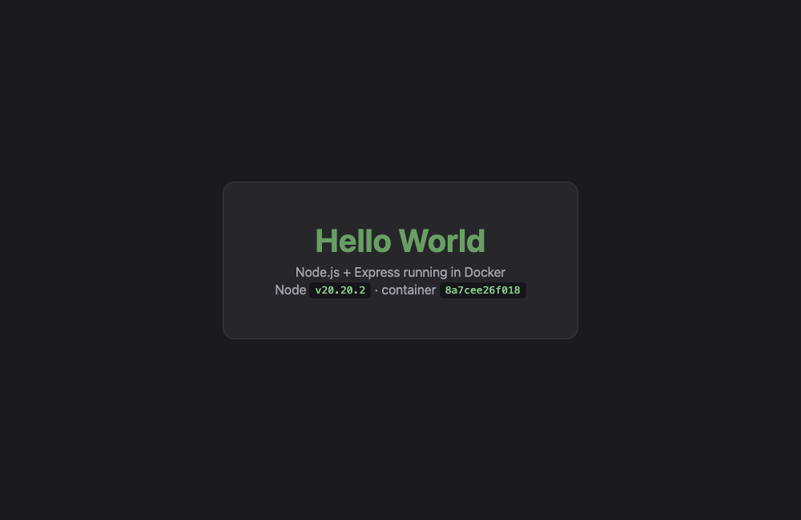
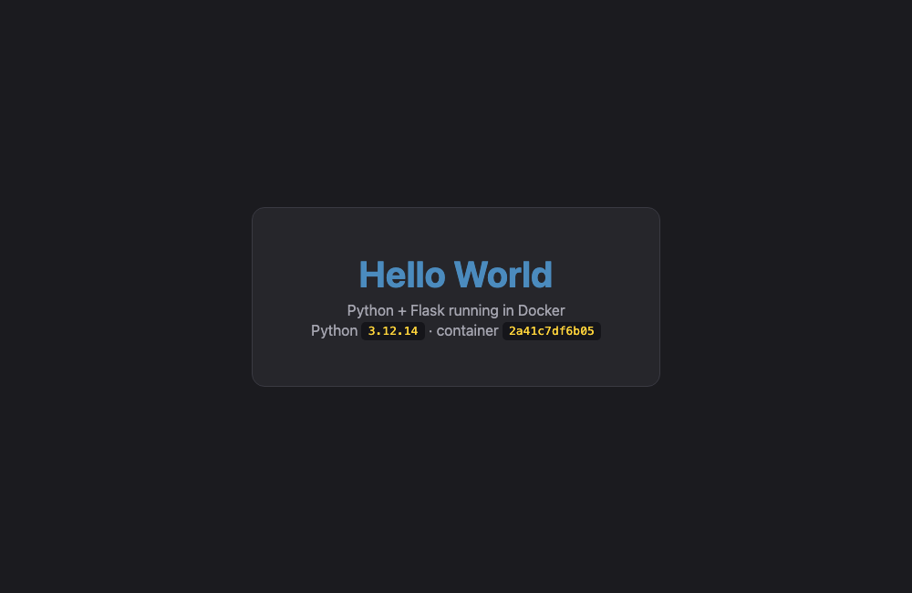
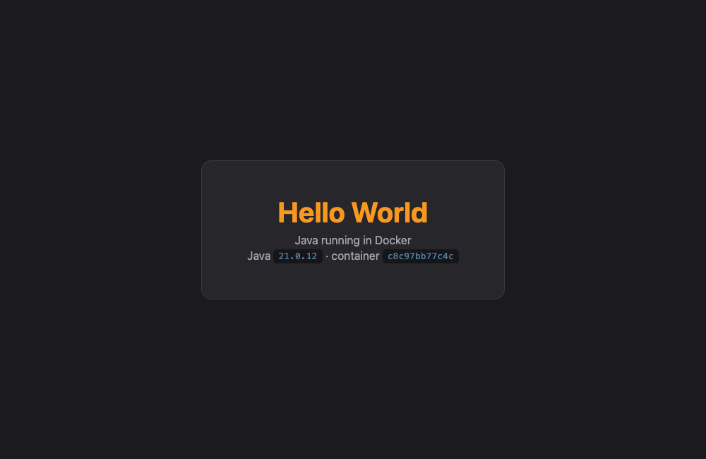
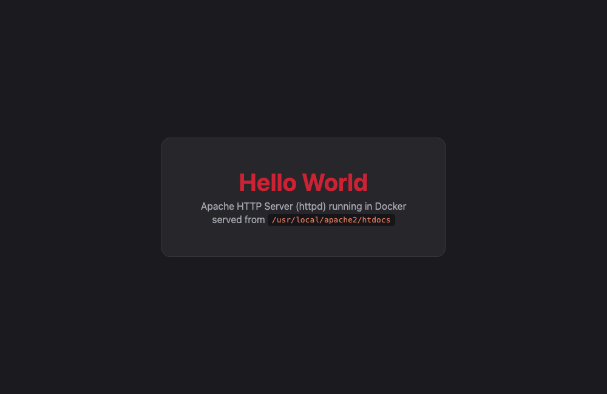
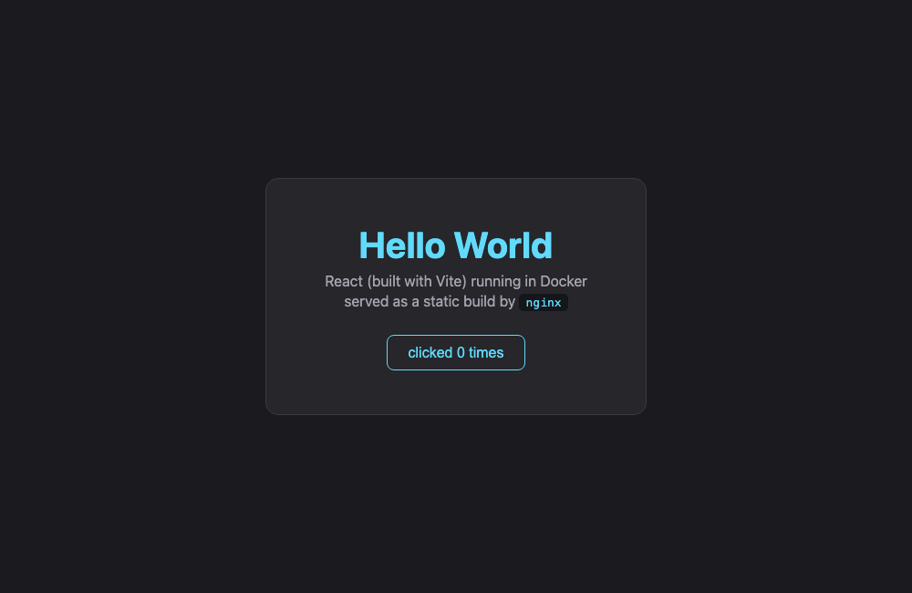
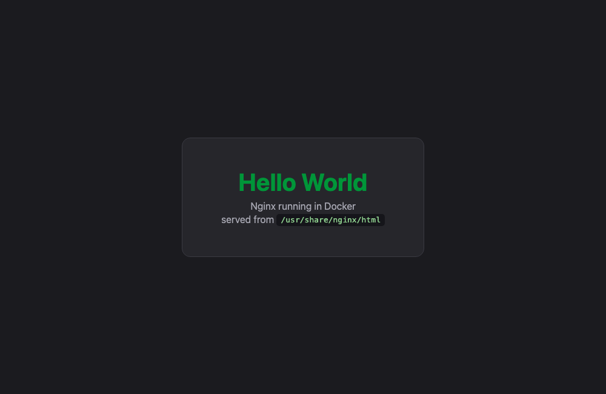

# Homework 5 — Docker Hello World Applications

Six Hello World web applications, each in its own folder with its own Dockerfile, each built
into an image, run as a container, and verified to display **Hello World** in a browser.

| Folder | Stack | Base image | Container port | Host port | Image size |
|---|---|---|---|---|---|
| [`nodejs-app`](nodejs-app) | Node.js 20 + Express | `node:20-alpine` | 3000 | **9001** | 210 MB |
| [`python-app`](python-app) | Python 3.12 + Flask | `python:3.12-slim` | 5000 | **9002** | 221 MB |
| [`java-app`](java-app) | Java 21, JDK HttpServer | `eclipse-temurin:21` | 8080 | **9003** | 286 MB |
| [`apache-app`](apache-app) | Apache httpd 2.4 | `httpd:2.4-alpine` | 80 | **9004** | 105 MB |
| [`react-app`](react-app) | React 18 + Vite → Nginx | `node:20` → `nginx:1.27` | 80 | **9005** | 76 MB |
| [`nginx-app`](nginx-app) | Nginx 1.27 | `nginx:1.27-alpine` | 80 | **9006** | 76 MB |

> Ports 9001–9006 were chosen because 3000/3001 and 8081–8086 were already in use on the
> machine. `docker run` fails with `ports are not available: ... bind: address already in use`
> when that happens — the fix is to pick a free host port, not to change the container port.

## Screenshots — Hello World in a real browser

All six were rendered with headless Chrome against the running containers.

| Node.js — `localhost:9001` | Python — `localhost:9002` |
|---|---|
|  |  |

| Java — `localhost:9003` | Apache — `localhost:9004` |
|---|---|
|  |  |

| React — `localhost:9005` | Nginx — `localhost:9006` |
|---|---|
|  |  |

---

## Build and run everything

```bash
# build all six images
for app in nodejs-app python-app java-app apache-app react-app nginx-app; do
  (cd "$app" && docker build -t "hw-${app}:1.0" .)
done

# run all six containers
docker run -d --name hw-nodejs -p 9001:3000 hw-nodejs-app:1.0
docker run -d --name hw-python -p 9002:5000 hw-python-app:1.0
docker run -d --name hw-java   -p 9003:8080 hw-java-app:1.0
docker run -d --name hw-apache -p 9004:80   hw-apache-app:1.0
docker run -d --name hw-react  -p 9005:80   hw-react-app:1.0
docker run -d --name hw-nginx  -p 9006:80   hw-nginx-app:1.0

docker ps
```

Tear down with:

```bash
docker rm -f hw-nodejs hw-python hw-java hw-apache hw-react hw-nginx
```

---

## 1. `nodejs-app` — Node.js + Express

[`server.js`](nodejs-app/server.js) starts an Express server that returns an HTML page and a
`/health` JSON endpoint.

```dockerfile
FROM node:20-alpine

WORKDIR /app

# Copy manifests FIRST so this layer is cached when only source code changes
COPY package*.json ./
RUN npm install --omit=dev

COPY server.js ./

EXPOSE 3000
USER node
CMD ["node", "server.js"]
```

**Why the manifests are copied first:** Docker caches each layer. If `package.json` has not
changed, the expensive `npm install` layer is reused and only the `COPY server.js` layer
rebuilds. Copying everything at once would invalidate the install on every source edit.

`USER node` drops root — the official Node image already provides that unprivileged user.

## 2. `python-app` — Python + Flask

```dockerfile
FROM python:3.12-slim

WORKDIR /app

ENV PYTHONDONTWRITEBYTECODE=1 \
    PYTHONUNBUFFERED=1

COPY requirements.txt .
RUN pip install --no-cache-dir -r requirements.txt

COPY app.py .

EXPOSE 5000

RUN useradd --create-home appuser && chown -R appuser /app
USER appuser

CMD ["python", "app.py"]
```

`PYTHONUNBUFFERED=1` matters in containers: without it Python buffers stdout and your logs
appear late or not at all in `docker logs`. `--no-cache-dir` keeps pip's download cache out of
the image.

Note `app.run(host="0.0.0.0")` in [`app.py`](python-app/app.py) — binding to `127.0.0.1`
inside a container makes it unreachable from outside, which is one of the most common Docker
mistakes.

## 3. `java-app` — Java 21 (multi-stage)

Uses the JDK's built-in `com.sun.net.httpserver`, so there is no Maven/Gradle and no framework.

```dockerfile
# Stage 1: compile the source with a full JDK
FROM eclipse-temurin:21-jdk-alpine AS builder
WORKDIR /build
COPY src/HelloWorldServer.java .
RUN javac -d classes HelloWorldServer.java

# Stage 2: runtime image only needs the JRE, not the compiler
FROM eclipse-temurin:21-jre-alpine
WORKDIR /app
COPY --from=builder /build/classes ./classes

EXPOSE 8080
RUN addgroup -S app && adduser -S app -G app
USER app
CMD ["java", "-cp", "classes", "HelloWorldServer"]
```

This is already a multi-stage build: the JDK (compiler) is only present in stage 1, and the
final image ships a JRE. See [Homework 6](../06-docker-multistage) for the full treatment.

## 4. `apache-app` — Apache httpd

```dockerfile
FROM httpd:2.4-alpine

# httpd serves everything in this directory by default
COPY public/ /usr/local/apache2/htdocs/

EXPOSE 80
```

Four lines. The base image already sets `CMD ["httpd-foreground"]`, so there is nothing to add
— the whole job is putting files in the right directory. Apache's document root inside the
official image is `/usr/local/apache2/htdocs`.

## 5. `react-app` — React + Vite, multi-stage into Nginx

```dockerfile
# Stage 1: install dependencies and produce the static production build
FROM node:20-alpine AS builder
WORKDIR /app
COPY package*.json ./
RUN npm install
COPY . .
RUN npm run build          # output lands in /app/dist

# Stage 2: tiny Nginx image that only carries the compiled assets
FROM nginx:1.27-alpine
COPY --from=builder /app/dist /usr/share/nginx/html
COPY nginx.conf /etc/nginx/conf.d/default.conf

EXPOSE 80
```

This is the biggest win in the whole homework. A single-stage version of the *same app* was
built for comparison ([`Dockerfile.single-stage`](react-app/Dockerfile.single-stage)):

```console
$ docker images
react-singlestage:1.0	411MB
hw-react-app:1.0	76.1MB
```

**411 MB → 76.1 MB, an 81% reduction**, because the final image contains only the compiled
`dist/` assets and Nginx — no Node runtime, no `node_modules`, no Vite toolchain.

The `nginx.conf` uses `try_files $uri $uri/ /index.html;` so client-side routes do not 404.

> React renders in the browser, so `curl` sees only `<div id="root"></div>` — the `<h1>` is
> produced by JavaScript. That is why the screenshot above (a real headless-Chrome render)
> is the meaningful proof for this one, not the curl output.

## 6. `nginx-app` — Nginx serving static HTML

```dockerfile
FROM nginx:1.27-alpine

COPY default.conf /etc/nginx/conf.d/default.conf
COPY public/ /usr/share/nginx/html/

EXPOSE 80
```

Nginx's document root in the official image is `/usr/share/nginx/html`. The custom
`default.conf` also adds a `/health` endpoint that returns JSON directly from nginx, with no
application behind it.

---

## Verification

```console
=== docker images (the six Hello World images) ===
REPOSITORY      TAG       IMAGE ID       SIZE
hw-react-app    1.0       74a396dac33d   76.1MB
hw-nginx-app    1.0       ecf42a77b16d   75.9MB
hw-apache-app   1.0       815da8d98c29   105MB
hw-java-app     1.0       21c1312a60c5   286MB
hw-python-app   1.0       962e4a1cb50f   221MB
hw-nodejs-app   1.0       eed9c28614e8   210MB

=== docker ps (all six containers running) ===
NAMES       IMAGE               STATUS              PORTS
hw-nginx    hw-nginx-app:1.0    Up About a minute   0.0.0.0:9006->80/tcp, [::]:9006->80/tcp
hw-react    hw-react-app:1.0    Up About a minute   0.0.0.0:9005->80/tcp, [::]:9005->80/tcp
hw-apache   hw-apache-app:1.0   Up About a minute   0.0.0.0:9004->80/tcp, [::]:9004->80/tcp
hw-java     hw-java-app:1.0     Up About a minute   0.0.0.0:9003->8080/tcp, [::]:9003->8080/tcp
hw-python   hw-python-app:1.0   Up About a minute   0.0.0.0:9002->5000/tcp, [::]:9002->5000/tcp
hw-nodejs   hw-nodejs-app:1.0   Up About a minute   0.0.0.0:9001->3000/tcp, [::]:9001->3000/tcp

=== HTTP verification of every app ===
Node.js   http://localhost:9001  -> HTTP 200
Python    http://localhost:9002  -> HTTP 200
Java      http://localhost:9003  -> HTTP 200
Apache    http://localhost:9004  -> HTTP 200
React     http://localhost:9005  -> HTTP 200
Nginx     http://localhost:9006  -> HTTP 200

=== curl output proving 'Hello World' is served ===
--- Node.js (port 9001) ---
<head><meta charset="utf-8"><title>Node.js Hello World</title>
<h1>Hello World</h1>
--- Python (port 9002) ---
<head><meta charset="utf-8"><title>Python Hello World</title>
<h1>Hello World</h1>
--- Java (port 9003) ---
<head><meta charset="utf-8"><title>Java Hello World</title>
<h1>Hello World</h1>
--- Apache (port 9004) ---
<title>Apache Hello World</title>
<h1>Hello World</h1>
--- Nginx (port 9006) ---
<title>Nginx Hello World</title>
<h1>Hello World</h1>
--- React (port 9005): renders client-side, so the h1 is in the JS bundle ---
<title>React Hello World</title>
<div id="root"></div>

=== /health endpoints ===
{"status":"ok","app":"nodejs"}
{"app":"python","status":"ok"}

{"status":"ok","app":"java"}
{"status":"ok","app":"nginx"}
```

All six return **HTTP 200** and serve **Hello World**.

## Docker commands used

| Command | Purpose |
|---|---|
| `docker build -t name:tag .` | build an image from the Dockerfile in `.` |
| `docker images` | list images |
| `docker run -d --name x -p 9001:3000 img` | run detached, map host:container port |
| `docker ps` | running containers (`-a` for stopped ones too) |
| `docker logs x` | container stdout/stderr |
| `docker exec -it x sh` | shell inside a running container |
| `docker stop x` / `docker start x` | stop / start |
| `docker rm -f x` | force remove |
| `docker rmi img` | remove an image |
| `docker system prune -a` | remove everything unused |

## Dockerfile instructions used

| Instruction | Meaning |
|---|---|
| `FROM` | base image; starts a new build stage |
| `WORKDIR` | set (and create) the working directory |
| `COPY` | copy files from the build context into the image |
| `COPY --from=stage` | copy from an earlier build stage |
| `RUN` | execute a command **at build time**, creating a layer |
| `ENV` | set an environment variable |
| `EXPOSE` | document the port the app listens on (does not publish it) |
| `USER` | drop to an unprivileged user |
| `CMD` | default command run **at container start** |

> `EXPOSE` is documentation only. It does **not** open a port — that is what `-p` on
> `docker run` does. `EXPOSE 3000` plus `-p 9001:3000` is what actually makes the app
> reachable at `localhost:9001`.

## Practices applied across all six

- **Alpine/slim base images** wherever possible — smaller images, smaller attack surface.
- **Dependency manifests copied before source**, so dependency layers stay cached.
- **`.dockerignore`** files keep `node_modules` and build artefacts out of the build context.
- **Non-root `USER`** in the Node, Python and Java images.
- **Multi-stage builds** for Java and React, where a build toolchain is needed but must not
  ship.
- **A `/health` endpoint** on the app-based images, which is what a real orchestrator would
  probe.
