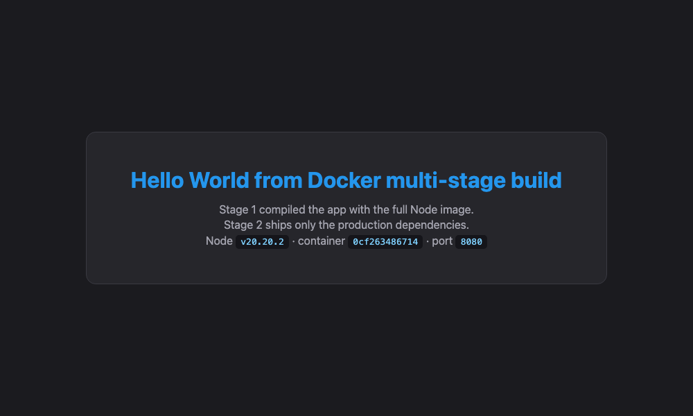

# Homework 6 — Docker Multi-Stage Build

## Submission details

| | |
|---|---|
| **Name** | `<YOUR NAME>` |
| **Enrollment Number** | `<YOUR ENROLLMENT NUMBER>` |
| **Date** | 3 September 2026 |
| **Application** | Node.js + Express, built with a multi-stage Dockerfile |
| **Required text** | Hello World from Docker multi-stage build ✅ |
| **Port** | 8080 ✅ |

> ⚠️ Fill in the two placeholder rows above before submitting.

---

## Task 1 — Build and run the multi-stage Dockerfile

### The application

The multi-stage Dockerfile from the `devops-heros` repository was used as the starting point,
adapted to listen on **port 8080** as the homework requires.

- [`server.js`](server.js) — Express app serving the required message
- [`package.json`](package.json) — one dependency, `express`
- [`Dockerfile`](Dockerfile) — the multi-stage build
- [`Dockerfile.single-stage`](Dockerfile.single-stage) — kept only for size comparison

### What a multi-stage build is

A multi-stage Dockerfile uses **several `FROM` instructions in one file**. Each `FROM` starts a
new stage. Only the **last** stage becomes the final image — everything else is discarded.
`COPY --from=<stage>` reaches back into an earlier stage and pulls out just the artefacts you
need.

That lets you use a large toolchain to *build* the application while shipping a small image to
*run* it.
```
   ┌──────────── Stage 1: builder ────────────┐
   │  FROM node:20-alpine AS builder          │
   │  npm install       (ALL dependencies,    │
   │                     including dev deps)  │
   │  COPY . .          (whole source tree)   │      DISCARDED
   │                                          │      ─────────▶  ✗
   └──────────────────┬───────────────────────┘
                      │  COPY --from=builder
                      ▼
   ┌──────────── Stage 2: production ─────────┐
   │  FROM node:20-alpine AS production       │
   │  npm install --omit=dev  (prod deps only)│
   │  COPY --from=builder /app/server.js      │      THIS becomes
   │  EXPOSE 8080 / USER node / CMD npm start │      the final image
   └──────────────────────────────────────────┘
```

### The Dockerfile

```dockerfile
# -----------------------------------------------------------------------------
# Stage 1: BUILD
#   Installs ALL dependencies (including dev dependencies) and builds the app.
#   This stage is discarded - none of its layers reach the final image.
# -----------------------------------------------------------------------------
FROM node:20-alpine AS builder

WORKDIR /app

# Copy manifests first so npm install is cached when only source changes
COPY package*.json ./
RUN npm install

# Copy the rest of the source and run any build step
COPY . .


# -----------------------------------------------------------------------------
# Stage 2: PRODUCTION
#   Starts from a clean base and copies ONLY what is needed at runtime
#   out of the builder stage using COPY --from=builder.
# -----------------------------------------------------------------------------
FROM node:20-alpine AS production

WORKDIR /app

ENV NODE_ENV=production
ENV PORT=8080

# Bring the manifests over from the build stage, then install prod deps only
COPY --from=builder /app/package*.json ./
RUN npm install --omit=dev && npm cache clean --force

# Bring over just the application code we actually need to run
COPY --from=builder /app/server.js ./

# The homework requires the app to listen on 8080
EXPOSE 8080

USER node

CMD ["npm", "start"]
```

### Build the image

```bash
docker build -t multistage-hello:1.0 .
```

Both stages executing in one build — note `[builder …]` and `[production …]` prefixes:

```console
#4 [builder 1/5] FROM docker.io/library/node:20-alpine@sha256:fb4cd12c85ee03686f6af5362a0b0d56d50c58a04632e6c0fb8363f609372293
#5 [builder 2/5] WORKDIR /app
#7 [builder 3/5] COPY package*.json ./
#8 [builder 4/5] RUN npm install
#9 [builder 5/5] COPY . .
#10 [production 3/5] COPY --from=builder /app/package*.json ./
#11 [production 4/5] RUN npm install --omit=dev && npm cache clean --force
#12 [production 5/5] COPY --from=builder /app/server.js ./
```

The full build log is in [`outputs/build-log.txt`](outputs/build-log.txt).

### Run the container on port 8080

```bash
docker run -d --name multistage-app -p 8080:8080 multistage-hello:1.0
```

### Verify it — `docker ps` on port 8080

```console
$ docker ps
CONTAINER ID   IMAGE                  COMMAND                  CREATED         STATUS         PORTS                                         NAMES
0cf263486714   multistage-hello:1.0   "docker-entrypoint.s…"   5 seconds ago   Up 5 seconds   0.0.0.0:8080->8080/tcp, [::]:8080->8080/tcp   multistage-app

$ docker ps --format 'table {{.Names}}	{{.Image}}	{{.Status}}	{{.Ports}}'
NAMES            IMAGE                  STATUS         PORTS
multistage-app   multistage-hello:1.0   Up 5 seconds   0.0.0.0:8080->8080/tcp, [::]:8080->8080/tcp
```

The `PORTS` column shows **`0.0.0.0:8080->8080/tcp`** — the container is running and published
on port 8080, as required.

### Access the application

```console
$ curl -i http://localhost:8080
HTTP/1.1 200 OK
X-Powered-By: Express
Content-Type: text/html; charset=utf-8
Content-Length: 919
ETag: W/"397-Y6s5h8wg85d8tt8pbyCl3yCoXug"
Date: Thu, 03 Sep 2026 04:47:54 GMT
Connection: keep-alive
Keep-Alive: timeout=5

<!doctype html>
<html>
<head><meta charset="utf-8"><title>Docker Multi-Stage Build</title>

$ curl -s http://localhost:8080 | grep '<h1>'
<h1>Hello World from Docker multi-stage build</h1>

$ curl -s http://localhost:8080/health
{"status":"ok","app":"multi-stage","port":"8080"}
```

**The required message is displayed:**
```
Hello World from Docker multi-stage build
```

### Screenshot — the application running in a browser on port 8080



The page shows the container ID `0cf263486714` and port `8080`, matching the `docker ps`
output above.

### Proof the app really listens on 8080

```console
$ docker exec multistage-app netstat -tlnp 2>/dev/null || docker port multistage-app
8080/tcp -> 0.0.0.0:8080
8080/tcp -> [::]:8080

$ docker inspect --format '{{json .Config.ExposedPorts}}' multistage-app
{"8080/tcp":{}}

$ docker inspect --format '{{json .NetworkSettings.Ports}}' multistage-app
{"8080/tcp":[{"HostIp":"0.0.0.0","HostPort":"8080"},{"HostIp":"::","HostPort":"8080"}]}
```

### Container logs

```console
$ docker logs multistage-app

> docker-hello-world@1.0.0 start
> node server.js

Server running on port 8080
```

---

## Why multi-stage builds are worth it

### Measured results

Two comparisons were built, both with `--no-cache`:

| Application | Single-stage | Multi-stage | Saving |
|---|---|---|---|
| This Node.js app | 210 MB | **199 MB** | 11 MB (5%) |
| The React app from [Homework 5](../05-docker-apps) | 411 MB | **76.1 MB** | **335 MB (81%)** |

```console
$ docker images
REPOSITORY          TAG         SIZE
react-singlestage   1.0         411MB
singlestage-hello   1.0         210MB
multistage-hello    1.0         199MB
hw-react-app        1.0         76.1MB
```

**Being honest about the Node result:** 5% is a small saving, and it is worth saying why. This
app has exactly one dependency (`express`) and **no build step**, so there is very little for
the builder stage to throw away. Multi-stage did not help much here.

The React app is where the technique earns its keep: its builder stage installs Vite, the React
compiler and roughly 300 MB of `node_modules`, then produces a `dist/` folder of static files.
The final stage copies only `dist/` into Nginx, so **none** of the toolchain ships. Same
technique, 81% smaller.

**The rule of thumb:** multi-stage pays off in proportion to how much your build toolchain
weighs compared to your runtime. Compiled languages (Go, Rust, Java, C++) and front-end
bundlers (React, Vue, Angular) benefit enormously; a plain interpreted app with no build step
benefits very little.

### The other benefits

- **Smaller attack surface** — no compilers, package managers or source code in production.
- **Faster deploys** — smaller images pull faster onto every node.
- **Secrets stay out** — build-time credentials used in stage 1 never reach the final image.
- **One file** — build and runtime definitions live together and stay in sync.

---

## Task 3 — Deploy at least 3 different types of applications

Six were deployed, covering all three required stacks and more. All were running
simultaneously:

```console
NAMES       IMAGE               STATUS              PORTS
hw-nginx    hw-nginx-app:1.0    Up About a minute   0.0.0.0:9006->80/tcp, [::]:9006->80/tcp
hw-react    hw-react-app:1.0    Up About a minute   0.0.0.0:9005->80/tcp, [::]:9005->80/tcp
hw-apache   hw-apache-app:1.0   Up About a minute   0.0.0.0:9004->80/tcp, [::]:9004->80/tcp
hw-java     hw-java-app:1.0     Up About a minute   0.0.0.0:9003->8080/tcp, [::]:9003->8080/tcp
hw-python   hw-python-app:1.0   Up About a minute   0.0.0.0:9002->5000/tcp, [::]:9002->5000/tcp
hw-nodejs   hw-nodejs-app:1.0   Up About a minute   0.0.0.0:9001->3000/tcp, [::]:9001->3000/tcp
```

| # | Type | Image | Port | Status |
|---|---|---|---|---|
| 1 | **Node.js** | `hw-nodejs-app:1.0` | 9001 | ✅ HTTP 200 |
| 2 | **Python** | `hw-python-app:1.0` | 9002 | ✅ HTTP 200 |
| 3 | **Java** | `hw-java-app:1.0` | 9003 | ✅ HTTP 200 |
| 4 | Apache | `hw-apache-app:1.0` | 9004 | ✅ HTTP 200 |
| 5 | React | `hw-react-app:1.0` | 9005 | ✅ HTTP 200 |
| 6 | Nginx | `hw-nginx-app:1.0` | 9006 | ✅ HTTP 200 |

```console
Node.js   http://localhost:9001  -> HTTP 200
Python    http://localhost:9002  -> HTTP 200
Java      http://localhost:9003  -> HTTP 200
Apache    http://localhost:9004  -> HTTP 200
React     http://localhost:9005  -> HTTP 200
Nginx     http://localhost:9006  -> HTTP 200
```

Full source, Dockerfiles and browser screenshots for all six are in
**[`../05-docker-apps`](../05-docker-apps)**.

---

## Reproducing this

```bash
docker build -t multistage-hello:1.0 .
docker run -d --name multistage-app -p 8080:8080 multistage-hello:1.0
docker ps
curl http://localhost:8080
open http://localhost:8080

# size comparison
docker build --no-cache -f Dockerfile.single-stage -t singlestage-hello:1.0 .
docker images | grep -E 'multistage-hello|singlestage-hello'

# clean up
docker rm -f multistage-app
```

## Files

| Path | What it is |
|---|---|
| `Dockerfile` | the multi-stage build |
| `Dockerfile.single-stage` | single-stage equivalent, for size comparison only |
| `server.js` | the Express application |
| `package.json` | dependency manifest |
| `outputs/build-log.txt` | full `docker build` output |
| `outputs/run-and-verify.txt` | `docker ps`, `curl`, port inspection, image sizes |
| `screenshots/` | browser screenshot of the app on port 8080 |
