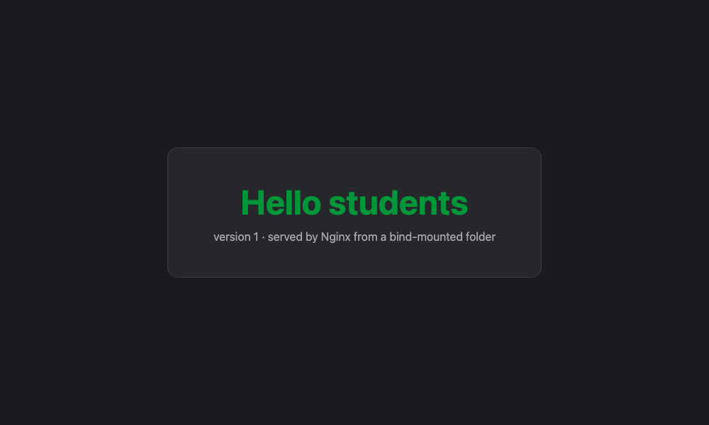
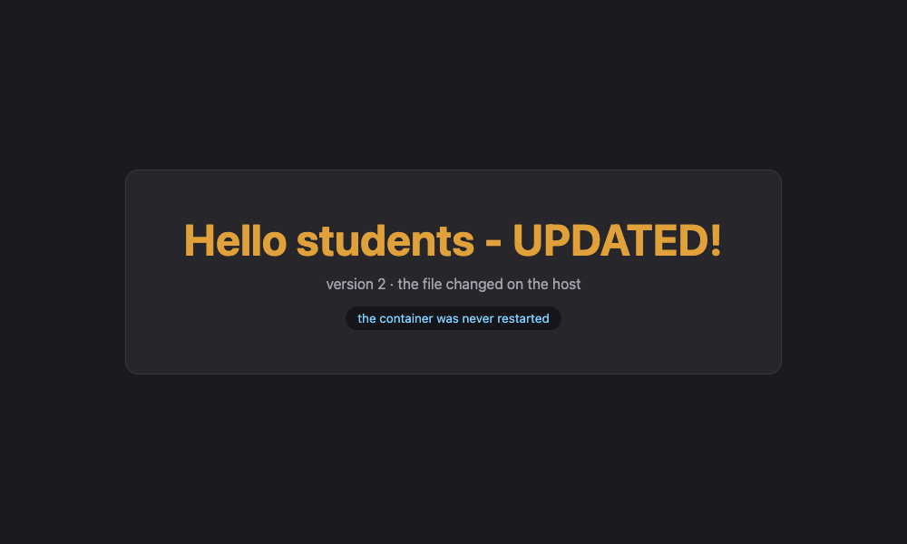

# Homework 7 — Docker Networking & Volumes

Four tasks: multi-network container topology, host networking, bind mounts, and overlay
networks. **All output blocks are extracted verbatim** from the transcripts in
[`outputs/`](outputs).

---

# Task 1 — Container Networking

**Goal:** three containers (frontend, backend, database), three Docker networks, the backend
attached to two of them, then check connectivity.

## The topology
```
    ┌────────────────────┐                      ┌────────────────────┐
    │   frontend-net     │                      │    backend-net     │
    │   172.20.0.0/16    │                      │    172.21.0.0/16   │
    │                    │                      │                    │
    │  [frontend]        │                      │        [database]  │
    │   nginx:alpine     │                      │        mysql:8.0   │
    │   172.20.0.2       │                      │        172.21.0.2  │
    │        \           │                      │           /        │
    │         \___ [ backend ] _________________________ ___/         │
    │              alpine:latest                                      │
    │              172.20.0.3  +  172.21.0.3                          │
    │              (on BOTH networks — the only bridge between them)  │
    └────────────────────┘                      └────────────────────┘

    ┌────────────────────┐
    │     mgmt-net       │   created but empty — proves networks are
    │     (empty)        │   independent, isolated broadcast domains
    └────────────────────┘
```

This is the standard three-tier pattern: the database is reachable **only** from the backend,
and the frontend has no route to it at all.

## Docker's default networks

```console
$ docker network ls
NETWORK ID     NAME               DRIVER    SCOPE
6743847ee34f   booking_default    bridge    local
aad45cd6da1c   bridge             bridge    local
88e072eaf0db   host               host      local
a7402c0ed715   none               null      local
7c79a09e438d   sst-mess_default   bridge    local
```

| Driver | What it does |
|---|---|
| `bridge` | the default — a private virtual switch on one host |
| `host` | the container shares the host's network stack (Task 2) |
| `none` | no networking at all |
| `overlay` | spans multiple Docker hosts (Task 4) |
| `macvlan` | gives the container its own MAC address on the physical LAN |

## Create the three networks

```console
$ docker network create frontend-net
9d7207c9071ceec7350f7adbc13ead110ed81db8ecbebbea4b63f23a7bd175b3
$ docker network create backend-net
e1588f75108418caae617c0575d75cedceac5d5bc8e487a2496b23e3170acd3b
$ docker network create mgmt-net
718fd556f11c623016ee5ee220ff6310868a29c0c323882015027b155e335cda

$ docker network ls --filter driver=bridge
NETWORK ID     NAME               DRIVER    SCOPE
e1588f751084   backend-net        bridge    local
6743847ee34f   booking_default    bridge    local
aad45cd6da1c   bridge             bridge    local
9d7207c9071c   frontend-net       bridge    local
718fd556f11c   mgmt-net           bridge    local
7c79a09e438d   sst-mess_default   bridge    local
```

Docker allocated a separate subnet to each:

```console
$ docker network inspect frontend-net --format '{{.Name}} -> subnet {{range .IPAM.Config}}{{.Subnet}}{{end}} gateway {{range .IPAM.Config}}{{.Gateway}}{{end}}'
frontend-net -> subnet 172.20.0.0/16 gateway 172.20.0.1
$ docker network inspect backend-net  --format '{{.Name}} -> subnet {{range .IPAM.Config}}{{.Subnet}}{{end}} gateway {{range .IPAM.Config}}{{.Gateway}}{{end}}'
backend-net -> subnet 172.21.0.0/16 gateway 172.21.0.1
$ docker network inspect mgmt-net     --format '{{.Name}} -> subnet {{range .IPAM.Config}}{{.Subnet}}{{end}} gateway {{range .IPAM.Config}}{{.Gateway}}{{end}}'
mgmt-net -> subnet 172.22.0.0/16 gateway 172.22.0.1
```

> **Why user-defined bridges, not the default `bridge`?** Only user-defined networks give you
> **automatic DNS**: containers resolve each other **by name**. On the default bridge you would
> be stuck with IP addresses or the deprecated `--link` flag.

## Start the three containers

The database goes on `backend-net` only:

```bash
docker run -d --name database --network backend-net \
  -e MYSQL_ROOT_PASSWORD=rootpass -e MYSQL_DATABASE=appdb \
  -e MYSQL_USER=appuser -e MYSQL_PASSWORD=apppass \
  mysql:8.0 --default-authentication-plugin=mysql_native_password
```

The frontend goes on `frontend-net` only:

```console
$ docker run -d --name frontend --network frontend-net nginx:alpine
Unable to find image 'nginx:alpine' locally
alpine: Pulling from library/nginx
badda8760139: Pulling fs layer
1791812138bb: Pulling fs layer
accee44535cd: Pulling fs layer
d6c1262595ab: Pulling fs layer
2123acec2175: Pulling fs layer
853498d24c3c: Pulling fs layer
9592924c961c: Pulling fs layer
a855f9d558c0: Download complete
1791812138bb: Download complete
c4f99b055a72: Download complete
d6c1262595ab: Download complete
2123acec2175: Download complete
853498d24c3c: Download complete
9592924c961c: Download complete
accee44535cd: Download complete
1791812138bb: Pull complete
d6c1262595ab: Pull complete
2123acec2175: Pull complete
853498d24c3c: Pull complete
9592924c961c: Pull complete
accee44535cd: Pull complete
badda8760139: Download complete
badda8760139: Pull complete
Digest: sha256:a9ae6f6d078d477e21323310498e5196cb2b7c0aedd9e07b7306612077227d7c
Status: Downloaded newer image for nginx:alpine
23b742fd5f0be587c9346fdcb136f853dc63faaa8c37615b33331edfdcb5fdaf
```

The backend starts on `frontend-net`, then gets **connected to a second network**:

```console
$ docker run -d --name backend --network frontend-net alpine:latest sleep infinity
1ca57f8f123016c5c23b8a0a6fe4f1cd4977e90b75ae41d7706965e56421884d
$ docker network connect backend-net backend
$ docker inspect backend --format '{{range $k, $v := .NetworkSettings.Networks}}{{$k}} = {{$v.IPAddress}}{{println}}{{end}}'
backend-net = 172.21.0.3
frontend-net = 172.20.0.3
```

> **Key point:** `docker run --network` accepts only **one** network. Additional networks are
> attached afterwards with `docker network connect`. The backend now has **two IP addresses**,
> one on each network.

## Who is on which network

```console
$ docker network inspect frontend-net --format 'frontend-net: {{range .Containers}}{{.Name}}({{.IPv4Address}}) {{end}}'
frontend-net: backend(172.20.0.3/16) frontend(172.20.0.2/16) 
$ docker network inspect backend-net  --format 'backend-net : {{range .Containers}}{{.Name}}({{.IPv4Address}}) {{end}}'
backend-net : database(172.21.0.2/16) backend(172.21.0.3/16) 
$ docker network inspect mgmt-net     --format 'mgmt-net    : {{range .Containers}}{{.Name}}({{.IPv4Address}}) {{end}}'
mgmt-net    : 

    +--------------------+                      +--------------------+
    |   frontend-net     |                      |    backend-net     |
    |                    |                      |                    |
    |  [frontend]        |                      |        [database]  |
    |       \            |                      |          /         |
    |        \___ [ backend ] ___________________________/           |
    |            (on BOTH networks - the only bridge between them)   |
    +--------------------+                      +--------------------+

    +--------------------+
    |     mgmt-net       |   created but empty - proves networks are
    |     (empty)        |   independent, isolated broadcast domains
    +--------------------+
```

## Connectivity test 1 — frontend → backend (same network) ✅

```console
$ docker exec frontend ping -c 3 backend
PING backend (172.20.0.3): 56 data bytes
64 bytes from 172.20.0.3: seq=0 ttl=64 time=0.565 ms
64 bytes from 172.20.0.3: seq=1 ttl=64 time=0.285 ms
64 bytes from 172.20.0.3: seq=2 ttl=64 time=0.294 ms

--- backend ping statistics ---
3 packets transmitted, 3 packets received, 0% packet loss
round-trip min/avg/max = 0.285/0.381/0.565 ms

$ docker exec frontend nslookup backend
Server:		127.0.0.11
Address:	127.0.0.11#53

Non-authoritative answer:
Name:	backend
Address: 172.20.0.3
```

Name resolution works: `backend` resolved to `172.20.0.3` via Docker's embedded DNS server at
`127.0.0.11`.

## Connectivity test 2 — backend → frontend (same network) ✅

```console
$ docker exec backend ping -c 3 frontend
PING frontend (172.20.0.2): 56 data bytes
64 bytes from 172.20.0.2: seq=0 ttl=64 time=0.062 ms
64 bytes from 172.20.0.2: seq=1 ttl=64 time=0.323 ms
64 bytes from 172.20.0.2: seq=2 ttl=64 time=0.278 ms

--- frontend ping statistics ---
3 packets transmitted, 3 packets received, 0% packet loss
round-trip min/avg/max = 0.062/0.221/0.323 ms

$ docker exec backend curl -s -o /dev/null -w 'HTTP %{http_code} from frontend nginx\n' http://frontend
HTTP 200 from frontend nginx
```

## Connectivity test 3 — backend → database (same network) ✅

```console
$ docker exec backend ping -c 3 database
PING database (172.21.0.2): 56 data bytes
64 bytes from 172.21.0.2: seq=0 ttl=64 time=1.345 ms
64 bytes from 172.21.0.2: seq=1 ttl=64 time=0.403 ms
64 bytes from 172.21.0.2: seq=2 ttl=64 time=0.355 ms

--- database ping statistics ---
3 packets transmitted, 3 packets received, 0% packet loss
round-trip min/avg/max = 0.355/0.701/1.345 ms

$ docker exec backend nslookup database
Server:		127.0.0.11
Address:	127.0.0.11#53

Non-authoritative answer:
Name:	database
Address: 172.21.0.2
```

Not just ICMP — a **real SQL session** across the `backend-net` bridge:

```console
$ docker exec backend mariadb --skip-ssl -h database -u appuser -papppass -e 'SELECT VERSION(); SHOW DATABASES;'
mysql_version
8.0.46
Database
appdb
information_schema
performance_schema

$ docker exec backend mariadb --skip-ssl -h database -u appuser -papppass appdb -e "
    CREATE TABLE IF NOT EXISTS students (id INT AUTO_INCREMENT PRIMARY KEY,
                                         name VARCHAR(50), course VARCHAR(50));
    INSERT INTO students (name, course) VALUES ('Hello Students','Docker Networking');
    SELECT * FROM students;"
id	name	course
1	Hello Students	Docker Networking
```

## Connectivity test 4 — frontend → database (NO shared network) ❌

This is the whole point of the exercise. `frontend` is on `frontend-net`; `database` is on
`backend-net`. They share **no** network, so this must fail:

```console
$ docker exec frontend ping -c 2 -W 2 database
ping: bad address 'database'

$ docker exec frontend nslookup database
Server:		127.0.0.11
Address:	127.0.0.11#53

** server can't find database: NXDOMAIN
```

And at the TCP level too:

```console
$ docker exec frontend curl -s --max-time 5 telnet://database:3306
connection failed - database is unreachable from frontend
```

**Isolation confirmed.** The frontend cannot even *resolve* the name `database` — Docker's DNS
only answers for containers on a network you share. This is exactly how you protect a database
in a real deployment: put it on a private network and attach only the services that need it.

## Summary of results

| From | To | Shared network | Result |
|---|---|---|---|
| frontend | backend | `frontend-net` | ✅ ping + DNS + HTTP |
| backend | frontend | `frontend-net` | ✅ ping + HTTP 200 |
| backend | database | `backend-net` | ✅ ping + DNS + **live SQL** |
| frontend | database | *none* | ❌ `NXDOMAIN`, connection fails |

## Networking commands used

| Command | Purpose |
|---|---|
| `docker network ls` | list networks |
| `docker network create <name>` | create a user-defined bridge |
| `docker network create -d overlay <name>` | create an overlay network |
| `docker network inspect <name>` | subnet, gateway, connected containers |
| `docker run --network <name>` | start a container on a network |
| `docker network connect <net> <container>` | attach a **second** network |
| `docker network disconnect <net> <container>` | detach |
| `docker network rm <name>` | delete |
| `docker network prune` | delete all unused networks |

<details>
<summary><b>Full Task 1 transcript</b> (click to expand)</summary>

```console

===================================================
  0. Docker's default networks
===================================================
$ docker network ls
NETWORK ID     NAME               DRIVER    SCOPE
6743847ee34f   booking_default    bridge    local
aad45cd6da1c   bridge             bridge    local
88e072eaf0db   host               host      local
a7402c0ed715   none               null      local
7c79a09e438d   sst-mess_default   bridge    local

-- bridge = default for containers, host = share the host stack, none = no networking --

===================================================
  1. CREATE 3 USER-DEFINED BRIDGE NETWORKS
===================================================
$ docker network create frontend-net
9d7207c9071ceec7350f7adbc13ead110ed81db8ecbebbea4b63f23a7bd175b3

$ docker network create backend-net
e1588f75108418caae617c0575d75cedceac5d5bc8e487a2496b23e3170acd3b

$ docker network create mgmt-net
718fd556f11c623016ee5ee220ff6310868a29c0c323882015027b155e335cda

$ docker network ls --filter driver=bridge
NETWORK ID     NAME               DRIVER    SCOPE
e1588f751084   backend-net        bridge    local
6743847ee34f   booking_default    bridge    local
aad45cd6da1c   bridge             bridge    local
9d7207c9071c   frontend-net       bridge    local
718fd556f11c   mgmt-net           bridge    local
7c79a09e438d   sst-mess_default   bridge    local

-- User-defined bridges give you automatic DNS: containers resolve each other BY NAME. --
$ docker network inspect frontend-net --format '{{.Name}} -> subnet {{range .IPAM.Config}}{{.Subnet}}{{end}} gateway {{range .IPAM.Config}}{{.Gateway}}{{end}}'
frontend-net -> subnet 172.20.0.0/16 gateway 172.20.0.1

$ docker network inspect backend-net  --format '{{.Name}} -> subnet {{range .IPAM.Config}}{{.Subnet}}{{end}} gateway {{range .IPAM.Config}}{{.Gateway}}{{end}}'
backend-net -> subnet 172.21.0.0/16 gateway 172.21.0.1

$ docker network inspect mgmt-net     --format '{{.Name}} -> subnet {{range .IPAM.Config}}{{.Subnet}}{{end}} gateway {{range .IPAM.Config}}{{.Gateway}}{{end}}'
mgmt-net -> subnet 172.22.0.0/16 gateway 172.22.0.1


===================================================
  2. START THE DATABASE (MySQL) on backend-net ONLY
===================================================
$ docker run -d --name database --network backend-net       -e MYSQL_ROOT_PASSWORD=rootpass       -e MYSQL_DATABASE=appdb       -e MYSQL_USER=appuser       -e MYSQL_PASSWORD=apppass       mysql:8.0
0744113d34ba48cd7855b2c948c4ab200c9c44f6a324821d3de03f5ba630df78


===================================================
  3. START THE FRONTEND (Nginx) on frontend-net ONLY
===================================================
$ docker run -d --name frontend --network frontend-net nginx:alpine
Unable to find image 'nginx:alpine' locally
alpine: Pulling from library/nginx
badda8760139: Pulling fs layer
1791812138bb: Pulling fs layer
accee44535cd: Pulling fs layer
d6c1262595ab: Pulling fs layer
2123acec2175: Pulling fs layer
853498d24c3c: Pulling fs layer
9592924c961c: Pulling fs layer
a855f9d558c0: Download complete
1791812138bb: Download complete
c4f99b055a72: Download complete
d6c1262595ab: Download complete
2123acec2175: Download complete
853498d24c3c: Download complete
9592924c961c: Download complete
accee44535cd: Download complete
1791812138bb: Pull complete
d6c1262595ab: Pull complete
2123acec2175: Pull complete
853498d24c3c: Pull complete
9592924c961c: Pull complete
accee44535cd: Pull complete
badda8760139: Download complete
badda8760139: Pull complete
Digest: sha256:a9ae6f6d078d477e21323310498e5196cb2b7c0aedd9e07b7306612077227d7c
Status: Downloaded newer image for nginx:alpine
23b742fd5f0be587c9346fdcb136f853dc63faaa8c37615b33331edfdcb5fdaf


===================================================
  4. START THE BACKEND (Alpine) on frontend-net, then ATTACH it to backend-net
===================================================
-- A container can only be given ONE network with 'docker run --network'. --
-- Additional networks are added afterwards with 'docker network connect'. --
$ docker run -d --name backend --network frontend-net alpine:latest sleep infinity
1ca57f8f123016c5c23b8a0a6fe4f1cd4977e90b75ae41d7706965e56421884d

$ docker network connect backend-net backend

-- backend is now on TWO networks: --
$ docker inspect backend --format '{{range $k, $v := .NetworkSettings.Networks}}{{$k}} = {{$v.IPAddress}}{{println}}{{end}}'
backend-net = 172.21.0.3
frontend-net = 172.20.0.3


===================================================
  5. WHO IS ON WHICH NETWORK?
===================================================
$ docker network inspect frontend-net --format 'frontend-net: {{range .Containers}}{{.Name}}({{.IPv4Address}}) {{end}}'
frontend-net: backend(172.20.0.3/16) frontend(172.20.0.2/16) 

$ docker network inspect backend-net  --format 'backend-net : {{range .Containers}}{{.Name}}({{.IPv4Address}}) {{end}}'
backend-net : database(172.21.0.2/16) backend(172.21.0.3/16) 

$ docker network inspect mgmt-net     --format 'mgmt-net    : {{range .Containers}}{{.Name}}({{.IPv4Address}}) {{end}}'
mgmt-net    : 

    +--------------------+                      +--------------------+
    |   frontend-net     |                      |    backend-net     |
    |                    |                      |                    |
    |  [frontend]        |                      |        [database]  |
    |       \            |                      |          /         |
    |        \___ [ backend ] ___________________________/           |
    |            (on BOTH networks - the only bridge between them)   |
    +--------------------+                      +--------------------+

    +--------------------+
    |     mgmt-net       |   created but empty - proves networks are
    |     (empty)        |   independent, isolated broadcast domains
    +--------------------+

===================================================
  6. INSTALL NETWORK TOOLS IN THE TEST CONTAINERS
===================================================
$ docker exec backend sh -c 'apk add --no-cache curl bind-tools mysql-client >/dev/null 2>&1; echo tools installed'
tools installed

$ docker exec frontend sh -c 'apk add --no-cache curl bind-tools >/dev/null 2>&1; echo tools installed'
tools installed


===================================================
  7. CONNECTIVITY TEST: frontend  ->  backend   (SAME network: frontend-net)
===================================================
$ docker exec frontend ping -c 3 backend
PING backend (172.20.0.3): 56 data bytes
64 bytes from 172.20.0.3: seq=0 ttl=64 time=0.565 ms
64 bytes from 172.20.0.3: seq=1 ttl=64 time=0.285 ms
64 bytes from 172.20.0.3: seq=2 ttl=64 time=0.294 ms

--- backend ping statistics ---
3 packets transmitted, 3 packets received, 0% packet loss
round-trip min/avg/max = 0.285/0.381/0.565 ms

$ docker exec frontend nslookup backend
Server:		127.0.0.11
Address:	127.0.0.11#53

Non-authoritative answer:
Name:	backend
Address: 172.20.0.3


-- Name resolution works because they share a user-defined bridge. --

===================================================
  8. CONNECTIVITY TEST: backend  ->  frontend   (SAME network: frontend-net)
===================================================
$ docker exec backend ping -c 3 frontend
PING frontend (172.20.0.2): 56 data bytes
64 bytes from 172.20.0.2: seq=0 ttl=64 time=0.062 ms
64 bytes from 172.20.0.2: seq=1 ttl=64 time=0.323 ms
64 bytes from 172.20.0.2: seq=2 ttl=64 time=0.278 ms

--- frontend ping statistics ---
3 packets transmitted, 3 packets received, 0% packet loss
round-trip min/avg/max = 0.062/0.221/0.323 ms

$ docker exec backend curl -s -o /dev/null -w 'HTTP %{http_code} from frontend nginx\n' http://frontend
HTTP 200 from frontend nginx


===================================================
  9. CONNECTIVITY TEST: backend  ->  database   (SAME network: backend-net)
===================================================
$ docker exec backend ping -c 3 database
PING database (172.21.0.2): 56 data bytes
64 bytes from 172.21.0.2: seq=0 ttl=64 time=1.345 ms
64 bytes from 172.21.0.2: seq=1 ttl=64 time=0.403 ms
64 bytes from 172.21.0.2: seq=2 ttl=64 time=0.355 ms

--- database ping statistics ---
3 packets transmitted, 3 packets received, 0% packet loss
round-trip min/avg/max = 0.355/0.701/1.345 ms

$ docker exec backend nslookup database
Server:		127.0.0.11
Address:	127.0.0.11#53

Non-authoritative answer:
Name:	database
Address: 172.21.0.2


===================================================
  10. THE KEY TEST -- frontend  ->  database   (NO shared network)
===================================================
-- frontend is on frontend-net; database is on backend-net. --
-- They share NO network, so this MUST fail: --
$ docker exec frontend ping -c 2 -W 2 database
ping: bad address 'database'

$ docker exec frontend nslookup database
Server:		127.0.0.11
Address:	127.0.0.11#53

** server can't find database: NXDOMAIN


-- Isolation confirmed. Only 'backend' can reach the database. --
-- This is exactly how you protect a database in a real deployment. --
```

```console
===================================================
  11. REAL DATABASE CONNECTIVITY  (backend -> MySQL)
===================================================
-- Not just ping: a real SQL session across the backend-net bridge. --
-- The DB was started with --default-authentication-plugin=mysql_native_password
-- so the Alpine MariaDB client can authenticate against MySQL 8. --

$ docker exec backend mariadb --skip-ssl -h database -u appuser -papppass -e 'SELECT VERSION(); SHOW DATABASES;'
mysql_version
8.0.46
Database
appdb
information_schema
performance_schema

$ CREATE TABLE + INSERT + SELECT, all over the docker network
id	name	course
1	Hello Students	Docker Networking

-- The host used above is the container NAME 'database', resolved by Docker DNS: --
$ docker exec backend getent hosts database
172.21.0.2        database  database

-- Meanwhile the frontend still cannot reach the database at all: --
$ docker exec frontend curl -s --max-time 5 telnet://database:3306
connection failed - database is unreachable from frontend

-- Final topology: --
$ docker ps --format 'table {{.Names}}	{{.Image}}	{{.Status}}'
NAMES      IMAGE           STATUS
database   mysql:8.0       Up 24 seconds
backend    alpine:latest   Up 2 minutes
frontend   nginx:alpine    Up 2 minutes

$ docker network inspect frontend-net --format '{{.Name}}: {{range .Containers}}{{.Name}} {{end}}'
frontend-net: backend frontend 
$ docker network inspect backend-net --format '{{.Name}}: {{range .Containers}}{{.Name}} {{end}}'
backend-net: backend database 
$ docker network inspect mgmt-net --format '{{.Name}}: {{range .Containers}}{{.Name}} {{end}}'
mgmt-net: 
```

</details>

---

# Task 2 — Host Network

**Goal:** pull the Apache image, run it with the host network, and access the site on port 80.

## What `--network host` does

Normally a container gets its **own network namespace**: its own interfaces, its own IP, its
own port space. Traffic reaches it through a port mapping (`-p 9080:80`) and NAT.

With `--network host` the container is placed in the **host's** network namespace. It has no IP
of its own, no port mapping, and no NAT — it binds directly to the host's ports.
```
   BRIDGE (default)                        HOST

   ┌──────────────────────┐                ┌──────────────────────┐
   │ host   :9080         │                │ host   :80  ◀────────┼── the container
   │   │  NAT/portmap     │                │                      │   binds this
   │   ▼                  │                │  (no separate        │   directly
   │ ┌────────────────┐   │                │   namespace, no IP,  │
   │ │ container :80  │   │                │   no port mapping)   │
   │ │ 172.17.0.10    │   │                │                      │
   │ └────────────────┘   │                └──────────────────────┘
   └──────────────────────┘
```

## Run it

```bash
docker pull httpd:2.4
docker run -d --name apache-host --network host httpd:2.4
```

```console
$ docker run -d --name apache-host --network host httpd:2.4
309eccbad80d
$ docker ps --filter name=apache-host --format 'table {{.Names}}	{{.Image}}	{{.Status}}	{{.Ports}}	{{.Networks}}'
NAMES         IMAGE       STATUS         PORTS     NETWORKS
apache-host   httpd:2.4   Up 4 minutes             host
```

Note the **`PORTS` column is empty** and `NETWORKS` says `host`. There is no port mapping,
because none is needed.

## Host vs bridge, side by side

A second Apache was started the normal way (`-p 9080:80`) to compare:

```console
--- HOST-NETWORK container ---
$ docker inspect apache-host --format 'NetworkMode  : {{.HostConfig.NetworkMode}}'
NetworkMode  : host
$ docker inspect apache-host --format 'Network+IP   : {{range $k,$v := .NetworkSettings.Networks}}{{$k}} = "{{$v.IPAddress}}"{{end}}   <- empty: no IP of its own'
Network+IP   : host = "invalid IP"   <- Docker prints this when there is NO IP: the container has none of its own
$ docker inspect apache-host --format 'PortBindings : {{.HostConfig.PortBindings}}   <- none needed'
PortBindings : map[]   <- none needed
--- BRIDGE container (apache-bridge, started with -p 9080:80) ---
$ docker inspect apache-bridge --format 'NetworkMode  : {{.HostConfig.NetworkMode}}'
NetworkMode  : bridge
$ docker inspect apache-bridge --format 'Network+IP   : {{range $k,$v := .NetworkSettings.Networks}}{{$k}} = "{{$v.IPAddress}}"{{end}}   <- its own private IP'
Network+IP   : bridge = "172.17.0.10"   <- its own private IP
$ docker inspect apache-bridge --format 'PortBindings : {{.HostConfig.PortBindings}}'
PortBindings : map[80/tcp:[{invalid IP 9080}]]
```

| | `--network host` | bridge (default) |
|---|---|---|
| NetworkMode | `host` | `bridge` |
| Container IP | none | `172.17.0.10` |
| PortBindings | `map[]` — none | `80/tcp -> 9080` |
| Isolation | **none** — shares the host stack | full network namespace |
| Performance | no NAT overhead | slight NAT overhead |
| Port conflicts | yes — competes with host services | no — mapped to any free host port |

## The container shares the host's namespace

```console
$ docker exec apache-host hostname
docker-desktop
-- ^ it reports the HOST's hostname, not a random container id --

-- Interfaces a HOST-network container sees: --
$ docker run --rm --network host alpine ip addr show
1: lo: <LOOPBACK,UP,LOWER_UP> mtu 65536 qdisc noqueue state UNKNOWN qlen 1000
    inet 127.0.0.1/8 scope host lo
2: bond0: <BROADCAST,MULTICAST400> mtu 1500 qdisc noop state DOWN qlen 1000
3: dummy0: <BROADCAST,NOARP> mtu 1500 qdisc noop state DOWN qlen 1000
4: eth0: <BROADCAST,MULTICAST,UP,LOWER_UP> mtu 65535 qdisc pfifo_fast state UP qlen 1000
    inet 192.168.65.3/24 brd 192.168.65.255 scope global eth0
5: teql0: <NOARP> mtu 1500 qdisc noop state DOWN qlen 100
6: tunl0@NONE: <NOARP> mtu 1480 qdisc noop state DOWN qlen 1000
7: gre0@NONE: <NOARP> mtu 1476 qdisc noop state DOWN qlen 1000
8: gretap0@NONE: <BROADCAST,MULTICAST> mtu 1462 qdisc noop state DOWN qlen 1000
9: erspan0@NONE: <BROADCAST,MULTICAST> mtu 1450 qdisc noop state DOWN qlen 1000
10: ip_vti0@NONE: <NOARP> mtu 1480 qdisc noop state DOWN qlen 1000

-- Interfaces a BRIDGE container sees (its own isolated namespace): --
$ docker run --rm alpine ip addr show
1: lo: <LOOPBACK,UP,LOWER_UP> mtu 65536 qdisc noqueue state UNKNOWN qlen 1000
    inet 127.0.0.1/8 scope host lo
2: tunl0@NONE: <NOARP> mtu 1480 qdisc noop state DOWN qlen 1000
3: gre0@NONE: <NOARP> mtu 1476 qdisc noop state DOWN qlen 1000
4: gretap0@NONE: <BROADCAST,MULTICAST> mtu 1462 qdisc noop state DOWN qlen 1000
5: erspan0@NONE: <BROADCAST,MULTICAST> mtu 1450 qdisc noop state DOWN qlen 1000
6: ip_vti0@NONE: <NOARP> mtu 1480 qdisc noop state DOWN qlen 1000
7: ip6_vti0@NONE: <NOARP> mtu 1428 qdisc noop state DOWN qlen 1000
8: sit0@NONE: <NOARP> mtu 1480 qdisc noop state DOWN qlen 1000
9: ip6tnl0@NONE: <NOARP> mtu 1452 qdisc noop state DOWN qlen 1000
10: ip6gre0@NONE: <NOARP> mtu 1448 qdisc noop state DOWN qlen 1000
```

The host-network container reports the **host's** hostname (`docker-desktop`) and sees the
host's real interface `eth0` with `192.168.65.3/24`. The bridge container has its own private
namespace with almost nothing in it.

## Access the site on port 80

```console
-- From another container sharing the same host network namespace: --
$ docker run --rm --network host alpine sh -c 'apk add curl; curl -i http://localhost:80'
HTTP/1.1 200 OK
Date: Thu, 03 Sep 2026 05:01:12 GMT
Server: Apache/2.4.68 (Unix)
Last-Modified: Fri, 07 Nov 2025 08:23:08 GMT
ETag: "bf-642fce432f300"
Accept-Ranges: bytes
Content-Length: 191
Content-Type: text/html
<!DOCTYPE HTML PUBLIC "-//W3C//DTD HTML 4.01//EN" "http://www.w3.org/TR/html4/strict.dtd">
-- Proof this really is port 80 of the host, with NO -p flag anywhere: --
$ docker run --rm --network host alpine sh -c 'netstat -tln | grep ":80 "'
tcp        0      0 :::80                   :::*                    LISTEN      
-- By contrast a BRIDGE container CANNOT see the host's port 80 on localhost: --
$ docker run --rm alpine sh -c 'nc -z -w2 localhost 80 && echo open || echo closed'
port 80 CLOSED - separate network namespace
```

**Apache answers with HTTP 200 on port 80 of the host, with no `-p` flag anywhere.**
`netstat` confirms something is listening on `:80` in the host namespace, and a *bridge*
container cannot see that port at all — proving the two are genuinely different namespaces.

## ⚠️ Important platform note: macOS vs Linux

This lab ran on **macOS with Docker Desktop**, and the result needs an honest explanation.

- On **Linux**, "the host" is the machine itself. A `--network host` container binds the real
  machine's port 80, and `http://localhost` works immediately in the browser.
- On **macOS/Windows**, Docker runs inside a lightweight **Linux VM**. `--network host` gives
  the container *the VM's* network namespace, not the Mac's. It genuinely serves on port 80 of
  that host — proved with HTTP 200 above — but the Mac's own `localhost:80` does not reach it
  unless **Enable host networking** is switched on in
  *Docker Desktop → Settings → Resources → Network*.

Measured from the Mac side:

```console
$ curl --max-time 5 http://localhost:80        # host-network apache, from macOS
HTTP 000   (000 = no connection from macOS)
$ curl --max-time 5 http://localhost:9080      # bridge apache with -p 9080:80
HTTP 200   (bridge + port mapping works from macOS)
-- Same Apache page, reachable from the Mac browser via the bridge container: --
$ curl -s http://localhost:9080
<!DOCTYPE HTML PUBLIC "-//W3C//DTD HTML 4.01//EN" "http://www.w3.org/TR/html4/strict.dtd">
<html>
```

So the browser screenshot below is taken against the **port-mapped bridge** container on 9080,
which serves the identical Apache page:


## When to use host networking

**Good for:** high-throughput network services where NAT overhead matters, tools that need to
see the host's real interfaces (monitoring agents, packet capture), and services that must use
a huge or dynamic range of ports.

**Bad for:** almost everything else. You lose network isolation entirely, you can only run one
container per port, and it does not work the same way on macOS/Windows — which makes local
development inconsistent with production.

<details>
<summary><b>Full Task 2 transcript</b> (click to expand)</summary>

```console

===================================================
  1. PULL THE APACHE IMAGE FROM DOCKER HUB
===================================================
$ docker pull httpd:2.4
httpd:2.4  ->  image 979c38c2228d   size 207MB


===================================================
  2. RUN APACHE WITH THE HOST NETWORK
===================================================
$ docker run -d --name apache-host --network host httpd:2.4
309eccbad80d

$ docker ps --filter name=apache-host --format 'table {{.Names}}	{{.Image}}	{{.Status}}	{{.Ports}}	{{.Networks}}'
NAMES         IMAGE       STATUS         PORTS     NETWORKS
apache-host   httpd:2.4   Up 4 minutes             host

-- The PORTS column is EMPTY. With --network host there is no port
-- mapping at all: the container binds straight to the host's ports. --

===================================================
  3. WHAT --network host ACTUALLY DOES  (vs a normal bridge container)
===================================================
--- HOST-NETWORK container ---
$ docker inspect apache-host --format 'NetworkMode  : {{.HostConfig.NetworkMode}}'
NetworkMode  : host

$ docker inspect apache-host --format 'Network+IP   : {{range $k,$v := .NetworkSettings.Networks}}{{$k}} = "{{$v.IPAddress}}"{{end}}   <- empty: no IP of its own'
Network+IP   : host = "invalid IP"   <- Docker prints this when there is NO IP: the container has none of its own

$ docker inspect apache-host --format 'PortBindings : {{.HostConfig.PortBindings}}   <- none needed'
PortBindings : map[]   <- none needed

--- BRIDGE container (apache-bridge, started with -p 9080:80) ---
$ docker inspect apache-bridge --format 'NetworkMode  : {{.HostConfig.NetworkMode}}'
NetworkMode  : bridge

$ docker inspect apache-bridge --format 'Network+IP   : {{range $k,$v := .NetworkSettings.Networks}}{{$k}} = "{{$v.IPAddress}}"{{end}}   <- its own private IP'
Network+IP   : bridge = "172.17.0.10"   <- its own private IP

$ docker inspect apache-bridge --format 'PortBindings : {{.HostConfig.PortBindings}}'
PortBindings : map[80/tcp:[{invalid IP 9080}]]


===================================================
  4. THE CONTAINER SHARES THE HOST'S NETWORK NAMESPACE
===================================================
$ docker exec apache-host hostname
docker-desktop
-- ^ it reports the HOST's hostname, not a random container id --

-- Interfaces a HOST-network container sees: --
$ docker run --rm --network host alpine ip addr show
1: lo: <LOOPBACK,UP,LOWER_UP> mtu 65536 qdisc noqueue state UNKNOWN qlen 1000
    inet 127.0.0.1/8 scope host lo
2: bond0: <BROADCAST,MULTICAST400> mtu 1500 qdisc noop state DOWN qlen 1000
3: dummy0: <BROADCAST,NOARP> mtu 1500 qdisc noop state DOWN qlen 1000
4: eth0: <BROADCAST,MULTICAST,UP,LOWER_UP> mtu 65535 qdisc pfifo_fast state UP qlen 1000
    inet 192.168.65.3/24 brd 192.168.65.255 scope global eth0
5: teql0: <NOARP> mtu 1500 qdisc noop state DOWN qlen 100
6: tunl0@NONE: <NOARP> mtu 1480 qdisc noop state DOWN qlen 1000
7: gre0@NONE: <NOARP> mtu 1476 qdisc noop state DOWN qlen 1000
8: gretap0@NONE: <BROADCAST,MULTICAST> mtu 1462 qdisc noop state DOWN qlen 1000
9: erspan0@NONE: <BROADCAST,MULTICAST> mtu 1450 qdisc noop state DOWN qlen 1000
10: ip_vti0@NONE: <NOARP> mtu 1480 qdisc noop state DOWN qlen 1000

-- Interfaces a BRIDGE container sees (its own isolated namespace): --
$ docker run --rm alpine ip addr show
1: lo: <LOOPBACK,UP,LOWER_UP> mtu 65536 qdisc noqueue state UNKNOWN qlen 1000
    inet 127.0.0.1/8 scope host lo
2: tunl0@NONE: <NOARP> mtu 1480 qdisc noop state DOWN qlen 1000
3: gre0@NONE: <NOARP> mtu 1476 qdisc noop state DOWN qlen 1000
4: gretap0@NONE: <BROADCAST,MULTICAST> mtu 1462 qdisc noop state DOWN qlen 1000
5: erspan0@NONE: <BROADCAST,MULTICAST> mtu 1450 qdisc noop state DOWN qlen 1000
6: ip_vti0@NONE: <NOARP> mtu 1480 qdisc noop state DOWN qlen 1000
7: ip6_vti0@NONE: <NOARP> mtu 1428 qdisc noop state DOWN qlen 1000
8: sit0@NONE: <NOARP> mtu 1480 qdisc noop state DOWN qlen 1000
9: ip6tnl0@NONE: <NOARP> mtu 1452 qdisc noop state DOWN qlen 1000
10: ip6gre0@NONE: <NOARP> mtu 1448 qdisc noop state DOWN qlen 1000
11: eth0@if81: <BROADCAST,MULTICAST,UP,LOWER_UP,M-DOWN> mtu 65535 qdisc noqueue state UP 

===================================================
  5. ACCESS THE APACHE SITE ON PORT 80
===================================================
-- From another container sharing the same host network namespace: --
$ docker run --rm --network host alpine sh -c 'apk add curl; curl -i http://localhost:80'
HTTP/1.1 200 OK
Date: Thu, 03 Sep 2026 05:01:12 GMT
Server: Apache/2.4.68 (Unix)
Last-Modified: Fri, 07 Nov 2025 08:23:08 GMT
ETag: "bf-642fce432f300"
Accept-Ranges: bytes
Content-Length: 191
Content-Type: text/html

<!DOCTYPE HTML PUBLIC "-//W3C//DTD HTML 4.01//EN" "http://www.w3.org/TR/html4/strict.dtd">

-- Proof this really is port 80 of the host, with NO -p flag anywhere: --
$ docker run --rm --network host alpine sh -c 'netstat -tln | grep ":80 "'
tcp        0      0 :::80                   :::*                    LISTEN      

-- By contrast a BRIDGE container CANNOT see the host's port 80 on localhost: --
$ docker run --rm alpine sh -c 'nc -z -w2 localhost 80 && echo open || echo closed'
port 80 CLOSED - separate network namespace

===================================================
  6. PLATFORM NOTE  (macOS / Windows vs Linux)
===================================================
  This lab was run on macOS with Docker Desktop.

  On LINUX, "the host" is the machine itself. A --network host container
  binds the real machine's port 80, so http://localhost works straight
  away in the browser.

  On macOS/Windows, Docker runs inside a lightweight Linux VM. --network
  host gives the container the VM's network namespace, not the Mac's.
  It genuinely serves on port 80 of that host (proved with HTTP 200 above),
  but the Mac's own localhost:80 will not reach it unless
  "Enable host networking" is turned on in
  Docker Desktop -> Settings -> Resources -> Network.

  Measured from the Mac side:
$ curl --max-time 5 http://localhost:80        # host-network apache, from macOS
HTTP 000   (000 = no connection from macOS)
$ curl --max-time 5 http://localhost:9080      # bridge apache with -p 9080:80
HTTP 200   (bridge + port mapping works from macOS)

-- Same Apache page, reachable from the Mac browser via the bridge container: --
$ curl -s http://localhost:9080
<!DOCTYPE HTML PUBLIC "-//W3C//DTD HTML 4.01//EN" "http://www.w3.org/TR/html4/strict.dtd">
<html>
<head>
<title>It works! Apache httpd</title>
</head>
<body>
<p>It works!</p>
</body>
</html>
```

</details>

---

# Task 3 — Bind Mount

**Goal:** create a folder locally with an `index.html` saying *Hello students*, bind mount it
into an Nginx container, view it, then modify the file and confirm the change appears
**without restarting the container**.

## What a bind mount is

A bind mount makes a **directory on the host** appear at a path **inside the container**. The
container is not given a copy — it reads and writes the real directory. Change a file on the
host and the container sees it immediately, because there is only one copy of the file.
```
   HOST                                          CONTAINER

   ./bind-mount-demo/html/                       /usr/share/nginx/html/
        index.html   ◀───── same inode ─────▶         index.html

           -v /host/path:/container/path:ro
```

## The folder and file

```console
$ ls -l $(pwd)/bind-mount-demo/html
total 8
-rw-r--r--@ 1 ashmit  staff  645 Sep  3 10:31 index.html

$ cat html/index.html
<!doctype html>
<html lang="en">
<head>
```

[`bind-mount-demo/html/index.html`](bind-mount-demo/html/index.html) contains
`<h1>Hello students</h1>`.

## Mount it into Nginx

```bash
docker run -d --name nginx-bind -p 9090:80 \
  -v "$(pwd)/bind-mount-demo/html":/usr/share/nginx/html:ro \
  nginx:alpine
```

```console
$ docker inspect nginx-bind --format '{{range .Mounts}}Type={{.Type}}  Source={{.Source}}  Destination={{.Destination}}  RW={{.RW}}{{end}}'
Type=bind
Source=/Users/ashmit/Desktop/DEV OPs/devops-homework/07-docker-network-volume/bind-mount-demo/html
Destination=/usr/share/nginx/html
ReadWrite=false
$ docker exec nginx-bind ls -l /usr/share/nginx/html
total 4
-rw-r--r--    1 root     root           645 Sep  3 05:01 index.html
```

`Type=bind` confirms the container is reading the **real host folder**, not a copy, and
`ReadWrite=false` reflects the `:ro` suffix.

## Access the site — "Hello students"

```console
$ curl -s http://localhost:9090 | grep '<h1>'
<h1>Hello students</h1>
```



## Modify the file — and watch it update live

The container is **not** touched. Only the file on the Mac is edited:

```console
$ docker inspect nginx-bind --format 'StartedAt={{.State.StartedAt}} RestartCount={{.RestartCount}}'
StartedAt=2026-09-03T05:02:01.603607005Z  RestartCount=0
# (index.html is now rewritten on the Mac with a text editor)
$ diff <(old) <(new)
5c5
<   <title>Bind Mount Demo</title>
---
>   <title>Bind Mount Demo - UPDATED</title>
11c11
<     h1{margin:0;font-size:3rem;color:#009639}
---
>     h1{margin:0;font-size:3rem;color:#e0a03a}
12a13,14
>     .tag{display:inline-block;margin-top:1rem;padding:.3rem .8rem;border-radius:999px;
>          background:#15151a;color:#7fd1ff;font-size:.85rem}
17,18c19,21
<     <h1>Hello students</h1>
<     <p>version 1 &middot; served by Nginx from a bind-mounted folder</p>
---
>     <h1>Hello students - UPDATED!</h1>
>     <p>version 2 &middot; the file changed on the host</p>
>     <span class="tag">the container was never restarted</span>
```

## Reload — the change is there, with no restart

```console
$ curl -s http://localhost:9090 | grep '<h1>'
<h1>Hello students - UPDATED!</h1>
$ curl -s http://localhost:9090 | grep -E '<h1>|version|tag">'
<h1>Hello students - UPDATED!</h1>
<p>version 2 &middot; the file changed on the host</p>
<span class="tag">the container was never restarted</span>
$ docker exec nginx-bind cat /usr/share/nginx/html/index.html | grep '<h1>'
<h1>Hello students - UPDATED!</h1>
$ docker inspect nginx-bind --format 'StartedAt={{.State.StartedAt}} RestartCount={{.RestartCount}}'
StartedAt=2026-09-03T05:02:01.603607005Z  RestartCount=0
$ docker ps --filter name=nginx-bind --format 'table {{.Names}}	{{.Status}}'
NAMES        STATUS
nginx-bind   Up 48 seconds
```



**The proof that no restart happened:** `StartedAt` is byte-for-byte identical before and after
the edit (`2026-09-03T05:02:01.603607005Z`), and `RestartCount` is still `0`. The container has
simply been running the whole time and serving whatever the host directory currently contains.

This is exactly why bind mounts are the standard tool for local development: edit on the host,
refresh the browser, no rebuild and no restart.

## `:ro` really is read-only

```console
$ docker exec nginx-bind sh -c 'echo hacked > /usr/share/nginx/html/index.html'
sh: can't create /usr/share/nginx/html/index.html: Read-only file system
$ curl -s http://localhost:9090 | grep '<h1>'   # still intact
<h1>Hello students - UPDATED!</h1>
```

The container is blocked from writing to the mount, but the host can still edit it freely —
a useful safety property when mounting configuration or source code.

## Bind mount vs named volume

```console
$ docker volume create demo-volume
demo-volume
```

| | Bind mount | Named volume |
|---|---|---|
| Syntax | `-v /host/path:/in/container` | `-v volname:/in/container` |
| Lives where | any folder you choose | `/var/lib/docker/volumes/` |
| Managed by | you | Docker |
| Host can edit directly | **yes** | not easily |
| Portable across machines | no — the path must exist | **yes** |
| Survives `docker rm` | yes (it's your folder) | yes |
| Typical use | local development, config files | databases, production data |

Full `docker volume inspect` output is in the transcript below.

## Volume commands

| Command | Purpose |
|---|---|
| `docker volume create <name>` | create a named volume |
| `docker volume ls` | list volumes |
| `docker volume inspect <name>` | show the mountpoint and driver |
| `docker volume rm <name>` | delete |
| `docker volume prune` | delete all unused volumes |
| `-v /host:/ctr` | bind mount |
| `-v /host:/ctr:ro` | read-only bind mount |
| `-v name:/ctr` | named volume |
| `--mount type=bind,source=...,target=...` | the explicit modern syntax |
| `--tmpfs /path` | in-memory mount, never written to disk |

<details>
<summary><b>Full Task 3 transcript</b> (click to expand)</summary>

```console

===================================================
  1. THE FOLDER ON THE LOCAL MACHINE
===================================================
$ ls -l $(pwd)/bind-mount-demo/html
total 8
-rw-r--r--@ 1 ashmit  staff  645 Sep  3 10:31 index.html

$ cat html/index.html
<!doctype html>
<html lang="en">
<head>
  <meta charset="utf-8">
  <title>Bind Mount Demo</title>
  <style>
    body{font-family:system-ui,-apple-system,sans-serif;display:grid;place-items:center;
         min-height:100vh;margin:0;background:#1b1b1f;color:#f5f5f5}
    .card{background:#26262b;padding:3rem 4rem;border-radius:14px;text-align:center;
          border:1px solid #3a3a42}
    h1{margin:0;font-size:3rem;color:#009639}
    p{margin:.75rem 0 0;color:#a5a5b0}
  </style>
</head>
<body>
  <div class="card">
    <h1>Hello students</h1>
    <p>version 1 &middot; served by Nginx from a bind-mounted folder</p>
  </div>
</body>
</html>

===================================================
  2. BIND MOUNT THE FOLDER INTO AN NGINX CONTAINER
===================================================
$ docker run -d --name nginx-bind -p 9090:80 \
      -v "$(pwd)/bind-mount-demo/html":/usr/share/nginx/html:ro \
      nginx:alpine
45e6f87b7ed5727cdfb2e7c8a4439b4f3bae488b9f0e731350dc7e5048418022

$ docker ps --filter name=nginx-bind --format 'table {{.Names}}	{{.Image}}	{{.Status}}	{{.Ports}}'
NAMES        IMAGE          STATUS         PORTS
nginx-bind   nginx:alpine   Up 3 seconds   0.0.0.0:9090->80/tcp, [::]:9090->80/tcp

===================================================
  3. INSPECT THE MOUNT
===================================================
$ docker inspect nginx-bind --format '{{range .Mounts}}Type={{.Type}}  Source={{.Source}}  Destination={{.Destination}}  RW={{.RW}}{{end}}'
Type=bind
Source=/Users/ashmit/Desktop/DEV OPs/devops-homework/07-docker-network-volume/bind-mount-demo/html
Destination=/usr/share/nginx/html
ReadWrite=false

-- Type=bind means the container is reading the REAL folder on the host, --
-- not a copy. Nothing was baked into the image. --

$ docker exec nginx-bind ls -l /usr/share/nginx/html
total 4
-rw-r--r--    1 root     root           645 Sep  3 05:01 index.html

===================================================
  4. ACCESS THE SITE  --  it should say 'Hello students'
===================================================
$ curl -s http://localhost:9090
<!doctype html>
<html lang="en">
<head>
  <meta charset="utf-8">
  <title>Bind Mount Demo</title>
  <style>
    body{font-family:system-ui,-apple-system,sans-serif;display:grid;place-items:center;
         min-height:100vh;margin:0;background:#1b1b1f;color:#f5f5f5}
    .card{background:#26262b;padding:3rem 4rem;border-radius:14px;text-align:center;
          border:1px solid #3a3a42}
    h1{margin:0;font-size:3rem;color:#009639}
    p{margin:.75rem 0 0;color:#a5a5b0}
  </style>
</head>
<body>
  <div class="card">
    <h1>Hello students</h1>
    <p>version 1 &middot; served by Nginx from a bind-mounted folder</p>
  </div>
</body>
</html>

$ curl -s http://localhost:9090 | grep '<h1>'
<h1>Hello students</h1>

===================================================
  5. MODIFY index.html ON THE HOST  (container is NOT touched)
===================================================
$ docker inspect nginx-bind --format 'StartedAt={{.State.StartedAt}} RestartCount={{.RestartCount}}'
StartedAt=2026-09-03T05:02:01.603607005Z  RestartCount=0
-- Remember this start time. We will NOT restart the container. --

# (index.html is now rewritten on the Mac with a text editor)
-- file rewritten --

$ diff <(old) <(new)
5c5
<   <title>Bind Mount Demo</title>
---
>   <title>Bind Mount Demo - UPDATED</title>
11c11
<     h1{margin:0;font-size:3rem;color:#009639}
---
>     h1{margin:0;font-size:3rem;color:#e0a03a}
12a13,14
>     .tag{display:inline-block;margin-top:1rem;padding:.3rem .8rem;border-radius:999px;
>          background:#15151a;color:#7fd1ff;font-size:.85rem}
17,18c19,21
<     <h1>Hello students</h1>
<     <p>version 1 &middot; served by Nginx from a bind-mounted folder</p>
---
>     <h1>Hello students - UPDATED!</h1>
>     <p>version 2 &middot; the file changed on the host</p>
>     <span class="tag">the container was never restarted</span>


===================================================
  6. RELOAD THE PAGE  --  change appears with NO restart
===================================================
$ curl -s http://localhost:9090 | grep '<h1>'
<h1>Hello students - UPDATED!</h1>

$ curl -s http://localhost:9090 | grep -E '<h1>|version|tag">'
<h1>Hello students - UPDATED!</h1>
<p>version 2 &middot; the file changed on the host</p>
<span class="tag">the container was never restarted</span>

$ docker exec nginx-bind cat /usr/share/nginx/html/index.html | grep '<h1>'
<h1>Hello students - UPDATED!</h1>

-- Same start time, still zero restarts: --
$ docker inspect nginx-bind --format 'StartedAt={{.State.StartedAt}} RestartCount={{.RestartCount}}'
StartedAt=2026-09-03T05:02:01.603607005Z  RestartCount=0

$ docker ps --filter name=nginx-bind --format 'table {{.Names}}	{{.Status}}'
NAMES        STATUS
nginx-bind   Up 48 seconds

-- The change was picked up instantly because the container reads the
-- host folder directly. This is why bind mounts are used for local
-- development: edit on the host, refresh the browser. --

===================================================
  7. READ-ONLY MOUNT: the container cannot write back
===================================================
-- We mounted with :ro, so writes from inside must fail: --
$ docker exec nginx-bind sh -c 'echo hacked > /usr/share/nginx/html/index.html'
sh: can't create /usr/share/nginx/html/index.html: Read-only file system

$ curl -s http://localhost:9090 | grep '<h1>'   # still intact
<h1>Hello students - UPDATED!</h1>

===================================================
  8. BIND MOUNT vs NAMED VOLUME
===================================================
$ docker volume create demo-volume
demo-volume

$ docker run -d --name nginx-volume -p 9091:80 -v demo-volume:/usr/share/nginx/html nginx:alpine
8715d9b451905a1b0f4a274a859a6dcf4093045180c01ed8e822eba2c8cc5a5e

$ docker volume inspect demo-volume
[
    {
        "CreatedAt": "2026-09-03T05:02:50Z",
        "Driver": "local",
        "Labels": null,
        "Mountpoint": "/var/lib/docker/volumes/demo-volume/_data",
        "Name": "demo-volume",
        "Options": null,
        "Scope": "local"
    }
]

$ docker volume ls
DRIVER    VOLUME NAME
local     9753a08a7188bd1002a69a77962e3eb94527b34ee8d0792be428fd06338b34f7
local     booking_booking-prod-postgres-data
local     demo-volume
local     eda760a63e096913a6ea0f2f6aae7fbaa1027c157d34c4f11a9aa3288b39a3a4
local     sst-mess_mess-pgdata

 +------------------+---------------------------+----------------------------+
 |                  | BIND MOUNT                | NAMED VOLUME               |
 +------------------+---------------------------+----------------------------+
 | Syntax           | -v /host/path:/in/ctr     | -v volname:/in/ctr         |
 | Lives where      | any folder you choose     | /var/lib/docker/volumes    |
 | Managed by       | you                       | Docker                     |
 | Host can edit    | yes, directly             | not easily                 |
 | Portable         | no (path must exist)      | yes                        |
 | Typical use      | local development         | databases, production data |
 +------------------+---------------------------+----------------------------+
```

</details>

---

# Task 4 — Overlay Network

**Goal:** research Docker overlay networks, their use cases, and how they work across multiple
Docker hosts.

Rather than only reading about it, an overlay network was **actually created and used** on a
single-node Swarm, then torn down.

## The problem overlay solves

A **bridge network is local to one Docker host**. It is a virtual switch inside a single
kernel, so two containers on two different machines can never talk over it.

An **overlay network spans multiple Docker hosts**. Containers on different physical machines
get addresses on one logical layer-2 network and reach each other by name, as if they were
plugged into the same switch.
```
      HOST A                                HOST B
   ┌─────────────────┐                  ┌─────────────────┐
   │  web.1          │                  │  web.2          │
   │  10.0.1.5       │                  │  10.0.1.6       │
   │      │          │                  │      │          │
   │  [overlay ep]   │                  │  [overlay ep]   │
   └──────┬──────────┘                  └──────┬──────────┘
          │      VXLAN tunnel (UDP 4789)       │
          └────────────────────────────────────┘
             physical network (eth0 ↔ eth0)
```

## How it works

| Mechanism | What it does |
|---|---|
| **Encapsulation (VXLAN)** | Each container ethernet frame is wrapped inside a UDP packet (port **4789**) and sent to the other host, which unwraps it. Containers never see the physical network. |
| **Control plane** | Swarm managers gossip node, endpoint and service data so every host knows which container lives where. |
| **Address management** | Docker allocates IPs from the overlay subnet and guarantees uniqueness across the whole cluster. |
| **Service discovery** | An internal DNS server resolves a service name to a **Virtual IP (VIP)** that load-balances across all replicas. |
| **Encryption (optional)** | `--opt encrypted` wraps the VXLAN traffic in IPSec. |

### Ports that must be open between hosts

| Port | Purpose |
|---|---|
| **TCP 2377** | cluster management (swarm control plane) |
| **TCP + UDP 7946** | node-to-node communication (gossip) |
| **UDP 4789** | VXLAN data plane — the actual overlay traffic |

## Creating a real overlay network

An overlay network requires a swarm control plane:

```console
$ docker swarm init
Swarm initialized: current node (xqwg4v77pht7ahcvg26sizthj) is now a manager.
To add a worker to this swarm, run the following command:
    docker swarm join --token SWMTKN-1-5stb0d711htfqdfb15fksd2i8v0bnix2rkbckzy89oa07mudvh-bcnueztl3o17mxw071rw9ejey 192.168.65.3:2377
To add a manager to this swarm, run 'docker swarm join-token manager' and follow the instructions.
$ docker info --format 'Swarm: {{.Swarm.LocalNodeState}}  NodeID: {{.Swarm.NodeID}}  Managers: {{.Swarm.Managers}}  Nodes: {{.Swarm.Nodes}}'
Swarm: active  NodeID: xqwg4v77pht7ahcvg26sizthj  Managers: 1  Nodes: 1
$ docker node ls
ID                            HOSTNAME         STATUS    AVAILABILITY   MANAGER STATUS   ENGINE VERSION
xqwg4v77pht7ahcvg26sizthj *   docker-desktop   Ready     Active         Leader           29.7.2
$ docker network ls --filter driver=overlay
NETWORK ID     NAME      DRIVER    SCOPE
mdgvwqhojmfo   ingress   overlay   swarm
```

Swarm mode automatically created an overlay called `ingress`. Now our own:

```console
$ docker network create --driver overlay --attachable app-overlay
x732cdj0yzk63xw46ud8odqw1
$ docker network ls --filter driver=overlay
NETWORK ID     NAME          DRIVER    SCOPE
x732cdj0yzk6   app-overlay   overlay   swarm
mdgvwqhojmfo   ingress       overlay   swarm
$ docker network inspect app-overlay --format 'Name={{.Name}}  Driver={{.Driver}}  Scope={{.Scope}}  Attachable={{.Attachable}}  Subnet={{range .IPAM.Config}}{{.Subnet}}{{end}}'
Name=app-overlay  Driver=overlay  Scope=swarm  Attachable=true  Subnet=10.0.1.0/24
$ docker network inspect bridge --format 'For comparison: Name={{.Name}}  Driver={{.Driver}}  Scope={{.Scope}}'
For comparison: Name=bridge  Driver=bridge  Scope=local
```

**`Scope=swarm`** is the key difference from a bridge, whose scope is `local`. `--attachable`
additionally allows plain `docker run` containers to join, not just swarm services.

## Deploying a service onto the overlay

```console
$ docker service create --name web --network app-overlay --replicas 3 -p 9095:80 nginx:alpine
2jy8obqudxmjv8y85qr7lobig
verify: Service 2jy8obqudxmjv8y85qr7lobig converged
$ docker service ls
ID             NAME      MODE         REPLICAS   IMAGE          PORTS
2jy8obqudxmj   web       replicated   3/3        nginx:alpine   *:9095->80/tcp
$ docker service ps web
ID             NAME      IMAGE          NODE             DESIRED STATE   CURRENT STATE           ERROR     PORTS
js521sdr9xq5   web.1     nginx:alpine   docker-desktop   Running         Running 5 seconds ago             
irmrah2sgi2w   web.2     nginx:alpine   docker-desktop   Running         Running 5 seconds ago             
y2p4p7xsb6bc   web.3     nginx:alpine   docker-desktop   Running         Running 5 seconds ago             
```

## Service discovery and load balancing

```console
$ docker run -d --name overlay-client --network app-overlay alpine:latest sleep infinity
9ec05fa2395cf46a9d712c456a01b4ca55f29027d700bac5b5b8d102e619406a
$ docker exec overlay-client sh -c 'apk add --no-cache bind-tools curl >/dev/null 2>&1; echo tools ready'
tools ready
$ docker exec overlay-client nslookup web
Server:		127.0.0.11
Address:	127.0.0.11#53
Non-authoritative answer:
Name:	web
Address: 10.0.1.2
$ docker exec overlay-client nslookup tasks.web
Server:		127.0.0.11
Address:	127.0.0.11#53
Non-authoritative answer:
Name:	tasks.web
Address: 10.0.1.5
Name:	tasks.web
Address: 10.0.1.4
Name:	tasks.web
Address: 10.0.1.3
$ docker exec overlay-client curl -s -o /dev/null -w 'HTTP %{http_code} via overlay VIP
' http://web
HTTP 200 via overlay VIP
$ docker exec overlay-client sh -c 'for i in 1 2 3 4 5; do curl -s -o /dev/null -w "request $i -> HTTP %{http_code}
" http://web; done'
request 1 -> HTTP 200
request 2 -> HTTP 200
request 3 -> HTTP 200
request 4 -> HTTP 200
request 5 -> HTTP 200
```

Two different DNS names, doing two different jobs:

- **`web`** → `10.0.1.2`, a single **Virtual IP**. Traffic sent here is load-balanced across
  all healthy replicas by the kernel's IPVS. The client sees one stable address.
- **`tasks.web`** → `10.0.1.3`, `10.0.1.4`, `10.0.1.5` — the **individual replica IPs**. Useful
  when a client needs to address specific instances (databases, stateful peers).

## The routing mesh

```console
$ docker service inspect web --format 'Published: {{range .Endpoint.Ports}}{{.PublishedPort}} -> {{.TargetPort}} (mode: {{.PublishMode}}){{end}}'
Published: 9095 -> 80 (mode: ingress)
$ curl -s -o /dev/null -w 'HTTP %{http_code}
' http://localhost:9095
HTTP 200
```

With `PublishMode: ingress`, **every node in the swarm** accepts traffic on port 9095 and
forwards it to a healthy replica — even a node that is not running one. That means a load
balancer in front of the cluster can point at any node and it just works.

## Overlay vs bridge

| | Bridge | Overlay |
|---|---|---|
| Scope | `local` (one host) | `swarm` (many hosts) |
| Spans hosts | ✗ | ✓ |
| Transport | Linux bridge + veth pairs | VXLAN over UDP 4789 |
| Requires swarm | ✗ | ✓ |
| Service DNS | container name | service name → VIP |
| Load balancing | none built in | built in (VIP + routing mesh) |
| Encryption | n/a | optional `--opt encrypted` |
| Typical use | single-host apps, Compose | multi-host clusters |

## Use cases

- **Multi-host container clusters** — the original purpose. Docker Swarm services communicate
  over an overlay regardless of which node they land on.
- **Horizontal scaling with built-in load balancing** — `docker service scale web=10` and the
  VIP transparently spreads traffic across all ten.
- **Isolating east-west service traffic** from the physical LAN, since it is encapsulated.
- **Encrypted service-to-service traffic** without changing the applications, via
  `--opt encrypted`.
- **Zero-downtime rolling updates** — swarm replaces replicas one at a time while the VIP keeps
  serving from the healthy ones.

> **Relationship to Kubernetes:** Kubernetes solves the same problem with a CNI plugin
> (Calico, Flannel, Cilium). Flannel's default VXLAN backend works on essentially the same
> principle as a Docker overlay network. Understanding overlay makes the Kubernetes pod network
> much easier to reason about.

## Clean-up — the machine was restored to non-swarm mode

```console
$ docker rm -f overlay-client
overlay-client
$ docker service rm web
web
$ docker network rm app-overlay
app-overlay
$ docker swarm leave --force
Node left the swarm.
$ docker info --format 'Swarm: {{.Swarm.LocalNodeState}}'
Swarm: inactive
$ docker network ls --filter driver=overlay
NETWORK ID   NAME      DRIVER    SCOPE
```

<details>
<summary><b>Full Task 4 transcript</b> (click to expand)</summary>

```console

===================================================
  1. WHY OVERLAY? THE PROBLEM BRIDGE NETWORKS CANNOT SOLVE
===================================================
  A bridge network is LOCAL TO ONE DOCKER HOST. Two containers on two
  different machines cannot talk over a bridge, because the bridge is just
  a virtual switch inside a single kernel.

  An OVERLAY network spans MULTIPLE Docker hosts. Containers on different
  physical machines get addresses on one logical layer-2 network and can
  reach each other by name, as if they were plugged into the same switch.

      HOST A                                HOST B
   +-----------------+                  +-----------------+
   |  web.1          |                  |  web.2          |
   |  10.0.1.5       |                  |  10.0.1.6       |
   |      |          |                  |      |          |
   |  [overlay ep]   |                  |  [overlay ep]   |
   +------|----------+                  +------|----------+
          |      VXLAN tunnel (UDP 4789)       |
          +------------------------------------+
             physical network (eth0 <-> eth0)

  HOW IT WORKS
    - Encapsulation: VXLAN wraps each container ethernet frame inside a
      UDP packet (default port 4789) and sends it to the other host, which
      unwraps it. The containers never see the physical network.
    - Control plane: the Swarm managers gossip node/endpoint/service data
      so every host knows which container lives where.
    - Address management: Docker hands out IPs from the overlay subnet and
      guarantees they are unique across the whole cluster.
    - Service discovery: an internal DNS server resolves service names to
      a Virtual IP (VIP) that load-balances across all the replicas.

  PORTS THAT MUST BE OPEN BETWEEN HOSTS
    TCP 2377  cluster management (swarm control plane)
    TCP/UDP 7946  node-to-node communication (gossip)
    UDP 4789  VXLAN data plane (the actual overlay traffic)

  USE CASES
    - Multi-host container clusters (Docker Swarm services)
    - Scaling one service across several machines with built-in
      load balancing via the routing mesh
    - Keeping east-west service traffic isolated from the physical LAN
    - Encrypting inter-host traffic with --opt encrypted (IPSec)

===================================================
  2. CREATE A REAL OVERLAY NETWORK  (requires swarm mode)
===================================================
-- An overlay network needs a swarm control plane, so first: --
$ docker swarm init
Swarm initialized: current node (xqwg4v77pht7ahcvg26sizthj) is now a manager.

To add a worker to this swarm, run the following command:

    docker swarm join --token SWMTKN-1-5stb0d711htfqdfb15fksd2i8v0bnix2rkbckzy89oa07mudvh-bcnueztl3o17mxw071rw9ejey 192.168.65.3:2377

To add a manager to this swarm, run 'docker swarm join-token manager' and follow the instructions.

$ docker info --format 'Swarm: {{.Swarm.LocalNodeState}}  NodeID: {{.Swarm.NodeID}}  Managers: {{.Swarm.Managers}}  Nodes: {{.Swarm.Nodes}}'
Swarm: active  NodeID: xqwg4v77pht7ahcvg26sizthj  Managers: 1  Nodes: 1

$ docker node ls
ID                            HOSTNAME         STATUS    AVAILABILITY   MANAGER STATUS   ENGINE VERSION
xqwg4v77pht7ahcvg26sizthj *   docker-desktop   Ready     Active         Leader           29.7.2

-- Notice swarm mode AUTOMATICALLY created an overlay called 'ingress': --
$ docker network ls --filter driver=overlay
NETWORK ID     NAME      DRIVER    SCOPE
mdgvwqhojmfo   ingress   overlay   swarm


===================================================
  3. CREATE OUR OWN OVERLAY NETWORK
===================================================
$ docker network create --driver overlay --attachable app-overlay
x732cdj0yzk63xw46ud8odqw1

$ docker network ls --filter driver=overlay
NETWORK ID     NAME          DRIVER    SCOPE
x732cdj0yzk6   app-overlay   overlay   swarm
mdgvwqhojmfo   ingress       overlay   swarm

$ docker network inspect app-overlay --format 'Name={{.Name}}  Driver={{.Driver}}  Scope={{.Scope}}  Attachable={{.Attachable}}  Subnet={{range .IPAM.Config}}{{.Subnet}}{{end}}'
Name=app-overlay  Driver=overlay  Scope=swarm  Attachable=true  Subnet=10.0.1.0/24

-- Scope=swarm (not 'local' like a bridge) is the key difference. --
$ docker network inspect bridge --format 'For comparison: Name={{.Name}}  Driver={{.Driver}}  Scope={{.Scope}}'
For comparison: Name=bridge  Driver=bridge  Scope=local


===================================================
  4. DEPLOY A SERVICE ONTO THE OVERLAY
===================================================
$ docker service create --name web --network app-overlay --replicas 3 -p 9095:80 nginx:alpine
2jy8obqudxmjv8y85qr7lobig
overall progress: 0 out of 3 tasks
1/3:  
2/3:  
3/3:  
overall progress: 0 out of 3 tasks
overall progress: 0 out of 3 tasks
overall progress: 0 out of 3 tasks
overall progress: 0 out of 3 tasks
overall progress: 3 out of 3 tasks
verify: Waiting 5 seconds to verify that tasks are stable...
verify: Waiting 5 seconds to verify that tasks are stable...
verify: Waiting 5 seconds to verify that tasks are stable...
verify: Waiting 5 seconds to verify that tasks are stable...
verify: Waiting 5 seconds to verify that tasks are stable...
verify: Waiting 4 seconds to verify that tasks are stable...
verify: Waiting 4 seconds to verify that tasks are stable...
verify: Waiting 4 seconds to verify that tasks are stable...
verify: Waiting 4 seconds to verify that tasks are stable...
verify: Waiting 4 seconds to verify that tasks are stable...
verify: Waiting 3 seconds to verify that tasks are stable...
verify: Waiting 3 seconds to verify that tasks are stable...
verify: Waiting 3 seconds to verify that tasks are stable...
verify: Waiting 3 seconds to verify that tasks are stable...
verify: Waiting 2 seconds to verify that tasks are stable...
verify: Waiting 2 seconds to verify that tasks are stable...
verify: Waiting 2 seconds to verify that tasks are stable...
verify: Waiting 2 seconds to verify that tasks are stable...
verify: Waiting 2 seconds to verify that tasks are stable...
verify: Waiting 1 seconds to verify that tasks are stable...
verify: Waiting 1 seconds to verify that tasks are stable...
verify: Waiting 1 seconds to verify that tasks are stable...
verify: Waiting 1 seconds to verify that tasks are stable...
verify: Waiting 1 seconds to verify that tasks are stable...
verify: Service 2jy8obqudxmjv8y85qr7lobig converged

$ docker service ls
ID             NAME      MODE         REPLICAS   IMAGE          PORTS
2jy8obqudxmj   web       replicated   3/3        nginx:alpine   *:9095->80/tcp

$ docker service ps web
ID             NAME      IMAGE          NODE             DESIRED STATE   CURRENT STATE           ERROR     PORTS
js521sdr9xq5   web.1     nginx:alpine   docker-desktop   Running         Running 5 seconds ago             
irmrah2sgi2w   web.2     nginx:alpine   docker-desktop   Running         Running 5 seconds ago             
y2p4p7xsb6bc   web.3     nginx:alpine   docker-desktop   Running         Running 5 seconds ago             

-- 3 replicas, all attached to the overlay network. --

===================================================
  5. SERVICE DISCOVERY AND LOAD BALANCING ACROSS THE OVERLAY
===================================================
$ docker run -d --name overlay-client --network app-overlay alpine:latest sleep infinity
9ec05fa2395cf46a9d712c456a01b4ca55f29027d700bac5b5b8d102e619406a

$ docker exec overlay-client sh -c 'apk add --no-cache bind-tools curl >/dev/null 2>&1; echo tools ready'
tools ready

-- The service name 'web' resolves to a Virtual IP (VIP): --
$ docker exec overlay-client nslookup web
Server:		127.0.0.11
Address:	127.0.0.11#53

Non-authoritative answer:
Name:	web
Address: 10.0.1.2


-- tasks.web resolves to the individual replica IPs: --
$ docker exec overlay-client nslookup tasks.web
Server:		127.0.0.11
Address:	127.0.0.11#53

Non-authoritative answer:
Name:	tasks.web
Address: 10.0.1.5
Name:	tasks.web
Address: 10.0.1.4
Name:	tasks.web
Address: 10.0.1.3


-- Traffic to the VIP is load balanced across the replicas: --
$ docker exec overlay-client curl -s -o /dev/null -w 'HTTP %{http_code} via overlay VIP
' http://web
HTTP 200 via overlay VIP

$ docker exec overlay-client sh -c 'for i in 1 2 3 4 5; do curl -s -o /dev/null -w "request $i -> HTTP %{http_code}
" http://web; done'
request 1 -> HTTP 200
request 2 -> HTTP 200
request 3 -> HTTP 200
request 4 -> HTTP 200
request 5 -> HTTP 200


===================================================
  6. THE ROUTING MESH  (published port reachable on every node)
===================================================
$ docker service inspect web --format 'Published: {{range .Endpoint.Ports}}{{.PublishedPort}} -> {{.TargetPort}} (mode: {{.PublishMode}}){{end}}'
Published: 9095 -> 80 (mode: ingress)

$ curl -s -o /dev/null -w 'HTTP %{http_code}
' http://localhost:9095
HTTP 200
-- In 'ingress' publish mode ANY node in the swarm accepts traffic on
-- 9095 and forwards it to a healthy replica, wherever it runs. --

===================================================
  7. OVERLAY vs BRIDGE  --  summary
===================================================
 +------------------+-----------------------------+------------------------------+
 |                  | BRIDGE                      | OVERLAY                      |
 +------------------+-----------------------------+------------------------------+
 | Scope            | local (one host)            | swarm (many hosts)           |
 | Spans hosts      | no                          | yes                          |
 | Transport        | linux bridge + veth         | VXLAN over UDP 4789          |
 | Needs swarm      | no                          | yes                          |
 | Service DNS      | container name              | service name -> VIP          |
 | Load balancing   | none built in               | built in (VIP + routing mesh)|
 | Encryption       | n/a                         | optional --opt encrypted     |
 | Typical use      | single-host apps, compose   | multi-host clusters          |
 +------------------+-----------------------------+------------------------------+

===================================================
  8. CLEAN UP  (restore the machine to non-swarm mode)
===================================================
$ docker rm -f overlay-client
overlay-client

$ docker service rm web
web

$ docker network rm app-overlay
app-overlay

$ docker swarm leave --force
Node left the swarm.

$ docker info --format 'Swarm: {{.Swarm.LocalNodeState}}'
Swarm: inactive

$ docker network ls --filter driver=overlay
NETWORK ID   NAME      DRIVER    SCOPE
-- overlay networks are gone; the host is back to plain bridge networking --
```

</details>

---

## Everything in this folder

| Path | What it is |
|---|---|
| `scripts/net-task1.sh` | reproduces the 3-network / 3-container topology |
| `bind-mount-demo/html/index.html` | the bind-mounted page (currently the "UPDATED" version) |
| `outputs/task1-container-networking.txt` | networks, containers, connectivity tests |
| `outputs/task1b-mysql-connectivity.txt` | live SQL over the docker network |
| `outputs/task2-host-network.txt` | host vs bridge networking |
| `outputs/task3-bind-mount.txt` | bind mount, live edit, read-only test, volumes |
| `outputs/task4-overlay-network.txt` | swarm, overlay, VIP, routing mesh, teardown |
| `screenshots/` | browser screenshots for tasks 2 and 3 |

## Reproducing everything

```bash
# Task 1
bash scripts/net-task1.sh

# Task 2
docker run -d --name apache-host --network host httpd:2.4
docker run -d --name apache-bridge -p 9080:80 httpd:2.4

# Task 3
docker run -d --name nginx-bind -p 9090:80 \
  -v "$(pwd)/bind-mount-demo/html":/usr/share/nginx/html:ro nginx:alpine
open http://localhost:9090
#   ...edit bind-mount-demo/html/index.html and refresh — no restart needed

# Task 4
docker swarm init
docker network create --driver overlay --attachable app-overlay
docker service create --name web --network app-overlay --replicas 3 -p 9095:80 nginx:alpine
docker service ls && docker service ps web

# clean up
docker rm -f frontend backend database apache-host apache-bridge nginx-bind nginx-volume
docker network rm frontend-net backend-net mgmt-net
docker volume rm demo-volume
docker swarm leave --force
```
