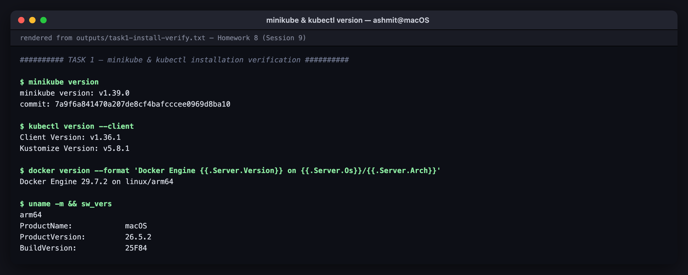
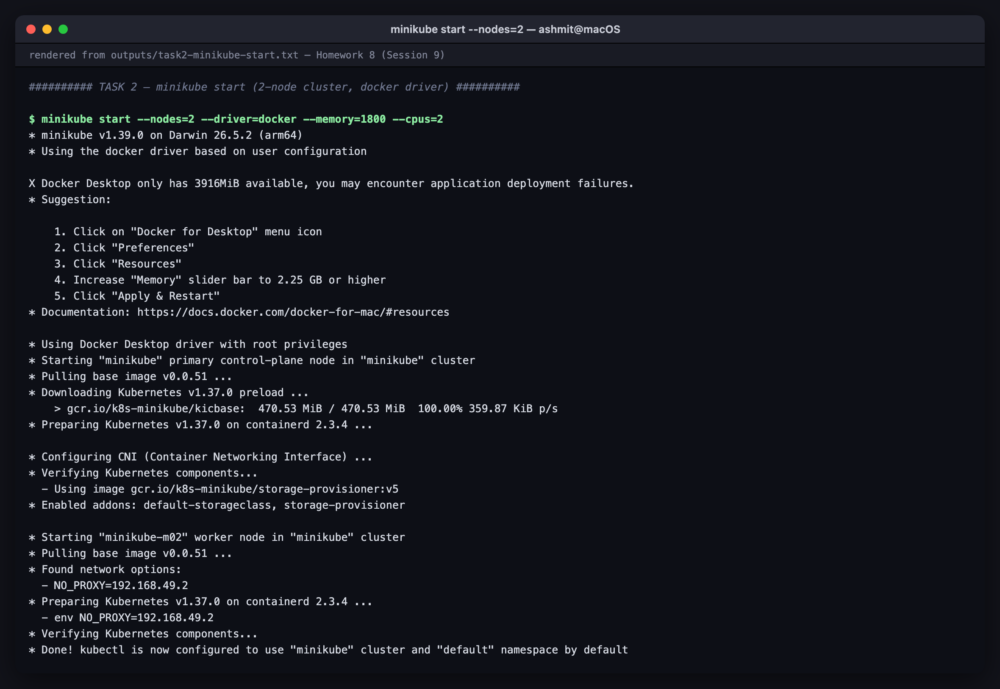
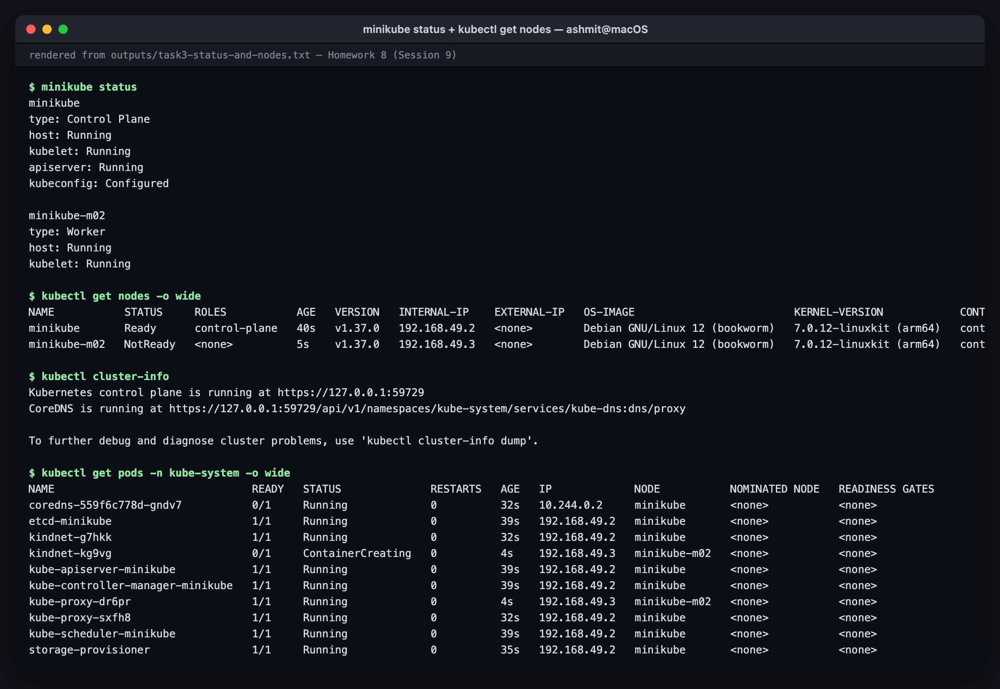
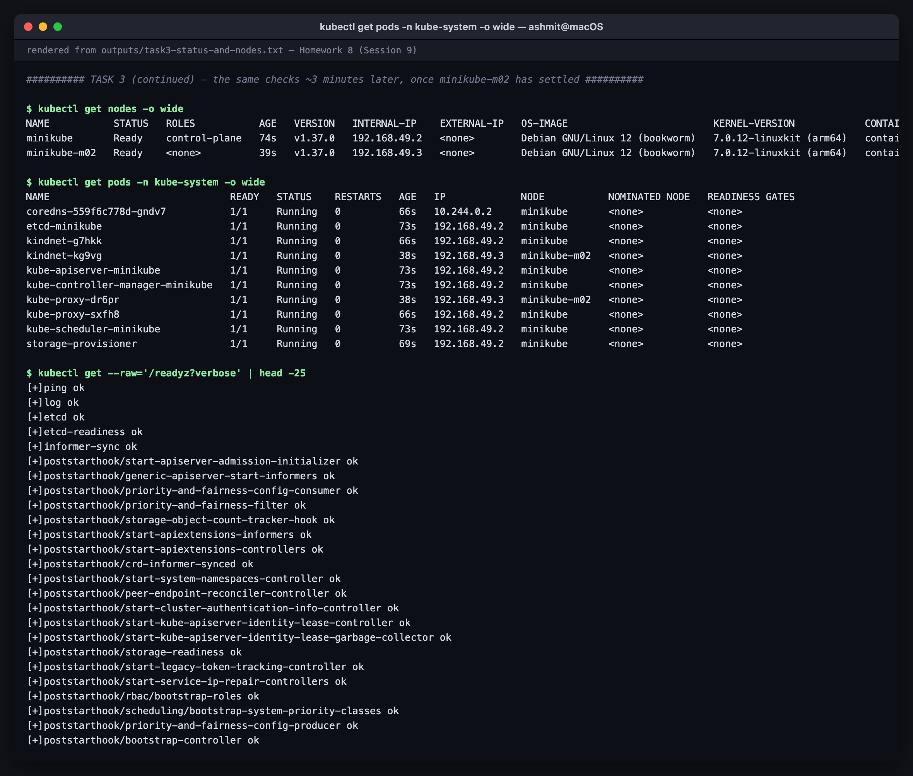
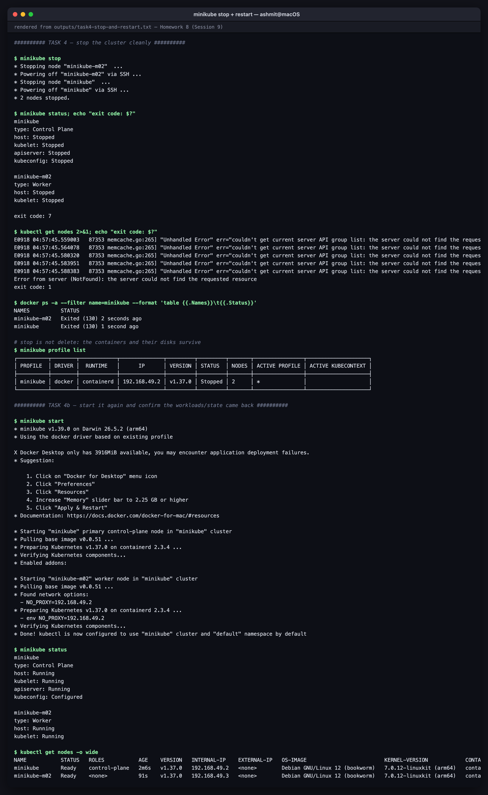

# Homework 8 — Kubernetes Fundamentals & Cluster Architecture

Course session: **`session9-k8s`**.

Install Minikube and `kubectl`, drive a local cluster through its full lifecycle, and write up
the control plane / worker node architecture against what the cluster actually reports.
**All output blocks are extracted verbatim** from the transcripts in [`outputs/`](outputs).

The screenshots are **renders of those transcripts**, not captures of a live terminal — every lab ran non-interactively, so there was no window to photograph. Each image names its source transcript in the title bar; see [`screenshots/`](screenshots).

Everything here runs on a **two-node** cluster (`minikube start --nodes=2`), not the usual
single node. That matters for the sessions that follow: a DaemonSet with one pod per node and
a NodePort open on every node are only convincing when there is more than one node.

---

# Task 1 — Minikube & `kubectl` installation verification

There is no Homebrew on this machine and `/usr/local/bin` is not writable, so the binary went
to `~/bin`:

```bash
mkdir -p ~/bin
curl -sSL -o ~/bin/minikube https://storage.googleapis.com/minikube/releases/latest/minikube-darwin-arm64
chmod +x ~/bin/minikube
export PATH="$HOME/bin:$PATH"
```

```console
$ minikube version
minikube version: v1.39.0
commit: 7a9f6a841470a207de8cf4bafcccee0969d8ba10

$ kubectl version --client
Client Version: v1.36.1
Kustomize Version: v5.8.1

$ docker version --format 'Docker Engine {{.Server.Version}} on {{.Server.Os}}/{{.Server.Arch}}'
Docker Engine 29.7.2 on linux/arm64

$ uname -m && sw_vers
arm64
ProductName:		macOS
ProductVersion:		26.5.2
BuildVersion:		25F84
```

The machine is **Apple Silicon (arm64)**. That single fact causes two real problems later —
`mysql:5.7` publishes no arm64 image (Homework 9, Task 6) and the Docker driver's node IP is
unreachable from macOS (Homework 10, Task 12). Both are documented where they bite.



*minikube and kubectl version checks on the macOS host*

---

# Task 2 — Starting the cluster

```console
$ minikube start --nodes=2 --driver=docker --memory=1800 --cpus=2
* minikube v1.39.0 on Darwin 26.5.2 (arm64)
* Using the docker driver based on user configuration

X Docker Desktop only has 3916MiB available, you may encounter application deployment failures.
* Suggestion:

    1. Click on "Docker for Desktop" menu icon
    2. Click "Preferences"
    3. Click "Resources"
    4. Increase "Memory" slider bar to 2.25 GB or higher
    5. Click "Apply & Restart"
* Documentation: https://docs.docker.com/docker-for-mac/#resources

* Using Docker Desktop driver with root privileges
* Starting "minikube" primary control-plane node in "minikube" cluster
* Pulling base image v0.0.51 ...
* Downloading Kubernetes v1.37.0 preload ...
    > gcr.io/k8s-minikube/kicbase:  470.53 MiB / 470.53 MiB  100.00% 359.87 KiB p/s
* Preparing Kubernetes v1.37.0 on containerd 2.3.4 ...
* Configuring CNI (Container Networking Interface) ...
* Verifying Kubernetes components...
  - Using image gcr.io/k8s-minikube/storage-provisioner:v5
* Enabled addons: default-storageclass, storage-provisioner

* Starting "minikube-m02" worker node in "minikube" cluster
* Pulling base image v0.0.51 ...
* Found network options:
  - NO_PROXY=192.168.49.2
* Preparing Kubernetes v1.37.0 on containerd 2.3.4 ...
  - env NO_PROXY=192.168.49.2
* Verifying Kubernetes components...
* Done! kubectl is now configured to use "minikube" cluster and "default" namespace by default
```

> **The memory warning is real, and it shaped the rest of this homework.** Docker Desktop has
> 3916 MiB total; two nodes at 1800 MiB each is 3600 MiB of *limits*. Limits are ceilings, not
> reservations, so the cluster runs fine — but it is why the StatefulSet lab later uses 2
> replicas instead of 3, and why every lab cleans up after itself before the next one starts.

`--memory` and `--cpus` are per node. `1800` and `2` were chosen to fit; the defaults
(2200 MiB, 2 CPUs) would have overcommitted this Docker VM.



*the two-node cluster starting, including the Docker memory warning*

---

# Task 3 — Cluster status & node health

```console
$ minikube status
minikube
type: Control Plane
host: Running
kubelet: Running
apiserver: Running
kubeconfig: Configured

minikube-m02
type: Worker
host: Running
kubelet: Running
```

Note that the worker line has **no `apiserver`**. Only the control-plane node runs one.

```console
$ kubectl get nodes -o wide
NAME           STATUS     ROLES           AGE   VERSION   INTERNAL-IP    EXTERNAL-IP   OS-IMAGE                         KERNEL-VERSION            CONTAINER-RUNTIME
minikube       Ready      control-plane   40s   v1.37.0   192.168.49.2   <none>        Debian GNU/Linux 12 (bookworm)   7.0.12-linuxkit (arm64)   containerd://2.3.4
minikube-m02   NotReady   <none>          5s    v1.37.0   192.168.49.3   <none>        Debian GNU/Linux 12 (bookworm)   7.0.12-linuxkit (arm64)   containerd://2.3.4
```

`minikube-m02` is **NotReady** here, and that is not a failure — it is the honest picture 5
seconds after a node joins. A node reports `Ready` only once its CNI plugin is up, and
`kindnet` was still being created on it. The same command a minute later:

```console
$ kubectl get nodes -o wide
NAME           STATUS   ROLES           AGE   VERSION   INTERNAL-IP    EXTERNAL-IP   OS-IMAGE                         KERNEL-VERSION            CONTAINER-RUNTIME
minikube       Ready    control-plane   74s   v1.37.0   192.168.49.2   <none>        Debian GNU/Linux 12 (bookworm)   7.0.12-linuxkit (arm64)   containerd://2.3.4
minikube-m02   Ready    <none>          39s   v1.37.0   192.168.49.3   <none>        Debian GNU/Linux 12 (bookworm)   7.0.12-linuxkit (arm64)   containerd://2.3.4
```

Two useful details in that table: the container runtime is **`containerd` 2.3.4**, not Docker
(the Docker driver runs the *node* as a Docker container, but inside that node containerd runs
the pods), and `EXTERNAL-IP` is `<none>` — the `192.168.49.x` addresses are internal to a
Docker bridge network.

```console
$ kubectl cluster-info
Kubernetes control plane is running at https://127.0.0.1:59729
CoreDNS is running at https://127.0.0.1:59729/api/v1/namespaces/kube-system/services/kube-dns:dns/proxy

To further debug and diagnose cluster problems, use 'kubectl cluster-info dump'.
```

The API server answers on `127.0.0.1:59729` because minikube publishes the node container's
`8443` onto a random loopback port on macOS. That is the *only* part of the cluster network
that macOS can reach directly — Homework 10, Task 12 goes into why.

## Where the control plane actually runs

```console
$ kubectl get pods -n kube-system -o wide
NAME                               READY   STATUS    RESTARTS   AGE   IP             NODE           NOMINATED NODE   READINESS GATES
coredns-559f6c778d-gndv7           1/1     Running   0          66s   10.244.0.2     minikube       <none>           <none>
etcd-minikube                      1/1     Running   0          73s   192.168.49.2   minikube       <none>           <none>
kindnet-g7hkk                      1/1     Running   0          66s   192.168.49.2   minikube       <none>           <none>
kindnet-kg9vg                      1/1     Running   0          38s   192.168.49.3   minikube-m02   <none>           <none>
kube-apiserver-minikube            1/1     Running   0          73s   192.168.49.2   minikube       <none>           <none>
kube-controller-manager-minikube   1/1     Running   0          73s   192.168.49.2   minikube       <none>           <none>
kube-proxy-dr6pr                   1/1     Running   0          38s   192.168.49.3   minikube-m02   <none>           <none>
kube-proxy-sxfh8                   1/1     Running   0          66s   192.168.49.2   minikube       <none>           <none>
kube-scheduler-minikube            1/1     Running   0          73s   192.168.49.2   minikube       <none>           <none>
storage-provisioner                1/1     Running   0          69s   192.168.49.2   minikube       <none>           <none>
```

Read that table as the architecture diagram made real:

| What you see | What it tells you |
|---|---|
| `etcd`, `kube-apiserver`, `kube-controller-manager`, `kube-scheduler` all suffixed `-minikube` | the four control-plane components run **only** on the control-plane node, as static pods managed by its kubelet |
| `kube-proxy` and `kindnet` appear **twice**, once per node | these are DaemonSets — every node needs its own network proxy and CNI agent |
| `coredns` has a pod IP `10.244.0.2` | it is an ordinary workload pod on the pod network, unlike the control-plane pods which use the node's host IP |
| host-networked pods show `192.168.49.x` | `etcd`/apiserver/scheduler/controller-manager use `hostNetwork: true` — they must be reachable before the pod network exists |

The API server's own readiness endpoint lists every internal subsystem it waits on:

```console
$ kubectl get --raw='/readyz?verbose' | head -25
[+]ping ok
[+]log ok
[+]etcd ok
[+]etcd-readiness ok
[+]informer-sync ok
[+]poststarthook/start-apiserver-admission-initializer ok
[+]poststarthook/generic-apiserver-start-informers ok
[+]poststarthook/priority-and-fairness-config-consumer ok
[+]poststarthook/priority-and-fairness-filter ok
[+]poststarthook/storage-object-count-tracker-hook ok
[+]poststarthook/start-apiextensions-informers ok
[+]poststarthook/start-apiextensions-controllers ok
[+]poststarthook/crd-informer-synced ok
[+]poststarthook/start-system-namespaces-controller ok
[+]poststarthook/peer-endpoint-reconciler-controller ok
[+]poststarthook/start-cluster-authentication-info-controller ok
[+]poststarthook/start-kube-apiserver-identity-lease-controller ok
[+]poststarthook/start-kube-apiserver-identity-lease-garbage-collector ok
[+]poststarthook/storage-readiness ok
[+]poststarthook/start-legacy-token-tracking-controller ok
[+]poststarthook/start-service-ip-repair-controllers ok
[+]poststarthook/rbac/bootstrap-roles ok
[+]poststarthook/scheduling/bootstrap-system-priority-classes ok
[+]poststarthook/priority-and-fairness-config-producer ok
[+]poststarthook/bootstrap-controller ok
```

`[+]etcd ok` is the interesting one: **the API server refuses to be ready until etcd answers.**
That is the dependency the architecture section below describes, visible as a health check.

```console
$ kubectl get componentstatuses 2>&1 | head -6
Warning: v1 ComponentStatus is deprecated in v1.19+
NAME                 STATUS    MESSAGE   ERROR
controller-manager   Healthy   ok
scheduler            Healthy   ok
etcd-0               Healthy   ok
```

## The nodes are Docker containers

```console
$ docker ps --filter name=minikube --format 'table {{.Names}}\t{{.Image}}\t{{.Status}}\t{{.Ports}}'
NAMES          IMAGE                                 STATUS          PORTS
minikube-m02   gcr.io/k8s-minikube/kicbase:v0.0.51   Up 10 seconds   127.0.0.1:59764->22/tcp, 127.0.0.1:59760->2376/tcp, 127.0.0.1:59761->5000/tcp, 127.0.0.1:59762->8443/tcp, 127.0.0.1:59763->32443/tcp
minikube       gcr.io/k8s-minikube/kicbase:v0.0.51   Up 10 seconds   127.0.0.1:59730->22/tcp, 127.0.0.1:59726->2376/tcp, 127.0.0.1:59728->5000/tcp, 127.0.0.1:59729->8443/tcp, 127.0.0.1:59727->32443/tcp
```

Both "machines" are containers from the same `kicbase` image. Only a fixed set of ports is
published to `127.0.0.1` — **not** the NodePort range. Remember that for Homework 10.

```console
$ minikube ip
192.168.49.2
```



*minikube status and kubectl get nodes -o wide*


*kube-system pods once minikube-m02 has settled: control-plane components on one node, kube-proxy and kindnet on both*

---

# Task 4 — Stopping the cluster cleanly

```console
$ minikube stop
* Stopping node "minikube-m02"  ...
* Powering off "minikube-m02" via SSH ...
* Stopping node "minikube"  ...
* Powering off "minikube" via SSH ...
* 2 nodes stopped.
```

Workers go down first, control plane last — the reverse of startup order.

```console
$ minikube status; echo "exit code: $?"
minikube
type: Control Plane
host: Stopped
kubelet: Stopped
apiserver: Stopped
kubeconfig: Stopped

minikube-m02
type: Worker
host: Stopped
kubelet: Stopped

exit code: 7
```

`minikube status` exits **7** when the cluster is down — worth knowing if you ever script
against it (`minikube status >/dev/null || minikube start`).

With no API server there is nothing for `kubectl` to talk to:

```console
$ kubectl get nodes 2>&1; echo "exit code: $?"
E0918 04:57:45.559003   87353 memcache.go:265] "Unhandled Error" err="couldn't get current server API group list: the server could not find the requested resource"
...
Error from server (NotFound): the server could not find the requested resource
exit code: 1
```

**Stop is not delete.** The node containers are `Exited`, not removed, and the profile survives
with its disks intact:

```console
$ docker ps -a --filter name=minikube --format 'table {{.Names}}\t{{.Status}}'
NAMES          STATUS
minikube-m02   Exited (130) 2 seconds ago
minikube       Exited (130) 1 second ago

$ minikube profile list
┌──────────┬────────┬────────────┬──────────────┬─────────┬─────────┬───────┬────────────────┬────────────────────┐
│ PROFILE  │ DRIVER │  RUNTIME   │      IP      │ VERSION │ STATUS  │ NODES │ ACTIVE PROFILE │ ACTIVE KUBECONTEXT │
├──────────┼────────┼────────────┼──────────────┼─────────┼─────────┼───────┼────────────────┼────────────────────┤
│ minikube │ docker │ containerd │ 192.168.49.2 │ v1.37.0 │ Stopped │ 2     │ *              │                    │
└──────────┴────────┴────────────┴──────────────┴─────────┴─────────┴───────┴────────────────┴────────────────────┘
```

Restarting reuses the existing profile — no 470 MiB download this time, and the node ages carry
over because etcd's data was never lost:

```console
$ minikube start
* minikube v1.39.0 on Darwin 26.5.2 (arm64)
* Using the docker driver based on existing profile
...
* Done! kubectl is now configured to use "minikube" cluster and "default" namespace by default

$ kubectl get nodes -o wide
NAME           STATUS   ROLES           AGE    VERSION   INTERNAL-IP    EXTERNAL-IP   OS-IMAGE                         KERNEL-VERSION            CONTAINER-RUNTIME
minikube       Ready    control-plane   2m6s   v1.37.0   192.168.49.2   <none>        Debian GNU/Linux 12 (bookworm)   7.0.12-linuxkit (arm64)   containerd://2.3.4
minikube-m02   Ready    <none>          91s    v1.37.0   192.168.49.3   <none>        Debian GNU/Linux 12 (bookworm)   7.0.12-linuxkit (arm64)   containerd://2.3.4
```

| Command | What survives |
|---|---|
| `minikube stop` | everything — containers, disks, etcd state, images |
| `minikube delete` | nothing in the profile; the node containers and their volumes are removed |
| `minikube delete --all --purge` | also the `~/.minikube` cache, including the 470 MiB base image |



*minikube stop, the exit-7 status, and the restart*

---

# Task 5 — Cluster architecture

```
+-------------------------------------------------------------------------------+
|                    CONTROL PLANE  —  node "minikube" (192.168.49.2)            |
|                                                                               |
|   +-------------------+       +--------------------+       +--------------+   |
|   |       etcd        |<----->|  kube-apiserver    |<----->|kube-scheduler|   |
|   | (state database)  |       |  (the only writer  |       |  (placement) |   |
|   |  hostNetwork      |       |   of etcd)         |       +--------------+   |
|   +-------------------+       +---------+----------+                          |
|                                         ^                                     |
|                                         |                                     |
|                             +------------------------+                        |
|                             | kube-controller-manager|                        |
|                             |  (reconciliation loops)|                        |
|                             +------------------------+                        |
+-----------------------------------------+-------------------------------------+
                                          | watch / report  (HTTPS :8443)
                        +-----------------+-----------------+
                        |                                   |
                        v                                   v
+------------------------------------+ +------------------------------------+
|  node "minikube" (also a worker)   | |   node "minikube-m02" (192.168.49.3)|
|                                    | |                                    |
|   +------------+  +------------+   | |   +------------+  +------------+   |
|   |  kubelet   |  | kube-proxy |   | |   |  kubelet   |  | kube-proxy |   |
|   +-----+------+  +-----+------+   | |   +-----+------+  +-----+------+   |
|         |               |          | |         |               |          |
|   +------------+  +------------+   | |   +------------+  +------------+   |
|   |  kindnet   |  |  CRI:      |   | |   |  kindnet   |  |  CRI:      |   |
|   |  (CNI)     |  | containerd |   | |   |  (CNI)     |  | containerd |   |
|   +------------+  +-----+------+   | |   +------------+  +-----+------+   |
|                         |          | |                         |          |
|                   +-----v------+   | |                   +-----v------+   |
|                   |    Pods    |   | |                   |    Pods    |   |
|                   | 10.244.0.x |   | |                   | 10.244.1.x |   |
|                   +------------+   | |                   +------------+   |
+------------------------------------+ +------------------------------------+
```

In minikube the control-plane node is **not tainted**, so it also schedules ordinary
workloads — which is why the DaemonSet in Homework 9 lands two pods, not one.

## Control plane

| Component | Job | Seen in this cluster as |
|---|---|---|
| **`kube-apiserver`** | the single front door. Every `kubectl` call, every controller, every kubelet talks REST/JSON to it. Authenticates, authorises, validates, then persists. | `kube-apiserver-minikube`, and `https://127.0.0.1:59729` in `cluster-info` |
| **`etcd`** | consistent key-value store holding the entire cluster state. **Only the API server talks to it** — no other component has etcd credentials. | `etcd-minikube`, and `[+]etcd ok` in `/readyz` |
| **`kube-scheduler`** | watches for pods with no `spec.nodeName`, scores every feasible node on resources, affinity, taints and tolerations, then binds the pod to the winner. It writes a binding; it never starts a container. | `kube-scheduler-minikube`; its failure mode is visible in Homework 9 Task 5.2 (`FailedScheduling`) |
| **`kube-controller-manager`** | one process hosting many control loops, each running *observe → diff → act* against desired state: node controller, ReplicaSet controller, Deployment controller, endpoint/EndpointSlice controller, and more. | `kube-controller-manager-minikube`; its ReplicaSet loop is what re-creates a hand-deleted pod in Homework 9 Task 6 |

## Worker (data plane)

| Component | Job | Seen in this cluster as |
|---|---|---|
| **`kubelet`** | the node agent. Watches the API server for pods bound to its node, tells the CRI runtime to pull images and start containers, runs liveness/readiness/startup probes, reports status back. Not a pod — a systemd service on the node. | `minikube status` shows `kubelet: Running` on **both** nodes |
| **`kube-proxy`** | programs the node's `iptables`/IPVS rules so that a Service's virtual IP is rewritten to a real pod IP. It does not sit in the data path; it writes the rules the kernel uses. | `kube-proxy-dr6pr` and `kube-proxy-sxfh8` — one per node |
| **CNI plugin** | assigns pod IPs and wires up cross-node pod-to-pod routing. Without it the node stays `NotReady`. | `kindnet-g7hkk` / `kindnet-kg9vg`; its absence is exactly why `minikube-m02` read `NotReady` for 30 seconds |
| **Container runtime (CRI)** | actually runs containers. Modern Kubernetes talks CRI to `containerd` or CRI-O; the Docker shim was removed in v1.24. | `containerd://2.3.4` in `kubectl get nodes -o wide` |
| **Pod** | smallest deployable unit. One or more containers sharing a network namespace (one IP, one port space) and volumes. | `10.244.0.2` for CoreDNS; the multi-container case is proved in Homework 9 Task 5.10 |

## How a `kubectl apply` actually travels

1. `kubectl` POSTs the manifest to **kube-apiserver**, which authenticates, runs admission and
   validation, and writes the object to **etcd**. At this point the pod exists as data, with no
   `nodeName` and no container anywhere.
2. **kube-scheduler** sees an unbound pod, picks a node, and writes a `Binding` back through the
   API server.
3. The **kubelet** on that node sees a pod bound to it, asks **containerd** to pull the image and
   start the container, and reports status back to the API server.
4. **kube-controller-manager**'s endpoint loop adds the pod's IP to any Service that selects it;
   **kube-proxy** on every node updates its rules so the Service VIP now reaches it.

Step 1 succeeding while step 3 fails is exactly the `ImagePullBackOff` state — the object is
happily stored in etcd, the container just cannot start. That is demonstrated in Homework 9,
Task 3.

---

## Files

```
08-k8s-fundamentals/
├── README.md
├── outputs/
│   ├── task1-install-verify.txt
│   ├── task2-minikube-start.txt
│   ├── task3-status-and-nodes.txt
│   └── task4-stop-and-restart.txt
└── screenshots/
```

The transcripts are the raw record; every `console` block above is a copy out of them.
