# Homework 9 — Kubernetes Core Objects, Pod Lifecycle & Deployment Strategies

Course session: **`session10-k8s-core-objects`**.

Thirteen tasks: pods, the twelve pod-lifecycle states, ReplicaSets, StatefulSets, DaemonSets,
rolling updates and rollbacks, two troubleshooting drills, and the four deployment strategies
(RollingUpdate, Blue-Green, Canary, Recreate) with **measured** results.

**All output blocks are extracted verbatim** from the transcripts in [`outputs/`](outputs).
The manifests in [`manifests/`](manifests) are the course files, copied in so this folder runs
standalone; the two files that are mine are marked as such.

The screenshots are **renders of those transcripts**, not captures of a live terminal — every lab ran non-interactively, so there was no window to photograph. Each image names its source transcript in the title bar; see [`screenshots/`](screenshots).

Cluster: the two-node Minikube from [Homework 8](../08-k8s-fundamentals) — `minikube`
(control-plane, also schedulable) and `minikube-m02` (worker).

---

# Task 1 — Cluster health & baseline checks

```console
$ kubectl version
Client Version: v1.36.1
Kustomize Version: v5.8.1
Server Version: v1.37.0

$ kubectl cluster-info
Kubernetes control plane is running at https://127.0.0.1:59830
CoreDNS is running at https://127.0.0.1:59830/api/v1/namespaces/kube-system/services/kube-dns:dns/proxy

To further debug and diagnose cluster problems, use 'kubectl cluster-info dump'.

$ kubectl get nodes -o wide
NAME           STATUS   ROLES           AGE     VERSION   INTERNAL-IP    EXTERNAL-IP   OS-IMAGE                         KERNEL-VERSION            CONTAINER-RUNTIME
minikube       Ready    control-plane   2m14s   v1.37.0   192.168.49.2   <none>        Debian GNU/Linux 12 (bookworm)   7.0.12-linuxkit (arm64)   containerd://2.3.4
minikube-m02   Ready    <none>          99s     v1.37.0   192.168.49.3   <none>        Debian GNU/Linux 12 (bookworm)   7.0.12-linuxkit (arm64)   containerd://2.3.4
```

Client v1.36.1 against server v1.37.0 — one minor version apart, inside the supported skew.


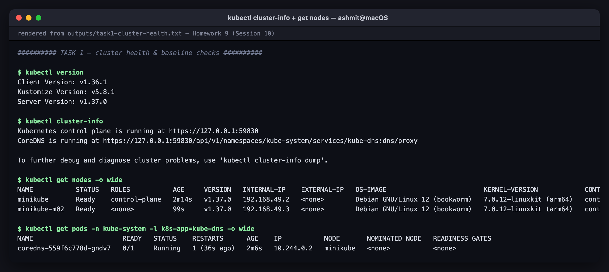
*cluster-info, node health and the CoreDNS pod*

---

# Task 2 — A standalone Pod (`pod.yml`)

The four mandatory top-level fields, and nothing else:

```yaml
apiVersion: v1          # which API group/version this object belongs to
kind: Pod               # which object type
metadata:               # name + labels, how everything else finds it
  name: nginx-pod
  labels:
    app: nginx
spec:                   # the desired state
  containers:
    - name: nginx
      image: nginx:latest
      ports:
        - containerPort: 80
```

```console
$ kubectl apply -f pod.yml
pod/nginx-pod created

$ kubectl get pods
NAME        READY   STATUS    RESTARTS   AGE
nginx-pod   0/1     Pending   0          0s

$ kubectl wait --for=condition=ready pod/nginx-pod --timeout=300s
pod/nginx-pod condition met

$ kubectl get pods -o wide
NAME        READY   STATUS    RESTARTS   AGE   IP            NODE           NOMINATED NODE   READINESS GATES
nginx-pod   1/1     Running   0          2s    10.244.1.57   minikube-m02   <none>           <none>
```

> **First attempt, honestly:** the first run of this task ran `kubectl get pods -o wide` 13
> seconds after `apply` and captured `ContainerCreating` with `IP: <none>` — the `nginx:latest`
> pull was still going. `kubectl logs` then returned
> `container "nginx" ... is waiting to start: ContainerCreating`. The task was re-run with an
> explicit `kubectl wait --for=condition=ready`; that is the transcript above.

The scheduler placed it on `minikube-m02` and the CNI gave it `10.244.1.57` — a worker-node pod
CIDR. `kubectl describe` shows the same, plus the condition list:

```console
$ kubectl describe pod nginx-pod | sed -n '1,45p'
Name:             nginx-pod
Namespace:        default
Priority:         0
Service Account:  default
Node:             minikube-m02/192.168.49.3
Start Time:       Fri, 18 Sep 2026 05:29:08 +0530
Labels:           app=nginx
Annotations:      <none>
Status:           Running
IP:               10.244.1.57
IPs:
  IP:  10.244.1.57
Containers:
  nginx:
    Container ID:   containerd://edbdb91c84ad646402d393888b0e015e57c7f913da9ee56353b13e6d325bc398
    Image:          nginx:latest
    Image ID:       docker.io/library/nginx@sha256:d0d674272be3be36f9a13d79194fa0db5aa630ab3ede9bec459d12f67370aaef
    Port:           80/TCP
    Host Port:      0/TCP
    State:          Running
      Started:      Fri, 18 Sep 2026 05:29:10 +0530
    Ready:          True
    Restart Count:  0
Conditions:
  Type                        Status
  PodReadyToStartContainers   True
  Initialized                 True
  Ready                       True
  ContainersReady             True
  PodScheduled                True
QoS Class:                   BestEffort
```

`QoS Class: BestEffort` is a consequence of this manifest setting no `resources` — no requests,
no limits, first to be evicted under memory pressure.

A real request was sent through the pod IP so that the access log has something in it:

```console
$ kubectl logs nginx-pod | tail -20
/docker-entrypoint.sh: Configuration complete; ready for start up
2026/09/17 23:59:11 [notice] 1#1: using the "epoll" event method
2026/09/17 23:59:11 [notice] 1#1: nginx/1.31.6
2026/09/17 23:59:11 [notice] 1#1: built by gcc 14.2.0 (Debian 14.2.0-19)
2026/09/17 23:59:11 [notice] 1#1: OS: Linux 7.0.12-linuxkit
2026/09/17 23:59:11 [notice] 1#1: start worker processes
...
127.0.0.1 - - [17/Sep/2026:23:59:11 +0000] "GET / HTTP/1.1" 200 896 "-" "curl/8.14.1" "-"

$ kubectl get pod nginx-pod -o jsonpath='apiVersion={.apiVersion} kind={.kind} metadata.name={.metadata.name} spec.containers[0].image={.spec.containers[0].image}{"\n"}'
apiVersion=v1 kind=Pod metadata.name=nginx-pod spec.containers[0].image=nginx:latest

$ kubectl delete -f pod.yml
pod "nginx-pod" deleted from default namespace

$ kubectl get pods
No resources found in default namespace.
```

Delete a bare Pod and it is gone for good. Nothing recreates it — that is the whole reason
ReplicaSets and Deployments exist (Task 6).


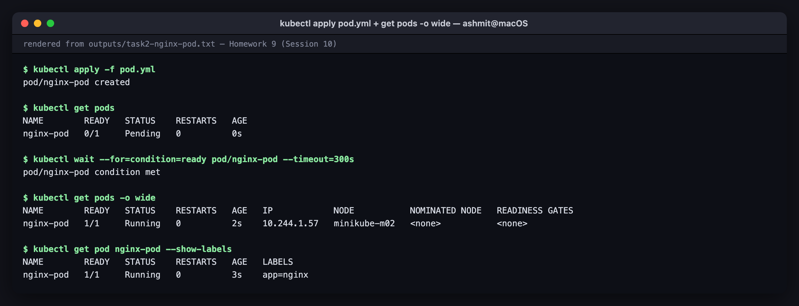
*apply, wait for Ready, and get pods -o wide with the pod IP and node*

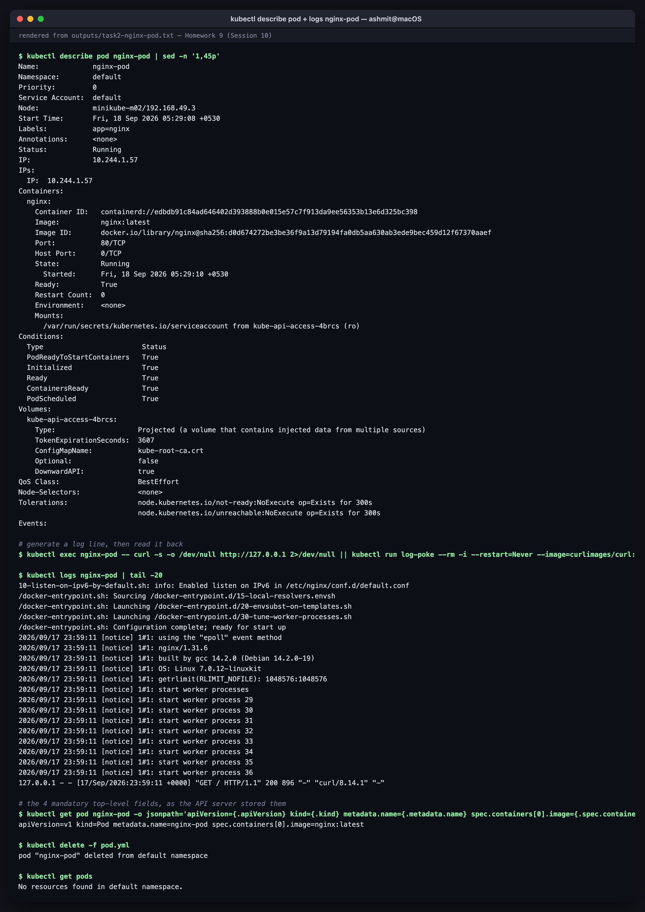
*describe pod and the nginx access log line*

---

# Task 3 — `ErrImagePull` → `ImagePullBackOff`

`pod-lifecycle/06-imagepullbackoff.yaml` asks for `image: jakwehrgkaejw:kahsdfgkhj`.

```console
$ kubectl apply -f pod-lifecycle/06-imagepullbackoff.yaml
pod/lifecycle-image-error created

$ kubectl get pod lifecycle-image-error
NAME                    READY   STATUS         RESTARTS   AGE
lifecycle-image-error   0/1     ErrImagePull   0          4s

$ kubectl get pod lifecycle-image-error
NAME                    READY   STATUS             RESTARTS   AGE
lifecycle-image-error   0/1     ImagePullBackOff   0          19s

$ kubectl get pod lifecycle-image-error
NAME                    READY   STATUS         RESTARTS   AGE
lifecycle-image-error   0/1     ErrImagePull   0          39s
```

The third sample is back to `ErrImagePull` — the back-off expired, the kubelet retried, and it
failed again. The pod oscillates between the two states forever.

The two states are not synonyms, and the order matters:

| State | Meaning |
|---|---|
| `ErrImagePull` | the kubelet **just tried** a pull and it failed |
| `ImagePullBackOff` | the kubelet has given up for now and is **waiting** before retrying, with an exponentially growing delay |

```console
$ kubectl describe pod lifecycle-image-error | sed -n '/Events:/,$p'
Events:
  Type     Reason     Age                From               Message
  ----     ------     ----               ----               -------
  Normal   Scheduled  39s                default-scheduler  Successfully assigned default/lifecycle-image-error to minikube-m02
  Normal   Pulling    22s (x2 over 38s)  kubelet            spec.containers{broken-image}: Pulling image "jakwehrgkaejw:kahsdfgkhj"
  Warning  Failed     21s (x2 over 37s)  kubelet            spec.containers{broken-image}: Failed to pull image "jakwehrgkaejw:kahsdfgkhj": failed to pull and unpack image "docker.io/library/jakwehrgkaejw:kahsdfgkhj": failed to resolve reference "docker.io/library/jakwehrgkaejw:kahsdfgkhj": pull access denied, repository does not exist or may require authorization: server message: insufficient_scope: authorization failed
  Warning  Failed     21s (x2 over 37s)  kubelet            spec.containers{broken-image}: Error: ErrImagePull
  Normal   BackOff    8s (x2 over 36s)   kubelet            spec.containers{broken-image}: Back-off pulling image "jakwehrgkaejw:kahsdfgkhj"
  Warning  Failed     8s (x2 over 36s)   kubelet            spec.containers{broken-image}: Error: ImagePullBackOff
```

## Why `kubectl apply` succeeded even though the container cannot start

`kubectl apply` talks to **kube-apiserver**, which validates the object and writes it to
**etcd**. Nothing in that path knows or cares whether `jakwehrgkaejw:kahsdfgkhj` exists —
image resolution is not part of API validation. The object is legitimately created.

Only later does the **scheduler** bind it to a node (`Successfully assigned ... to
minikube-m02` — note that succeeded too) and the **kubelet** on that node ask containerd to
pull the image, which is where it fails. Two different subsystems, two different outcomes:

```
kubectl apply ──► apiserver ──► etcd            ✅  object stored
                      │
                      ▼
                  scheduler ──► binding          ✅  node assigned
                      │
                      ▼
                   kubelet  ──► containerd pull  ❌  ErrImagePull → ImagePullBackOff
```


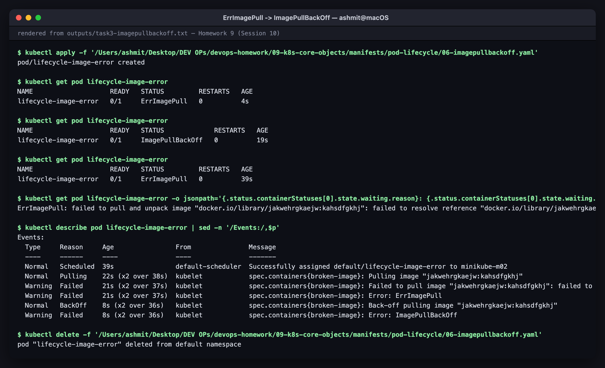
*ErrImagePull and ImagePullBackOff alternating, with the kubelet events*

---

# Task 4 — Capturing the transient phases (`hello.yml`)

`hello.yml` is a `busybox` pod with `restartPolicy: Never` that runs
`echo Hello Kubernetes` — it lives for a few milliseconds. To catch `Running` at all, the image
was pre-pulled first (otherwise the pull dominates and `Running` flashes past between polls),
a `kubectl get pods -w` watch was started **before** the apply, and the second terminal polled
every 0.3 s.

Terminal 2 — the poll loop:

```console
$ kubectl get pod hello-pod --no-headers   # poll 01
hello-pod   0/1   ContainerCreating   0     0s
$ kubectl get pod hello-pod --no-headers   # poll 06
hello-pod   0/1   ContainerCreating   0     2s
$ kubectl get pod hello-pod --no-headers   # poll 07
hello-pod   1/1   Running   0     3s
$ kubectl get pod hello-pod --no-headers   # poll 08
hello-pod   0/1   Completed   0     3s
```

Terminal 1 — the watch stream, which is the authoritative record because it prints one line per
API event rather than per poll:

```console
$ kubectl get pods -w
NAME        READY   STATUS    RESTARTS   AGE
hello-pod   0/1     Pending   0          0s
hello-pod   0/1     Pending   0          0s
hello-pod   0/1     ContainerCreating   0          0s
hello-pod   0/1     ContainerCreating   0          1s
hello-pod   1/1     Running             0          2s
hello-pod   0/1     Completed           0          3s
hello-pod   0/1     Completed           0          4s
```

All three required stages, in order, with the real timings:

| Stage | What the kubelet is doing | Duration here |
|---|---|---|
| `Pending` | scheduled, nothing pulled yet | < 1 s |
| `ContainerCreating` | sandbox created, netns wired, image checked | ~2 s |
| `Running` | the `echo` process is alive | < 1 s |
| `Completed` (phase `Succeeded`) | exited 0, `restartPolicy: Never` so nothing restarts it | permanent |

```console
$ kubectl get pod hello-pod -o jsonpath='phase={.status.phase} exitCode=... reason=... started=... finished=...'
phase=Succeeded exitCode=0 reason=Completed

$ kubectl logs hello-pod
Hello Kubernetes
```

`Completed` is what `kubectl get` prints; `Succeeded` is the actual `status.phase`. Same thing,
two names.


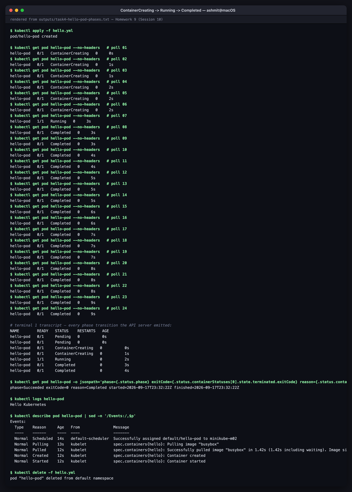
*ContainerCreating -> Running -> Completed, from both the poll loop and the watch*

---

# Task 5 — The twelve pod-lifecycle manifests

Full transcript: [`outputs/task5-pod-lifecycle-lab.txt`](outputs/task5-pod-lifecycle-lab.txt).

## 5.1 `01-running.yaml` — Running

```console
$ kubectl get pod lifecycle-running -o wide
NAME                READY   STATUS    RESTARTS   AGE   IP            NODE           NOMINATED NODE   READINESS GATES
lifecycle-running   1/1     Running   0          43s   10.244.1.31   minikube-m02   <none>           <none>

$ kubectl get pod lifecycle-running -o jsonpath='phase=... ready=... started=...'
phase=Running ready=true started=2026-09-17T23:49:19Z
```

## 5.2 `02-pending.yaml` — Pending, because nothing can satisfy it

The manifest requests `memory: 9Gi`. Each node has ~1.8 GiB.

```console
$ kubectl get pod lifecycle-pending
NAME                READY   STATUS    RESTARTS   AGE
lifecycle-pending   0/1     Pending   0          8s

$ kubectl describe pod lifecycle-pending | sed -n '/Events:/,$p'
Events:
  Type     Reason            Age   From               Message
  ----     ------            ----  ----               -------
  Warning  FailedScheduling  8s    default-scheduler  0/2 nodes are available: 2 Insufficient memory. preemption: 0/2 nodes are available: 2 Preemption is not helpful for scheduling.

$ kubectl get pod lifecycle-pending -o jsonpath='{.status.conditions[0].reason}: {.status.conditions[0].message}'
Unschedulable: 0/2 nodes are available: 2 Insufficient memory. preemption: 0/2 nodes are available: 2 Preemption is not helpful for scheduling.
```

`0/2 nodes are available` — the scheduler evaluated **both** nodes and rejected both. The pod
sits in `Pending` forever; it is never an error, just an unmet constraint. The scheduler also
says preemption would not help: evicting lower-priority pods still would not free 9 GiB.

## 5.3 `03-succeeded.yaml` / 5.4 `04-failed.yaml` — exit code decides the phase

Same manifest shape, `restartPolicy: Never`, differing only in `exit 0` vs `exit 1`:

```console
$ kubectl get pod lifecycle-succeeded
NAME                  READY   STATUS      RESTARTS   AGE
lifecycle-succeeded   0/1     Completed   0          20s
$ kubectl get pod lifecycle-succeeded -o jsonpath='phase=... exitCode=...'
phase=Succeeded exitCode=0

$ kubectl get pod lifecycle-failed
NAME               READY   STATUS   RESTARTS   AGE
lifecycle-failed   0/1     Error    0          20s
$ kubectl get pod lifecycle-failed -o jsonpath='phase=... exitCode=... reason=...'
phase=Failed exitCode=1 reason=Error
```

One byte of difference in the exit code moves the pod between two terminal phases. Neither
restarts, because `restartPolicy: Never`.

## 5.5 `05-crashloopbackoff.yaml` — the restart back-off

Default `restartPolicy: Always`, and the container always exits 1 after 3 seconds:

```console
$ kubectl get pod lifecycle-crashloop --no-headers   # t+016s
lifecycle-crashloop   1/1   Running   1 (5s ago)    8s
$ kubectl get pod lifecycle-crashloop --no-headers   # t+024s
lifecycle-crashloop   0/1   Error   1 (13s ago)   16s
$ kubectl get pod lifecycle-crashloop --no-headers   # t+056s
lifecycle-crashloop   1/1   Running   3 (28s ago)   50s
$ kubectl get pod lifecycle-crashloop --no-headers   # t+112s
lifecycle-crashloop   0/1   Error   4 (57s ago)   108s
$ kubectl get pod lifecycle-crashloop --no-headers   # t+192s
lifecycle-crashloop   0/1   Error   5 (86s ago)   3m11s
```

The `RESTARTS` column carries its own timestamp — `4 (57s ago)` at `AGE 108s` means restart #4
happened when the pod was 51 s old. Reading every sample that way gives the restart times:

| Restart # | Pod age when it happened | Gap since previous |
|---|---|---|
| 1 | 3 s | — |
| 2 | 7 s | 4 s |
| 3 | 22 s | 15 s |
| 4 | 51 s | 29 s |
| 5 | 105 s | 54 s |

4 → 15 → 29 → 54 seconds: the delay roughly **doubles** every time. That is the exponential
back-off, measured. The kubelet caps it at 5 minutes.

```console
$ kubectl describe pod lifecycle-crashloop | sed -n '/Events:/,$p'
Events:
  Type     Reason     Age                  From               Message
  ----     ------     ----                 ----               -------
  Normal   Scheduled  3m19s                default-scheduler  Successfully assigned default/lifecycle-crashloop to minikube-m02
  Normal   Pulled     13s (x6 over 3m19s)  kubelet            spec.containers{crashing-app}: Container image "busybox:1.36" already present on machine and can be accessed by the pod
  Normal   Created    12s (x6 over 3m19s)  kubelet            spec.containers{crashing-app}: Container created
  Normal   Started    12s (x6 over 3m19s)  kubelet            spec.containers{crashing-app}: Container started
  Warning  BackOff    9s (x5 over 3m11s)   kubelet            spec.containers{crashing-app}: Back-off restarting failed container crashing-app in pod lifecycle-crashloop_default(f3d9379b-...)

$ kubectl logs lifecycle-crashloop
Application started
Application crashed
```

> **The STATUS column never said `CrashLoopBackOff` on this cluster, and that is worth saying
> out loud.** The lab sheet expects `STATUS: CrashLoopBackOff`. On Kubernetes **v1.37** this
> pod's status printed `Error` the whole way through. To check whether that was just unlucky
> sampling, the container state was polled every 2 seconds for 80 seconds
> ([`outputs/task5-crashloop-waiting-state.txt`](outputs/task5-crashloop-waiting-state.txt)) —
> it alternates between `running` and `terminated`, and never reports
> `waiting.reason: CrashLoopBackOff`:
>
> ```console
> $ kubectl get pod lifecycle-crashloop -o jsonpath=...   # t+010s
> restarts=1 state={"terminated":{"exitCode":1,"reason":"Error",...}}
> $ kubectl get pod lifecycle-crashloop -o jsonpath=...   # t+020s
> restarts=2 state={"running":{"startedAt":"2026-09-17T23:59:32Z"}}
> ```
>
> The back-off itself is unquestionably happening — the `BackOff` events and the widening
> restart gaps prove it. Only the label on the status column differs from the lab sheet.
> `kubectl logs --previous` also failed here
> (`unable to retrieve container logs for containerd://...`) because containerd had already
> reaped the dead container; plain `kubectl logs` works and is shown above.

## 5.6 `07-readiness.yaml` — `Running` is not `Ready`

```console
$ kubectl get pod lifecycle-readiness --no-headers   # t+06s
lifecycle-readiness   0/1   Running   0     3s
$ kubectl get pod lifecycle-readiness --no-headers   # t+09s
lifecycle-readiness   1/1   Running   0     6s
```

For three seconds the pod is `Running` with `READY 0/1`. The process is alive; the readiness
probe (`initialDelaySeconds: 5`) has not passed yet. **A Service will not send it traffic while
`READY` is `0/1`** — that is the entire point of readiness, and it is what makes the zero-
downtime rolling update in Task 8 possible.

## 5.7 `08-liveness.yaml` — the probe restarts a hung container

The container creates `/tmp/healthy`, sleeps 20 s, deletes it, then sleeps 300 s — alive but
broken. The liveness probe tests for that file every 5 s with `failureThreshold: 2`.

```console
$ kubectl describe pod lifecycle-liveness | sed -n '/Events:/,$p'
Events:
  Type     Reason     Age                From               Message
  ----     ------     ----               ----               -------
  Normal   Scheduled  61s                default-scheduler  Successfully assigned default/lifecycle-liveness to minikube-m02
  Warning  Unhealthy  31s (x2 over 35s)  kubelet            spec.containers{app}: Liveness probe failed:
  Normal   Killing    31s                kubelet            spec.containers{app}: Container app failed liveness probe, will be restarted
  Normal   Pulled     0s (x2 over 60s)   kubelet            spec.containers{app}: Container image "busybox:1.36" already present on machine and can be accessed by the pod
  Normal   Created    0s (x2 over 60s)   kubelet            spec.containers{app}: Container created
  Normal   Started    0s (x2 over 60s)   kubelet            spec.containers{app}: Container started
```

Two consecutive failures (`x2`), then `Killing`, then `Created`/`Started` a second time
(`x2 over 60s`). The process never crashed — Kubernetes killed it. That is self-healing for
deadlocks, which no exit code would ever catch.

| Probe | Failure means | Consequence |
|---|---|---|
| **readiness** | "not ready for traffic yet" | removed from Service endpoints, **not** restarted |
| **liveness** | "wedged, unrecoverable" | container **killed and restarted** |
| **startup** | "still booting" | liveness/readiness suppressed until it passes |

## 5.8 `09-startup.yaml` — protecting a slow boot

The app takes 30 s to write `/tmp/started`; the startup probe allows `failureThreshold: 10 ×
periodSeconds: 5` = 50 s.

```console
$ kubectl get pod lifecycle-startup --no-headers   # t+12s
lifecycle-startup   0/1   Running   0     6s
$ kubectl get pod lifecycle-startup --no-headers   # t+36s
lifecycle-startup   0/1   Running   0     31s
$ kubectl get pod lifecycle-startup --no-headers   # t+42s
lifecycle-startup   1/1   Running   0     37s

$ kubectl get pod lifecycle-startup -o jsonpath='ready=... started=... restarts=...'
ready=true started=true restarts=0
```

**`restarts=0`** is the result that matters. A liveness probe with a short delay would have
killed this container twice before it ever finished booting. The startup probe holds the other
probes off until the app declares itself up.

## 5.9 `10-init-container.yaml` — sequential setup

```console
$ kubectl get pod lifecycle-init --no-headers   # t+04s
lifecycle-init   0/1   Init:0/1   0     0s
$ kubectl get pod lifecycle-init --no-headers   # t+12s
lifecycle-init   0/1   Init:0/1   0     9s
$ kubectl get pod lifecycle-init --no-headers   # t+16s
lifecycle-init   1/1   Running   0     13s
```

`Init:0/1` means *zero of one init containers finished*. The nginx app container is not started
at all until the init container exits 0:

```console
$ kubectl describe pod lifecycle-init | sed -n '/Init Containers:/,/^Containers:/p'
Init Containers:
  setup:
    Image:         busybox:1.36
    Command:
      sh
      -c
      echo 'Init container running'; sleep 10; echo 'Init complete'
    State:          Terminated
      Reason:       Completed
      Exit Code:    0
      Started:      Fri, 18 Sep 2026 05:09:11 +0530
      Finished:     Fri, 18 Sep 2026 05:09:21 +0530
    Ready:          True
    Restart Count:  0
Containers:

$ kubectl logs lifecycle-init -c setup
Init container running
Init complete
```

`Started 05:09:11` → `Finished 05:09:21`: exactly the 10 seconds it sleeps, and the app started
after that. This is how you wait for a migration, a config fetch, or a dependency to be ready.

## 5.10 `11-multi-container.yaml` — two containers, one network namespace

```console
$ kubectl get pod lifecycle-multi-container -o wide
NAME                        READY   STATUS    RESTARTS   AGE   IP            NODE           NOMINATED NODE   READINESS GATES
lifecycle-multi-container   2/2     Running   0          20s   10.244.1.16   minikube-m02   <none>           <none>

$ kubectl logs lifecycle-multi-container -c sidecar
Sidecar is running
Sidecar is running
```

`READY 2/2`, **one** pod IP. The proof that the containers share a network namespace — the
sidecar reaches nginx on `127.0.0.1`, not on a pod IP:

```console
$ kubectl exec lifecycle-multi-container -c sidecar -- wget -qO- http://127.0.0.1:80 | head -5
<!DOCTYPE html>
<html>
<head>
<title>Welcome to nginx!</title>
<style>
```

That is the entire sidecar pattern: localhost between containers, no service discovery needed.

## 5.11 `12-termination.yaml` — graceful shutdown

The container traps `TERM`, prints, sleeps 10 s, then exits.
`terminationGracePeriodSeconds: 20`.

```console
$ time kubectl delete pod lifecycle-termination
pod "lifecycle-termination" deleted from default namespace

real	0m10.506s

$ kubectl get pod lifecycle-termination   # while the grace period is running
NAME                    READY   STATUS        RESTARTS   AGE
lifecycle-termination   1/1     Terminating   0          21s

$ kubectl logs lifecycle-termination   # SIGTERM trap output, mid-shutdown
Application running
SIGTERM received; cleaning up...
```

**10.5 seconds**, not 20. The grace period is a *deadline*, not a delay — the kubelet sends
`SIGTERM`, waits up to 20 s, and proceeds the moment the process exits on its own. Had the trap
slept 30 s instead of 10 s, the kubelet would have sent `SIGKILL` at 20 s and the cleanup would
have been cut short.


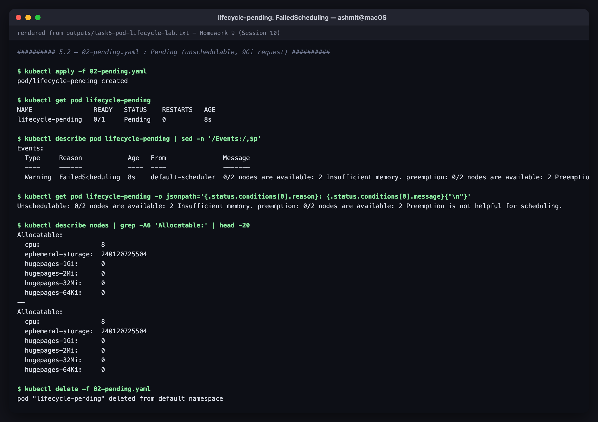
*Pending: FailedScheduling against both nodes*

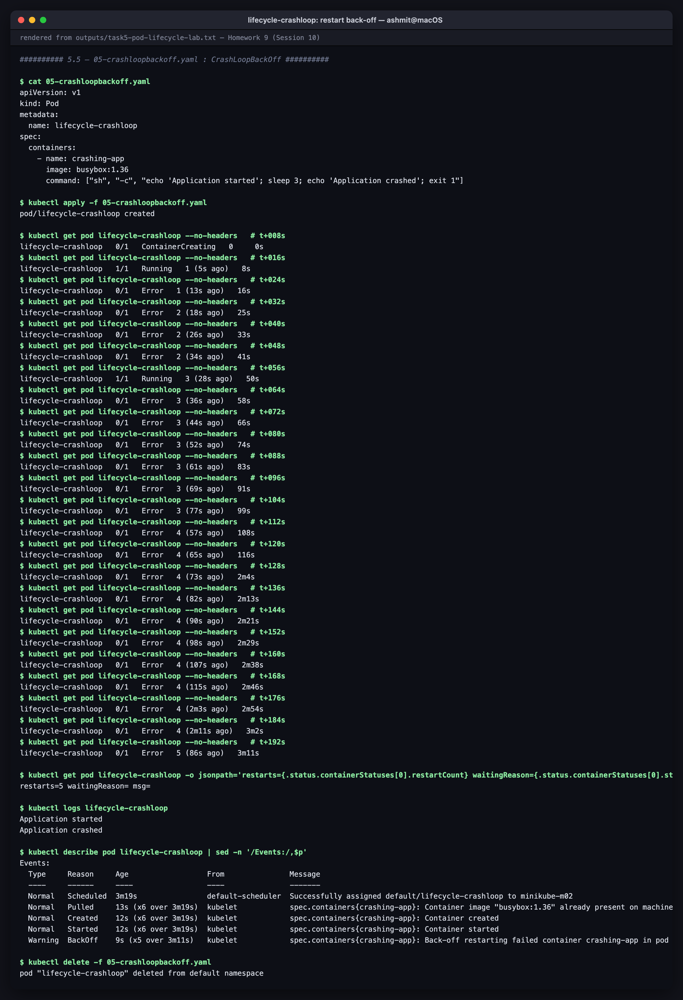
*the restart back-off, with the BackOff events*

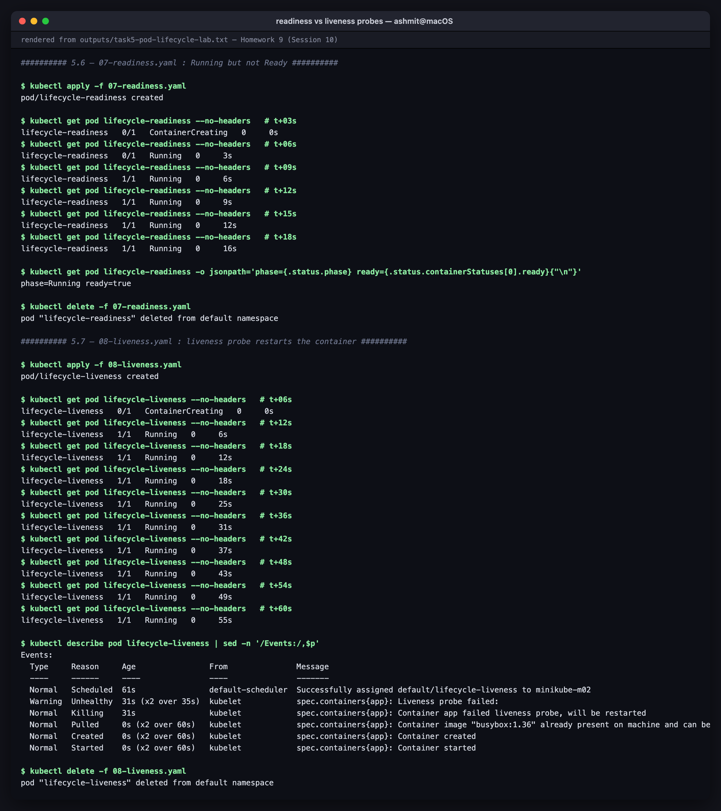
*Running but not Ready, then a liveness-triggered restart*

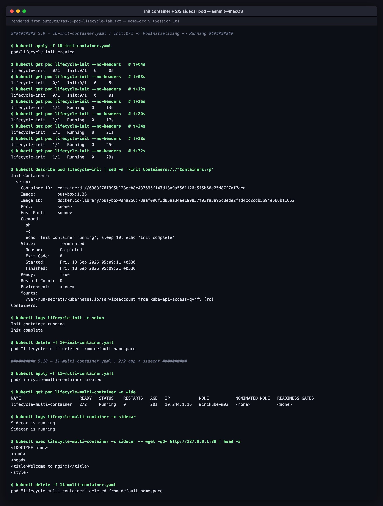
*Init:0/1 -> Running, and the 2/2 app + sidecar pod*

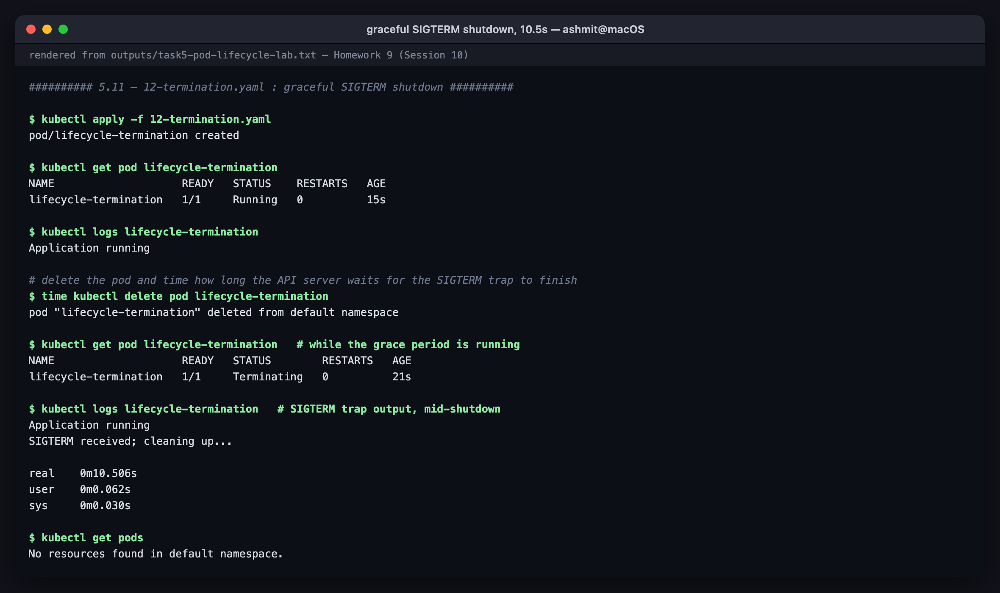
*graceful SIGTERM shutdown in 10.5s against a 20s grace period*

---

# Task 6 — ReplicaSet and StatefulSet

## Part A — ReplicaSet self-healing

```console
$ kubectl apply -f replicaset.yml
replicaset.apps/nginx-rs created

$ kubectl get rs nginx-rs
NAME       DESIRED   CURRENT   READY   AGE
nginx-rs   3         3         3       20s

$ kubectl get pods -l app=nginx -o wide
NAME             READY   STATUS    RESTARTS   AGE   IP            NODE           NOMINATED NODE   READINESS GATES
nginx-rs-lblk8   1/1     Running   0          20s   10.244.1.19   minikube-m02   <none>           <none>
nginx-rs-mh8fl   1/1     Running   0          20s   10.244.0.3    minikube       <none>           <none>
nginx-rs-tjc9c   1/1     Running   0          20s   10.244.1.18   minikube-m02   <none>           <none>
```

The pods carry an owner reference — that is the link the controller follows:

```console
$ kubectl get pods -l app=nginx -o jsonpath='{range .items[*]}{.metadata.name}{"  ownerRef="}{.metadata.ownerReferences[0].kind}/{.metadata.ownerReferences[0].name}{"\n"}{end}'
nginx-rs-lblk8  ownerRef=ReplicaSet/nginx-rs
nginx-rs-mh8fl  ownerRef=ReplicaSet/nginx-rs
nginx-rs-tjc9c  ownerRef=ReplicaSet/nginx-rs
```

Delete one by hand and watch the reconciliation loop fire:

```console
$ kubectl delete pod nginx-rs-lblk8
pod "nginx-rs-lblk8" deleted from default namespace

$ kubectl get pods -l app=nginx
NAME             READY   STATUS              RESTARTS   AGE
nginx-rs-5chkf   0/1     ContainerCreating   0          1s
nginx-rs-mh8fl   1/1     Running             0          22s
nginx-rs-tjc9c   1/1     Running             0          22s
```

`nginx-rs-5chkf` is **1 second old** — the replacement was created before the delete command
even returned. Thirteen seconds later:

```console
$ kubectl get pods -l app=nginx
NAME             READY   STATUS    RESTARTS   AGE
nginx-rs-5chkf   1/1     Running   0          14s
nginx-rs-mh8fl   1/1     Running   0          35s
nginx-rs-tjc9c   1/1     Running   0          35s
```

The controller wrote down what it did:

```console
$ kubectl describe rs nginx-rs | sed -n '/Events:/,$p'
Events:
  Type    Reason            Age   From                   Message
  ----    ------            ----  ----                   -------
  Normal  SuccessfulCreate  35s   replicaset-controller  Created pod: nginx-rs-lblk8
  Normal  SuccessfulCreate  35s   replicaset-controller  Created pod: nginx-rs-mh8fl
  Normal  SuccessfulCreate  35s   replicaset-controller  Created pod: nginx-rs-tjc9c
  Normal  SuccessfulCreate  14s   replicaset-controller  Created pod: nginx-rs-5chkf
```

Three creations at 35 s, a fourth at 14 s — the reconciliation loop, in the event log.

Note the **new random suffix**. The ReplicaSet restores the *count*, never the *identity*. Hold
that thought for the StatefulSet below.

## Part B — StatefulSet, and an honest arm64 failure

The course manifest asks for `mysql:5.7`:

```console
$ kubectl apply -f statefulset.yml
statefulset.apps/mysql created

$ kubectl get statefulset mysql
NAME    READY   AGE
mysql   0/3     40s

$ kubectl get pods -l app=mysql -o wide
NAME      READY   STATUS         RESTARTS   AGE   IP            NODE           NOMINATED NODE   READINESS GATES
mysql-0   0/1     ErrImagePull   0          40s   10.244.1.21   minikube-m02   <none>           <none>
```

```console
$ kubectl describe pod mysql-0 | sed -n '/Events:/,$p'
Events:
  Warning  FailedScheduling  41s (x4 over 41s)  default-scheduler  0/2 nodes are available: pod has unbound immediate PersistentVolumeClaims. not found
  Normal   Scheduled         41s                default-scheduler  Successfully assigned default/mysql-0 to minikube-m02
  Normal   Pulling           26s (x2 over 40s)  kubelet            spec.containers{mysql}: Pulling image "mysql:5.7"
  Warning  Failed            22s (x2 over 37s)  kubelet            spec.containers{mysql}: Failed to pull image "mysql:5.7": rpc error: code = NotFound desc = failed to pull and unpack image "docker.io/library/mysql:5.7": no match for platform in manifest: not found
  Warning  Failed            22s (x2 over 37s)  kubelet            spec.containers{mysql}: Error: ErrImagePull
```

> **`no match for platform in manifest`** — this is not a typo or a network problem.
> **`mysql:5.7` publishes no `linux/arm64` image**, and this laptop is Apple Silicon. Oracle
> stopped at amd64 for the 5.7 line. Nothing about the manifest is wrong; the image simply does
> not exist for this CPU.

Two things still worked and are worth keeping:

1. `mysql-0` — the **ordinal name** was assigned before the image was ever pulled.
2. The PVC was created and **bound** by the dynamic provisioner, independently of the container
   failing:

```console
$ kubectl get pvc
NAME                               STATUS   VOLUME                                     CAPACITY   ACCESS MODES   STORAGECLASS   VOLUMEATTRIBUTESCLASS   AGE
mysql-persistent-storage-mysql-0   Bound    pvc-eccfcbc1-5f2a-4c05-a955-efdf662fb94d   5Gi        RWO            standard       <unset>                 41s

$ kubectl get pv
NAME                                       CAPACITY   ACCESS MODES   RECLAIM POLICY   STATUS   CLAIM                                      STORAGECLASS   ...
pvc-eccfcbc1-5f2a-4c05-a955-efdf662fb94d   5Gi        RWO            Delete           Bound    default/mysql-persistent-storage-mysql-0   standard
```

Also note the first event: `pod has unbound immediate PersistentVolumeClaims` — the scheduler
**refused to place the pod until its volume was bound**. Storage before scheduling.

Only `mysql-0` was ever created, because a StatefulSet starts pods **strictly in order** and
`mysql-0` never became Ready.

### The fix — [`manifests/statefulset-arm64.yml`](manifests/statefulset-arm64.yml) (written for this homework)

Same StatefulSet, two changes: `mysql:8.0` (which does publish arm64) and `replicas: 2`
(this Docker VM has 3.9 GiB total, and MySQL 8 is not small).

```console
$ kubectl get pods -l app=mysql --no-headers   # t+045s
mysql-0   0/1   ContainerCreating   0     30s
$ kubectl get pods -l app=mysql --no-headers   # t+060s
mysql-0   1/1   Running             0     46s
mysql-1   0/1   ContainerCreating   0     3s
$ kubectl get pods -l app=mysql --no-headers   # t+105s
mysql-0   1/1   Running   0     92s
mysql-1   1/1   Running   0     49s
```

**`mysql-1` was not created until `mysql-0` reached `1/1 Running`** — 46 seconds in, `mysql-1`
is 3 seconds old. That is ordered startup, and it is the whole reason StatefulSets exist for
databases: node 1 needs node 0 up before it can join the cluster.

```console
$ kubectl get pods -l app=mysql -o wide
NAME      READY   STATUS    RESTARTS   AGE     IP            NODE           NOMINATED NODE   READINESS GATES
mysql-0   1/1     Running   0          3m35s   10.244.1.22   minikube-m02   <none>           <none>
mysql-1   1/1     Running   0          2m52s   10.244.0.4    minikube       <none>           <none>

$ kubectl get pvc -o wide
NAME                               STATUS   VOLUME                                     CAPACITY   ACCESS MODES   STORAGECLASS   ...   AGE
mysql-persistent-storage-mysql-0   Bound    pvc-e005fe9f-733e-4b5e-9bfa-352449aad394   1Gi        RWO            standard             3m35s
mysql-persistent-storage-mysql-1   Bound    pvc-0cad3e7a-c760-4fc0-b9b4-fac683f67c64   1Gi        RWO            standard             2m52s
```

One PVC **per ordinal**, from `volumeClaimTemplates`. Now delete `mysql-0` and compare with the
ReplicaSet above:

```console
$ kubectl delete pod mysql-0
pod "mysql-0" deleted from default namespace

$ kubectl get pods -l app=mysql
NAME      READY   STATUS    RESTARTS   AGE
mysql-0   1/1     Running   0          25s
mysql-1   1/1     Running   0          3m19s

$ kubectl get pvc -o wide
NAME                               STATUS   VOLUME                                     CAPACITY   ...   AGE
mysql-persistent-storage-mysql-0   Bound    pvc-e005fe9f-733e-4b5e-9bfa-352449aad394   1Gi              4m2s
mysql-persistent-storage-mysql-1   Bound    pvc-0cad3e7a-c760-4fc0-b9b4-fac683f67c64   1Gi              3m19s
```

The pod came back as **`mysql-0`**, not `mysql-x7f2q`, and it re-attached to
**`pvc-e005fe9f-...`** — the exact same volume, note the unchanged 4-minute age of the PVC
against the 25-second-old pod. A database that came back under a new name with an empty disk
would be useless; that is the difference between a StatefulSet and a ReplicaSet in one command.


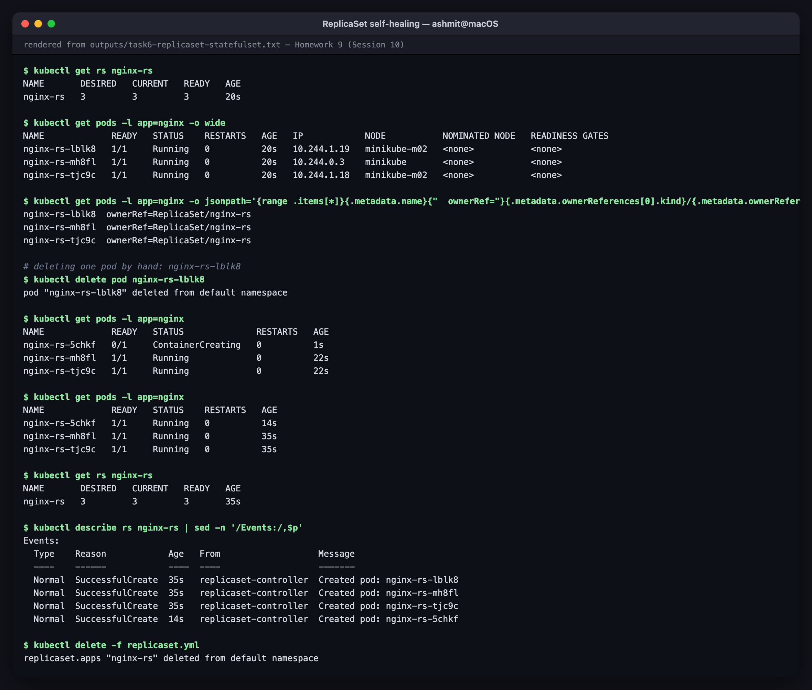
*ReplicaSet self-healing: the replacement is 1 second old*

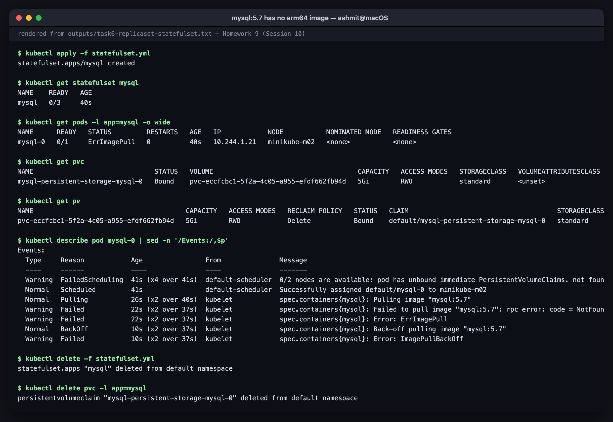
*mysql:5.7 on Apple Silicon: no match for platform in manifest*

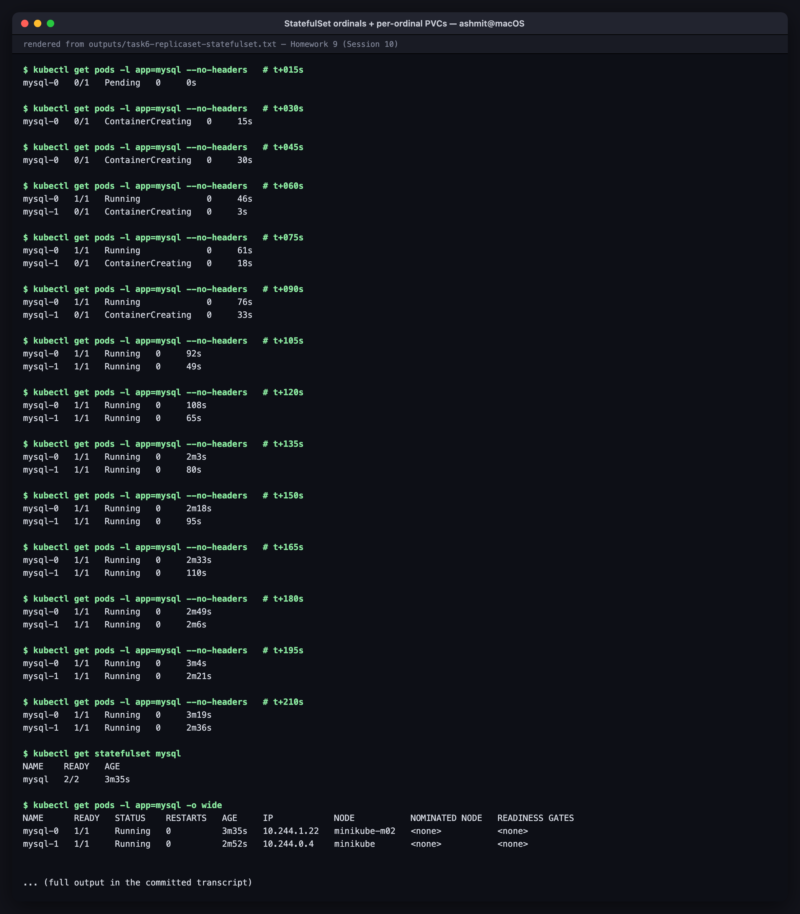
*the same StatefulSet on mysql:8.0: ordered startup and per-ordinal PVCs*

---

# Task 7 — DaemonSet

```console
$ kubectl get nodes
NAME           STATUS   ROLES           AGE   VERSION
minikube       Ready    control-plane   20m   v1.37.0
minikube-m02   Ready    <none>          19m   v1.37.0

$ kubectl apply -f daemonset/node-agent-ds.yaml
daemonset.apps/node-logging-agent created

$ kubectl get ds node-logging-agent
NAME                 DESIRED   CURRENT   READY   UP-TO-DATE   AVAILABLE   NODE SELECTOR   AGE
node-logging-agent   2         2         2       2            2           <none>          25s
```

**`DESIRED 2` was never written anywhere.** A DaemonSet has no `replicas` field — the
controller counts eligible nodes and derives the number. Two nodes, two pods, one each:

```console
$ kubectl get pods -l app=node-logging-agent -o wide
NAME                       READY   STATUS    RESTARTS   AGE   IP            NODE           NOMINATED NODE   READINESS GATES
node-logging-agent-ncsrg   1/1     Running   0          25s   10.244.0.5    minikube       <none>           <none>
node-logging-agent-v79pq   1/1     Running   0          25s   10.244.1.24   minikube-m02   <none>           <none>

$ kubectl logs -l app=node-logging-agent --tail=2 --prefix=true
[pod/node-logging-agent-ncsrg/fluent-logger] [Thu Sep 17 23:46:51 UTC 2026] Collecting host system metrics on node-logging-agent-ncsrg
[pod/node-logging-agent-ncsrg/fluent-logger] [Thu Sep 17 23:47:01 UTC 2026] Collecting host system metrics on node-logging-agent-ncsrg
[pod/node-logging-agent-v79pq/fluent-logger] [Thu Sep 17 23:46:55 UTC 2026] Collecting host system metrics on node-logging-agent-v79pq
[pod/node-logging-agent-v79pq/fluent-logger] [Thu Sep 17 23:47:06 UTC 2026] Collecting host system metrics on node-logging-agent-v79pq
```

The control-plane node got an agent too, which on a managed cluster it usually would not:

```console
$ kubectl get nodes -o custom-columns='NODE:.metadata.name,TAINTS:.spec.taints'
NODE           TAINTS
minikube       <none>
minikube-m02   <none>
```

**Minikube does not taint its control-plane node.** On EKS/GKE the control plane carries
`node-role.kubernetes.io/control-plane:NoSchedule`, and a DaemonSet would need a matching
`toleration` to land there — which is exactly what real agents (Fluent Bit, node-exporter,
Falco, Cilium) ship with, because you *do* want telemetry from control-plane nodes.

The course also ships `deamonset.yml`, the same shape with the real
`prom/node-exporter` image; it is in [`manifests/deamonset.yml`](manifests/deamonset.yml).


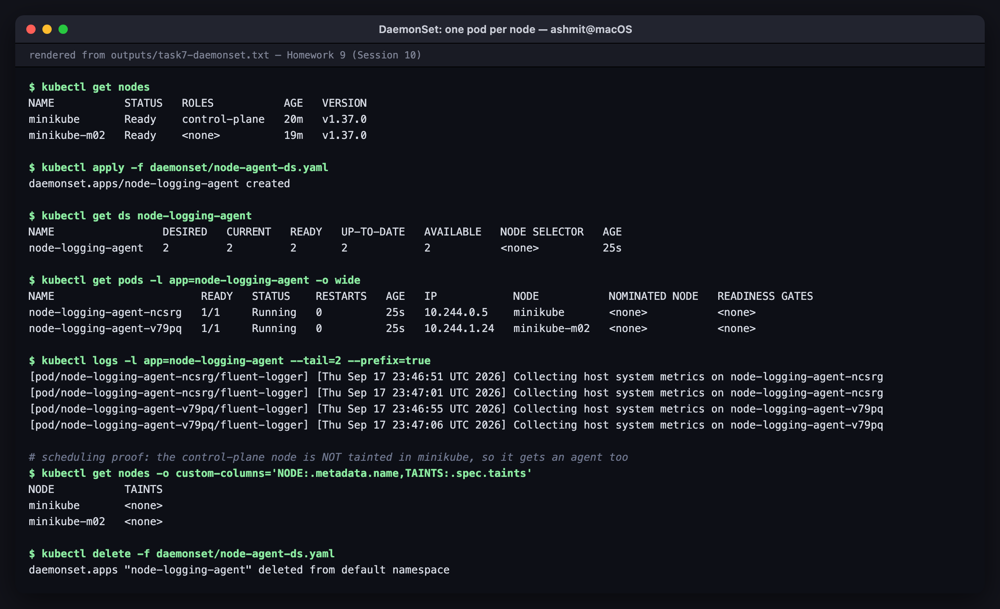
*DESIRED 2 derived from the node count, one pod per node*

---

# Task 8 — Rolling update with `maxSurge: 1`, `maxUnavailable: 0`, then rollback

```console
$ kubectl rollout status deployment/app-rolling --timeout=180s
deployment "app-rolling" successfully rolled out

$ kubectl get pods -l app=app-rolling --show-labels
NAME                           READY   STATUS    RESTARTS   AGE   LABELS
app-rolling-86d7d44d5b-4fxqb   1/1     Running   0          19s   app=app-rolling,pod-template-hash=86d7d44d5b,version=v1
app-rolling-86d7d44d5b-5n5cw   1/1     Running   0          19s   app=app-rolling,pod-template-hash=86d7d44d5b,version=v1
app-rolling-86d7d44d5b-sc76t   1/1     Running   0          19s   app=app-rolling,pod-template-hash=86d7d44d5b,version=v1
app-rolling-86d7d44d5b-znjsm   1/1     Running   0          19s   app=app-rolling,pod-template-hash=86d7d44d5b,version=v1
```

Applying v2 and watching in a second terminal — the pattern repeats four times, and it always
goes **surge first, terminate second**:

```console
$ kubectl get pods -l app=app-rolling -w
NAME                           READY   STATUS    RESTARTS   AGE
app-rolling-86d7d44d5b-4fxqb   1/1     Running   0          19s
app-rolling-86d7d44d5b-5n5cw   1/1     Running   0          19s
app-rolling-86d7d44d5b-sc76t   1/1     Running   0          19s
app-rolling-86d7d44d5b-znjsm   1/1     Running   0          19s
app-rolling-56bff6d88c-kp9m7   0/1     Pending   0          0s          <- 5th pod created (surge)
app-rolling-56bff6d88c-kp9m7   0/1     ContainerCreating   0          0s
app-rolling-56bff6d88c-kp9m7   0/1     Running             0          10s
app-rolling-56bff6d88c-kp9m7   1/1     Running             0          17s  <- only now READY
app-rolling-86d7d44d5b-4fxqb   1/1     Terminating         0          36s  <- old pod removed AFTER
app-rolling-56bff6d88c-tfsnh   0/1     Pending             0          0s   <- next surge
app-rolling-56bff6d88c-tfsnh   1/1     Running             0          17s
app-rolling-86d7d44d5b-sc76t   1/1     Terminating         0          54s
app-rolling-56bff6d88c-zsf87   0/1     Pending             0          0s
app-rolling-56bff6d88c-zsf87   1/1     Running             0          7s
app-rolling-86d7d44d5b-5n5cw   1/1     Terminating         0          61s
app-rolling-56bff6d88c-hvs8d   0/1     Pending             0          0s
app-rolling-56bff6d88c-hvs8d   1/1     Running             0          7s
```

The gap between `0/1 Running` and `1/1 Running` (10 s → 17 s on the first pod) is the readiness
probe. **The old pod is not touched until the new one is `1/1`** — `maxUnavailable: 0` in
action. Capacity during the rollout is 4 or 5 healthy pods, never 3.

```console
$ kubectl describe deployment app-rolling | grep -A4 StrategyType
StrategyType:           RollingUpdate
MinReadySeconds:        0
RollingUpdateStrategy:  0 max unavailable, 1 max surge
```

Two ReplicaSets exist during and after the roll — that is how rollback is possible at all:

```console
$ kubectl rollout history deployment/app-rolling
deployment.apps/app-rolling
REVISION  CHANGE-CAUSE
1         <none>
2         <none>

$ kubectl rollout undo deployment/app-rolling
Warning: resource deployments/app-rolling was previously managed with 'kubectl apply'. Rolling back will not update the kubectl.kubernetes.io/last-applied-configuration annotation, which may cause unexpected behavior on future 'kubectl apply' operations.
deployment.apps/app-rolling rolled back

$ kubectl get pods -l app=app-rolling --show-labels
NAME                           READY   STATUS        RESTARTS   AGE   LABELS
app-rolling-56bff6d88c-tfsnh   1/1     Terminating   0          65s   app=app-rolling,pod-template-hash=56bff6d88c,version=v2
app-rolling-86d7d44d5b-86xf2   1/1     Running       0          33s   app=app-rolling,pod-template-hash=86d7d44d5b,version=v1
app-rolling-86d7d44d5b-ms5tf   1/1     Running       0          10s   app=app-rolling,pod-template-hash=86d7d44d5b,version=v1
app-rolling-86d7d44d5b-pcmzz   1/1     Running       0          26s   app=app-rolling,pod-template-hash=86d7d44d5b,version=v1
app-rolling-86d7d44d5b-thdq2   1/1     Running       0          17s   app=app-rolling,pod-template-hash=86d7d44d5b,version=v1
```

`version=v1` is back, and the `pod-template-hash` is `86d7d44d5b` again — the **original**
ReplicaSet was scaled back up, not a new one created. The rollback is itself a rolling update,
with the same surge guarantees.

```console
$ kubectl rollout history deployment/app-rolling
deployment.apps/app-rolling
REVISION  CHANGE-CAUSE
2         <none>
3         <none>
```

Revision 1 is gone and revision 3 appeared: rolling back does not *rewind* history, it
**appends** a new revision whose content equals the old one. Also note `CHANGE-CAUSE` is
`<none>` throughout — nothing was annotated with `kubernetes.io/change-cause`, which in
production you would set so this table is readable.


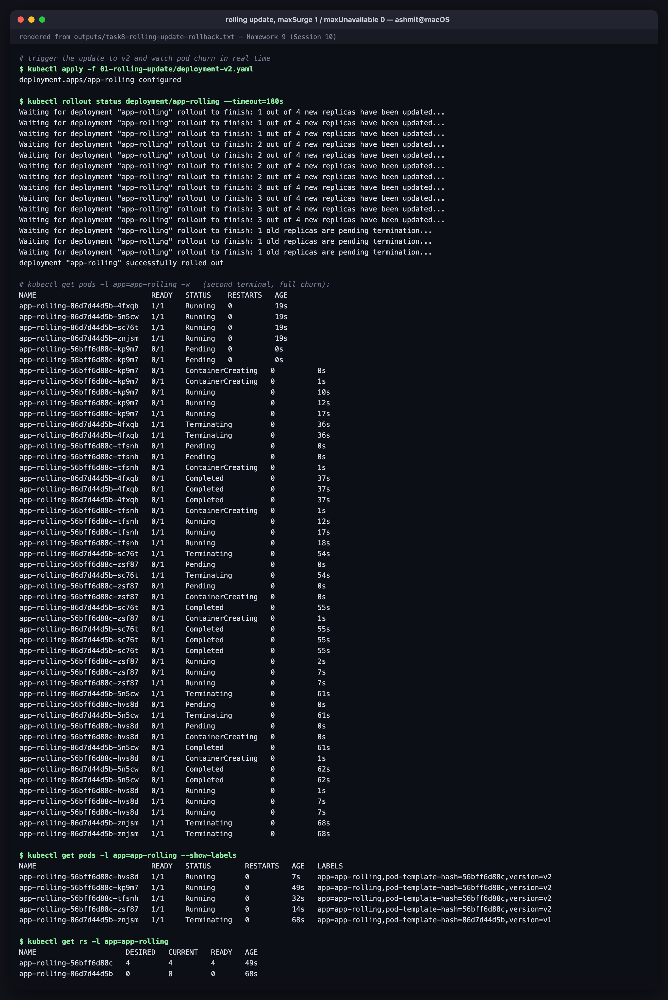
*the pod watch: every new pod reaches 1/1 before an old one is touched*

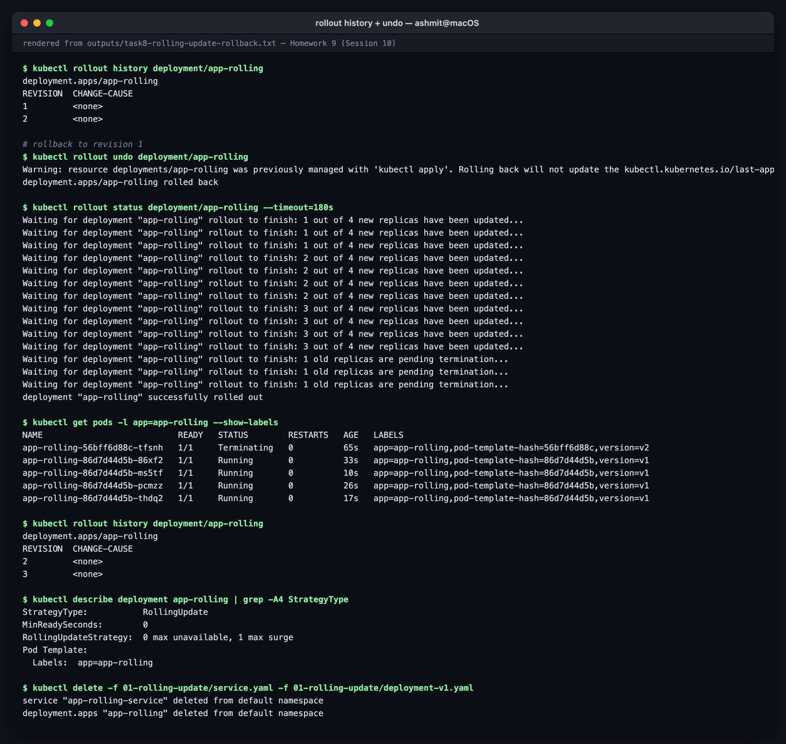
*rollout history and undo, which appends revision 3 rather than rewinding*

---

# Task 9 — Troubleshooting drills

## Drill 1 — a rollout stalled by an unresolvable image

`broken-image.yaml` upgrades a Deployment called `yatri-backend`, so a healthy revision 1 has
to exist first — otherwise there are no "old pods" left standing to make the point. That is
[`manifests/troubleshooting/yatri-backend-v1.yaml`](manifests/troubleshooting/yatri-backend-v1.yaml),
written for this homework.

```console
$ kubectl get pods -l app=yatri-backend -o wide
NAME                             READY   STATUS    RESTARTS   AGE   IP            NODE           NOMINATED NODE   READINESS GATES
yatri-backend-8478778b59-nd42m   1/1     Running   0          2s    10.244.1.34   minikube-m02   <none>           <none>
yatri-backend-8478778b59-p87jn   1/1     Running   0          2s    10.244.1.33   minikube-m02   <none>           <none>
yatri-backend-8478778b59-rnkj6   1/1     Running   0          2s    10.244.0.12   minikube       <none>           <none>

$ grep -n 'image:' troubleshooting/broken-image.yaml
33:          image: yatri-backend:non-existent-tag-v999

$ kubectl apply -f troubleshooting/broken-image.yaml
deployment.apps/yatri-backend configured

$ kubectl rollout status deployment/yatri-backend --timeout=40s
Waiting for deployment "yatri-backend" rollout to finish: 1 out of 3 new replicas have been updated...
error: timed out waiting for the condition
```

The rollout is **stuck at 1 of 3** and will stay there forever:

```console
$ kubectl get pods -l app=yatri-backend -L version
NAME                             READY   STATUS         RESTARTS   AGE   VERSION
yatri-backend-77dbb657cd-grpb6   0/1     ErrImagePull   0          41s   broken-v3
yatri-backend-8478778b59-nd42m   1/1     Running        0          43s   v1
yatri-backend-8478778b59-p87jn   1/1     Running        0          43s   v1
yatri-backend-8478778b59-rnkj6   1/1     Running        0          43s   v1

$ kubectl get deployment yatri-backend
NAME            READY   UP-TO-DATE   AVAILABLE   AGE
yatri-backend   3/3     1            3           42s

$ kubectl get rs -l app=yatri-backend
NAME                       DESIRED   CURRENT   READY   AGE
yatri-backend-77dbb657cd   1         1         0       40s
yatri-backend-8478778b59   3         3         3       42s
```

**`READY 3/3` and `AVAILABLE 3` while the rollout is broken.** This is the headline of the
drill: `maxSurge: 1, maxUnavailable: 0` means Kubernetes created *one* new pod, waited for it
to become Ready, and — because it never did — **refused to touch any of the three old pods**.
Users saw nothing. The only column that betrays the problem is `UP-TO-DATE 1`.

```console
$ kubectl describe pod yatri-backend-77dbb657cd-grpb6 | sed -n '/Events:/,$p'
Events:
  Warning  Failed     23s (x2 over 39s)  kubelet  spec.containers{backend}: Failed to pull image "yatri-backend:non-existent-tag-v999": failed to pull and unpack image "docker.io/library/yatri-backend:non-existent-tag-v999": failed to resolve reference "docker.io/library/yatri-backend:non-existent-tag-v999": pull access denied, repository does not exist or may require authorization: server message: insufficient_scope: authorization failed
```

Recovery is one command:

```console
$ kubectl rollout undo deployment/yatri-backend
deployment.apps/yatri-backend rolled back

$ kubectl rollout status deployment/yatri-backend --timeout=120s
Waiting for deployment "yatri-backend" rollout to finish: 1 old replicas are pending termination...
deployment "yatri-backend" successfully rolled out
```

> **Watch the wording in the pull error.** `yatri-backend:non-existent-tag-v999` was resolved as
> `docker.io/library/yatri-backend` — an unqualified image name silently becomes a Docker Hub
> official-library name. The registry's answer is `pull access denied`, not "tag not found",
> because Docker Hub will not tell an anonymous client whether a private repo exists. A missing
> tag and a missing permission look identical from here, which is a genuinely common source of
> wasted debugging time.

## Drill 2 — label selector must match the pod template

```yaml
spec:
  selector:
    matchLabels:
      app: correct-app-name
  template:
    metadata:
      labels:
        app: wrong-app-name      # BUG
```

```console
$ kubectl apply -f troubleshooting/selector-mismatch.yaml; echo "exit code: $?"
The Deployment "selector-error-demo" is invalid: spec.template.metadata.labels: Invalid value: map[string]string{"app":"wrong-app-name"}: `selector` does not match template `labels`
exit code: 1
```

This is caught by the **API server**, not by a controller — no object was ever created. A
Deployment that could not find its own pods would be permanently broken, so the schema forbids
it up front.

```console
$ sed 's/app: wrong-app-name/app: correct-app-name/' troubleshooting/selector-mismatch.yaml > selector-fixed.yaml && diff ...
<         app: wrong-app-name

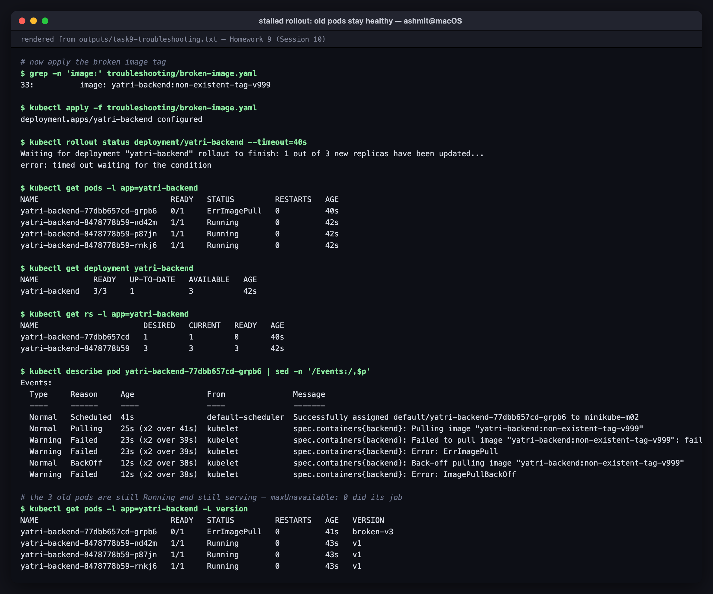
*the rollout stalls at 1 of 3 while the deployment still reports READY 3/3*

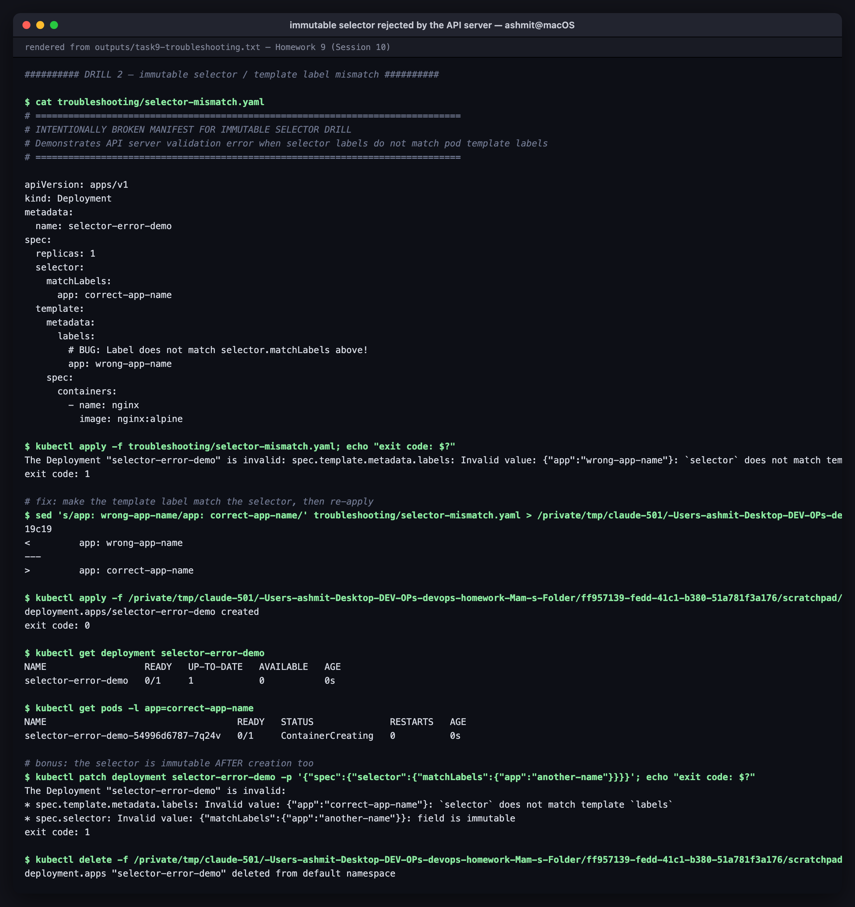
*the API server rejecting the selector mismatch, and the immutability follow-up*

---
>         app: correct-app-name

$ kubectl apply -f selector-fixed.yaml; echo "exit code: $?"
deployment.apps/selector-error-demo created
exit code: 0

$ kubectl get pods -l app=correct-app-name
NAME                                   READY   STATUS              RESTARTS   AGE
selector-error-demo-54996d6787-7q24v   0/1     ContainerCreating   0          0s
```

And the follow-up that the lab sheet does not ask for but every engineer eventually hits — the
selector is **immutable after creation**:

```console
$ kubectl patch deployment selector-error-demo -p '{"spec":{"selector":{"matchLabels":{"app":"another-name"}}}}'; echo "exit code: $?"
The Deployment "selector-error-demo" is invalid:
* spec.template.metadata.labels: Invalid value: {"app":"correct-app-name"}: `selector` does not match template `labels`
* spec.selector: Invalid value: {"matchLabels":{"app":"another-name"}}: field is immutable
exit code: 1
```

`field is immutable`. To change a Deployment's selector you must delete and recreate it. Choose
labels carefully the first time.

---

# Task 10 — Concepts

## The four ports

```
 Client (outside the cluster)
        │
        ▼  nodePort: 30020      ← open on EVERY node's IP, range 30000-32767
 ┌──────────────────┐
 │   node (kernel)  │
 └────────┬─────────┘
          ▼  port: 80           ← the Service's own port, on its ClusterIP (a virtual IP)
 ┌──────────────────┐
 │  Service  VIP    │
 └────────┬─────────┘
          ▼  targetPort: 80     ← the port on the POD the traffic is forwarded to
 ┌──────────────────┐
 │   Pod  10.244.x  │
 └────────┬─────────┘
          ▼  containerPort: 80  ← documentation of what the process listens on
     nginx process
```

| Field | Lives on | Who uses it | Mandatory? |
|---|---|---|---|
| `containerPort` | the Pod spec | **nobody at runtime** — purely informational/documentation | no |
| `targetPort` | the Service spec | kube-proxy, as the destination port on the pod | defaults to `port` |
| `port` | the Service spec | in-cluster clients: `http://svc-name:port` | yes |
| `nodePort` | the Service spec | external clients: `http://<node-ip>:nodePort` | auto-assigned |

The one that surprises people: **deleting `containerPort` changes nothing.** Traffic reaches a
container because `targetPort` says so, not because `containerPort` declares it. It is worth
writing anyway — it documents intent and some tooling reads it. Verified against the schema in
[Homework 10, Task 1](../10-k8s-services#task-1--the-four-ports).

## Labels vs selectors

A **label** is data you attach to an object (`app: nginx`, `slot: blue`, `version: v2`). A
**selector** is a query someone else runs over those labels.

```
Deployment app-blue  ──sets──► pods labelled {app: myapp, slot: blue,  version: v1}
Deployment app-green ──sets──► pods labelled {app: myapp, slot: green, version: v2}

Service myapp-service ──selects──► {app: myapp, slot: blue}   ← matches only the 3 blue pods
```

The labels never changed in the blue-green cutover in Task 11 — **only the selector did**. That
is what made the switch instant.

## The four deployment strategies

| Strategy | Pod count during change | Downtime | Extra capacity | Rollback | Measured in |
|---|---|---|---|---|---|
| **RollingUpdate** | 4 → 5 → 4 | none | +1 pod | rolling, ~30 s | Task 8 |
| **Recreate** | 3 → **0** → 3 | **~3 s measured** | none | rolling | Task 13 |
| **Blue-Green** | 6 the whole time | none | **+100%** | instant, selector flip | Task 11 |
| **Canary** | 10 the whole time | none | +10% | instant, scale canary to 0 | Task 12 |

## `maxSurge` vs `maxUnavailable`

Both accept an absolute number or a percentage of `spec.replicas`; percentages round **up** for
surge and **down** for unavailable.

For the Task 8 deployment — `replicas: 4`, `maxSurge: 1`, `maxUnavailable: 0`:

- ceiling: `4 + 1 = 5` pods may exist at once
- floor: `4 − 0 = 4` pods must be available at all times → **100% capacity held throughout**
- cost: the rollout is serial and slow; one pod at a time, each waiting on its readiness probe

| Setting | Max pods | Min available | Behaviour |
|---|---|---|---|
| `maxSurge: 1, maxUnavailable: 0` | 5 | 4 | safest; needs room for 1 extra pod (used in Task 8) |
| `maxSurge: 0, maxUnavailable: 1` | 4 | 3 | no extra capacity needed; runs at 75% during the roll |
| `maxSurge: 25%, maxUnavailable: 25%` | 5 | 3 | the **default**; fast, with a capacity dip |
| `maxSurge: 100%, maxUnavailable: 0` | 8 | 4 | fastest; doubles cost for the duration |

`maxSurge: 0, maxUnavailable: 0` is rejected — it would make progress impossible.

## Requests vs limits, and GB vs GiB

- **Request** — what the **scheduler** subtracts from a node's allocatable when deciding
  placement. It is a reservation, whether or not the process uses it. The `9Gi` request in
  Task 5.2 is why that pod never got scheduled.
- **Limit** — what the **kernel cgroup** enforces at runtime. Exceed a CPU limit and the process
  is **throttled**; exceed a memory limit and it is **OOM-killed**.

| Suffix | Base | Value |
|---|---|---|
| `M` | decimal | 1,000,000 bytes |
| `Mi` | binary | 1,048,576 bytes |
| `G` | decimal | 1,000,000,000 bytes |
| `Gi` | binary | 1,073,741,824 bytes |

`1Gi` is about **7.4% more** memory than `1G`. Always use `Mi`/`Gi` in Kubernetes — every tool
in the ecosystem reports in binary units, so mixing them makes dashboards lie.

Requests and limits together set the **QoS class**, which decides eviction order under node
pressure:

| QoS | Condition | Evicted |
|---|---|---|
| `Guaranteed` | requests == limits, for every container | last |
| `Burstable` | requests set, limits higher or absent | middle |
| `BestEffort` | neither set | **first** |

The `nginx-pod` in Task 2 reported `QoS Class: BestEffort` — it sets no resources at all.

---

# Task 11 — Blue-Green deployment

Both environments run side by side, six pods, distinguished only by the `slot` label:

```console
$ kubectl get pods -l app=myapp --show-labels
NAME                        READY   STATUS    RESTARTS   AGE   LABELS
app-blue-5c69d7785c-ngpvt   1/1     Running   0          29s   app=myapp,pod-template-hash=5c69d7785c,slot=blue,version=v1
app-blue-5c69d7785c-psc9q   1/1     Running   0          29s   app=myapp,pod-template-hash=5c69d7785c,slot=blue,version=v1
app-blue-5c69d7785c-zhwnt   1/1     Running   0          29s   app=myapp,pod-template-hash=5c69d7785c,slot=blue,version=v1
app-green-84df7f978-bx6ps   1/1     Running   0          18s   app=myapp,pod-template-hash=84df7f978,slot=green,version=v2
app-green-84df7f978-mn5wl   1/1     Running   0          18s   app=myapp,pod-template-hash=84df7f978,slot=green,version=v2
app-green-84df7f978-nwlsb   1/1     Running   0          19s   app=myapp,pod-template-hash=84df7f978,slot=green,version=v2
```

All traffic tests run from a `curl` pod **inside** the cluster, hitting the Service name so the
requests actually go through the ClusterIP and kube-proxy. (A host-side `kubectl port-forward`
would pin to a single pod and prove nothing about load balancing — see
[Homework 10, Task 12](../10-k8s-services#task-12--why-node-ipnodeport-fails-on-macos).)

```console
$ kubectl apply -f 02-blue-green/service-blue.yaml
service/myapp-service created

$ kubectl describe svc myapp-service | grep -E 'Selector|Endpoints|NodePort'
Selector:                 app=myapp,slot=blue
Type:                     NodePort
NodePort:                 http  30020/TCP
Endpoints:                10.244.1.39:80,10.244.0.13:80,10.244.1.38:80

$ for i in 1..6; do curl -s http://myapp-service | grep ENVIRONMENT; done   # from traffic-client pod
command terminated with exit code 7
command terminated with exit code 7
command terminated with exit code 7
BLUE ENVIRONMENT
BLUE ENVIRONMENT
BLUE ENVIRONMENT
```

> **Three failed requests, and they are not a bug in the app.** `curl` exit 7 is "failed to
> connect". The Service object had existed for well under a second when the loop started, and
> kube-proxy had not yet written its rules on the node running the client pod. This is
> real-world behaviour worth knowing: a Service is not usable the instant `kubectl apply`
> returns. **Note that no requests failed during the actual cutover below** — which is the
> point of the whole exercise.

The switch is a two-line diff:

```console
$ diff 02-blue-green/service-blue.yaml 02-blue-green/service-green.yaml
15c14
<     slot: blue     # <-- Currently routing to BLUE (v1)

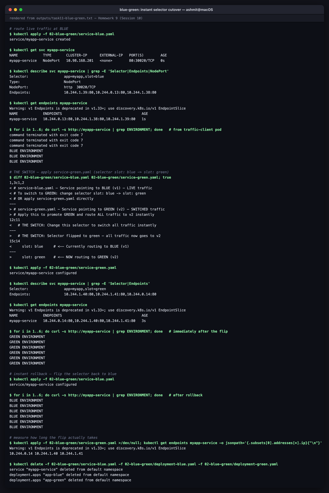
*the endpoint set flipping to a disjoint set of pod IPs, BLUE -> GREEN -> BLUE*

---
>     slot: green    # <-- NOW routing to GREEN (v2)

$ kubectl apply -f 02-blue-green/service-green.yaml
service/myapp-service configured

$ kubectl describe svc myapp-service | grep -E 'Selector|Endpoints'
Selector:                 app=myapp,slot=green
Endpoints:                10.244.1.40:80,10.244.1.41:80,10.244.0.14:80

$ for i in 1..6; do curl -s http://myapp-service | grep ENVIRONMENT; done   # immediately after the flip
GREEN ENVIRONMENT
GREEN ENVIRONMENT
GREEN ENVIRONMENT
GREEN ENVIRONMENT
GREEN ENVIRONMENT
GREEN ENVIRONMENT
```

Compare the endpoint sets before and after: `10.244.1.39, 10.244.0.13, 10.244.1.38` became
`10.244.1.40, 10.244.1.41, 10.244.0.14` — a **completely disjoint** set of pod IPs. Six out of
six requests hit green, with **no mixed-version window**. Nothing was built, pulled, scheduled
or started; the endpoint controller just recomputed the list.

Rollback is the same operation in reverse, and is just as instant:

```console
$ kubectl apply -f 02-blue-green/service-blue.yaml
service/myapp-service configured

$ for i in 1..6; do curl -s http://myapp-service | grep ENVIRONMENT; done   # after rollback
BLUE ENVIRONMENT
BLUE ENVIRONMENT
BLUE ENVIRONMENT
BLUE ENVIRONMENT
BLUE ENVIRONMENT
BLUE ENVIRONMENT
```

**The cost:** six pods to serve three pods' worth of traffic. Blue-green buys the fastest
possible rollback with 100% extra compute, for as long as both slots are up.

---

# Task 12 — Canary deployment

One Service, one shared label (`app: myapp-canary`), two Deployments with different `track`
labels. The traffic split is nothing but the **pod-count ratio**.

```console
$ kubectl get deploy app-stable app-canary
NAME         READY   UP-TO-DATE   AVAILABLE   AGE
app-stable   9/9     9            9           60s
app-canary   1/1     1            1           47s

$ kubectl get endpoints myapp-canary-service
NAME                   ENDPOINTS                                                  AGE
myapp-canary-service   10.244.0.15:80,10.244.0.16:80,10.244.0.17:80 + 7 more...   60s
```

Ten endpoints behind one Service. Forty requests at 9:1:

```console
$ for i in $(seq 1 40); do curl -s http://myapp-canary-service | grep -o "STABLE v1\|CANARY v2"; done | sort | uniq -c
   4 CANARY v2
  36 STABLE v1
```

```
raw sequence, in order:
STABLE v1 STABLE v1 STABLE v1 STABLE v1 STABLE v1 STABLE v1 STABLE v1 STABLE v1 STABLE v1 STABLE v1
STABLE v1 STABLE v1 STABLE v1 STABLE v1 CANARY v2 STABLE v1 STABLE v1 STABLE v1 STABLE v1 STABLE v1
STABLE v1 STABLE v1 CANARY v2 STABLE v1 STABLE v1 STABLE v1 CANARY v2 STABLE v1 STABLE v1 STABLE v1
STABLE v1 STABLE v1 STABLE v1 CANARY v2 STABLE v1 STABLE v1 STABLE v1 STABLE v1 STABLE v1 STABLE v1
```

**4/40 = 10.0%**, against a 1-in-10 pod ratio. Dead on — and note the canary hits are scattered,
not clustered, because kube-proxy picks a backend per connection at random.

Shifting the split is two `kubectl scale` calls, no redeploy:

```console
$ kubectl scale deployment app-canary --replicas=3
$ kubectl scale deployment app-stable --replicas=7

$ kubectl get deploy app-stable app-canary
NAME         READY   UP-TO-DATE   AVAILABLE   AGE
app-stable   7/7     7            7           60s
app-canary   3/3     3            3           47s

$ for i in $(seq 1 40); do curl -s http://myapp-canary-service | grep -o "STABLE v1\|CANARY v2"; done | sort | uniq -c
   9 CANARY v2
  31 STABLE v1
```

**9/40 = 22.5%** where the pod ratio predicts 30%. That gap is honest sampling noise, not a
misconfiguration: with n=40 and p=0.3 the standard deviation is about 2.9 requests, so 9 hits is
roughly 1.4σ below the expected 12 — unremarkable. Getting a clean 30% needs hundreds of
requests, which is precisely why real canary analysis is driven by error-rate and latency
metrics over minutes, not by counting a handful of curls.

Aborting the canary:

```console
$ kubectl scale deployment app-canary --replicas=0
$ kubectl scale deployment app-stable --replicas=9

$ kubectl get deploy app-stable app-canary
NAME         READY   UP-TO-DATE   AVAILABLE   AGE
app-stable   9/9     9            9           87s
app-canary   0/0     0            0           74s

$ for i in $(seq 1 20); do curl -s http://myapp-canary-service | grep -o "STABLE v1\|CANARY v2"; done | sort | uniq -c
  20 STABLE v1
```

20/20 stable. The canary Deployment still exists at `0/0`, which makes re-enabling it a single
scale command.

**The limitation of pod-ratio canarying:** the granularity is `1/total pods`. A 1% canary needs
100 pods. Real 1%-of-traffic canaries need a Layer 7 proxy that splits by weight — an Ingress
controller with canary annotations, or a service mesh — not a pod count.


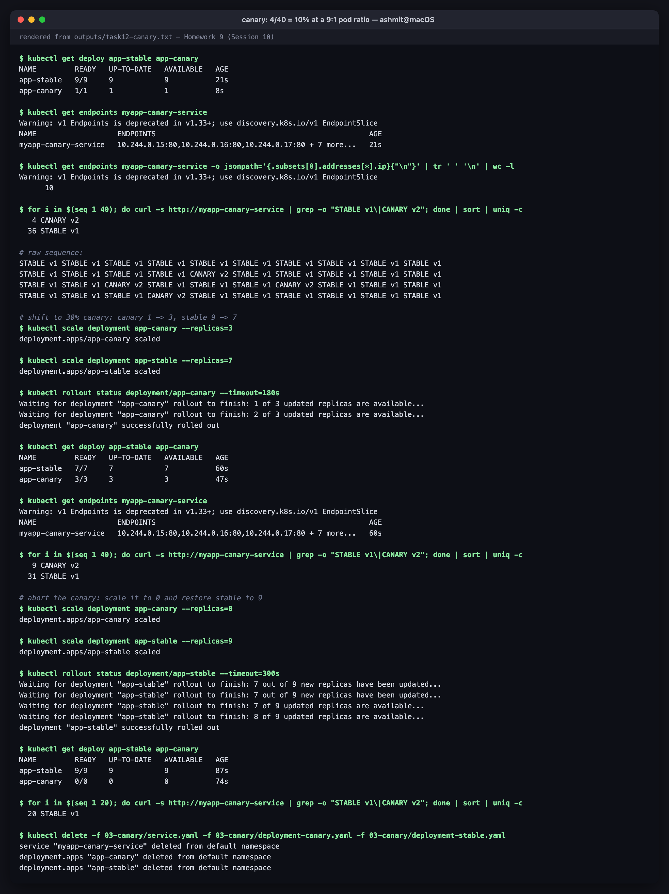
*4 of 40 requests to the canary at a 9:1 pod ratio*

---

# Task 13 — Recreate strategy and its measured outage

```console
$ grep -A3 'strategy:' 04-recreate/deployment-v1.yaml
  strategy:
    type: Recreate
  selector:
    matchLabels:
```

A polling loop runs inside the cluster at 2 Hz while v2 is applied:

```console
23:56:54  VERSION: v1
23:56:54  VERSION: v1
23:56:55  VERSION: v1
23:56:55  [OUTAGE] no endpoint / connection refused
23:56:57  [OUTAGE] no endpoint / connection refused
23:56:57  [OUTAGE] no endpoint / connection refused
23:56:58  [OUTAGE] no endpoint / connection refused
23:56:58  VERSION: v2 (UPGRADED)
23:56:59  VERSION: v2 (UPGRADED)
23:56:59  VERSION: v2 (UPGRADED)
```

```console
$ grep -c OUTAGE recreate-loop.txt
4
```

**A real, measured outage: 4 consecutive failed samples across 23:56:55 → 23:56:58, about
3 seconds with zero pods serving.** Not a claim from a textbook — a request log.

The pod watch over the same window explains it precisely:

```console
$ kubectl get pods -l app=app-recreate -w
app-recreate-6c78cb55bb-4trlk   1/1     Running       0          13s
app-recreate-6c78cb55bb-7hm5h   1/1     Running       0          14s
app-recreate-6c78cb55bb-sg4br   1/1     Running       0          13s
app-recreate-6c78cb55bb-sg4br   1/1     Terminating   0          13s     <- all three at once
app-recreate-6c78cb55bb-4trlk   1/1     Terminating   0          13s
app-recreate-6c78cb55bb-7hm5h   1/1     Terminating   0          14s
app-recreate-6c78cb55bb-7hm5h   0/1     Completed     0          15s
app-recreate-6c78cb55bb-sg4br   0/1     Completed     0          14s
app-recreate-6c78cb55bb-4trlk   0/1     Completed     0          14s
app-recreate-7bd8d89b8b-crmfv   0/1     Pending       0          0s      <- only NOW is v2 created
app-recreate-7bd8d89b8b-ddmfx   0/1     Pending       0          0s
app-recreate-7bd8d89b8b-62lml   0/1     Pending       0          0s
app-recreate-7bd8d89b8b-62lml   0/1     ContainerCreating   0          1s
app-recreate-7bd8d89b8b-62lml   1/1     Running             0          2s
app-recreate-7bd8d89b8b-ddmfx   1/1     Running             0          2s
app-recreate-7bd8d89b8b-crmfv   1/1     Running             0          2s
```

All three v1 pods go `Terminating` **in the same instant**, and the first v2 pod is `Pending`
only after all three reach `Completed`. Compare that with the Task 8 watch, where a new pod was
always `1/1 Running` before an old one was touched. Same cluster, same app, opposite guarantee.

The outage here is only ~3 s because the image was already cached and nginx starts instantly.
A JVM application with a 45-second warm-up would produce a 45-second outage, every deploy.

```console
$ kubectl rollout history deployment/app-recreate
$ kubectl rollout undo deployment/app-recreate
deployment.apps/app-recreate rolled back

$ kubectl get pods -l app=app-recreate --show-labels
NAME                            READY   STATUS    RESTARTS   AGE   LABELS
app-recreate-6c78cb55bb-25xwn   1/1     Running   0          3s    app=app-recreate,pod-template-hash=6c78cb55bb,version=v1
app-recreate-6c78cb55bb-44m5t   1/1     Running   0          3s    app=app-recreate,pod-template-hash=6c78cb55bb,version=v1
app-recreate-6c78cb55bb-5dgds   1/1     Running   0          3s    app=app-recreate,pod-template-hash=6c78cb55bb,version=v1
```

**The rollback is also a Recreate** — it takes a second outage. There is no "fast undo" with
this strategy.

**When Recreate is the right answer anyway:** when two versions must never run at once. A
schema migration that v1 cannot read, a singleton holding an exclusive lock, or a `ReadWriteOnce`
volume that only one pod can mount. In those cases the outage is the price of correctness.


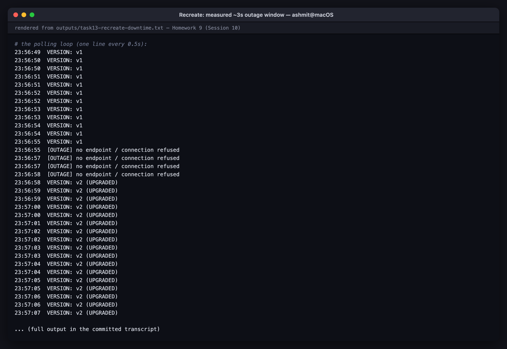
*the 2 Hz polling loop capturing the outage window*

---

## Files

```
09-k8s-core-objects/
├── README.md
├── manifests/                         course manifests, copied in so this folder runs standalone
│   ├── pod.yml  hello.yml  replicaset.yml  statefulset.yml  deamonset.yml
│   ├── statefulset-arm64.yml          ← written here: mysql:8.0, 2 replicas (Apple Silicon)
│   ├── pod-lifecycle/                 01..12, the twelve lifecycle states
│   ├── daemonset/                     node-agent-ds.yaml
│   ├── 01-rolling-update/  02-blue-green/  03-canary/  04-recreate/
│   └── troubleshooting/
│       ├── broken-image.yaml  selector-mismatch.yaml
│       └── yatri-backend-v1.yaml      ← written here: healthy revision 1 for Drill 1
├── outputs/
│   ├── task1-cluster-health.txt
│   ├── task2-nginx-pod.txt
│   ├── task3-imagepullbackoff.txt
│   ├── task4-hello-pod-phases.txt
│   ├── task5-pod-lifecycle-lab.txt
│   ├── task5-crashloop-waiting-state.txt
│   ├── task6-replicaset-statefulset.txt
│   ├── task7-daemonset.txt
│   ├── task8-rolling-update-rollback.txt
│   ├── task9-troubleshooting.txt
│   ├── task11-blue-green.txt
│   ├── task12-canary.txt
│   └── task13-recreate-downtime.txt
└── screenshots/
```
