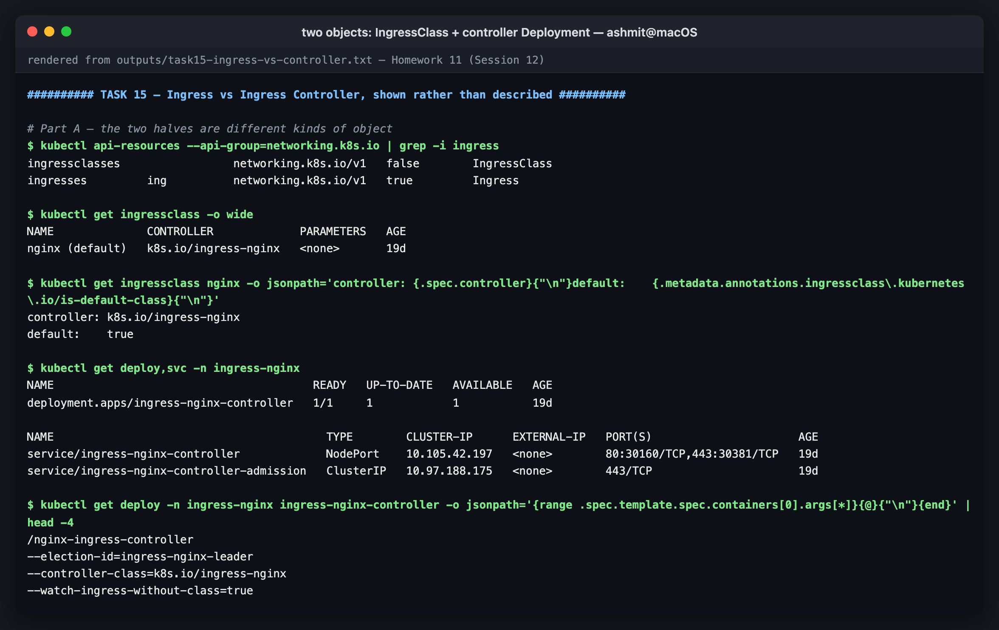
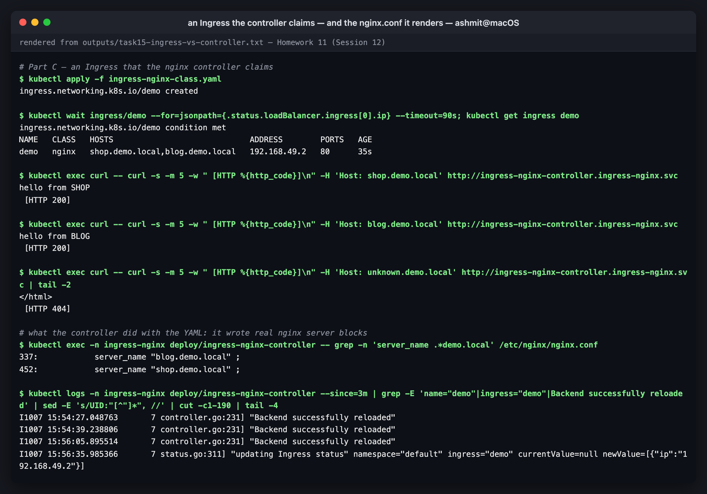
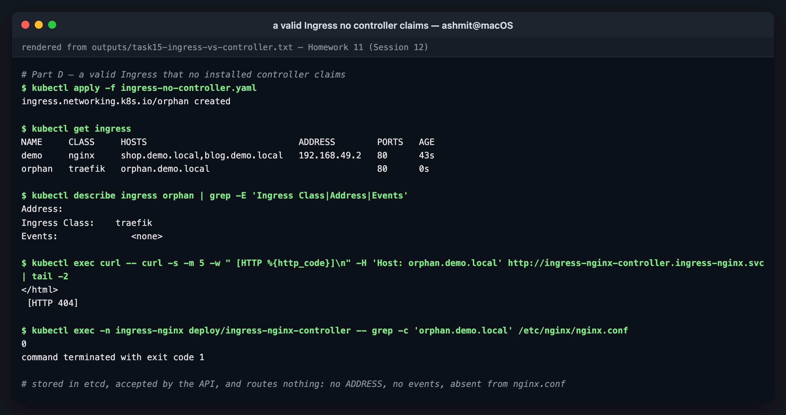
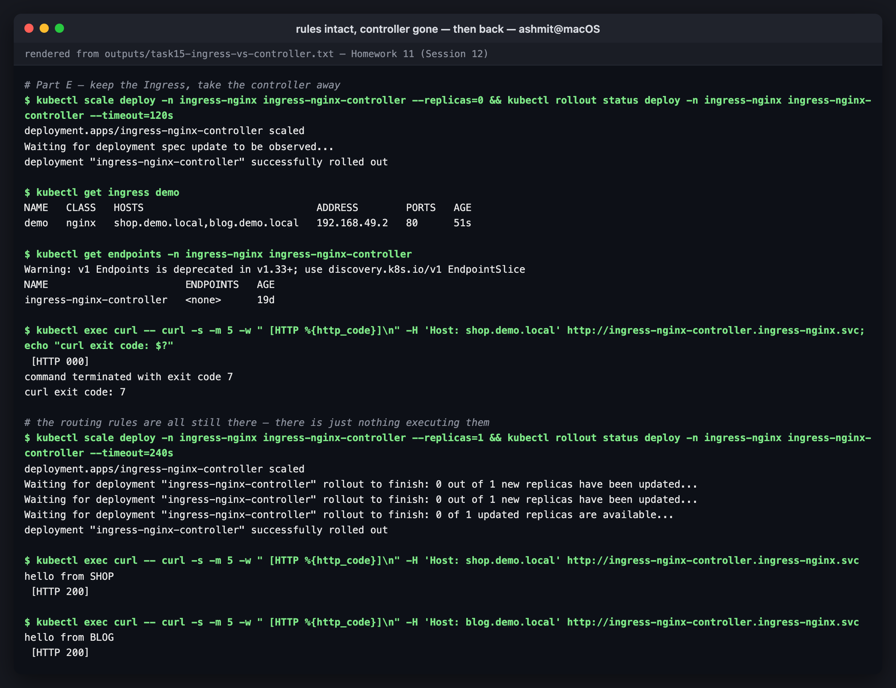

# Ingress vs Ingress Controller

Session 12, **Task 4**. The concepts are explained with live evidence from the two-node
Minikube cluster rather than diagrams alone. **Every output block is extracted verbatim** from
[`../outputs/task15-ingress-vs-controller.txt`](../outputs/task15-ingress-vs-controller.txt).

Manifests in this folder:

| File | What it is |
|---|---|
| [`apps.yaml`](apps.yaml) | two backends, `shop` and `blog`, each answering with its own name |
| [`ingress-nginx-class.yaml`](ingress-nginx-class.yaml) | an Ingress for class `nginx` — the controller that is installed |
| [`ingress-no-controller.yaml`](ingress-no-controller.yaml) | an equally valid Ingress for class `traefik` — a controller that is **not** installed |

---

## What is an Ingress?

An **Ingress** is a Kubernetes API object (`networking.k8s.io/v1`, kind `Ingress`) that
describes **Layer 7 routing rules**: *requests for this host and this path go to that Service
on that port*, optionally with TLS. It is data. It is stored in etcd like a ConfigMap, and on
its own it does nothing.

```yaml
spec:
  ingressClassName: nginx          # which controller should implement me
  rules:
    - host: shop.demo.local        # match on the Host header
      http:
        paths:
          - path: /                # and on the URL path
            pathType: Prefix
            backend: { service: { name: shop, port: { number: 80 } } }
```

## What is an Ingress Controller?

An **Ingress Controller** is a **running program**: a Deployment of reverse-proxy pods
(NGINX, Envoy, HAProxy, Traefik, or a cloud load balancer driven by an operator). It runs a
control loop:

```
 watch API server ──► new/changed Ingress for MY class? ──► render proxy config ──► reload
        ▲                                                                            │
        └────────────────────────── update Ingress .status (ADDRESS) ◄───────────────┘
```

It is the only component that actually receives packets. Kubernetes ships **no** controller in
the box. You install one, the same way you install any other workload.

## The link between them: IngressClass

A cluster can run several controllers at once. **IngressClass** is how an Ingress says which
one it is addressed to:

```console
$ kubectl api-resources --api-group=networking.k8s.io | grep -i ingress
ingressclasses                 networking.k8s.io/v1   false        IngressClass
ingresses         ing          networking.k8s.io/v1   true         Ingress

$ kubectl get ingressclass -o wide
NAME              CONTROLLER             PARAMETERS   AGE
nginx (default)   k8s.io/ingress-nginx   <none>       19d

$ kubectl get ingressclass nginx -o jsonpath='controller: {.spec.controller}{"\n"}default:    {.metadata.annotations.ingressclass\.kubernetes\.io/is-default-class}{"\n"}'
controller: k8s.io/ingress-nginx
default:    true
```

And the controller announces the same string on its command line. That is how it knows which
Ingresses belong to it:

```console
$ kubectl get deploy -n ingress-nginx ingress-nginx-controller -o jsonpath='{range .spec.template.spec.containers[0].args[*]}{@}{"\n"}{end}' | head -4
/nginx-ingress-controller
--election-id=ingress-nginx-leader
--controller-class=k8s.io/ingress-nginx
--watch-ingress-without-class=true
```

`Ingress.spec.ingressClassName: nginx` → `IngressClass nginx` → `spec.controller: k8s.io/ingress-nginx`
→ the pod started with `--controller-class=k8s.io/ingress-nginx`. Break any link in that chain
and the Ingress is orphaned.


*IngressClass and the controller Deployment: two separate objects*

---

## Proof 1 — an Ingress the controller claims

```console
$ kubectl apply -f ingress-nginx-class.yaml
ingress.networking.k8s.io/demo created

$ kubectl wait ingress/demo --for=jsonpath={.status.loadBalancer.ingress[0].ip} --timeout=90s; kubectl get ingress demo
ingress.networking.k8s.io/demo condition met
NAME   CLASS   HOSTS                             ADDRESS        PORTS   AGE
demo   nginx   shop.demo.local,blog.demo.local   192.168.49.2   80      35s

$ kubectl exec curl -- curl -s -m 5 -w " [HTTP %{http_code}]\n" -H 'Host: shop.demo.local' http://ingress-nginx-controller.ingress-nginx.svc
hello from SHOP
 [HTTP 200]

$ kubectl exec curl -- curl -s -m 5 -w " [HTTP %{http_code}]\n" -H 'Host: blog.demo.local' http://ingress-nginx-controller.ingress-nginx.svc
hello from BLOG
 [HTTP 200]

$ kubectl exec curl -- curl -s -m 5 -w " [HTTP %{http_code}]\n" -H 'Host: unknown.demo.local' http://ingress-nginx-controller.ingress-nginx.svc | tail -2
</html>
 [HTTP 404]
```

Same IP and port, three different answers, chosen only by the `Host` header. That is
Layer 7 routing. The `ADDRESS` column was filled in **by the controller**; Kubernetes itself
never writes it.

What the controller actually did with the YAML was to write NGINX configuration:

```console
$ kubectl exec -n ingress-nginx deploy/ingress-nginx-controller -- grep -n 'server_name .*demo.local' /etc/nginx/nginx.conf
337:		server_name "blog.demo.local" ;
452:		server_name "shop.demo.local" ;

$ kubectl logs -n ingress-nginx deploy/ingress-nginx-controller --since=3m | grep -E 'name="demo"|ingress="demo"|Backend successfully reloaded' | sed -E 's/UID:"[^"]*", //' | cut -c1-190 | tail -4
I1007 15:54:27.048763       7 controller.go:231] "Backend successfully reloaded"
I1007 15:54:39.238806       7 controller.go:231] "Backend successfully reloaded"
I1007 15:56:05.895514       7 controller.go:231] "Backend successfully reloaded"
I1007 15:56:35.985366       7 status.go:311] "updating Ingress status" namespace="default" ingress="demo" currentValue=null newValue=[{"ip":"192.168.49.2"}]
```

Two `server {}` blocks in a real `nginx.conf`, a reload, and a status write-back. Every
annotation you put on an ingress-nginx Ingress (`rewrite-target`, `ssl-redirect`, …) ends up
as a directive in this file.


*the Ingress claimed, routed by Host header, rendered into nginx.conf*

## Proof 2 — a valid Ingress with no controller

`ingress-no-controller.yaml` is identical in shape. It only asks for class `traefik`:

```console
$ kubectl apply -f ingress-no-controller.yaml
ingress.networking.k8s.io/orphan created

$ kubectl get ingress
NAME     CLASS     HOSTS                             ADDRESS        PORTS   AGE
demo     nginx     shop.demo.local,blog.demo.local   192.168.49.2   80      43s
orphan   traefik   orphan.demo.local                                80      0s

$ kubectl describe ingress orphan | grep -E 'Ingress Class|Address|Events'
Address:          
Ingress Class:    traefik
Events:              <none>

$ kubectl exec curl -- curl -s -m 5 -w " [HTTP %{http_code}]\n" -H 'Host: orphan.demo.local' http://ingress-nginx-controller.ingress-nginx.svc | tail -2
</html>
 [HTTP 404]

$ kubectl exec -n ingress-nginx deploy/ingress-nginx-controller -- grep -c 'orphan.demo.local' /etc/nginx/nginx.conf
0
command terminated with exit code 1
```

The API server **accepted** it, because it is schema-valid. Nothing else happened: no
`ADDRESS`, no events, zero lines in `nginx.conf`, and a 404. The Ingress exists, and nothing
acts on it.


*an orphaned Ingress: accepted, stored, and ignored*

## Proof 3 — keep the Ingress, remove the controller

```console
$ kubectl scale deploy -n ingress-nginx ingress-nginx-controller --replicas=0 && kubectl rollout status deploy -n ingress-nginx ingress-nginx-controller --timeout=120s
deployment.apps/ingress-nginx-controller scaled
Waiting for deployment spec update to be observed...
deployment "ingress-nginx-controller" successfully rolled out

$ kubectl get ingress demo
NAME   CLASS   HOSTS                             ADDRESS        PORTS   AGE
demo   nginx   shop.demo.local,blog.demo.local   192.168.49.2   80      51s

$ kubectl get endpoints -n ingress-nginx ingress-nginx-controller
Warning: v1 Endpoints is deprecated in v1.33+; use discovery.k8s.io/v1 EndpointSlice
NAME                       ENDPOINTS   AGE
ingress-nginx-controller   <none>      19d

$ kubectl exec curl -- curl -s -m 5 -w " [HTTP %{http_code}]\n" -H 'Host: shop.demo.local' http://ingress-nginx-controller.ingress-nginx.svc; echo "curl exit code: $?"
 [HTTP 000]
command terminated with exit code 7
curl exit code: 7
```

The rules are untouched, and even the stale `ADDRESS` is still displayed. But curl exit code
7 means *failed to connect*: there is no process left to accept the connection. Scale it
back up and the same, unchanged Ingress works again:

```console
$ kubectl exec curl -- curl -s -m 5 -w " [HTTP %{http_code}]\n" -H 'Host: shop.demo.local' http://ingress-nginx-controller.ingress-nginx.svc
hello from SHOP
 [HTTP 200]
```


*rules intact with the controller at zero replicas, then restored*

---

## The difference, side by side

| | **Ingress** | **Ingress Controller** |
|---|---|---|
| Kind of thing | API object (YAML in etcd) | running pods (a Deployment/DaemonSet) |
| Answers | *what* should be routed *where* | *how* it is actually routed |
| Who writes it | application teams, per app | platform team, once per cluster |
| Contains | hosts, paths, backend Services, TLS Secret names | a proxy (NGINX/Envoy/HAProxy…) + a control loop |
| Touches packets? | **no** | **yes**, it is the data path |
| Scope | namespaced | cluster-wide (usually its own namespace) |
| Without the other | stored, valid, ignored (Proof 2 and 3) | proxy with no routes: 404 for everything |
| Analogy | the sheet music | the orchestra |

## Why both are required

- **Separation of concerns.** Developers declare intent in a portable object; the platform
  team picks the implementation. Switching NGINX to Traefik should not mean rewriting every
  app's manifests. It mostly means changing `ingressClassName`.
- **Kubernetes stays neutral.** The core project defines the API and lets vendors compete on
  implementations. That is the same model as CSI for storage and CNI for networking.
- **One entry point instead of N load balancers.** Without Ingress, every public service needs
  its own `LoadBalancer` Service, which on a cloud means one paid load balancer per service.
  With Ingress, one controller behind one load balancer serves every host and path, and does
  TLS termination in one place.
- **Neither half works alone.** Proof 2 is an Ingress without a controller. Proof 3 is the
  controller's routes without a running proxy. Only together does a request reach a pod.

## Examples of Ingress Controllers

| Controller | Data plane | Typical use |
|---|---|---|
| **ingress-nginx** (Kubernetes community) | NGINX | the classic default, and what this cluster runs |
| **NGINX Ingress Controller** (F5/NGINX Inc.) | NGINX / NGINX Plus | a different project with a confusingly similar name |
| **Traefik** | Traefik | k3s default; auto-discovery, Let's Encrypt built in |
| **HAProxy Kubernetes Ingress** | HAProxy | high-throughput TCP/HTTP |
| **Contour** / **Emissary** | Envoy | Envoy-based, strong Gateway API support |
| **AWS Load Balancer Controller** | AWS ALB | provisions a real ALB per Ingress (or group) |
| **GKE Ingress** | Google Cloud HTTP(S) LB | provisions a Google LB |
| **Azure Application Gateway (AGIC)** | App Gateway | Azure's managed L7 LB |
| **Istio ingress gateway** | Envoy | when a service mesh is already present |

Two things worth knowing about where this is heading:

- The **Gateway API** (`GatewayClass` / `Gateway` / `HTTPRoute`) is the successor to Ingress.
  It makes the same split explicit and typed: the platform team owns `Gateway`, app teams own
  `HTTPRoute`, and features that were vendor annotations (header matching, traffic splitting)
  become fields. The course's Helm charts already ship an `httproute.yaml` template for it.
- The Kubernetes project has **retired ingress-nginx**. It announced in November 2025 that
  best-effort maintenance would end in March 2026, and recommends migrating to the Gateway API
  or another controller. It still works fine for learning, as this lab shows, but a new
  production cluster should not start on it.

## Reproducing this

```bash
cd 11-ingress-configmaps-secrets/ingress-vs-ingress-controller
kubectl apply -f apps.yaml
kubectl run curl --image=curlimages/curl:8.11.1 --restart=Never -- sleep 3600
kubectl apply -f ingress-nginx-class.yaml
kubectl exec curl -- curl -s -H 'Host: shop.demo.local' http://ingress-nginx-controller.ingress-nginx.svc
kubectl apply -f ingress-no-controller.yaml
kubectl get ingress                       # orphan has no ADDRESS
kubectl scale deploy -n ingress-nginx ingress-nginx-controller --replicas=0
kubectl scale deploy -n ingress-nginx ingress-nginx-controller --replicas=1
kubectl delete -f . && kubectl delete pod curl
```
