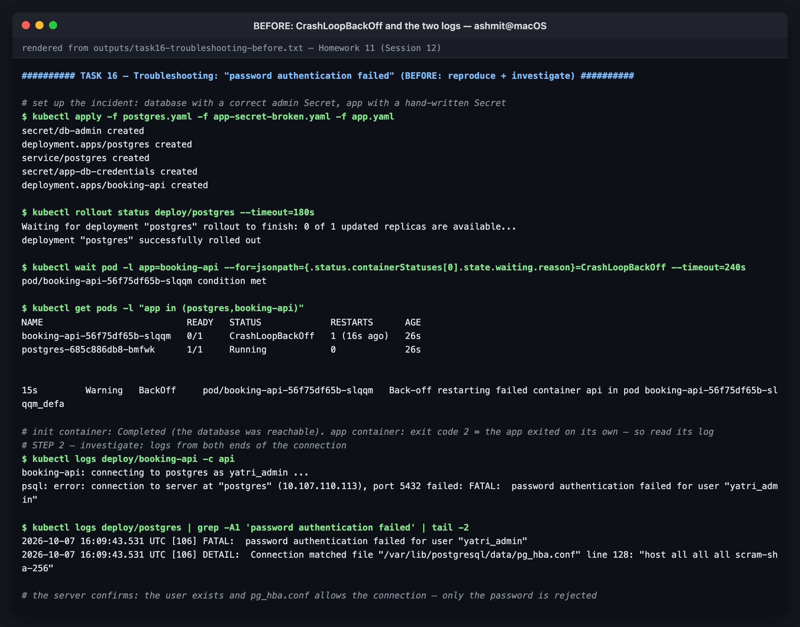
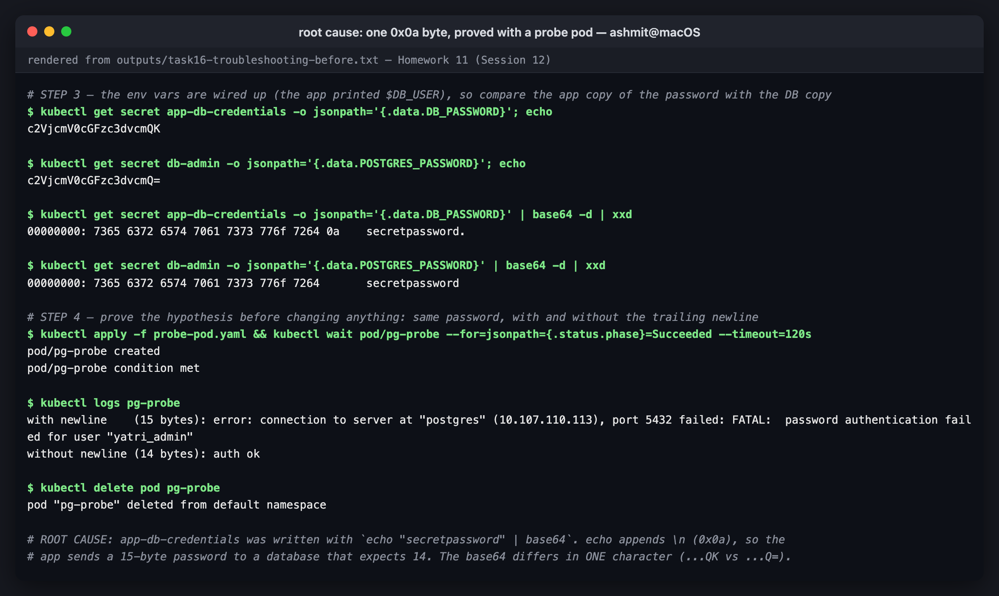
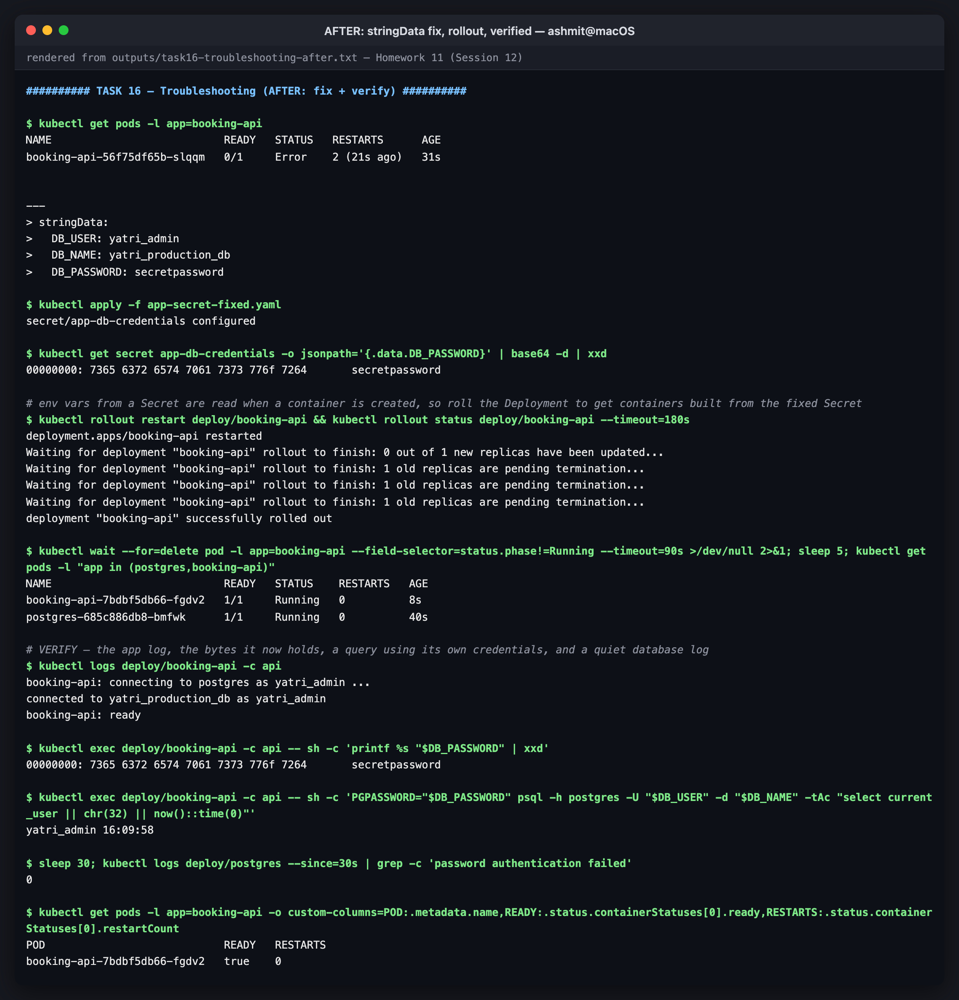

# Troubleshooting — "password authentication failed"

Session 12, **Task 5**. The course's `troubleshooting/` folder contains one incident,
[`secret-base64-gotcha.md`](https://github.com/Nency-Ravaliya/devops-heros/blob/main/session-12-ingress-configmaps-secrets/troubleshooting/secret-base64-gotcha.md):
a PostgreSQL client rejected with `FATAL: password authentication failed`, even though the
developer is sure the password is right.

The course file describes the bug. This folder **reproduces it end to end against a real
PostgreSQL server** and works it the way you would on call: identify, investigate, find the
root cause, prove it, fix, verify.

Transcripts, quoted verbatim below:
[`../outputs/task16-troubleshooting-before.txt`](../outputs/task16-troubleshooting-before.txt) ·
[`../outputs/task16-troubleshooting-after.txt`](../outputs/task16-troubleshooting-after.txt)

| File | Role |
|---|---|
| [`postgres.yaml`](postgres.yaml) | the database. Its admin Secret uses `stringData`, so it is correct |
| [`app-secret-broken.yaml`](app-secret-broken.yaml) | the app's credentials, base64 written by hand with `echo \| base64` |
| [`app.yaml`](app.yaml) | `booking-api`: connects on start and exits non-zero if it cannot, like a real app |
| [`probe-pod.yaml`](probe-pod.yaml) | one-shot diagnostic pod used to prove the hypothesis |
| [`app-secret-fixed.yaml`](app-secret-fixed.yaml) | the fix |

The setup mirrors how this happens in practice: the **DB team** and the **app team** each hold
their own copy of the same credential, in two different Secrets.

---

## Problem statement

After deploying `booking-api`, the pod never becomes Ready. The developer says the password in
the Secret is `secretpassword`, which is what the database was initialised with.

## Step 1 — Identify

```console
$ kubectl apply -f postgres.yaml -f app-secret-broken.yaml -f app.yaml
secret/db-admin created
deployment.apps/postgres created
service/postgres created
secret/app-db-credentials created
deployment.apps/booking-api created

$ kubectl wait pod -l app=booking-api --for=jsonpath={.status.containerStatuses[0].state.waiting.reason}=CrashLoopBackOff --timeout=240s
pod/booking-api-56f75df65b-slqqm condition met

$ kubectl get pods -l "app in (postgres,booking-api)"
NAME                           READY   STATUS             RESTARTS      AGE
booking-api-56f75df65b-slqqm   0/1     CrashLoopBackOff   1 (16s ago)   26s
postgres-685c886db8-bmfwk      1/1     Running            0             26s

$ kubectl get events --field-selector involvedObject.kind=Pod --sort-by=.lastTimestamp | grep booking-api | grep -E 'BackOff' | tail -1 | cut -c1-150
15s         Warning   BackOff     pod/booking-api-56f75df65b-slqqm   Back-off restarting failed container api in pod booking-api-56f75df65b-slqqm_defa
```

The database is healthy and the app is crash-looping. The app's `wait-for-db` init container
completed, which means Postgres was reachable before the app started. So this is **not** a
network or startup-ordering problem.

> The raw transcript also contains a `kubectl describe | sed` filter between these two
> commands that printed nothing because of a quoting slip in the filter. It is left in the
> transcript as it ran; the `get pods` and events above carry the same information.

## Step 2 — Investigate: read both ends of the connection

```console
$ kubectl logs deploy/booking-api -c api
booking-api: connecting to postgres as yatri_admin ...
psql: error: connection to server at "postgres" (10.107.110.113), port 5432 failed: FATAL:  password authentication failed for user "yatri_admin"

$ kubectl logs deploy/postgres | grep -A1 'password authentication failed' | tail -2
2026-10-07 16:09:43.531 UTC [106] FATAL:  password authentication failed for user "yatri_admin"
2026-10-07 16:09:43.531 UTC [106] DETAIL:  Connection matched file "/var/lib/postgresql/data/pg_hba.conf" line 128: "host all all all scram-sha-256"
```

The server-side log narrows it a lot:

| Hypothesis | Ruled out by |
|---|---|
| DNS / Service broken | the client reached `10.107.110.113:5432` |
| Wrong username | the app printed `yatri_admin`, the role that exists |
| `pg_hba.conf` rejecting the client | `Connection matched ... line 128` means the connection was **allowed** to try a password |
| Env vars not injected | the app printed `$DB_USER`, so `secretKeyRef` is wired up |
| **The password bytes** | **still open** |


*BEFORE: CrashLoopBackOff, and both logs*

## Step 3 — Compare the two copies of the credential

```console
$ kubectl get secret app-db-credentials -o jsonpath='{.data.DB_PASSWORD}'; echo
c2VjcmV0cGFzc3dvcmQK

$ kubectl get secret db-admin -o jsonpath='{.data.POSTGRES_PASSWORD}'; echo
c2VjcmV0cGFzc3dvcmQ=

$ kubectl get secret app-db-credentials -o jsonpath='{.data.DB_PASSWORD}' | base64 -d | xxd
00000000: 7365 6372 6574 7061 7373 776f 7264 0a    secretpassword.

$ kubectl get secret db-admin -o jsonpath='{.data.POSTGRES_PASSWORD}' | base64 -d | xxd
00000000: 7365 6372 6574 7061 7373 776f 7264       secretpassword
```

The base64 strings differ only in their **last character**, `K` versus `=`. Decoded and
hex-dumped, the app's copy has one extra byte: `0a`, a newline.

## Step 4 — Prove it before changing anything

A hypothesis is not a root cause until it is tested. [`probe-pod.yaml`](probe-pod.yaml) sends
the same password twice, with and without the trailing newline:

```console
$ kubectl apply -f probe-pod.yaml && kubectl wait pod/pg-probe --for=jsonpath={.status.phase}=Succeeded --timeout=120s
pod/pg-probe created
pod/pg-probe condition met

$ kubectl logs pg-probe
with newline    (15 bytes): error: connection to server at "postgres" (10.107.110.113), port 5432 failed: FATAL:  password authentication failed for user "yatri_admin"
without newline (14 bytes): auth ok
```

That settles it.

> **A trap I hit while building this probe:** my first version built the bad password with
> `PW="$(printf 'secretpassword\n')"`, and it **authenticated successfully**. Command
> substitution `$(...)` strips trailing newlines, so the "broken" password was not broken.
> This is the same reason `--from-literal="$(echo ...)"` does not reproduce the bug
> ([Task 4](../README.md#task-4--the-trailing-newline-bug)). The probe keeps the newline by
> appending a sentinel character and then removing it.


*root cause: one 0x0a byte, proved with a probe pod*

## Root cause

`app-db-credentials` was written by hand with

```bash
echo "secretpassword" | base64      # → c2VjcmV0cGFzc3dvcmQK
```

`echo` appends `\n`. The app therefore sends the 15-byte password `secretpassword\n` to a
database that expects the 14-byte `secretpassword`. Every tool that displays the value
(`describe`, `printenv`, the app's own logs) renders that byte invisibly, and the only visible
difference in the YAML is one character at the end of a base64 string, which is why it passes
code review.

## Fix

Stop hand-encoding. With `stringData:`, Kubernetes does the base64 encoding itself:

```console
$ diff app-secret-broken.yaml app-secret-fixed.yaml
1,3c1
< # The application's copy of the credentials, written by hand by a developer:
< #   echo "secretpassword" | base64      ->  c2VjcmV0cGFzc3dvcmQK
< # The value LOOKS right. It decodes to "secretpassword\n".
---
> # Fixed: stringData — Kubernetes does the encoding, so there is no echo, no base64 and no newline.
9,12c7,10
< data:
<   DB_USER: eWF0cmlfYWRtaW4=          # yatri_admin
<   DB_NAME: eWF0cmlfcHJvZHVjdGlvbl9kYg==  # yatri_production_db
<   DB_PASSWORD: c2VjcmV0cGFzc3dvcmQK  # BUG: trailing \n
---
> stringData:
>   DB_USER: yatri_admin
>   DB_NAME: yatri_production_db
>   DB_PASSWORD: secretpassword

$ kubectl apply -f app-secret-fixed.yaml
secret/app-db-credentials configured

$ kubectl get secret app-db-credentials -o jsonpath='{.data.DB_PASSWORD}' | base64 -d | xxd
00000000: 7365 6372 6574 7061 7373 776f 7264       secretpassword
```

Fixing the Secret is **not enough by itself**. Environment variables are copied into a
container when it is created; a Secret update never reaches a running container's env (the same
behaviour shown for ConfigMaps in [Task 2](../README.md#task-2--patching-a-live-configmap-does-not-touch-running-pods)).
So roll the Deployment:

```console
$ kubectl rollout restart deploy/booking-api && kubectl rollout status deploy/booking-api --timeout=180s
deployment.apps/booking-api restarted
Waiting for deployment "booking-api" rollout to finish: 0 out of 1 new replicas have been updated...
Waiting for deployment "booking-api" rollout to finish: 1 old replicas are pending termination...
Waiting for deployment "booking-api" rollout to finish: 1 old replicas are pending termination...
Waiting for deployment "booking-api" rollout to finish: 1 old replicas are pending termination...
deployment "booking-api" successfully rolled out
```

## Verify

```console
$ kubectl get pods -l "app in (postgres,booking-api)"
NAME                           READY   STATUS    RESTARTS   AGE
booking-api-7bdbf5db66-fgdv2   1/1     Running   0          8s
postgres-685c886db8-bmfwk      1/1     Running   0          40s

$ kubectl logs deploy/booking-api -c api
booking-api: connecting to postgres as yatri_admin ...
connected to yatri_production_db as yatri_admin
booking-api: ready

$ kubectl exec deploy/booking-api -c api -- sh -c 'printf %s "$DB_PASSWORD" | xxd'
00000000: 7365 6372 6574 7061 7373 776f 7264       secretpassword

$ kubectl exec deploy/booking-api -c api -- sh -c 'PGPASSWORD="$DB_PASSWORD" psql -h postgres -U "$DB_USER" -d "$DB_NAME" -tAc "select current_user || chr(32) || now()::time(0)"'
yatri_admin 16:09:58

$ sleep 30; kubectl logs deploy/postgres --since=30s | grep -c 'password authentication failed'
0

$ kubectl get pods -l app=booking-api -o custom-columns=POD:.metadata.name,READY:.status.containerStatuses[0].ready,RESTARTS:.status.containerStatuses[0].restartCount
POD                            READY   RESTARTS
booking-api-7bdbf5db66-fgdv2   true    0
```

The checks cover five separate things: the app logs a successful connection, the variable now
holds exactly 14 bytes with no `0a`, a query made with the app's own credentials succeeds, the
database has logged no further auth failures, and the new pod has zero restarts.


*AFTER: stringData fix, rollout, verified*

---

## Before / after

| | Before | After |
|---|---|---|
| `booking-api` status | `CrashLoopBackOff` | `Running`, `1/1`, 0 restarts |
| App log | `FATAL: password authentication failed` | `connected to yatri_production_db as yatri_admin` |
| `DB_PASSWORD` bytes | `... 7264 0a` (15) | `... 7264` (14) |
| Secret base64 | `c2VjcmV0cGFzc3dvcmQK` | `c2VjcmV0cGFzc3dvcmQ=` |
| Postgres auth failures | one per restart | 0 in 30 s |

## Prevention

- Use `stringData:` in manifests, or `kubectl create secret --from-literal`. Never hand-encode.
- If you must encode by hand, use `printf '%s' "$pw" | base64`, or `echo -n`.
- `--from-file` reads files byte for byte, so create them with `printf`, not `echo`.
- A CI check that decodes every `data:` value in Secret manifests and fails on a trailing
  `0a` costs about one line of `yq` and would catch this class of bug for good.
- Keep one source of truth for each credential (External Secrets / Sealed Secrets, see
  [Task 5](../README.md#task-5--what-this-cluster-has-and-what-production-adds)), so two teams are
  not maintaining two copies that can drift.

## Reproducing this

```bash
cd 11-ingress-configmaps-secrets/troubleshooting
kubectl apply -f postgres.yaml -f app-secret-broken.yaml -f app.yaml
kubectl get pods -w                               # booking-api → CrashLoopBackOff
kubectl logs deploy/booking-api -c api
kubectl apply -f probe-pod.yaml && kubectl logs pg-probe
kubectl apply -f app-secret-fixed.yaml && kubectl rollout restart deploy/booking-api
kubectl delete -f app.yaml -f app-secret-fixed.yaml -f postgres.yaml -f probe-pod.yaml
```
