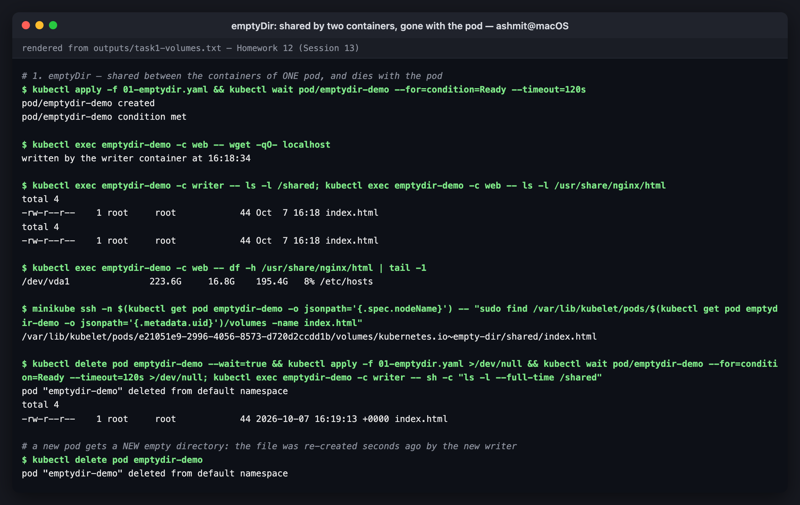
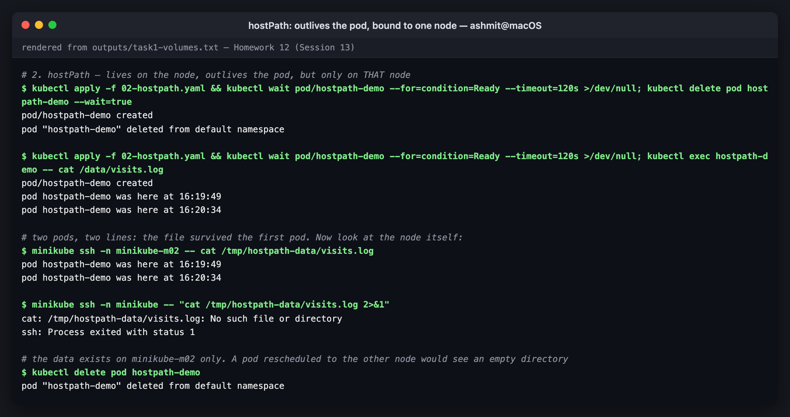
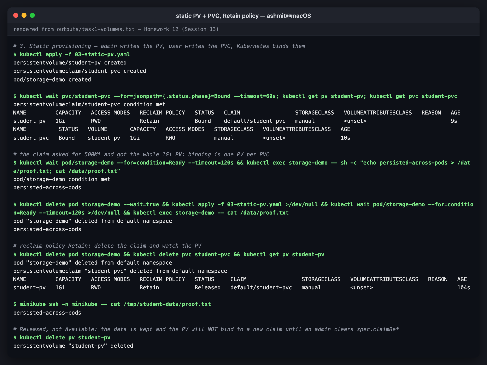

# Kubernetes Volumes

Session 13, **Task 1**. What I learned about `emptyDir`, `hostPath`, PersistentVolumes,
PersistentVolumeClaims, StorageClasses and dynamic provisioning, with **every example run on
the two-node Minikube cluster**. All output blocks are extracted verbatim from
[`../outputs/task1-volumes.txt`](../outputs/task1-volumes.txt); the manifests are in
[`manifests/`](manifests).

---

## Why volumes exist at all

A container's filesystem is a writable layer on top of its image, and it is thrown away
whenever the container is replaced. A restart after a crash, a liveness kill, or a rollout
all start from a clean image. Volumes are how data outlives a container. What separates the
volume types is **how long the data lives, and where**:

```
                  lifetime of the data
  container  <   pod   <   node   <   cluster / cloud
                  │          │              │
               emptyDir   hostPath    PersistentVolume
                                      (via PVC + StorageClass)
```

| Type | Data survives… | Shared between | Tied to | Typical use |
|---|---|---|---|---|
| container layer | nothing (lost on restart) | — | the container | nothing you care about |
| `emptyDir` | container restarts, **not** pod deletion | containers in **one** pod | the pod | scratch space, sidecar hand-off, caches |
| `hostPath` | pod deletion | pods on the **same node** | one node | node agents (log shippers, CNI), single-node labs |
| PV / PVC | pod deletion, rescheduling | depends on access mode | the storage backend | databases, uploads, anything stateful |

---

## 1. `emptyDir`

Created empty when the pod is scheduled, mounted into any of the pod's containers, and
**deleted when the pod is deleted**. [`01-emptydir.yaml`](manifests/01-emptydir.yaml) runs
a `writer` container that writes a page and an nginx `web` container that serves it. They
have nothing in common except the volume:

```console
$ kubectl exec emptydir-demo -c web -- wget -qO- localhost
written by the writer container at 16:18:34

$ kubectl exec emptydir-demo -c writer -- ls -l /shared; kubectl exec emptydir-demo -c web -- ls -l /usr/share/nginx/html
total 4
-rw-r--r--    1 root     root            44 Oct  7 16:18 index.html
total 4
-rw-r--r--    1 root     root            44 Oct  7 16:18 index.html
```

The same file appears at two different mount paths in two containers. Where it actually
lives is a directory the kubelet creates under the pod's UID on the node:

```console
$ minikube ssh -n $(kubectl get pod emptydir-demo -o jsonpath='{.spec.nodeName}') -- "sudo find /var/lib/kubelet/pods/$(kubectl get pod emptydir-demo -o jsonpath='{.metadata.uid}')/volumes -name index.html"
/var/lib/kubelet/pods/e21051e9-2996-4056-8573-d720d2ccdd1b/volumes/kubernetes.io~empty-dir/shared/index.html
```

Because the path contains the **pod UID**, a new pod can never see it. After delete and
re-create, the file has a fresh timestamp written by the new writer:

```console
$ kubectl delete pod emptydir-demo --wait=true && kubectl apply -f 01-emptydir.yaml >/dev/null && kubectl wait pod/emptydir-demo --for=condition=Ready --timeout=120s >/dev/null; kubectl exec emptydir-demo -c writer -- sh -c "ls -l --full-time /shared"
pod "emptydir-demo" deleted from default namespace
total 4
-rw-r--r--    1 root     root            44 2026-10-07 16:19:13 +0000 index.html
```

Good to know:
- `emptyDir.medium: Memory` puts it on tmpfs (RAM), which is fast but **counts against the
  container's memory limit**.
- `sizeLimit` (50Mi here) gets the pod evicted if exceeded, so one runaway log cannot fill the
  node's disk.


*emptyDir: shared by two containers, gone with the pod*

## 2. `hostPath`

Mounts a directory from the **node's** filesystem. [`02-hostpath.yaml`](manifests/02-hostpath.yaml)
appends a line to `/data/visits.log` on start and is pinned to the worker node `minikube-m02`.
Running it twice gives two lines, so the data outlived the first pod:

```console
$ kubectl apply -f 02-hostpath.yaml && kubectl wait pod/hostpath-demo --for=condition=Ready --timeout=120s >/dev/null; kubectl exec hostpath-demo -- cat /data/visits.log
pod/hostpath-demo created
pod hostpath-demo was here at 16:19:49
pod hostpath-demo was here at 16:20:34
```

The two-node cluster then shows the catch:

```console
$ minikube ssh -n minikube-m02 -- cat /tmp/hostpath-data/visits.log
pod hostpath-demo was here at 16:19:49
pod hostpath-demo was here at 16:20:34

$ minikube ssh -n minikube -- "cat /tmp/hostpath-data/visits.log 2>&1"
cat: /tmp/hostpath-data/visits.log: No such file or directory
ssh: Process exited with status 1
```

The data exists **only on `minikube-m02`**. If the scheduler had put the pod on `minikube`, it
would have found an empty directory with no error and no warning. On a single-node cluster this
problem is invisible, which is why hostPath looks like persistence in most tutorials.

Why it is restricted in production:
- **Node coupling.** Data does not follow the pod.
- **Security.** A pod with `hostPath: /` (or `/var/run/docker.sock`, or `/etc`) can take over
  the node. The `baseline` and `restricted` Pod Security Standards forbid hostPath entirely.
- **Legitimate users are node agents**: Fluent Bit reading `/var/log`, CNI plugins, CSI node
  drivers. They run as DaemonSets precisely *because* they are node-local.


*hostPath: outlives the pod, bound to one node*

## 3. PersistentVolume and PersistentVolumeClaim (static provisioning)

The PV/PVC split separates **who provides storage** from **who uses it**:

| | PersistentVolume (PV) | PersistentVolumeClaim (PVC) |
|---|---|---|
| Is | a piece of storage that exists in the cluster | a **request** for storage |
| Scope | cluster-wide (not namespaced) | namespaced |
| Written by | the cluster admin (or a provisioner) | the application developer |
| Says | "here are 1Gi of RWO disk at this backend" | "I need 500Mi, RWO, from class X" |
| Analogy | a parking space | a parking ticket |

The pod only ever names the **claim**, and never the disk. That is what makes the same
Deployment portable between Minikube, EKS and GKE.

[`03-static-pv.yaml`](manifests/03-static-pv.yaml) is the admin-made PV, a claim, and a pod:

```console
$ kubectl wait pvc/student-pvc --for=jsonpath={.status.phase}=Bound --timeout=60s; kubectl get pv student-pv; kubectl get pvc student-pvc
persistentvolumeclaim/student-pvc condition met
NAME         CAPACITY   ACCESS MODES   RECLAIM POLICY   STATUS   CLAIM                 STORAGECLASS   VOLUMEATTRIBUTESCLASS   REASON   AGE
student-pv   1Gi        RWO            Retain           Bound    default/student-pvc   manual         <unset>                          9s
NAME          STATUS   VOLUME       CAPACITY   ACCESS MODES   STORAGECLASS   VOLUMEATTRIBUTESCLASS   AGE
student-pvc   Bound    student-pv   1Gi        RWO            manual         <unset>                 10s
```

The claim asked for **500Mi** and shows **1Gi**. Binding is one-to-one: a claim gets a whole PV
that is at least as big as requested, and the surplus is not shared with anyone.

> I set `storageClassName: manual` on both. The course's `pv.yaml` / `pvc.yaml` leave it out,
> and on a cluster with a **default** StorageClass, a PVC without a class gets the default one
> injected. The dynamic provisioner then creates a brand-new PV for it and the hand-made PV
> sits unused. Giving both the same non-default class (plus a label selector) makes the static
> binding deterministic.

Data survives deleting the pod:

```console
$ kubectl wait pod/storage-demo --for=condition=Ready --timeout=120s && kubectl exec storage-demo -- sh -c "echo persisted-across-pods > /data/proof.txt; cat /data/proof.txt"
pod/storage-demo condition met
persisted-across-pods

$ kubectl delete pod storage-demo --wait=true && kubectl apply -f 03-static-pv.yaml >/dev/null && kubectl wait pod/storage-demo --for=condition=Ready --timeout=120s >/dev/null && kubectl exec storage-demo -- cat /data/proof.txt
pod "storage-demo" deleted from default namespace
persisted-across-pods
```

### Reclaim policy: what happens when the claim is deleted

```console
$ kubectl delete pod storage-demo && kubectl delete pvc student-pvc && kubectl get pv student-pv
pod "storage-demo" deleted from default namespace
persistentvolumeclaim "student-pvc" deleted from default namespace
NAME         CAPACITY   ACCESS MODES   RECLAIM POLICY   STATUS     CLAIM                 STORAGECLASS   VOLUMEATTRIBUTESCLASS   REASON   AGE
student-pv   1Gi        RWO            Retain           Released   default/student-pvc   manual         <unset>                          104s

$ minikube ssh -n minikube -- cat /tmp/student-data/proof.txt
persisted-across-pods
```

| Policy | When the PVC is deleted | Use for |
|---|---|---|
| `Retain` | PV goes **Released**, data kept, PV **not** reusable until an admin clears `spec.claimRef` or deletes it | anything you cannot afford to lose |
| `Delete` | PV **and** the backing disk are deleted | scratch / easily re-created data. It is the default for dynamic classes, which surprises people |
| `Recycle` | deprecated (`rm -rf` then reuse) | nothing; do not use |

`Released` is not `Available`. It is a deliberate safety stop: Kubernetes will not hand the
previous tenant's data to a new claim.

### Access modes

| Mode | Short | Meaning |
|---|---|---|
| ReadWriteOnce | RWO | read-write by pods on **one node** (several pods on that node can share it) |
| ReadOnlyMany | ROX | read-only by many nodes |
| ReadWriteMany | RWX | read-write by many nodes. Needs NFS, CephFS, EFS, Azure Files… not block disks |
| ReadWriteOncePod | RWOP | read-write by exactly **one pod** cluster-wide |

The access mode is something you request, and the backend has to support it. A cloud block
disk (EBS, PD) is RWO by nature. Asking for RWX from an EBS class leaves the PVC `Pending`.


*static PV + PVC, Retain policy*

## 4. StorageClass

A StorageClass describes **how to make** a PV: which provisioner, with which parameters, and
with which reclaim and binding rules.

```console
$ kubectl get storageclass
NAME                 PROVISIONER                RECLAIMPOLICY   VOLUMEBINDINGMODE   ALLOWVOLUMEEXPANSION   AGE
standard (default)   k8s.io/minikube-hostpath   Delete          Immediate           false                  19d
```

| Field | Here | What it controls |
|---|---|---|
| `provisioner` | `k8s.io/minikube-hostpath` | the driver that creates the volume. On EKS it is `ebs.csi.aws.com`, on GKE `pd.csi.storage.gke.io` |
| `reclaimPolicy` | `Delete` | applied to every PV this class creates |
| `volumeBindingMode` | `Immediate` | create the volume as soon as the PVC appears… |
| `allowVolumeExpansion` | `false` | whether a PVC can later be resized |
| `(default)` annotation | `is-default-class: "true"` | PVCs without a `storageClassName` get this one |

`volumeBindingMode: WaitForFirstConsumer` is the one to use on a multi-zone cloud. It delays
creating the disk until a pod is scheduled, so the disk is created **in that pod's zone**.
With `Immediate`, an EBS volume can be created in `us-east-1a` for a pod that then gets
scheduled to `us-east-1b`, and the pod can never start.

A cloud example (EKS, gp3, encrypted, expandable):

```yaml
apiVersion: storage.k8s.io/v1
kind: StorageClass
metadata:
  name: gp3-encrypted
provisioner: ebs.csi.aws.com
parameters:
  type: gp3
  encrypted: "true"
reclaimPolicy: Retain
volumeBindingMode: WaitForFirstConsumer
allowVolumeExpansion: true
```

## 5. Dynamic provisioning

No PV is written by anyone. The claim names a class, and the class's provisioner creates the
PV to fit:

```console
$ kubectl get pv
No resources found

$ kubectl apply -f 04-dynamic-pvc.yaml
persistentvolumeclaim/dynamic-pvc created
pod/dynamic-demo created

$ kubectl wait pvc/dynamic-pvc --for=jsonpath={.status.phase}=Bound --timeout=60s; kubectl get pvc dynamic-pvc; kubectl get pv
persistentvolumeclaim/dynamic-pvc condition met
NAME          STATUS   VOLUME                                     CAPACITY   ACCESS MODES   STORAGECLASS   VOLUMEATTRIBUTESCLASS   AGE
dynamic-pvc   Bound    pvc-ead740c2-29c7-4645-aa66-3692eba1fea3   500Mi      RWO            standard       <unset>                 1s
NAME                                       CAPACITY   ACCESS MODES   RECLAIM POLICY   STATUS   CLAIM                 STORAGECLASS   VOLUMEATTRIBUTESCLASS   REASON   AGE
pvc-ead740c2-29c7-4645-aa66-3692eba1fea3   500Mi      RWO            Delete           Bound    default/dynamic-pvc   standard       <unset>                          1s
```

Compare this with section 3:
- The PV appeared within one second, named `pvc-<uid>`.
- It is sized **exactly** 500Mi, not "the closest PV someone happened to create".
- It inherited `Delete` from the class.

Under the hood, on Minikube:

```console
$ kubectl get pv $(kubectl get pvc dynamic-pvc -o jsonpath='{.spec.volumeName}') -o jsonpath='{.spec.hostPath.path}{"\n"}{.metadata.annotations.pv\.kubernetes\.io/provisioned-by}{"\n"}'
/tmp/hostpath-provisioner/default/dynamic-pvc
k8s.io/minikube-hostpath
```

Minikube's "dynamic provisioner" just makes a **hostPath** directory, so every caveat from
section 2 still applies. The PV also has no node affinity. On a two-node cluster that makes
"persistent" data node-local without saying so, and it breaks the Session 13 mini-project, as
shown in [`../mini-project`](../mini-project).

And `Delete` in action:

```console
$ kubectl delete pod dynamic-demo && kubectl delete pvc dynamic-pvc && sleep 5 && kubectl get pv
pod "dynamic-demo" deleted from default namespace
persistentvolumeclaim "dynamic-pvc" deleted from default namespace
No resources found
```

The full flow:

```
 developer                    Kubernetes                         storage backend
 ─────────                    ──────────                         ───────────────
 PVC (class: standard) ──►  PV controller sees unbound PVC
                            └─► provisioner for "standard" ──►  create disk/dir
                                ◄── PV object created ◄──────────────┘
                            PV ⇄ PVC bound
 Pod (claimName) ────────►  kubelet attaches + mounts ─────────►  volume in the container
 delete PVC ─────────────►  reclaimPolicy: Delete ────────────►  disk deleted
```


*StorageClass and dynamic provisioning*

---

## Static vs dynamic, summarised

| | Static | Dynamic |
|---|---|---|
| Who creates the PV | an admin, in advance | the provisioner, on demand |
| PV size | whatever the admin chose | exactly what was requested |
| Scales to many teams | no, because someone has to keep pre-creating PVs | yes |
| When it is still used | pre-existing data (an NFS export, a restored snapshot), on-prem without CSI | almost everything else |

## Reproducing this

```bash
cd 12-storage-hpa-probes/01-kubernetes-volumes/manifests
kubectl apply -f 01-emptydir.yaml      # then exec into both containers
kubectl apply -f 02-hostpath.yaml      # minikube ssh -n minikube-m02 -- cat /tmp/hostpath-data/visits.log
kubectl apply -f 03-static-pv.yaml     # kubectl get pv,pvc ; delete the PVC and watch "Released"
kubectl apply -f 04-dynamic-pvc.yaml   # kubectl get pv appears on its own
kubectl delete -f . --ignore-not-found
```
