# Homework 12 — Kubernetes Storage, HPA & Probes

Course session: **`session-13-storage-hpa-probes`**.

Three tasks:
- volumes, from `emptyDir` to dynamic provisioning
- the Horizontal Pod Autoscaler under real load, using the course `hpa.yaml`
- the Session 13 mini-project, which combines a PVC, an HPA and all three probes

**All output blocks are extracted verbatim** from the transcripts in [`outputs/`](outputs).
Cluster: the two-node Minikube from [Homework 8](../08-k8s-fundamentals).

The screenshots are **renders of those transcripts**, not captures of a live terminal — every lab ran non-interactively, so there was no window to photograph. Each image names its source transcript in the title bar; see [`screenshots/`](screenshots).

Things found by running it rather than reading it:

- **The mini-project's "persistent" storage does not persist across nodes.** The course
  Deployment runs 2–5 replicas against one `ReadWriteOnce` PVC. On a two-node cluster the
  replicas land on both nodes, and Minikube's provisioner makes a plain `hostPath` PV with no
  node affinity. The pods on the second node get a **different, empty directory**. See
  [Task 3](#task-3--mini-project-production-ready-web-app).
- **The HPA lab took the control plane down the first time.** An unthrottled load
  generator starved the API server. That led to the cluster's real root cause, nodes capped
  at 2 CPUs while advertising 8, which is written up as a troubleshooting case in
  [Homework 13](../13-k8s-troubleshooting#task-4--a-real-incident-control-plane-starved-on-this-cluster).
- The course's PV/PVC pair binds to the **wrong volume** on a cluster with a default
  StorageClass. See the note in [Task 1](01-kubernetes-volumes#3-persistentvolume-and-persistentvolumeclaim-static-provisioning).

| Brief | Where |
|---|---|
| Task 1 — volume documentation | **[`01-kubernetes-volumes/README.md`](01-kubernetes-volumes)** |
| Task 2 — HPA YAML, load generator, HPA output, screenshots | [Task 2](#task-2--hpa-hands-on) · [`02-hpa/`](02-hpa) |
| Task 3 — mini-project implementation | [Task 3](#task-3--mini-project-production-ready-web-app) · [`mini-project/`](mini-project) |

---

# Task 1 — Kubernetes volumes

The full write-up is **[`01-kubernetes-volumes/README.md`](01-kubernetes-volumes)**. It covers
`emptyDir`, `hostPath`, PV, PVC, StorageClass and dynamic provisioning, each run on the
cluster:

| Type | What the lab proved |
|---|---|
| `emptyDir` | the same file seen by two containers at two mount paths; it lives under the **pod UID** on the node, so a new pod gets a new, empty one |
| `hostPath` | survived a pod restart, but the file exists **only on `minikube-m02`**; `minikube` has no such file |
| static PV + PVC | 500Mi claim bound to the whole 1Gi PV; `Retain` left the PV `Released` with the data still on disk |
| StorageClass | `standard (default)`, provisioner `k8s.io/minikube-hostpath`, `Delete`, `Immediate` |
| dynamic provisioning | a PVC alone produced a PV in under a second, sized exactly 500Mi; deleting the PVC deleted the PV |

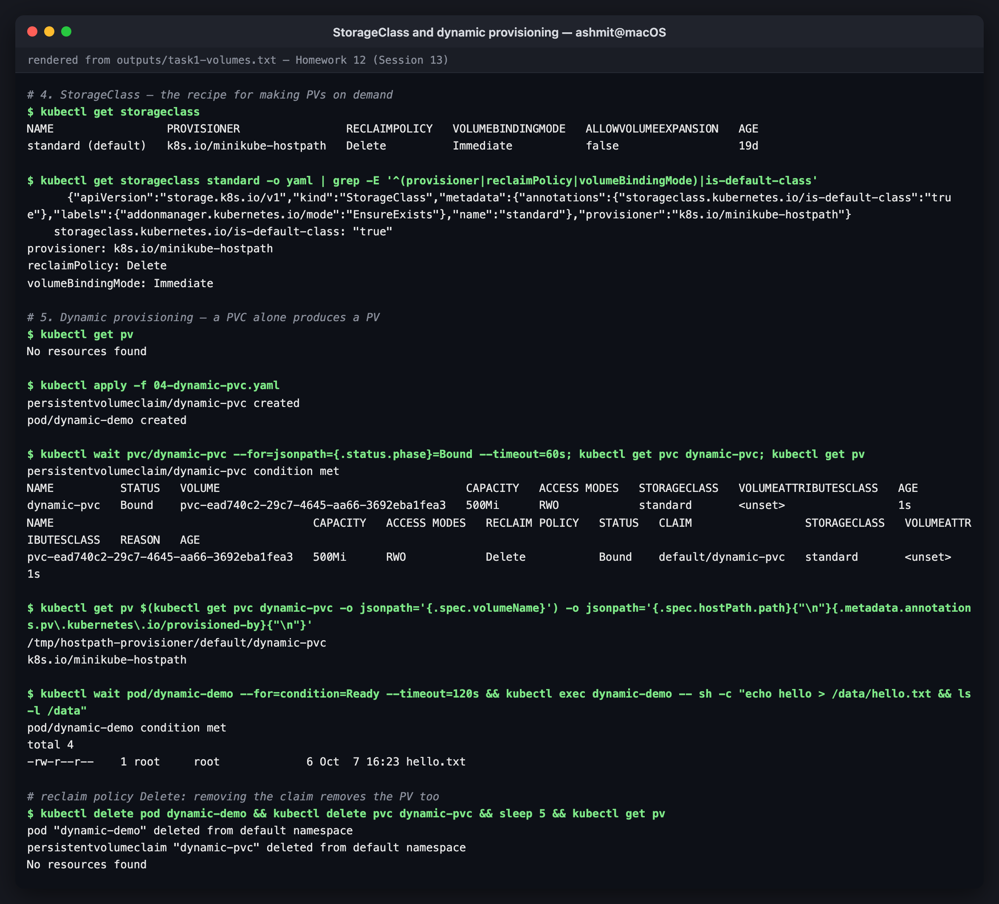
*StorageClass and dynamic provisioning*

---

# Task 2 — HPA hands-on

Files in [`02-hpa/`](02-hpa):
- `deployment.yaml`, `service.yaml` and `hpa.yaml`: the course files, unchanged
- `load-generator.yaml`: the load generator, written here
- `sample.sh`: a 15-second sampler of `kubectl get hpa` and `kubectl top pods`

Transcripts:
- [`outputs/task2-hpa.txt`](outputs/task2-hpa.txt): the steps
- [`outputs/task2-hpa-timeline.txt`](outputs/task2-hpa-timeline.txt): the sampler's timeline

## How the HPA decides

```
desiredReplicas = ceil( currentReplicas × currentUtilisation / targetUtilisation )
```

- Utilisation is a **percentage of the CPU request**, not of the limit or the node. The course
  Deployment requests `100m`, so "50%" means 50 millicores per pod on average. A pod
  **without** a CPU request can never be autoscaled on CPU: the HPA shows `<unknown>`.
- The HPA ignores changes within a **10% tolerance** of the target (ratio 0.9–1.1).
- **Scale-up** is immediate. **Scale-down** waits for a **300-second stabilisation window**
  and uses the highest recommendation seen in it, to avoid flapping.
- Metrics come from **metrics-server** (`minikube addons enable metrics-server`), the same
  source as `kubectl top`.

## Step 1 — Deploy the application

```console
$ kubectl apply -f deployment.yaml -f service.yaml
deployment.apps/hpa-demo created
service/hpa-demo-service created

$ kubectl get deploy hpa-demo -o jsonpath='{.spec.template.spec.containers[0].resources}{"\n"}'
{"limits":{"cpu":"200m"},"requests":{"cpu":"100m"}}
```

## Step 2 — Configure the HPA

The course `hpa.yaml` (`autoscaling/v2`): target the Deployment, 1–5 replicas, 50% average CPU.

```console
$ kubectl apply -f hpa.yaml
horizontalpodautoscaler.autoscaling/hpa-demo created
```

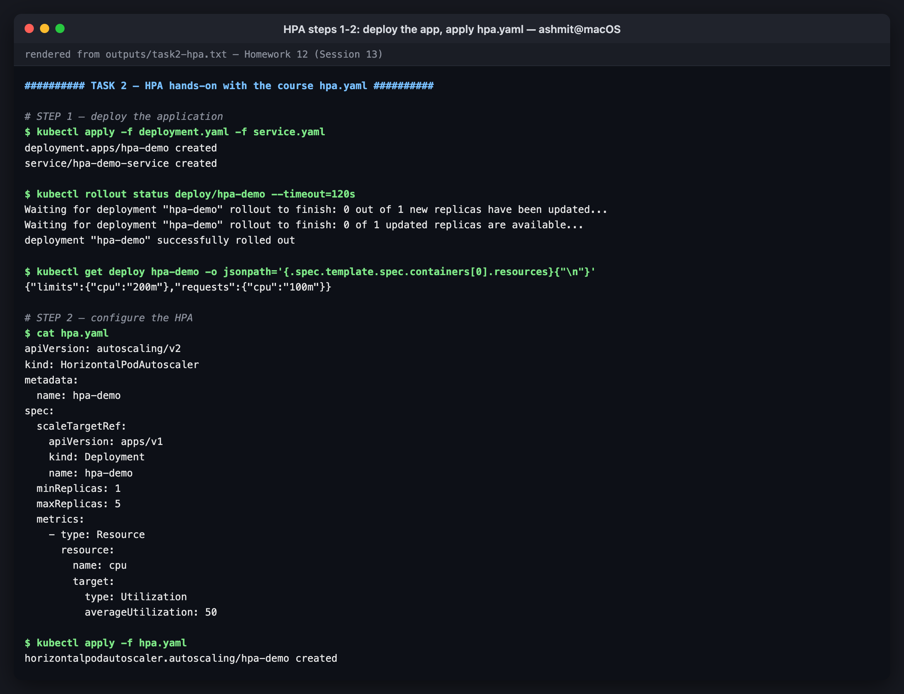
*steps 1-2: deploy and configure*

## Step 3 — Verify the HPA

```console
$ kubectl get apiservice v1beta1.metrics.k8s.io
NAME                     SERVICE                      AVAILABLE   AGE
v1beta1.metrics.k8s.io   kube-system/metrics-server   True        37m

$ kubectl get hpa hpa-demo
NAME       REFERENCE             TARGETS              MINPODS   MAXPODS   REPLICAS   AGE
hpa-demo   Deployment/hpa-demo   cpu: <unknown>/50%   1         5         1          0s

$ kubectl get hpa hpa-demo
NAME       REFERENCE             TARGETS       MINPODS   MAXPODS   REPLICAS   AGE
hpa-demo   Deployment/hpa-demo   cpu: 0%/50%   1         5         1          101s

$ kubectl top pods -l app=hpa-demo
NAME                        CPU(cores)   MEMORY(bytes)   
hpa-demo-5d6676989b-r2z9v   0m           7Mi             
```

`<unknown>` for the first minute or two is normal. `kubectl describe hpa` explains it in
its own events:

```console
  Warning  FailedGetResourceMetric       69s (x3 over 101s)  horizontal-pod-autoscaler  failed to get cpu utilization: unable to get metrics for resource cpu: n
  Warning  FailedGetResourceMetric       18s                 horizontal-pod-autoscaler  failed to get cpu utilization: did not receive metrics for targeted pods
```

metrics-server only reports a pod after it has scraped it at least twice, because it needs
two samples to compute a rate. If `<unknown>` persists, either metrics-server is down or the
container has no CPU request.

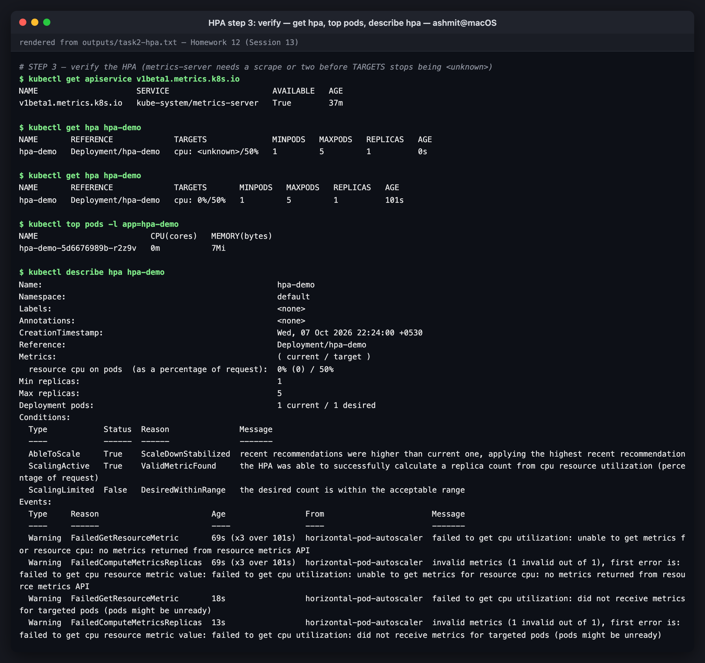
*step 3: verify — get hpa, top pods, describe hpa*

## Steps 4–7 — Load generator, increase load, observe CPU and scaling

[`load-generator.yaml`](02-hpa/load-generator.yaml) is a Deployment of busybox `wget` loops
against the Service. It is a Deployment rather than a bare pod, so the load can be raised in
steps with `kubectl scale`. It started with 2 workers and went up to 6 at 22:28:17.

From the sampler, one line per 15 s (HPA line, then each pod's CPU):

```
===== 22:25:47 load generator: 2 workers
hpa-demo   Deployment/hpa-demo   cpu: 0%/50%   1     5     1     107s
hpa-demo   Deployment/hpa-demo   cpu: 18%/50%   1     5     1     2m52s
hpa-demo   Deployment/hpa-demo   cpu: 30%/50%   1     5     1     3m44s
===== 22:28:17 STEP 5 — increase load: load generator scaled to 6 workers
hpa-demo   Deployment/hpa-demo   cpu: 32%/50%   1     5     1     4m31s
hpa-demo   Deployment/hpa-demo   cpu: 69%/50%   1     5     1     5m47s
hpa-demo   Deployment/hpa-demo   cpu: 69%/50%   1     5     2     6m16s
hpa-demo   Deployment/hpa-demo   cpu: 44%/50%   1     5     2     6m31s
hpa-demo-5d6676989b-9j6dd   83m   11Mi   
hpa-demo-5d6676989b-r2z9v   44m   7Mi    
```

*(an excerpt; the full timeline is in the transcript and the screenshot below)*

Reading it against the formula:

| Moment | Utilisation | Calculation | Result |
|---|---|---|---|
| 2 workers | 30% | ceil(1 × 30/50) = 1 | stays at 1 |
| 6 workers | **69%** | ceil(1 × 69/50) = **2** | **scales to 2** |
| after scale-out | 44%, then 53% | ceil(2 × 0.53) = 2, and 53/50 = 1.06 is inside the 10% tolerance | stays at 2 |

```console
$ kubectl get hpa hpa-demo
NAME       REFERENCE             TARGETS        MINPODS   MAXPODS   REPLICAS   AGE
hpa-demo   Deployment/hpa-demo   cpu: 52%/50%   1         5         2          8m51s

$ kubectl top pods -l app=hpa-demo
NAME                        CPU(cores)   MEMORY(bytes)   
hpa-demo-5d6676989b-9j6dd   55m          7Mi             
hpa-demo-5d6676989b-r2z9v   50m          7Mi             

$ kubectl get pods -l app=hpa-demo -o wide
NAME                        READY   STATUS    RESTARTS   AGE     IP             NODE           NOMINATED NODE   READINESS GATES
hpa-demo-5d6676989b-9j6dd   1/1     Running   0          3m17s   10.244.0.45    minikube       <none>           <none>
hpa-demo-5d6676989b-r2z9v   1/1     Running   0          8m58s   10.244.1.111   minikube-m02   <none>           <none>
```

Two pods on two nodes sharing the load evenly (55m and 50m), with the average just over the
50m target. `kubectl describe hpa` gives the HPA's own reasoning:

```console
Conditions:
  Type            Status  Reason              Message
  ----            ------  ------              -------
  AbleToScale     True    ReadyForNewScale    recommended size matches current size
  ScalingActive   True    ValidMetricFound    the HPA was able to successfully calculate a replica count from cpu resource utilization (percentage of request)
  ScalingLimited  False   DesiredWithinRange  the desired count is within the acceptable range
```

It reached 2 replicas, not 5, and that is correct behaviour. Six workers, each capped at 150m
CPU (see below), generated about 105m of nginx work in total (55m + 50m). Two pods absorb
that at about 50% each. More load would have produced more replicas; the formula, not the
maximum, decides.

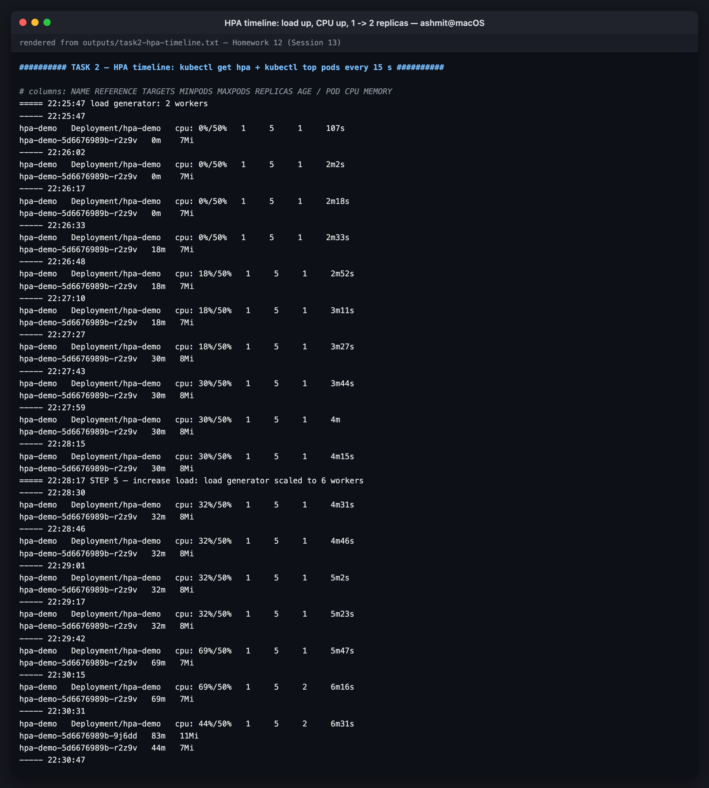
*HPA timeline: load up, CPU up, 1 -> 2 replicas*

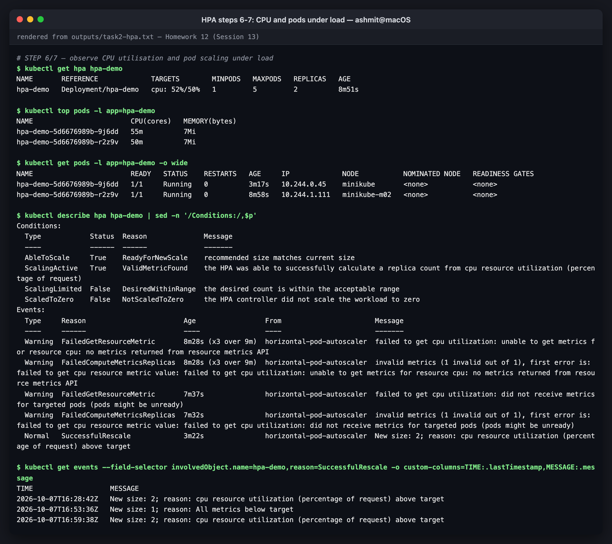
*steps 6-7: CPU and pods under load*

## Step 8 — Remove the load, watch it scale down

```console
$ kubectl delete deploy/load-generator
deployment.apps "load-generator" deleted from default namespace

$ kubectl get hpa hpa-demo
NAME       REFERENCE             TARGETS       MINPODS   MAXPODS   REPLICAS   AGE
hpa-demo   Deployment/hpa-demo   cpu: 0%/50%   1         5         1          21m

$ kubectl get events --field-selector involvedObject.name=hpa-demo,reason=SuccessfulRescale -o custom-columns=TIME:.lastTimestamp,MESSAGE:.message
TIME                   MESSAGE
2026-10-07T16:28:42Z   New size: 2; reason: cpu resource utilization (percentage of request) above target
2026-10-07T16:53:36Z   New size: 1; reason: All metrics below target
2026-10-07T16:59:38Z   New size: 2; reason: cpu resource utilization (percentage of request) above target
2026-10-07T17:15:06Z   New size: 1; reason: All metrics below target
```

Events are matched by object **name**, so the first two lines belong to the first attempt's
HPA, which had the same name (see below). This run's scale-out is 16:59:38 UTC and its
scale-down is 17:15:06 UTC.

The scale-down took longer than the 300-second window. The timeline shows why:

```
===== 22:33:05 load generator deleted
error: Get "https://127.0.0.1:59830/apis/autoscaling/v2/namespaces/default/horizontalpodautoscalers/hpa-demo": net/http: TLS handshake timeout - error from a previous attempt: http2: client connection lost
...
hpa-demo   Deployment/hpa-demo   cpu: <unknown>/50%   1     5     2     21m
error: Metrics API not available
----- 22:45:16
hpa-demo   Deployment/hpa-demo   cpu: 0%/50%   1     5     2     21m
hpa-demo-5d6676989b-r2z9v   0m    7Mi   
----- 22:45:31
hpa-demo   Deployment/hpa-demo   cpu: 0%/50%   1     5     1     21m
```

Thirty seconds after the load was removed, the cluster's API server stopped answering, and
metrics-server with it. **When the HPA has no metrics, it does not scale.** It held 2
replicas, which is the safe choice. When metrics came back at 22:45:16 the stabilisation window
had long expired, so it scaled to 1 on the very next sync, 15 seconds later. The outage itself
is the subject of the next section.

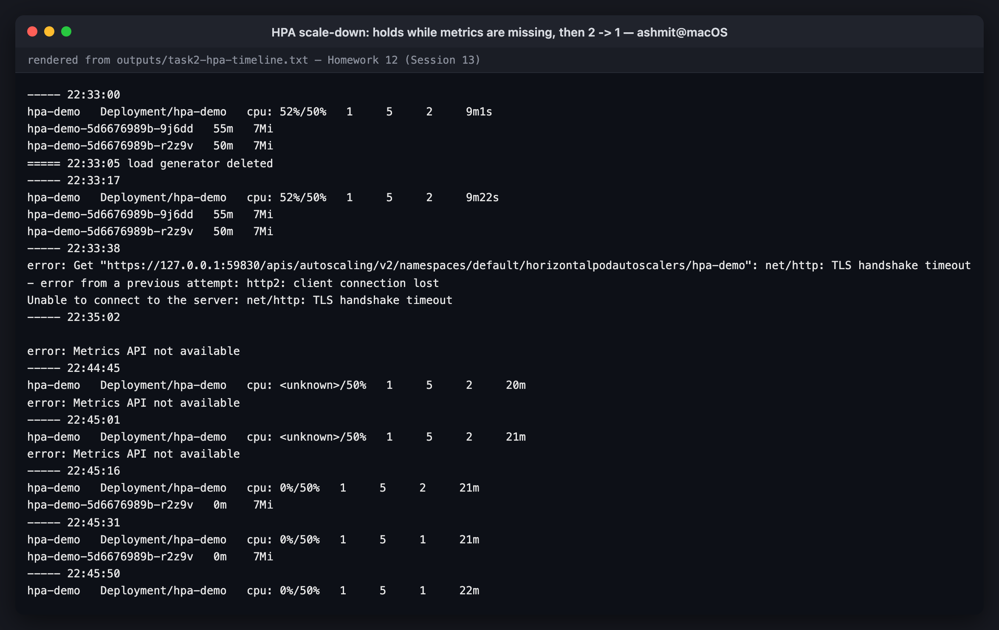
*scale-down: holds while metrics are missing, then 2 -> 1*

## The first attempt, and why the load generator has a CPU limit

The first run used a load generator **without a CPU limit**: four `wget` loops scheduled
onto the control-plane node. Each one took as much CPU as it could get. The HPA sampler
went silent for seven minutes, and kubectl failed with `TLS handshake timeout`. Its transcripts
are kept as they were:
[`task2-hpa-attempt1.txt`](outputs/task2-hpa-attempt1.txt) and
[`task2-hpa-attempt1-timeline.txt`](outputs/task2-hpa-attempt1-timeline.txt).

The corrected generator has a ceiling, and a nodeSelector to keep it off the node running the
control plane:

```yaml
    spec:
      nodeSelector:
        kubernetes.io/hostname: minikube-m02
      containers:
        - name: load
          image: busybox:1.36
          command: ["/bin/sh", "-c", "while true; do wget -q -O /dev/null http://hpa-demo-service; done"]
          resources:
            requests: { cpu: 50m, memory: 8Mi }
            limits: { cpu: 150m, memory: 32Mi }
```

A load generator is a noisy neighbour by design, so give it limits like any other workload.
Investigating why the control plane was so fragile turned up the real root cause: both node
containers were capped at **2 CPUs** while the kubelet advertised **8**. The second outage
during scale-down was the same problem. The full investigation, with the fix (`docker update
--cpus` on the running nodes), is
[Homework 13, Task 4](../13-k8s-troubleshooting#task-4--a-real-incident-control-plane-starved-on-this-cluster).

## Useful commands, as used above

| Command | What it showed |
|---|---|
| `kubectl get hpa` | target vs current utilisation, current replicas, min/max |
| `kubectl get pods -o wide` | the new replica and which node it landed on |
| `kubectl top pods` | per-pod CPU in millicores (the HPA's input) |
| `kubectl describe hpa` | conditions (`ScaleDownStabilized`, `DesiredWithinRange`) and rescale events with reasons |
| `kubectl get events --field-selector reason=SuccessfulRescale` | the scaling history |

---

# Task 3 — Mini project: production-ready web app

The course's [`mini-project/`](mini-project) files are used unchanged: a namespace, a 500Mi
RWO PVC, a 2-replica nginx Deployment with startup, readiness and liveness probes and
resource requests/limits, a ClusterIP Service, and an HPA (2–5 replicas at 50% CPU).
Transcripts: `outputs/task3-mini-project-*.txt`.

```
            web-service (ClusterIP :80)
                 │
     ┌───────────┴───────────┐
  web-app pod             web-app pod        ◄── web-app-hpa (2–5, 50% CPU)
  startup/readiness/      startup/readiness/
  liveness probes         liveness probes
     └───────────┬───────────┘
            PVC web-data (RWO, 500Mi) ─► StorageClass standard ─► ???
```

The `???` is the interesting part.

## Deploy (course steps 5.1–5.4)

```console
$ kubectl apply -f pvc.yaml && kubectl get pvc -n production-webapp
persistentvolumeclaim/web-data created
NAME       STATUS    VOLUME   CAPACITY   ACCESS MODES   STORAGECLASS   VOLUMEATTRIBUTESCLASS   AGE
web-data   Pending                                      standard       <unset>                 0s

$ kubectl apply -f deployment.yaml -f service.yaml && kubectl rollout status deploy/web-app -n production-webapp --timeout=180s
deployment.apps/web-app created
service/web-service created
Waiting for deployment "web-app" rollout to finish: 0 out of 2 new replicas have been updated...
Waiting for deployment "web-app" rollout to finish: 0 of 2 updated replicas are available...
Waiting for deployment "web-app" rollout to finish: 1 of 2 updated replicas are available...
deployment "web-app" successfully rolled out

$ kubectl get pods -n production-webapp -o wide
NAME                      READY   STATUS    RESTARTS   AGE   IP             NODE           NOMINATED NODE   READINESS GATES
web-app-d45775485-2x4j8   1/1     Running   0          20s   10.244.0.46    minikube       <none>           <none>
web-app-d45775485-nf4ld   1/1     Running   0          20s   10.244.1.118   minikube-m02   <none>           <none>
```

Both replicas are Running, and they are on **different nodes** while mounting the same RWO
claim. On a single-node cluster this line would look unremarkable.

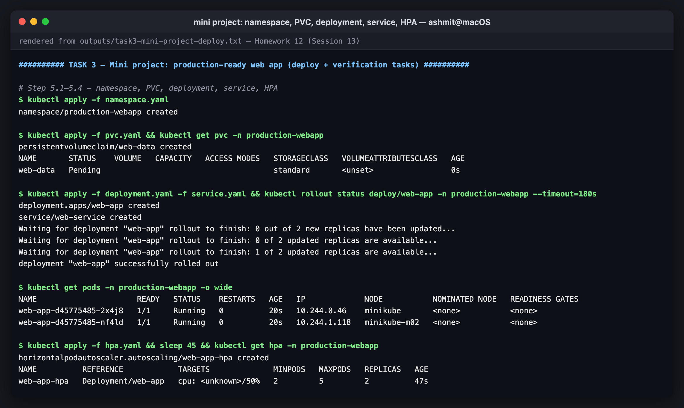
*mini project: namespace, PVC, deployment, service, HPA*

## Verification Task 1 — storage persistence, as written in the course

```console
$ OLD=$(kubectl -n production-webapp get pods -l app=web-app -o jsonpath='{.items[0].metadata.name}'); echo "deleting $OLD on $(kubectl -n production-webapp get pod $OLD -o jsonpath='{.spec.nodeName}')"; kubectl delete pod -n production-webapp $OLD
deleting web-app-d45775485-2x4j8 on minikube
pod "web-app-d45775485-2x4j8" deleted from production-webapp namespace

$ kubectl rollout status deploy/web-app -n production-webapp --timeout=180s >/dev/null; kubectl get pods -n production-webapp -o wide
NAME                      READY   STATUS    RESTARTS   AGE     IP             NODE           NOMINATED NODE   READINESS GATES
web-app-d45775485-nf4ld   1/1     Running   0          2m18s   10.244.1.118   minikube-m02   <none>           <none>
web-app-d45775485-rzx65   1/1     Running   0          55s     10.244.0.47    minikube       <none>           <none>
```

The course checks only the replacement pod. Checking **every** replica tells a different story:

```console
$ for p in $(kubectl -n production-webapp get pods -l app=web-app -o jsonpath='{.items[*].metadata.name}'); do echo "$p on $(kubectl -n production-webapp get pod $p -o jsonpath='{.spec.nodeName}'): $(kubectl -n production-webapp exec $p -- cat /data/student.txt 2>&1)"; done
web-app-d45775485-nf4ld on minikube-m02: cat: /data/student.txt: No such file or directory
command terminated with exit code 1
web-app-d45775485-rzx65 on minikube: Student: BinaryBhakti
```

The replacement landed on the same node as the original, so it "passed". The other replica,
sharing the "same" volume, has never seen the file.

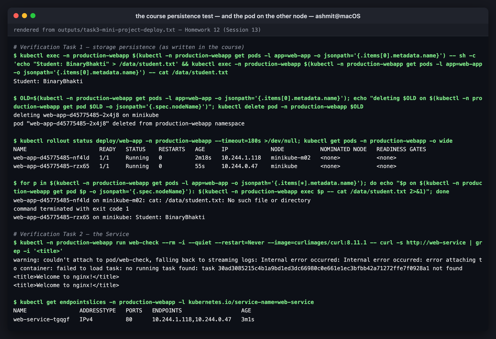
*the course persistence test — and the pod on the other node*

## The bug: persistent data that depends on which node the pod lands on

```console
$ kubectl get pv $(kubectl -n production-webapp get pvc web-data -o jsonpath='{.spec.volumeName}') -o jsonpath='provisioner: {.metadata.annotations.pv\.kubernetes\.io/provisioned-by}{"\n"}hostPath:    {.spec.hostPath.path}{"\n"}nodeAffinity: {.spec.nodeAffinity}{"(none)"}{"\n"}'
provisioner: k8s.io/minikube-hostpath
hostPath:    /tmp/hostpath-provisioner/production-webapp/web-data
nodeAffinity: (none)

$ for n in minikube minikube-m02; do echo "--- $n:"; minikube ssh -n $n -- "ls -la /tmp/hostpath-provisioner/production-webapp/web-data/ 2>&1"; done
--- minikube:
total 12
drwxrwxrwx 2 root root 4096 Oct  7 17:24 .
drwxr-xr-x 3 root root 4096 Oct  7 17:23 ..
-rw-r--r-- 1 root root   22 Oct  7 17:24 student.txt
--- minikube-m02:
total 8
drwxr-xr-x 2 root root 4096 Oct  7 17:23 .
drwxr-xr-x 3 root root 4096 Oct  7 17:23 ..
```

**Root cause.** Minikube's default provisioner creates a plain `hostPath` PV and **does not
record a node affinity**, so Kubernetes believes the volume is reachable from any node. Each
node's kubelet then creates its own empty directory at that path. ReadWriteOnce does not
help: RWO means "mountable read-write by one *node*", and nothing tells the scheduler *which*
node. Two directories with the same name, and no error anywhere.

On a real cloud this cannot happen silently. An EBS volume attaches to one node at a time, so
the second replica would be stuck in `ContainerCreating` with `Multi-Attach error`. That is
the visible version of the same design flaw: **2–5 replicas cannot share one RWO volume across
nodes**.

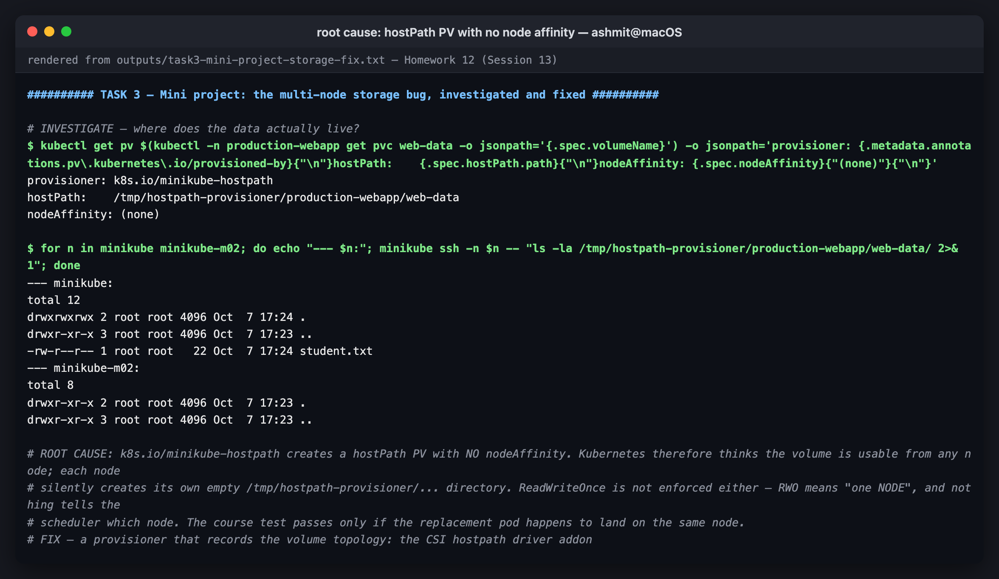
*root cause: hostPath PV with no node affinity*

### The fix

[`mini-project/fix-multinode-storage/`](mini-project/fix-multinode-storage) switches the claim
to Minikube's **CSI hostpath driver**. It is still node-local storage, but it records the
topology:

```console
$ kubectl get pv $(kubectl -n production-webapp get pvc web-data-csi -o jsonpath='{.spec.volumeName}') -o jsonpath='driver: {.spec.csi.driver}{"\n"}nodeAffinity: {.spec.nodeAffinity.required.nodeSelectorTerms[0].matchExpressions[0].key} in {.spec.nodeAffinity.required.nodeSelectorTerms[0].matchExpressions[0].values}{"\n"}'
driver: hostpath.csi.k8s.io
nodeAffinity: topology.hostpath.csi/node in ["minikube"]

$ kubectl -n production-webapp rollout status deploy/web-app --timeout=180s && kubectl -n production-webapp get pods -l app=web-app -o wide
deployment "web-app" successfully rolled out
NAME                       READY   STATUS    RESTARTS   AGE     IP            NODE       NOMINATED NODE   READINESS GATES
web-app-7d58ff965c-86fzd   1/1     Running   0          103s    10.244.0.54   minikube   <none>           <none>
web-app-7d58ff965c-qmlsh   1/1     Running   0          6m10s   10.244.0.55   minikube   <none>           <none>
```

The scheduler now places **every** replica on the volume's node. Write from one, read from
all, delete one, and read from its replacement:

```console
$ P=($(kubectl -n production-webapp get pods -l app=web-app -o jsonpath='{.items[*].metadata.name}')); kubectl -n production-webapp exec ${P[0]} -- sh -c 'echo "Student: BinaryBhakti" > /data/student.txt'; for p in ${P[@]}; do echo "$p on $(kubectl -n production-webapp get pod $p -o jsonpath='{.spec.nodeName}'): $(kubectl -n production-webapp exec $p -- cat /data/student.txt)"; done
web-app-7d58ff965c-86fzd on minikube: Student: BinaryBhakti
web-app-7d58ff965c-qmlsh on minikube: Student: BinaryBhakti

$ kubectl -n production-webapp delete pod $(kubectl -n production-webapp get pods -l app=web-app -o jsonpath='{.items[0].metadata.name}') && kubectl -n production-webapp rollout status deploy/web-app --timeout=180s >/dev/null; for p in $(kubectl -n production-webapp get pods -l app=web-app -o jsonpath='{.items[*].metadata.name}'); do echo "$p on $(kubectl -n production-webapp get pod $p -o jsonpath='{.spec.nodeName}'): $(kubectl -n production-webapp exec $p -- cat /data/student.txt)"; done
pod "web-app-7d58ff965c-86fzd" deleted from production-webapp namespace
web-app-7d58ff965c-qmlsh on minikube: Student: BinaryBhakti
web-app-7d58ff965c-rzxdz on minikube: Student: BinaryBhakti
```

> The transcript shows a first verification attempt that raced the CSI driver's start-up (its
> images were still being pulled, so the pods sat `Pending`). It is left in, followed by the
> clean re-run quoted above.

The trade-off: all replicas are now confined to **one node**, which is what RWO really means.
The real choices for a scaled web tier are:

| Option | Gives you |
|---|---|
| RWO + co-location (this fix) | correct data; no node-level redundancy |
| **ReadWriteMany** storage (NFS, EFS, CephFS, Azure Files) | one shared filesystem, replicas on any node |
| StatefulSet + `volumeClaimTemplates` | each replica owns its own volume (databases, queues) |
| no local state: object storage or a database | the usual answer for stateless web apps |

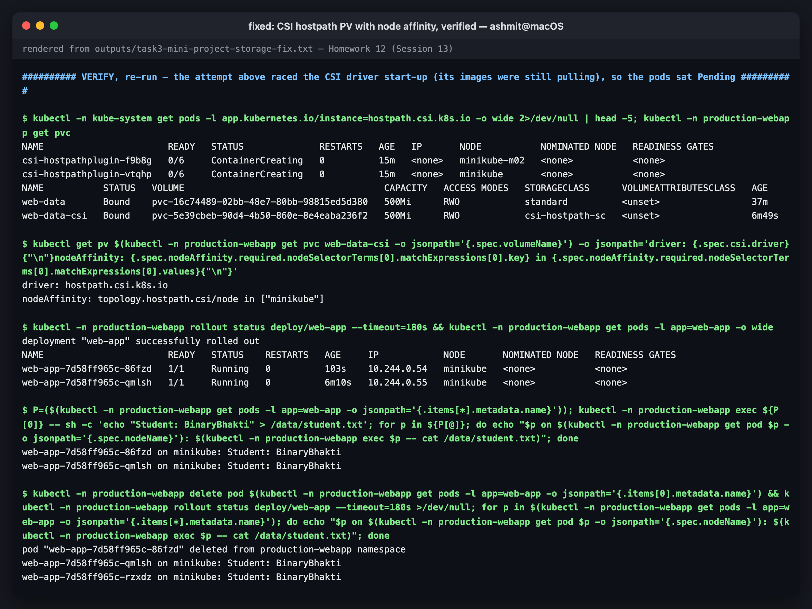
*fixed: CSI hostpath PV with node affinity, verified*

## Verification Task 2 — the Service

```console
$ kubectl get endpointslices -n production-webapp -l kubernetes.io/service-name=web-service
NAME                ADDRESSTYPE   PORTS   ENDPOINTS                  AGE
web-service-tgqgf   IPv4          80      10.244.1.118,10.244.0.47   3m1s
```

Both pod IPs are behind the Service, and an in-cluster `curl http://web-service` returned the
nginx welcome page (see `task3-mini-project-deploy.txt`).

## Verification Task 3 — HPA scale-out

**Not completed on the mini-project; the autoscaling behaviour is demonstrated in
[Task 2](#task-2--hpa-hands-on) instead.** Two load runs against `web-app-hpa`
(`task3-mini-project-hpa-and-probes.txt` and `task3-mini-project-hpa-rerun.txt`) both lost
their metrics: the HPA showed `cpu: <unknown>/50%` and kubectl hit `TLS handshake timeout`
for most of each run. By then the bottleneck was outside Kubernetes altogether. The host Mac
(8 GB RAM) had **10.6 GB of 11.2 GB swap** in use, with the Docker VM being paged, so any
burst of load stalled the API server. Both transcripts are kept unedited.

## Probes — the bonus challenges

The three probes as deployed:

```
startup:   / every 2s x 30      -> up to 60 s to start before liveness/readiness begin
readiness: / every 5s x 2       -> out of the Service after 10 s of failures
liveness:  / every 5s x 3       -> restarted after 15 s of failures
strategy:  Recreate
```

| Probe | Question | On failure |
|---|---|---|
| startup | has it finished starting? | container restarted; the other probes are **paused** until it passes |
| readiness | may it receive traffic now? | removed from Service endpoints; **not** restarted |
| liveness | is it alive, or stuck? | container **restarted** |

### Challenge 2 — readiness on a path that does not exist

```console
$ sleep 40; kubectl -n production-webapp get pods -l app=web-app
NAME                       READY   STATUS    RESTARTS   AGE
web-app-5945bfc776-4sgdf   0/1     Running   0          37s
web-app-5945bfc776-ctxzr   0/1     Running   0          37s

$ kubectl -n production-webapp get endpointslices -l kubernetes.io/service-name=web-service
NAME                ADDRESSTYPE   PORTS   ENDPOINTS                  AGE
web-service-tgqgf   IPv4          80      10.244.1.121,10.244.0.48   19m

$ kubectl -n production-webapp run c --rm -i --quiet --restart=Never --image=curlimages/curl:8.11.1 -- curl -s -m 3 -o /dev/null -w '%{http_code}\n' http://web-service; echo "curl exit code: $?"
pod production-webapp/c terminated (Error)
curl exit code: 7

$ kubectl -n production-webapp describe pod $(kubectl -n production-webapp get pods -l app=web-app -o jsonpath='{.items[0].metadata.name}') | grep -E 'Readiness probe failed' | tail -1 | cut -c1-160
  Warning  Unhealthy  5s (x6 over 30s)  kubelet            spec.containers{nginx}: Readiness probe failed: HTTP probe failed with statuscode: 404
```

Two things to notice:

1. **The EndpointSlice still lists both IPs.** The course checks `kubectl get endpoints`,
   whose legacy `Endpoints` object moves not-ready pods into `notReadyAddresses`, so its
   ENDPOINTS column really is empty. An **EndpointSlice** (what kube-proxy actually reads
   today) keeps the pod with `conditions.ready: false`, and its `ENDPOINTS` column does not
   show readiness. My note in the transcript ("no endpoints") is therefore wrong for the
   command I ran. kube-proxy routes only to ready endpoints, so the effect is identical:
   `curl` exit code 7, connection refused. To see readiness in a slice, use
   `kubectl get endpointslices -o yaml`.
2. **It is a full outage, not a stalled rollout.** The mini-project uses `strategy: Recreate`,
   which kills *all* old pods before starting new ones. With `RollingUpdate` the old, healthy
   pods would have stayed in service, because a new pod that never becomes Ready blocks the
   rollout. Recreate plus a bad probe means zero capacity.

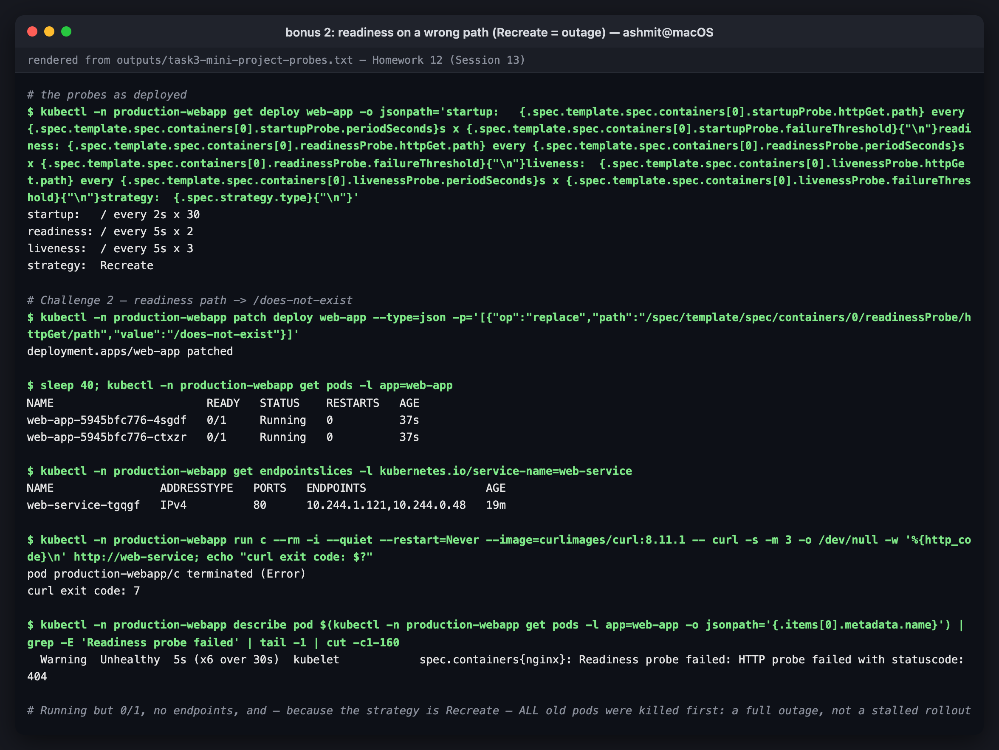
*readiness on a wrong path (Recreate = outage)*

### Challenge 3 — liveness on a path that does not exist

```console
NAME                      READY   STATUS    RESTARTS      AGE
web-app-85d86b65d-8dtzk   1/1     Running   2 (26s ago)   73s
web-app-85d86b65d-xxwpt   0/1     Running   3 (1s ago)    74s

      Reason:       Completed
      Exit Code:    0
    Restart Count:  3
  Type     Reason     Age               From               Message
  Warning  Unhealthy  3s (x9 over 63s)  kubelet            spec.containers{nginx}: Liveness probe failed: HTTP probe failed with statuscode: 404
  Normal   Killing    3s (x3 over 53s)  kubelet            spec.containers{nginx}: Container nginx failed liveness probe, will be restarted
```

Three restarts in about a minute: 3 failures × 5 s = 15 s, plus the restart time. Note
**`Reason: Completed, Exit Code: 0`**. nginx was perfectly healthy and shut down cleanly when
the kubelet sent SIGTERM, so a liveness kill does not necessarily look like a crash. The only
evidence is the `Killing ... failed liveness probe` event.

The lesson: a liveness probe should check **only that the process is alive**, never a
dependency or a page that could legitimately 404. A probe that asks the wrong question
restarts healthy containers forever.

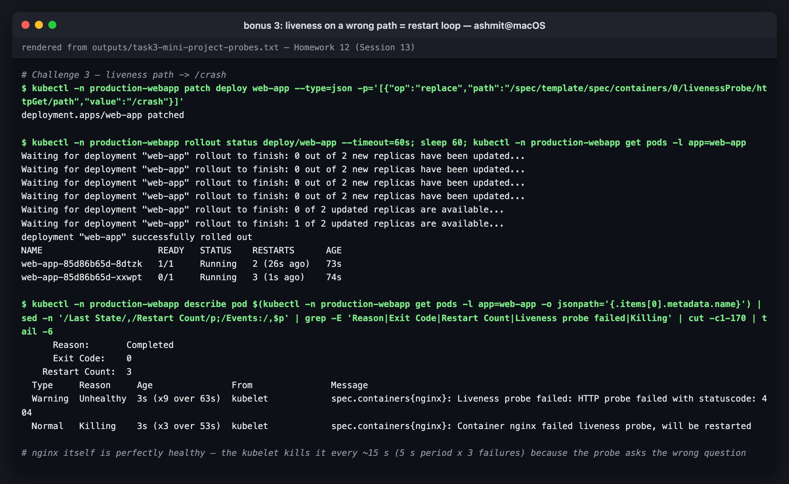
*liveness on a wrong path = restart loop*

Both challenges were reverted with `kubectl rollout undo`, which returned the pods to
`1/1 Running` with 0 restarts.

---

## Reproducing this

```bash
minikube addons enable metrics-server
cd 12-storage-hpa-probes
# Task 1
kubectl apply -f 01-kubernetes-volumes/manifests/
# Task 2
kubectl apply -f 02-hpa/deployment.yaml -f 02-hpa/service.yaml -f 02-hpa/hpa.yaml
kubectl apply -f 02-hpa/load-generator.yaml && kubectl scale deploy/load-generator --replicas=6
./02-hpa/sample.sh 15                       # Ctrl-C when done
kubectl delete deploy/load-generator        # scale-down after ~5 min
# Task 3
cd mini-project && kubectl apply -f namespace.yaml -f pvc.yaml -f deployment.yaml -f service.yaml -f hpa.yaml
kubectl apply -f load-generator.yaml
# the storage fix
minikube addons enable volumesnapshots && minikube addons enable csi-hostpath-driver
kubectl apply -f fix-multinode-storage/pvc-csi.yaml
kubectl -n production-webapp patch deploy web-app --type=json \
  -p='[{"op":"replace","path":"/spec/template/spec/volumes/0/persistentVolumeClaim/claimName","value":"web-data-csi"}]'
```

## Files

```
12-storage-hpa-probes/
├── README.md
├── 01-kubernetes-volumes/
│   ├── README.md                    Task 1 write-up
│   └── manifests/                   01-emptydir 02-hostpath 03-static-pv 04-dynamic-pvc
├── 02-hpa/
│   ├── deployment.yaml service.yaml hpa.yaml     (course files)
│   ├── load-generator.yaml          capped, pinned load generator
│   └── sample.sh                    15-second get hpa / top pods sampler
├── mini-project/
│   ├── namespace.yaml pvc.yaml deployment.yaml service.yaml hpa.yaml   (course files)
│   ├── load-generator.yaml
│   └── fix-multinode-storage/       pvc-csi.yaml + README
├── outputs/
│   ├── task1-volumes.txt
│   ├── task2-hpa.txt  task2-hpa-timeline.txt
│   ├── task2-hpa-attempt1.txt  task2-hpa-attempt1-timeline.txt
│   ├── task3-mini-project-deploy.txt
│   ├── task3-mini-project-hpa-and-probes.txt  task3-mini-project-hpa-rerun.txt
│   ├── task3-mini-project-probes.txt
│   └── task3-mini-project-storage-fix.txt
└── screenshots/

