# Homework 13 — Kubernetes Troubleshooting

Course session: **`session-14-kubernetes-troubleshooting`**.

Four parts:
- Task 1: the troubleshooting commands, each used on a live app
- Task 2: ten broken scenarios, each identified → investigated → root-caused → fixed → verified
- Task 3: the course mini-project
- Task 4: a **real incident on this cluster** that nobody staged; it kept breaking the other homeworks until it was found

**All output blocks are extracted verbatim** from the transcripts in [`outputs/`](outputs).
Cluster: the Minikube cluster from [Homework 8](../08-k8s-fundamentals), running on one node
for this homework (the worker was stopped during Task 4's investigation, which also produced a
genuine `NotReady` node to look at).

The screenshots are **renders of those transcripts**, not captures of a live terminal — every lab ran non-interactively, so there was no window to photograph. Each image names its source transcript in the title bar; see [`screenshots/`](screenshots).

| Deliverable | Where |
|---|---|
| Commands | [Task 1](#task-1--the-commands) |
| Problem statement, investigation, root cause, solution, before/after | [Task 2](#task-2--ten-common-issues), one section per issue; manifests in [`issues/`](issues) |
| Mini project | [Task 3](#task-3--mini-project) |
| Screenshots | inline, and in [`screenshots/`](screenshots) |

## The method

Every issue below follows the same loop, from the course's own troubleshooting mindset:

```
GET  ─►  DESCRIBE  ─►  EVENTS  ─►  LOGS (--previous)  ─►  EXEC / test from another pod  ─►  ROOT CAUSE  ─►  FIX  ─►  VERIFY
 what      why it's      what        what the app          what the world looks like       one sentence    smallest    with the same
 state?    in it         happened    said                  from inside / beside it                         change      check that failed
```

The most useful single habit: **classify the state first**, because it tells you which layer
to look at:

| State | Layer that failed | Look at |
|---|---|---|
| `Pending` (no node) | scheduler | `describe` → `FailedScheduling` |
| `ContainerCreating` (has a node) | kubelet preparing the pod: volumes, network, image | `describe` → `FailedMount` and similar |
| `ErrImagePull` / `ImagePullBackOff` | registry / image name / credentials | `describe` → `Failed to pull image` |
| `CreateContainerConfigError` | config references (missing Secret/ConfigMap key) | `.state.waiting.message` |
| `CrashLoopBackOff` | the application exits | `logs --previous`, exit code |
| `OOMKilled` (exit 137) | memory limit | `lastState.terminated`, limits |
| `Running` but not working | the Service, DNS or the app's own networking | endpoints, `curl` from another pod, `/proc/net/tcp` |

---

# Task 1 — The commands

Transcript: [`outputs/task1-commands.txt`](outputs/task1-commands.txt). Practised on
[`commands/demo-app.yaml`](commands/demo-app.yaml): a 2-replica nginx Deployment, its Service,
and a logger pod that writes a heartbeat and a periodic `WARN` to stderr.

| Command | Question it answers |
|---|---|
| `kubectl get` | what exists, and what state is it in? |
| `kubectl get -o wide` | …plus pod IP and **node**: the first check when only *some* requests fail |
| `kubectl describe` | why is it in that state? spec + status + conditions + **events**, in one view |
| `kubectl logs` | what did the application say? (`--previous` for the container that died) |
| `kubectl exec` | what does the world look like from inside the container? |
| `kubectl events` | what happened, in order? |
| `kubectl explain` | what does this field mean? (from *this* API server, so always the right version) |
| `kubectl top` | who is using the CPU and memory? |

### get and get -o wide

```console
$ kubectl get pods --show-labels
NAME                   READY   STATUS    RESTARTS   AGE   LABELS
logs-demo              1/1     Running   0          23s   app=logs-demo
web-78b458b948-t5mtp   1/1     Running   0          23s   app=web,pod-template-hash=78b458b948
web-78b458b948-zfw5f   1/1     Running   0          23s   app=web,pod-template-hash=78b458b948

$ kubectl get pods -A --field-selector=status.phase!=Running,status.phase!=Succeeded
NAMESPACE     NAME               READY   STATUS    RESTARTS   AGE
kube-system   kindnet-rwc7g      0/1     Pending   0          162m
kube-system   kube-proxy-cknj8   0/1     Pending   0          162m
```

That field selector is the "show me only what's wrong, everywhere" query. Here it finds two
DaemonSet pods stuck on the stopped worker node, which `get nodes -o wide` confirms:

```console
$ kubectl get nodes -o wide
NAME           STATUS     ROLES           AGE   VERSION   INTERNAL-IP    EXTERNAL-IP   OS-IMAGE                         KERNEL-VERSION            CONTAINER-RUNTIME
minikube       Ready      control-plane   19d   v1.37.0   192.168.49.2   <none>        Debian GNU/Linux 12 (bookworm)   7.0.12-linuxkit (arm64)   containerd://2.3.4
minikube-m02   NotReady   <none>          19d   v1.37.0   192.168.49.3   <none>        Debian GNU/Linux 12 (bookworm)   7.0.12-linuxkit (arm64)   containerd://2.3.4
```

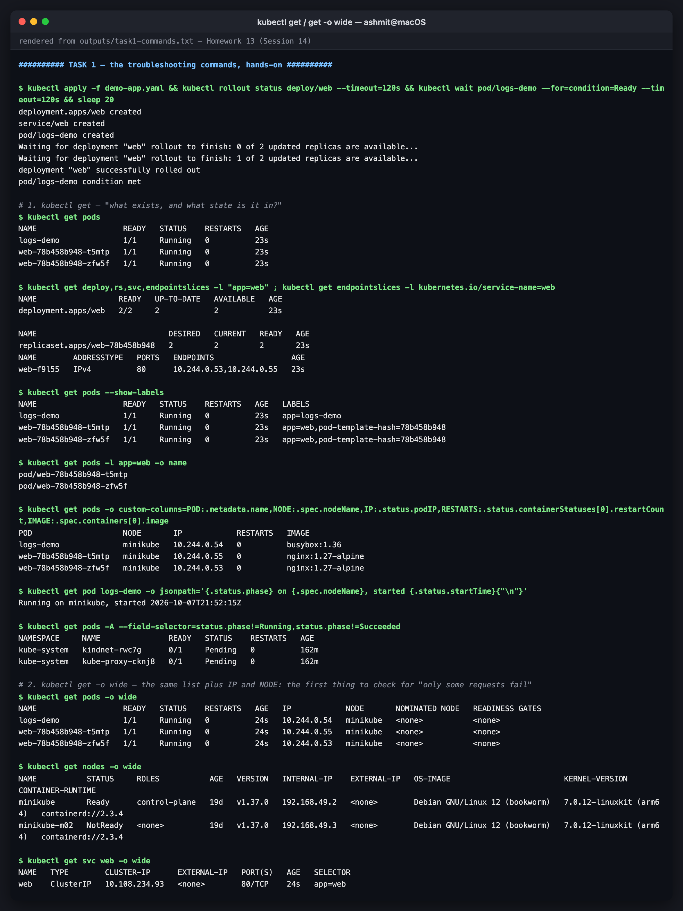
*kubectl get / get -o wide*

### describe

`describe` on the `NotReady` node shows *why*, in its Conditions:

```console
  MemoryPressure   Unknown   Thu, 08 Oct 2026 00:37:41 +0530   Thu, 08 Oct 2026 00:38:53 +0530   NodeStatusUnknown   Kubelet stopped posting node status.
  Ready            Unknown   Thu, 08 Oct 2026 00:37:41 +0530   Thu, 08 Oct 2026 00:38:53 +0530   NodeStatusUnknown   Kubelet stopped posting node status.
```

`Unknown`, not `False`: the control plane has not heard from that kubelet, so it cannot say
anything about memory or readiness. That is the signature of a node that is down or
unreachable, as opposed to one that is unhealthy.

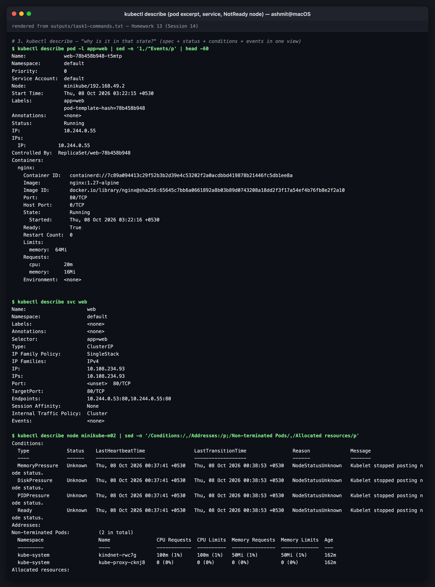
*kubectl describe*

### logs, exec, debug

`kubectl logs` has more useful flags than most people use: `--tail`, `--since=10s
--timestamps`, `deploy/web` (picks a pod for you), `-l app=web --prefix` (all replicas,
labelled), `-c` (a container in a multi-container pod), and `--previous`. For images without a
shell, `kubectl debug --target` attaches an **ephemeral container** that shares the process
namespace. All of them are in the transcript.

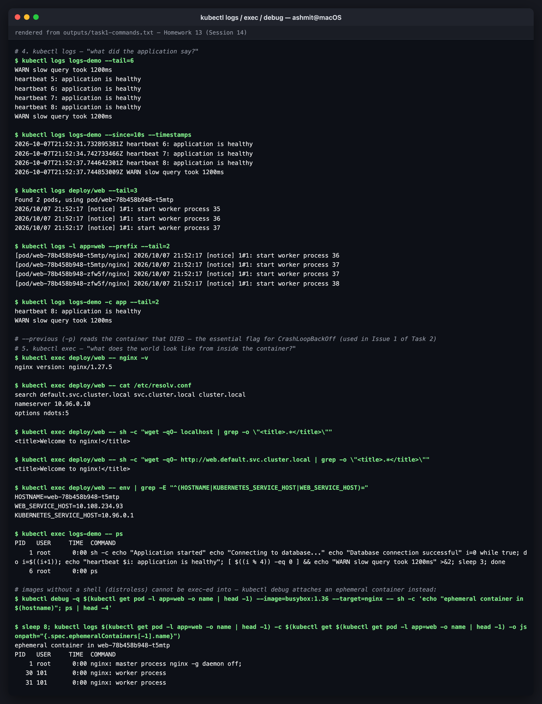
*kubectl logs / exec / debug*

### events, explain, top

```console
$ kubectl explain deployment.spec.strategy.rollingUpdate.maxUnavailable
```

`explain` answers "what does this field do, and what is the default?" from the API server's
own OpenAPI schema, so it is always the right version for the cluster you are on. `top` needs
metrics-server, and its first answer was a genuine `metrics not available yet` for pods that
were seconds old.

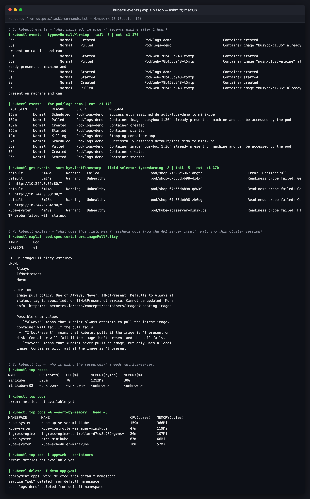
*kubectl events / explain / top*

---

# Task 2 — Ten common issues

Manifests: [`issues/NN-name/`](issues), each with a `broken.yaml` and a `fixed.yaml` (or
equivalents). Transcripts: `outputs/task2-NN-*.txt`.

| # | Issue | What I saw | Key command | Root cause | Fix |
|---|---|---|---|---|---|
| 1 | CrashLoopBackOff | restarts climbing, exit 1 | `logs --previous` | required env var missing | ConfigMap + `envFrom` |
| 2 | ImagePullBackOff | `NotFound` on pull | `describe` events | tag typo `1.277` | correct tag (patched in place) |
| 3 | ErrImagePull | `pull access denied` | `.state.waiting.message` | no registry prefix → docker.io/library | full image path (+ pull secret if private) |
| 4 | Pending | no node assigned | `describe` → `FailedScheduling` | requests 500 CPU / 1000Gi | realistic requests |
| 5 | ContainerCreating | node assigned, no container | `describe` → `FailedMount` | ConfigMap never created | create it (**+ a second bug, IPv6**) |
| 6 | Service unreachable | `curl` exit 7, no endpoints | `get endpointslices` | selector typo **and** wrong targetPort | fix both; targetPort by name |
| 7 | DNS | `curl` exit 6 | `cat /etc/resolv.conf`, `nslookup` | short name across namespaces | FQDN |
| 8 | Pod networking | refused even on pod IP | `/proc/net/tcp` | app bound to 127.0.0.1 | bind 0.0.0.0 |
| 9 | Configuration | `CreateContainerConfigError` | `.state.waiting.message` | wrong Secret key name | correct key |
| 10 | OOMKilled | exit 137 | `lastState.terminated` | 200 MiB in a 20Mi limit | limit sized to the measured working set |

## Issue 1 — CrashLoopBackOff

**Problem.** The course's scenario-1 pod never stays up.

```console
$ kubectl get pod crashloop-pod -o jsonpath='{.status.containerStatuses[0].lastState.terminated}' ; echo
{"containerID":"containerd://dd581b247a8f6656c2608b3f4633dfac388efa8aceb5bcc91b6269b5dd1a85d5","exitCode":1,"finishedAt":"2026-10-07T21:53:40Z","reason":"Error","startedAt":"2026-10-07T21:53:40Z"}

$ kubectl logs crashloop-pod --previous
[FATAL ERROR]: DATABASE_URL environment variable is MISSING!

$ kubectl get pod crashloop-pod -o jsonpath='{.spec.containers[0].env}{.spec.containers[0].envFrom}' ; echo '(no env, no envFrom)'
(no env, no envFrom)
```

**Investigation.** `reason: Error, exitCode: 1` means the process exited by itself; it was
not killed by the kubelet (143) or the kernel (137). So the answer is in its own output, and
`--previous` reads the container that died rather than the one currently waiting.

**Root cause.** The app requires `DATABASE_URL`, and the pod gives it no environment at all.
Kubernetes is doing its job: restarting with exponential back-off (10 s, 20 s, 40 s … 5 min).

**Fix and verify.** A ConfigMap plus `envFrom`. A pod's env is immutable, so the pod is
replaced:

```console
$ kubectl logs crashloop-pod
Application started successfully! db=postgresql://yatri_admin@postgres:5432/yatri_production_db
```

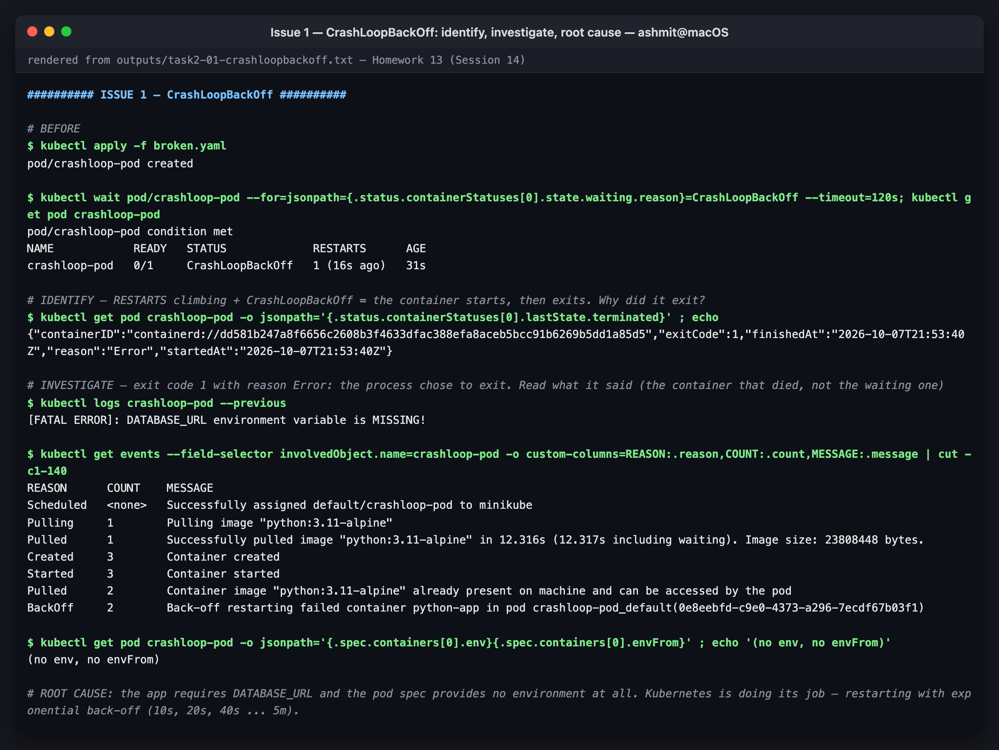
*Issue 1 — before*

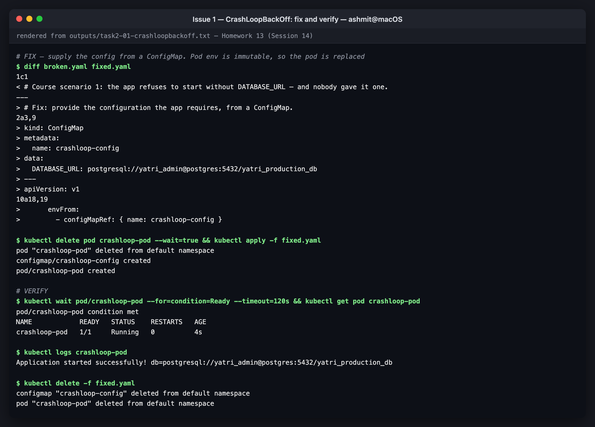
*Issue 1 — after*

## Issue 2 — ImagePullBackOff

```console
  Warning  Failed     13s               kubelet            spec.containers{web}: Failed to pull image "nginx:1.277": rpc error: code = NotFound desc = failed to pull and unpack image "docker.io/librar

$ docker manifest inspect nginx:1.277 >/dev/null 2>&1 && echo "nginx:1.277 exists" || echo "nginx:1.277: no such manifest"
nginx:1.277: no such manifest

$ docker manifest inspect nginx:1.27 >/dev/null 2>&1 && echo "nginx:1.27 exists" || echo "nginx:1.27: no such manifest"
nginx:1.27 exists
```

**Root cause.** `NotFound` means the registry was reached and the *repository* exists, but the
**tag** does not: `1.277` was meant to be `1.27`. `docker manifest inspect` checks an image
reference without pulling it.

**Fix.** A pod's `image` is one of the few mutable pod fields, so `kubectl set image` fixes it
in place with no delete. The pod became `1/1 Running`.

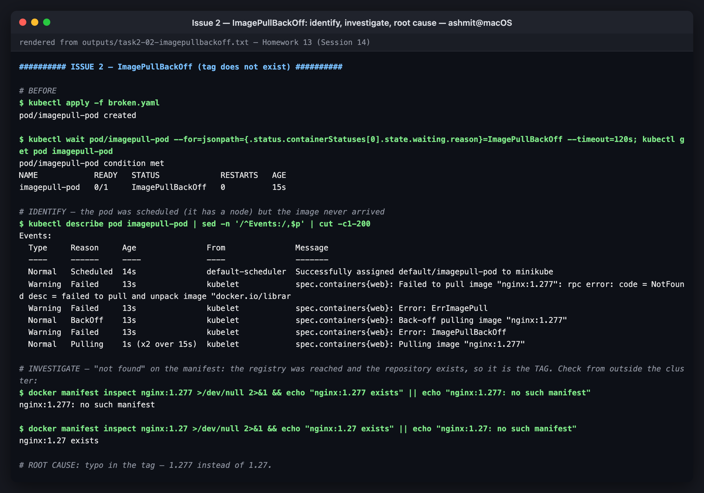
*Issue 2 — before*

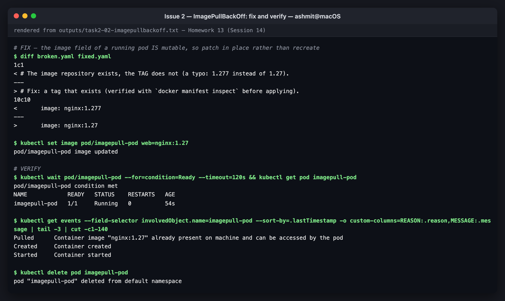
*Issue 2 — after*

## Issue 3 — ErrImagePull

Caught in its **first** state, before the back-off:

```console
$ kubectl wait pod/errimagepull-pod --for=jsonpath={.status.containerStatuses[0].state.waiting.reason}=ErrImagePull --timeout=60s; kubectl get pod errimagepull-pod
pod/errimagepull-pod condition met
NAME               READY   STATUS         RESTARTS   AGE
errimagepull-pod   0/1     ErrImagePull   0          3s

$ kubectl get pod errimagepull-pod -o jsonpath='{.status.containerStatuses[0].state.waiting.message}' | fold -w 160; echo
failed to pull and unpack image "docker.io/library/yatri-api-service:v999-invalid-tag-does-not-exist": failed to resolve reference "docker.io/library/yatri-api-
service:v999-invalid-tag-does-not-exist": pull access denied, repository does not exist or may require authorization: server message: insufficient_scope: author
ization failed
```

11 seconds later the same pod showed `ImagePullBackOff`. These are **two phases of one
problem**: `ErrImagePull` means this pull attempt failed, and `ImagePullBackOff` means the kubelet is
waiting before the next attempt.

**Root cause.** It is a different failure from Issue 2. An image name with no registry
resolves to `docker.io/library/…`, which does not exist. Docker Hub deliberately answers
"does not exist **or** may require authorization" for both missing and private repositories,
so the message cannot tell you which. For a real private image the fix is the full registry
path plus an `imagePullSecret` (this pod had none). Here it was replaced with an existing
image, and verified with an in-cluster request: `yatri-api-service stand-in`.

> The first verification printed nothing: the image has no `wget`, and the fallback curl pod
> lost its output. The transcript keeps that attempt and a **follow-up** that verifies
> properly.

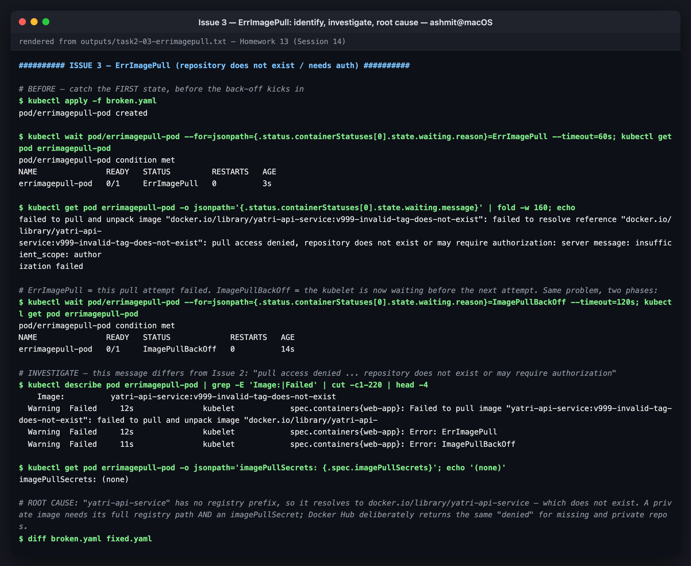
*Issue 3 — before*

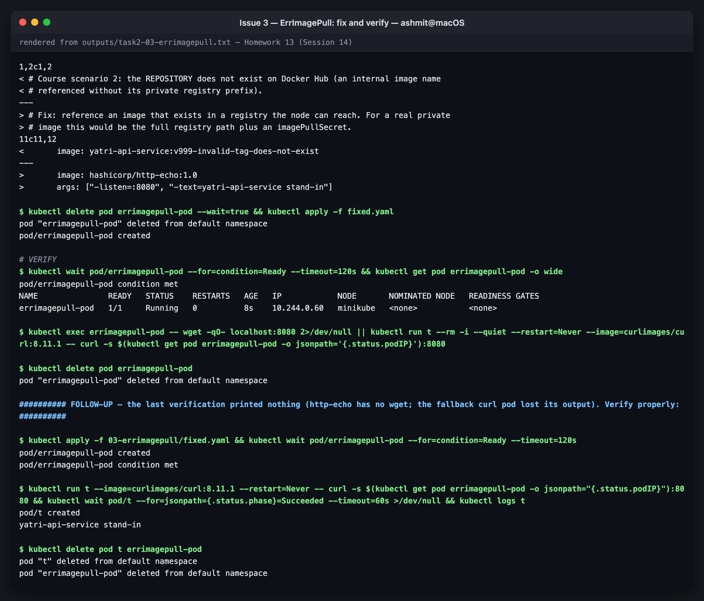
*Issue 3 — after*

## Issue 4 — Pending

```console
$ kubectl logs pending-pod

$ kubectl describe pod pending-pod | sed -n '/^Events:/,$p' | cut -c1-260
Events:
  Type     Reason            Age   From               Message
  ----     ------            ----  ----               -------
  Warning  FailedScheduling  5s    default-scheduler  0/2 nodes are available: 1 Insufficient cpu, 1 Insufficient memory, 1 node(s) had untolerated taint(s). preemption: 0/2 nodes are available: 2 Preemption is not helpful for scheduling.
```

No logs exist, because no container was ever created. The scheduler gives one reason per
node: the control plane lacks the CPU and memory, and the stopped worker carries the
`unreachable` taint. "Preemption is not helpful" means evicting lower-priority pods would not
help either.

**Root cause.** It requests `500` CPUs and `1000Gi`, against nodes that allocate 8 CPUs and
about 3.8Gi. **Requests are reservations**, and the scheduler only places a pod where the
request fits. **Fix:** requests sized to real usage (`50m` / `32Mi`) plus a memory limit, after
which the event is `Scheduled`.

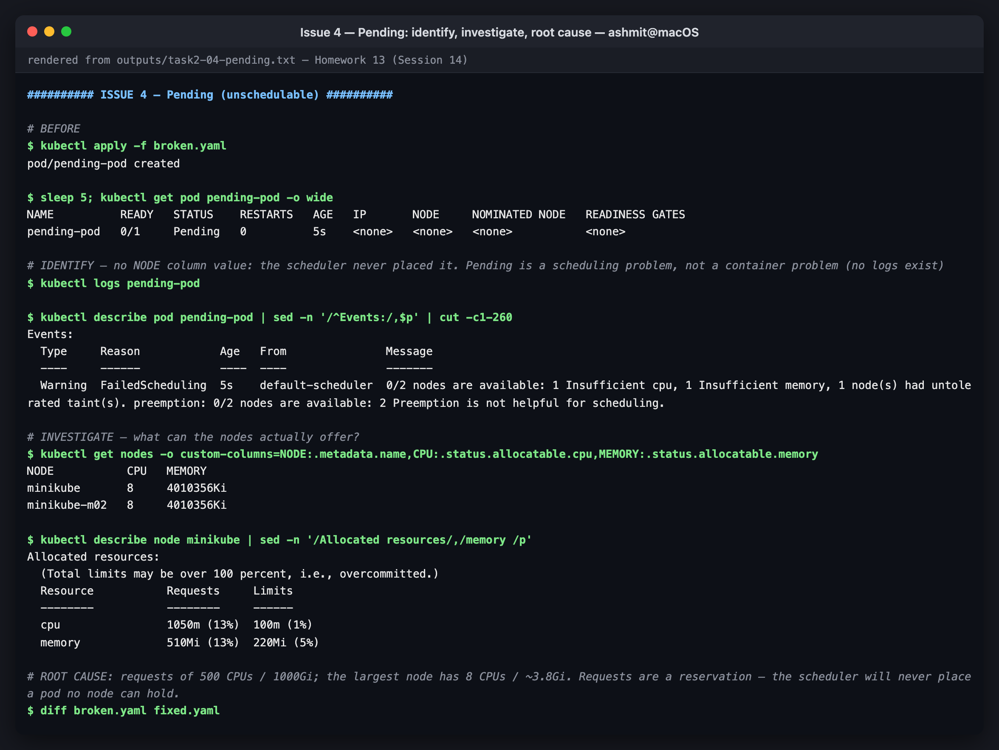
*Issue 4 — before*

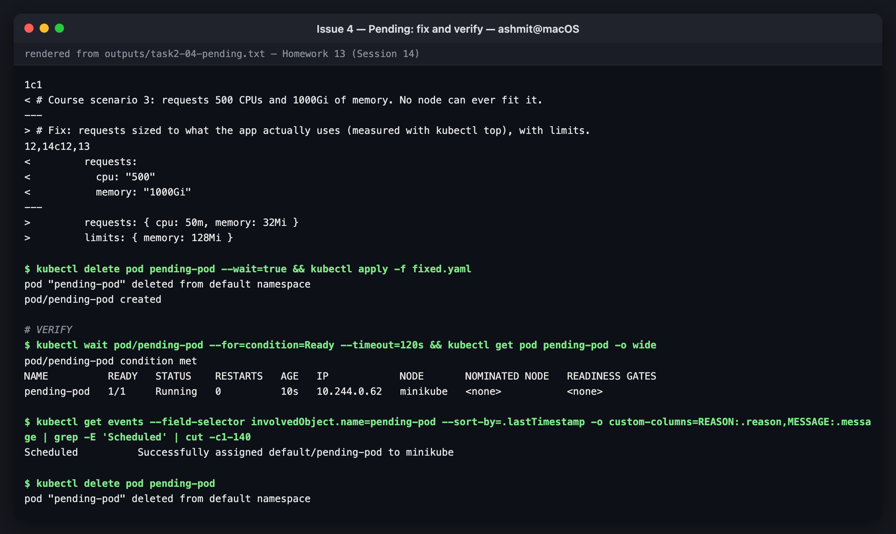
*Issue 4 — after*

## Issue 5 — Stuck in ContainerCreating, then a second bug

```console
$ kubectl logs containercreating-pod
Error from server (BadRequest): container "web" in pod "containercreating-pod" is waiting to start: ContainerCreating

  Warning  FailedMount  14s (x7 over 46s)  kubelet            MountVolume.SetUp failed for volume "site-config" : configmap "nginx-site-config" not found
```

**Root cause.** Unlike Pending, it *has* a node. The kubelet cannot build the pod's volumes
because the ConfigMap it mounts was never created, and it retries `FailedMount` indefinitely.
**Fix:** create the ConfigMap; the pod is not touched, and the kubelet picks it up on its next
retry.

The pod went `1/1 Running`, and then **the verification failed**:

```console
$ kubectl exec containercreating-pod -- wget -qO- localhost; echo "exit: $?"
wget: can't connect to remote host: Connection refused
command terminated with exit code 1
exit: 1

$ kubectl exec containercreating-pod -- wget -qO- 127.0.0.1; echo "exit: $?"
served with config from nginx-site-config
exit: 0

$ kubectl exec containercreating-pod -- grep localhost /etc/hosts
127.0.0.1	localhost
::1	localhost ip6-localhost ip6-loopback

$ kubectl exec containercreating-pod -- netstat -tln
Active Internet connections (only servers)
Proto Recv-Q Send-Q Local Address           Foreign Address         State       
tcp        0      0 0.0.0.0:80              0.0.0.0:*               LISTEN      
```

**Second root cause.** busybox `wget` tries `localhost` as **`::1`** (IPv6) first. The
ConfigMap *replaces* nginx's `default.conf`, which normally has both `listen 80;` and
`listen [::]:80;`, with one that only listens on IPv4. So fixing the first bug exposed a second
one, introduced by the fix itself. **Second fix:** listen on both families:

```console
$ kubectl exec containercreating-pod -- netstat -tln
Active Internet connections (only servers)
Proto Recv-Q Send-Q Local Address           Foreign Address         State       
tcp        0      0 0.0.0.0:80              0.0.0.0:*               LISTEN      
tcp        0      0 :::80                   :::*                    LISTEN      

$ kubectl exec containercreating-pod -- wget -qO- localhost; echo "exit: $?"
served with config from nginx-site-config
exit: 0
```

Lesson: "Running" is not "working". Verify with the same check a user would make.

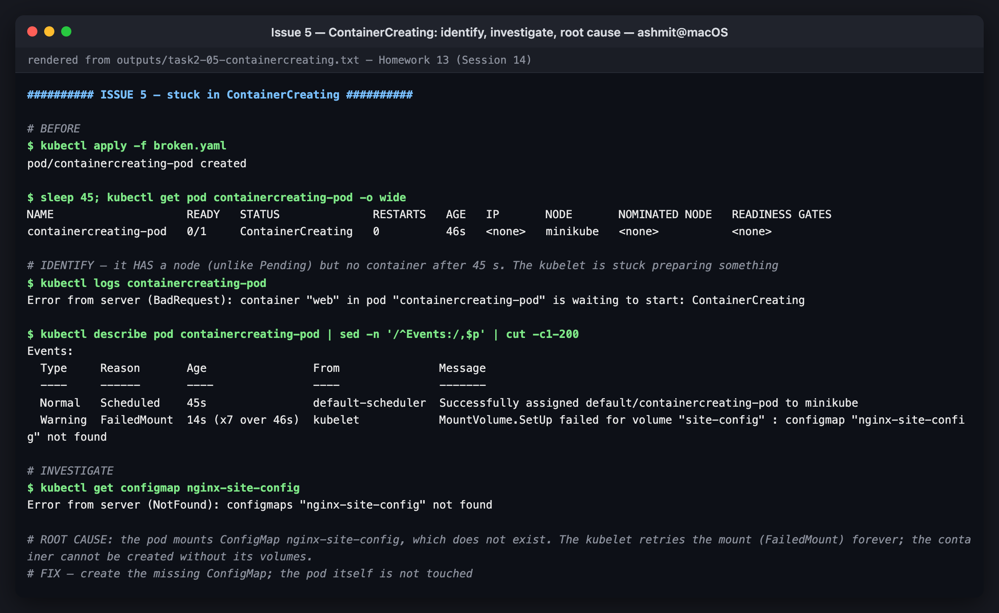
*Issue 5 — before*

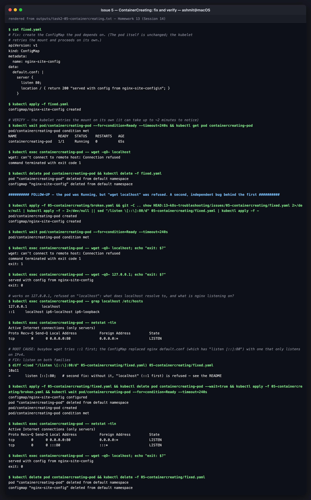
*Issue 5 — the fix, the second bug, and its fix*

## Issue 6 — Service connectivity: two bugs, the first hiding the second

```console
$ kubectl get endpointslices -l kubernetes.io/service-name=orders-svc
NAME               ADDRESSTYPE   PORTS     ENDPOINTS   AGE
orders-svc-r4hpg   IPv4          <unset>   <unset>     2s

$ kubectl get svc orders-svc -o jsonpath='selector: {.spec.selector}{"\n"}'
selector: {"app":"order"}

$ kubectl get pods --show-labels -l tier=backend
NAME                      READY   STATUS    RESTARTS   AGE   LABELS
orders-5b77b57f47-bkmmj   1/1     Running   0          2s    app=orders,pod-template-hash=5b77b57f47,tier=backend
orders-5b77b57f47-tnsbc   1/1     Running   0          2s    app=orders,pod-template-hash=5b77b57f47,tier=backend
```

**Bug 1:** the selector says `app=order`, but the pods are `app=orders`, so the Service has
no endpoints. After fixing only that, the endpoints appear, but it is **still refused**:

```console
$ kubectl get pod -l app=orders -o jsonpath='{.items[0].spec.containers[0].ports}'; echo
[{"containerPort":5678,"name":"http","protocol":"TCP"}]

$ kubectl exec svc-test -- curl -s -m 3 http://$(kubectl get pod -l app=orders -o jsonpath='{.items[0].status.podIP}'):5678
orders service OK
```

**Bug 2:** `targetPort: 80`, but the container listens on 5678. **Fix:** the right selector,
and `targetPort: http` **by name**, so the Service follows the container port if it ever
changes.

The first verification refused 3 of 4 requests right after the fix, then succeeded. A
follow-up re-ran the whole fix from scratch: **12 of 12 requests succeeded**, and the refusals
did not reproduce. The likeliest explanation is kube-proxy's rule sync lagging behind two
Service edits made seconds apart in the first run. The transcript keeps the original note and
an explicit correction.

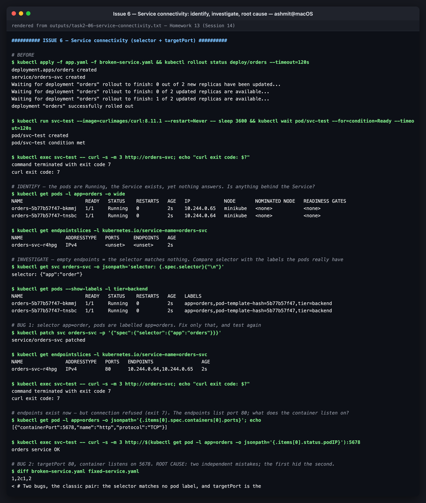
*Issue 6 — before*

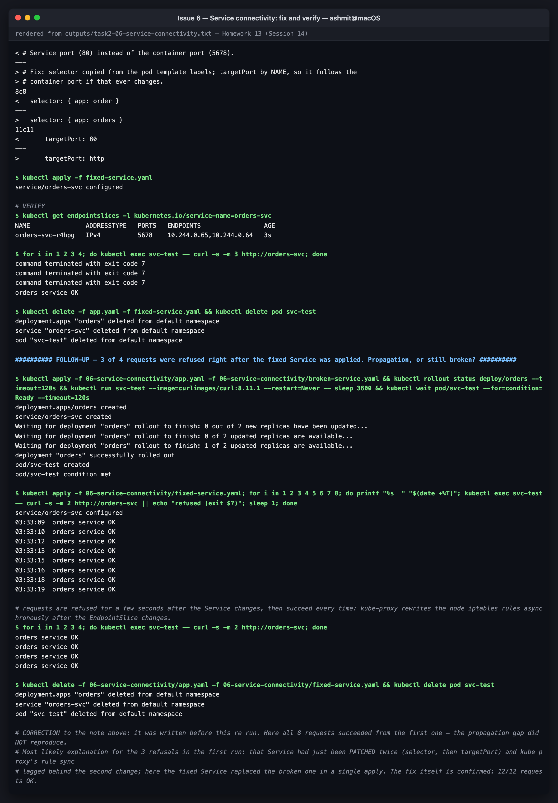
*Issue 6 — after*

## Issue 7 — DNS: a short name across namespaces

The client in namespace `frontend` calls `http://api`; the API lives in namespace `backend`.

```console
 [HTTP 000]
curl failed: exit 6

$ kubectl -n frontend exec web-client -- cat /etc/resolv.conf
search frontend.svc.cluster.local svc.cluster.local cluster.local
nameserver 10.96.0.10
options ndots:5

$ kubectl -n frontend exec web-client -- nslookup api
Server:		10.96.0.10
Address:	10.96.0.10:53

** server can't find api.cluster.local: NXDOMAIN

** server can't find api.frontend.svc.cluster.local: NXDOMAIN

** server can't find api.svc.cluster.local: NXDOMAIN
```

`curl` exit code 6 means "could not resolve host", so this is DNS, not routing. The search list
shows the resolver expands `api` with the **client's** namespace first
(`api.frontend.svc.cluster.local`). The Service is `api.backend.svc.cluster.local`, which no
search entry produces.

```console
$ kubectl -n frontend exec web-client -- nslookup api.backend.svc.cluster.local
Server:		10.96.0.10
Address:	10.96.0.10:53


Name:	api.backend.svc.cluster.local
Address: 10.109.15.43
```

**Fix:** use the FQDN (or at least `api.backend`). The client then logs `api in namespace
backend [HTTP 200]`.

> **An honest note on my own check.** To confirm "CoreDNS itself is healthy" I first ran
> `nslookup kubernetes.default`, and it returned `NXDOMAIN`, although the transcript note right
> after it says "DNS works". The successful lookup of the full name above is the real proof
> that DNS was healthy. busybox's `nslookup` is a poor tool for testing search-list expansion,
> so use FQDNs or `dig` from a `dnsutils` image.

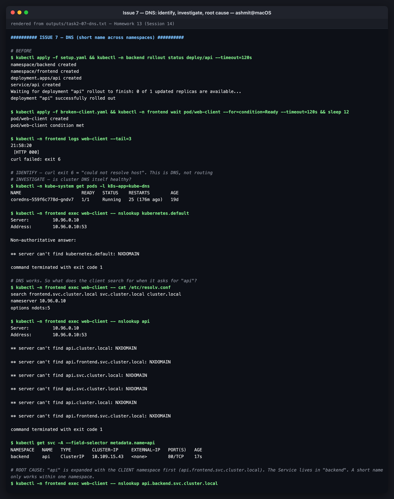
*Issue 7 — before*

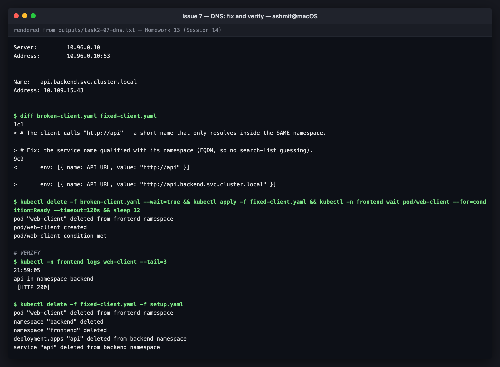
*Issue 7 — after*

## Issue 8 — Pod networking: listening on the wrong interface

```console
$ kubectl get endpointslices -l kubernetes.io/service-name=inventory
NAME              ADDRESSTYPE   PORTS   ENDPOINTS     AGE
inventory-j25fs   IPv4          8080    10.244.0.70   13s

$ kubectl exec net-test -- curl -s -m 3 http://$(kubectl get pod -l app=inventory -o jsonpath='{.items[0].status.podIP}'):8080; echo "curl exit code: $?"
command terminated with exit code 7
curl exit code: 7

$ kubectl exec deploy/inventory -- python3 -c "import urllib.request; print(urllib.request.urlopen('http://127.0.0.1:8080').status)"
200

$ kubectl exec deploy/inventory -- sh -c 'cat /proc/net/tcp | awk "NR>1 && \$4==\"0A\" {print \"listening on\", \$2}"'
listening on 0100007F:1F90
```

Unlike Issue 6, the Service has an endpoint and the ports match, and even the **pod IP**
refuses. From inside the pod it works. `/proc/net/tcp` (no `ss` or `netstat` in a slim image)
shows the listening socket: `0100007F:1F90` is little-endian hex for **127.0.0.1:8080**.

**Root cause:** the app was started with `--bind 127.0.0.1`. Kubernetes networking is fine;
the process is simply not on the pod's network interface. **Fix:** bind `0.0.0.0`. After the
fix, `listening on 00000000:1F90` and `HTTP 200` through the Service.

> The first verification ran too early, while the new pod's Python process had not yet bound.
> The Deployment has no readinessProbe, so `rollout status` only meant "container started". A
> follow-up verification after the pod settled is in the transcript. A readinessProbe on
> `:8080` would have made the rollout itself wait.

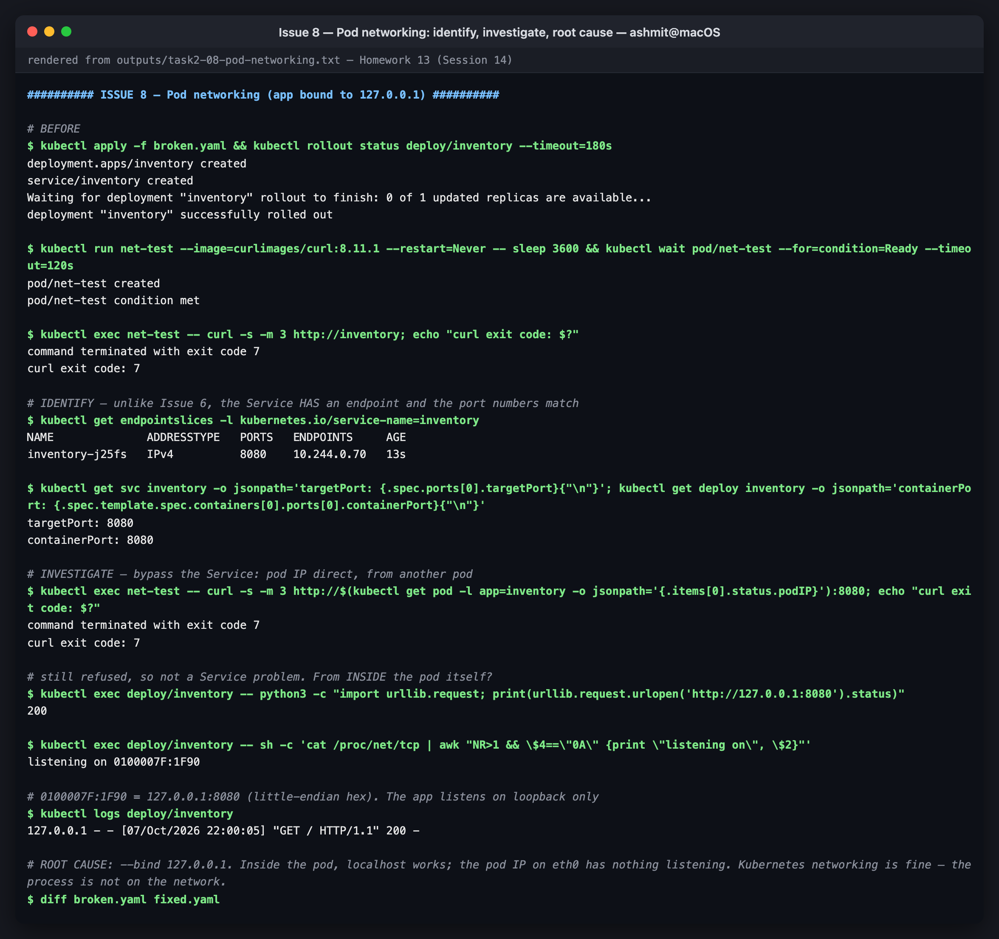
*Issue 8 — before*

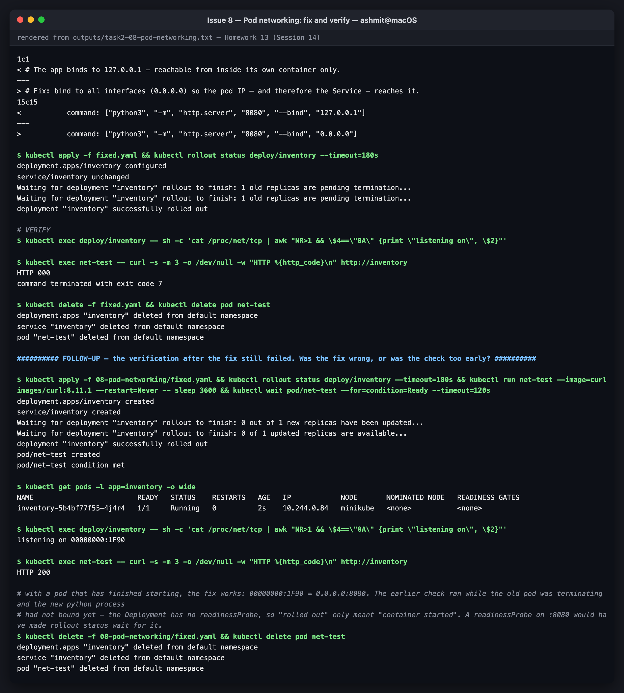
*Issue 8 — after*

## Issue 9 — Configuration error: CreateContainerConfigError

```console
payments-pod   0/1     CreateContainerConfigError   0          1s

$ kubectl get pod payments-pod -o jsonpath='{.status.containerStatuses[0].state.waiting.message}'; echo
couldn't find key DB_PASSWORD in Secret default/payments-db

$ kubectl get secret payments-db -o jsonpath='{.data}' | tr ',' '\n'; echo
{"password":"czNjcjN0LXBheW1lbnRz"
"username":"cGF5bWVudHM="}
```

It is not a crash (no restarts) and not an image problem: the kubelet refused to **build** the
container's environment. **Root cause:** env `DB_PASSWORD` references key `DB_PASSWORD`, but
the Secret's keys are `username` and `password`. **Fix:** reference `password`. Verified:
`payments started as payments`, `DB_PASSWORD is set: 15 characters`, which is the length of
`s3cr3t-payments` and shows no stray newline (see
[Homework 11's troubleshooting](../11-ingress-configmaps-secrets/troubleshooting)).

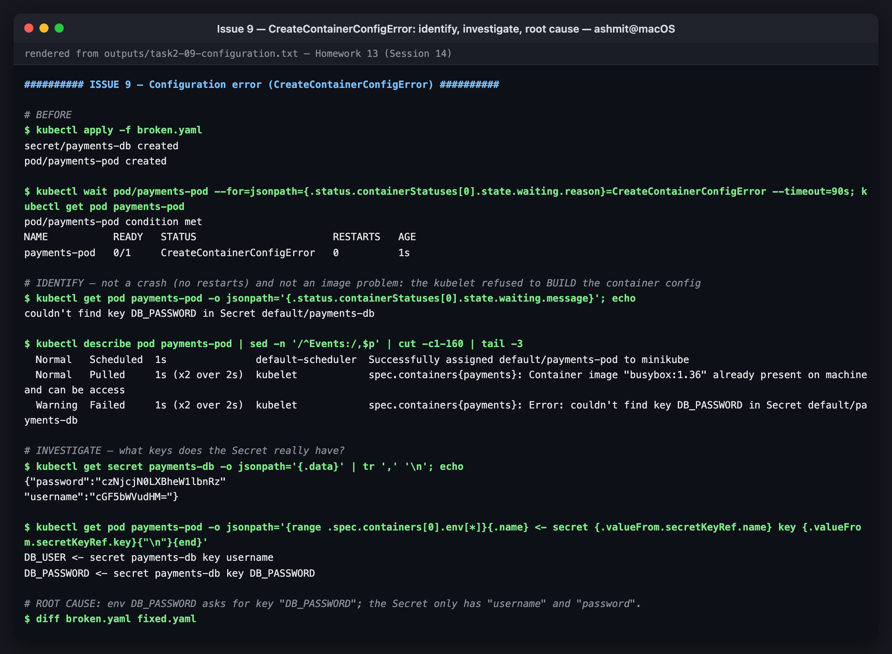
*Issue 9 — before*

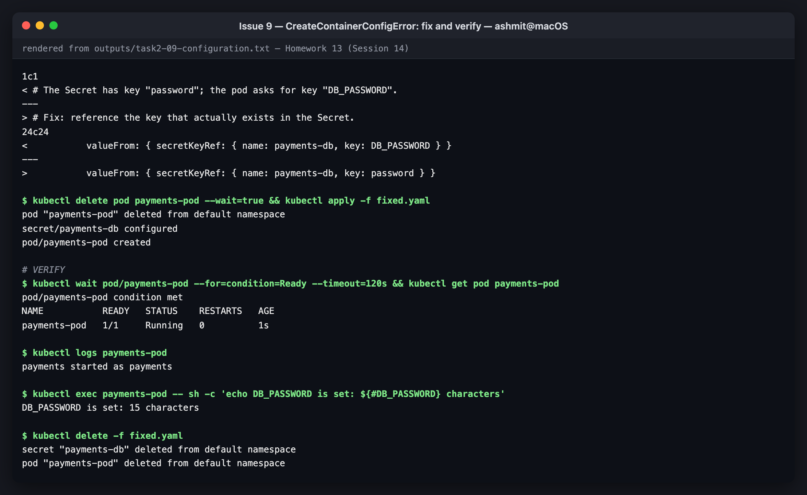
*Issue 9 — after*

## Issue 10 — OOMKilled

```console
$ kubectl get pod oomkilled-pod -o jsonpath='{.status.containerStatuses[0].lastState.terminated}'; echo
{"containerID":"containerd://e8a12fab5dea5aab10679c03711b0ffde84227ed9df39fdbafa51df5288273ac","exitCode":137,"finishedAt":"2026-10-07T22:01:19Z","reason":"OOMKilled","startedAt":"2026-10-07T22:01:19Z"}

$ kubectl logs oomkilled-pod --previous
Allocating memory rapidly...

$ kubectl get pod oomkilled-pod -o jsonpath='limit: {.spec.containers[0].resources.limits.memory}'; echo
limit: 20Mi
```

Exit 137 = 128 + 9 (SIGKILL), sent by the kernel's OOM killer. The app never got to log an
error, so its log stops mid-sentence. The STATUS column flickers between `OOMKilled`,
`CrashLoopBackOff` and even `Running`, so `lastState.terminated.reason` is the reliable field.
**Root cause:** about 200 MiB in a 20Mi limit. **Fix:** a limit sized to the measured working
set plus headroom. The app then logs `holding 200 MiB` and stays up. In real life you first
decide whether the limit is wrong or the code leaks.

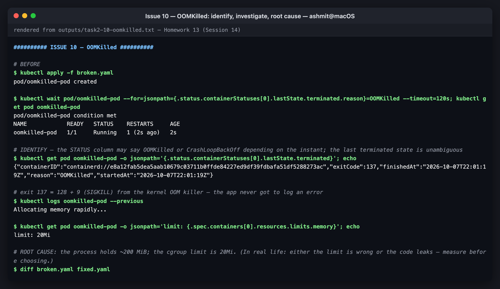
*Issue 10 — before*

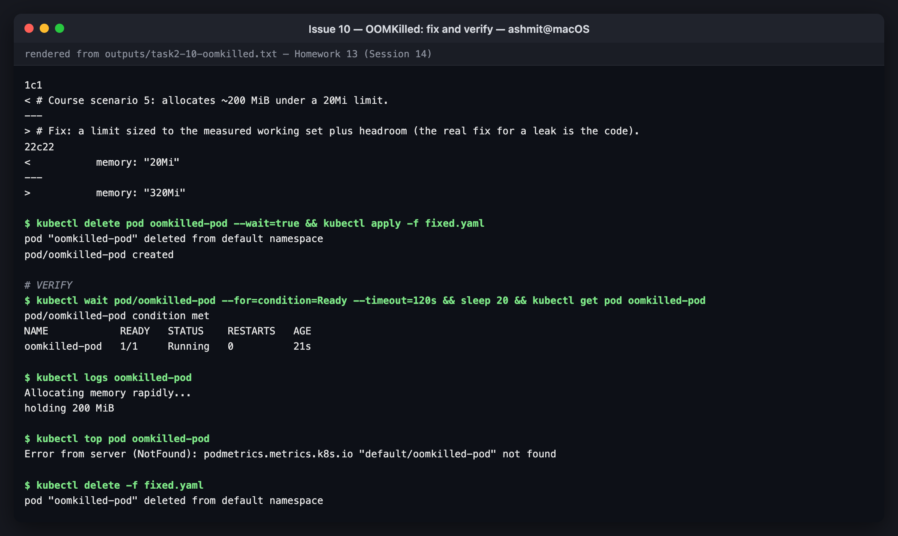
*Issue 10 — after*

---

# Task 3 — Mini project

The course's [`mini-project/`](mini-project) (a 2-replica nginx Deployment, a Service and a
broken pod) worked through in the order the course asks. Transcript:
[`outputs/task3-mini-project.txt`](outputs/task3-mini-project.txt).

**Broken pod:**

```console
$ kubectl get pod project-broken-pod
NAME                 READY   STATUS             RESTARTS   AGE
project-broken-pod   0/1     ImagePullBackOff   0          14s
```

**Service selector challenge.** After changing the selector to `app: wrong-app`:

```console
$ kubectl get service troubleshooting-service; kubectl get endpoints troubleshooting-service
NAME                      TYPE        CLUSTER-IP      EXTERNAL-IP   PORT(S)   AGE
troubleshooting-service   ClusterIP   10.105.26.218   <none>        80/TCP    23s
Warning: v1 Endpoints is deprecated in v1.33+; use discovery.k8s.io/v1 EndpointSlice
NAME                      ENDPOINTS   AGE
troubleshooting-service   <none>      23s
```

The Service itself looks perfectly healthy in `get service`, with a ClusterIP and a port. Only
the endpoints reveal that it selects nothing.

### Questions from the course, answered

**Question 1 — Pod status?** `ImagePullBackOff`, after a first `ErrImagePull`.
**Question 2 — The actual error?** `Failed to pull image "nginx:this-tag-does-not-exist": rpc error: code = NotFound`.
**Question 3 — Which command found it?** `kubectl describe pod project-broken-pod`, in the Events.
**Question 4 — What's wrong with the image?** The repository `nginx` exists, the tag
`this-tag-does-not-exist` does not.
**Question 5 — The fix?** A real tag: `kubectl set image pod/project-broken-pod app=nginx:1.27`
fixed it in place, and the pod went `1/1 Running`.

| Problem | What I saw | Command I used | Root cause | Fix |
|---|---|---|---|---|
| **Broken Pod** | `0/1 ImagePullBackOff` | `kubectl describe pod` | tag does not exist | `kubectl set image … nginx:1.27` |
| **Service problem** | Service exists, `ENDPOINTS <none>`, curl exit 7 | `kubectl get endpoints`, `get pods --show-labels`, `describe service` | selector `app=wrong-app` matches no pod | restore `app: troubleshooting-app` |
| **Image problem** | `NotFound` on pull | `describe` → Events | same as the broken pod | same |

### The README questions

1. **What does `kubectl get` tell us?** What objects exist and their summary state: phase,
   ready count, restarts, age. It is the "what" and the quickest check.
2. **`get` vs `describe`?** `get` is a one-line summary (or raw YAML with `-o yaml`);
   `describe` is a human-oriented report that adds conditions, related objects and, above all,
   **Events**. That makes it the "why".
3. **Why `kubectl logs`?** To read what the application wrote to stdout/stderr, including the
   container that already died (`--previous`), which is usually where the crash reason is.
4. **When `kubectl exec`?** When the pod runs but misbehaves: check config files, env vars,
   listening sockets, DNS and connectivity *from the pod's point of view* (Issues 5, 7 and 8).
5. **`CrashLoopBackOff`?** The container starts and exits repeatedly, and the kubelet waits
   longer before each restart. The cause is in the app's exit code and `--previous` logs.
6. **`ImagePullBackOff`?** Pulling the image failed (`ErrImagePull`) and the kubelet is backing
   off before retrying: wrong name or tag, a private registry without credentials, or no
   network to the registry.
7. **Why can a Pod stay `Pending`?** The scheduler cannot place it: not enough allocatable CPU
   or memory for its requests, nodeSelector or affinity mismatches, taints, or an unbound PVC.
   `describe` → `FailedScheduling` says which.
8. **Why can a Service have no endpoints?** Its selector matches no pods, the matching pods are
   not Ready, or it is a selector-less Service with no manual endpoints.
9. **Selector and labels?** A Service sends traffic to every Ready pod whose labels contain
   **all** of the selector's key=value pairs. That matching is the only link between them; a
   one-character typo silently breaks it.
10. **What is Kubernetes DNS?** CoreDNS, running in `kube-system` behind the `kube-dns`
    Service (`10.96.0.10` here). It gives every Service a name
    `<svc>.<namespace>.svc.cluster.local`, and every pod's `/etc/resolv.conf` points at it with
    a search list for short names (Issue 7).

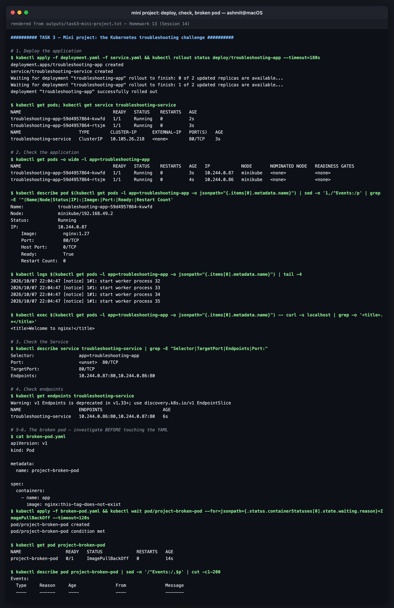
*mini project: deploy, check, broken pod*

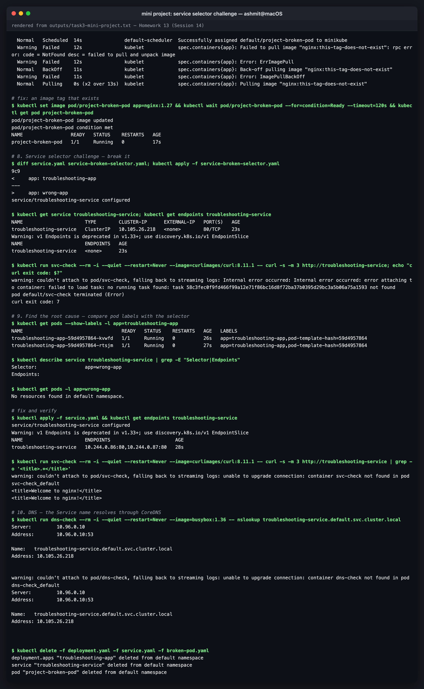
*mini project: service selector challenge*

---

# Task 4 — A real incident: control plane starved on this cluster

This one was not staged. It surfaced while starting these homeworks and kept breaking them
(an Ingress lab, the HPA lab, a Helm run) until the real cause was found. Transcript, appended
to as the investigation went on:
[`outputs/task4-real-incident-probe-restarts.txt`](outputs/task4-real-incident-probe-restarts.txt).

### Symptom

On an idle, 19-day-old cluster: `ingress-nginx-controller` had restarted **137** times,
`kube-apiserver` **55**, `storage-provisioner` **406**. Later, `kubectl` itself failed with
`net/http: TLS handshake timeout`.

### Investigation, in order

| Step | Evidence | Conclusion |
|---|---|---|
| exit code of the restarted controller | `143` = 128 + SIGTERM | the kubelet killed it; it did not crash |
| its events | `Liveness probe failed: … context deadline exceeded`, x1757 | probes timing out (1 s timeout), not failing |
| node events | `NodeNotReady` x82 on `minikube` | the node, not the pod |
| node capacity vs container limit | node reports **4010356Ki / 8 CPUs**; `docker inspect` shows **1.76 GiB / 2 CPUs** | the kubelet advertises the whole Docker VM, not its own container's cgroup |
| cgroup `memory.events` | `max 25289236`, `oom_kill 0` | pressed against the memory ceiling 25 M times, but never OOM-killed: thrashing |
| collateral damage | storage-provisioner `leaderelection lost`; metrics-server `panic: … TLS handshake timeout` | leader-elected and API-dependent components die when the API server stalls |
| CPU pressure vs cgroup quota | `cpu.max 1600000 800000` (= 2 CPUs), `throttled_usec 330726353524` (~92 h), PSI `some avg10=91.88` | **the root cause** |

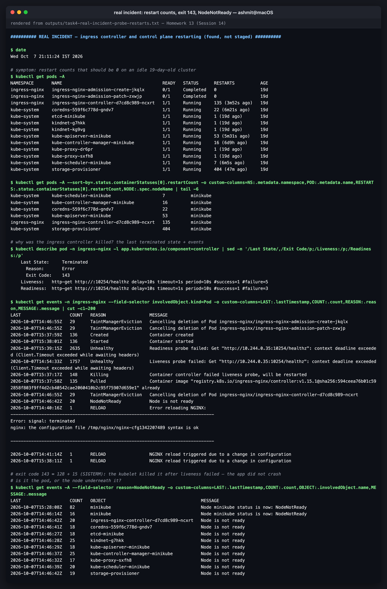
*symptoms: restart counts, exit 143, NodeNotReady*

### Root cause

The nodes were created in Homework 8 with `minikube start --cpus=2 --memory=1800`. Docker
enforces those caps, but the **kubelet reports the whole Docker VM** (8 CPUs, ~3.8 GiB) as the
node's capacity. Every scheduling decision and every component assumed about 4× the CPU it
actually got. The control plane was CPU-throttled for an accumulated ~92 hours. Under
throttling, liveness probes with `timeoutSeconds: 1` time out, the kubelet SIGTERMs the
container (exit 143), and it restarts. That accounts for every restart counted above.

Two things made it acute while these labs ran:
- an HPA load generator with **no CPU limit** (four tight loops on the control-plane node;
  [Homework 12](../12-storage-hpa-probes#the-first-attempt-and-why-the-load-generator-has-a-cpu-limit))
- an idle LocalStack container burning 235% CPU on failed DNS lookups

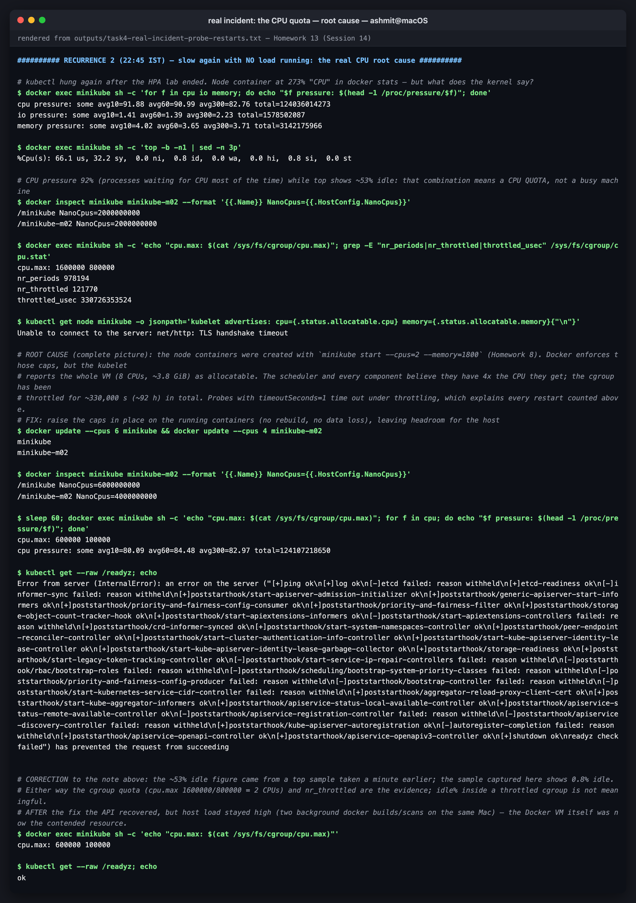
*the CPU quota — root cause*

### Fix (no cluster rebuild)

```console
$ docker update --memory 2900m --memory-swap 2900m minikube
minikube

$ docker update --cpus 6 minikube && docker update --cpus 4 minikube-m02
minikube
minikube-m02
```

`docker update` changes the cgroup limits of a **running** container, so there was no
rebuild and no data loss. Also: a CPU limit and nodeSelector on every load generator, the idle
LocalStack stopped, background builds throttled to `--cpus=1`, and the worker node stopped to
leave headroom.

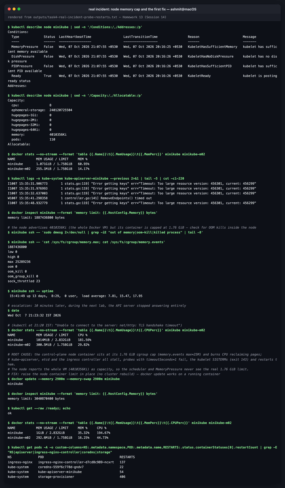
*node memory cap and the first fix*

### After

```console
$ docker exec minikube sh -c 'echo "cpu.max: $(cat /sys/fs/cgroup/cpu.max)"; echo "cpu pressure: $(head -1 /proc/pressure/cpu)"; echo "mem pressure: $(head -1 /proc/pressure/memory)"'
cpu.max: 1200000 200000
cpu pressure: some avg10=40.39 avg60=26.08 avg300=17.98 total=129334738235
mem pressure: some avg10=0.41 avg60=0.31 avg300=0.27 total=3578208995

$ kubectl get pods -A -o custom-columns=NS:.metadata.namespace,POD:.metadata.name,RESTARTS:.status.containerStatuses[0].restartCount,STARTED:.status.containerStatuses[0].state.running.startedAt | grep -E 'NS|apiserver|ingress-nginx-controller|coredns|storage|metrics|etcd|scheduler'
NS              POD                                        RESTARTS   STARTED
ingress-nginx   ingress-nginx-controller-d7cd8c989-gvnsv   16         2026-10-07T19:04:33Z
kube-system     coredns-559f6c778d-gndv7                   25         2026-10-07T19:03:05Z
kube-system     etcd-minikube                              2          2026-10-07T19:02:16Z
kube-system     kube-apiserver-minikube                    65         2026-10-07T19:02:16Z
kube-system     kube-scheduler-minikube                    9          2026-10-07T19:02:16Z
kube-system     metrics-server-768f9f6999-gb88p            1          2026-10-07T21:19:14Z
kube-system     storage-provisioner                        437        2026-10-07T19:12:16Z
```

`cpu.max` is now 6 CPUs (1200000/200000). Memory pressure is near zero. The counters stopped:
the API server's current container started at 19:02 UTC and was still running ~3 hours later.
All ten Task 2 scenarios ran afterwards with **zero** `Unable to connect` errors across every
transcript.

**What could not be fixed from inside Kubernetes:** the host. This is an 8 GB Mac running the
Docker VM, and it had about 10 GB of swap in use during the work. Whenever the host swapped
hard, the VM stalled regardless of any cgroup setting. The honest lesson for a laptop cluster
is to size the cluster to the machine (one node, fewer addons) rather than to the tutorial.

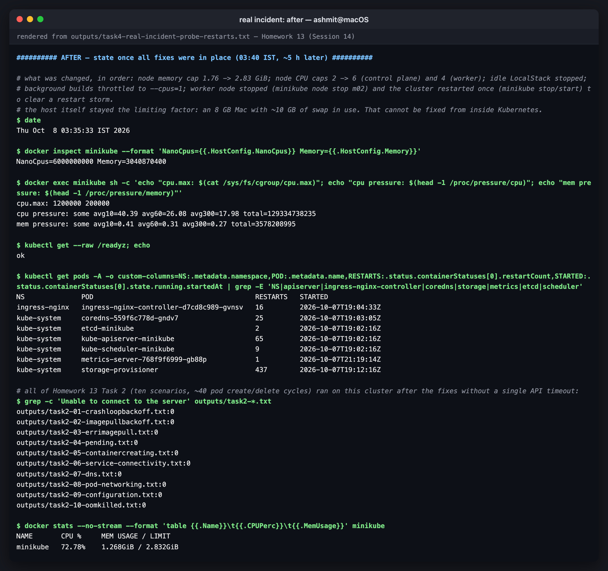
*after*

**Lessons that transfer to real clusters:**
- Restart counts on system pods are an alarm, not noise.
- Exit 143 plus `Liveness probe failed: context deadline exceeded` points at the node, not the
  app.
- A container's view of its resources (`/proc/meminfo`, `nproc`) can disagree with its cgroup.
  Check `cpu.max`, `memory.max`, `cpu.stat` and `/proc/pressure`.
- CPU starvation never kills anything outright. It makes everything slow, and timeouts do the
  rest.

---

## Reproducing this

```bash
cd 13-k8s-troubleshooting
kubectl apply -f commands/demo-app.yaml          # Task 1: practise get/describe/logs/exec/events/explain/top
for d in issues/*/; do echo "$d"; ls "$d"; done  # Task 2: apply broken.yaml, investigate, apply fixed.yaml
kubectl apply -f issues/01-crashloopbackoff/broken.yaml
kubectl logs crashloop-pod --previous
kubectl delete pod crashloop-pod && kubectl apply -f issues/01-crashloopbackoff/fixed.yaml
cd mini-project && kubectl apply -f deployment.yaml -f service.yaml -f broken-pod.yaml   # Task 3
# Task 4 — check your own nodes:
docker inspect minikube --format '{{.HostConfig.NanoCpus}} {{.HostConfig.Memory}}'
docker exec minikube sh -c 'cat /sys/fs/cgroup/cpu.max /proc/pressure/cpu; grep throttled /sys/fs/cgroup/cpu.stat'
```

## Files

```
13-k8s-troubleshooting/
├── README.md
├── commands/demo-app.yaml
├── issues/
│   ├── 01-crashloopbackoff/   02-imagepullbackoff/   03-errimagepull/   04-pending/
│   ├── 05-containercreating/  06-service-connectivity/  07-dns/   08-pod-networking/
│   └── 09-configuration/      10-oomkilled/           (each: broken + fixed manifests)
├── mini-project/              course files + service-broken-selector.yaml
├── outputs/
│   ├── task1-commands.txt
│   ├── task2-01 … task2-10-*.txt
│   ├── task3-mini-project.txt
│   └── task4-real-incident-probe-restarts.txt
└── screenshots/
```
