# Homework 14 — Helm

Course session: **`session-15-helm`**.

Three tasks:
- every Helm command from the session
- a complete Install → Upgrade → Verify → Upgrade again → Verify → Rollback → Verify workflow
- the Notes-app mini-project

**All output blocks are extracted verbatim** from the transcripts in [`outputs/`](outputs).
Cluster: the Minikube cluster from [Homework 8](../08-k8s-fundamentals). Helm **v4.3.0**.

The screenshots are **renders of those transcripts**, not captures of a live terminal — every lab ran non-interactively, so there was no window to photograph. Each image names its source transcript in the title bar; see [`screenshots/`](screenshots).

Findings worth reading even if you skip the rest:

- **A failed `helm upgrade` changed what the *healthy* pods were serving.** The release was
  marked `failed` and the broken image never started. But the chart mounts a ConfigMap as a
  directory, Helm had already updated that ConfigMap, and the kubelet pushed the new content
  into the old pods. A rollback took another ~60 s to undo it. Measured, explained and fixed
  in [Task 2b](#task-2b--a-failed-upgrade-that-still-reached-production).
- **The course mini-project's chart silently ignores config-only changes.** `helm upgrade`
  reports success and the ConfigMap changes, but the pods keep running with the old value.
  Fixed with a `checksum/config` annotation in [Task 3](#task-3--mini-project-the-notes-app).
- **Helm 4 changed flags the course uses.** `--atomic` is deprecated (it still works, with a
  warning) in favour of `--rollback-on-failure`. `--wait` now takes a strategy, and releases
  are applied with **server-side apply**.

| Deliverable | Where |
|---|---|
| Helm chart, `values.yaml`, templates | [`rollback-demo/`](rollback-demo) (written here), [`demo-app/`](demo-app) (`helm create`), [`mini-project/notes-chart/`](mini-project/notes-chart) (course) and its fix |
| Installation, upgrade, rollback | [Task 1](#task-1--helm-commands), [Task 2](#task-2--the-rollback-workflow) |
| Screenshots | [`screenshots/`](screenshots), inline below |
| Mini project | [Task 3](#task-3--mini-project-the-notes-app) |

---

## What Helm is, briefly

Helm is the package manager for Kubernetes:

| Term | Meaning |
|---|---|
| **Chart** | a package: `Chart.yaml` (metadata) + `values.yaml` (defaults) + `templates/` (Go-templated manifests) |
| **Values** | the inputs. Defaults in `values.yaml`, overridden with `-f file.yaml` and `--set key=value` (later wins) |
| **Release** | one installed instance of a chart, with a name (`helm install shop ./chart` makes release `shop`) |
| **Revision** | every install, upgrade and rollback creates a new numbered revision of the release |
| **Repository** | an HTTP server with an `index.yaml` listing packaged charts |

Helm renders templates and values into plain manifests and applies them. It also stores each
revision as a Secret in the release namespace (`sh.helm.release.v1.<name>.v<N>`), and that is
what makes `history` and `rollback` possible.

---

# Task 1 — Helm commands

Transcript: [`outputs/task1-helm-commands.txt`](outputs/task1-helm-commands.txt).

| Command | What it does | Shown below |
|---|---|---|
| `helm repo add/list/update/remove` | manage chart repositories | yes |
| `helm search repo` / `helm search hub` | search added repos (local index) / Artifact Hub | yes |
| `helm show chart` | inspect a chart without installing it | yes |
| `helm create` | scaffold a new chart | yes |
| `helm lint` / `helm template` | validate / render locally, no cluster changes | yes |
| `helm install` | create a release (revision 1) | yes |
| `helm list` | releases in the namespace (`-A` all namespaces) | yes |
| `helm status` | state of a release, its resources and NOTES | yes |
| `helm get values/manifest/notes/metadata` | what Helm stored for a revision | yes |
| `helm upgrade` | new revision with a new chart and/or values | yes |
| `helm history` | all revisions of a release | yes |
| `helm rollback` | new revision that re-applies an old one | yes |
| `helm uninstall` | delete the release and its resources | yes |

## helm repo and helm search

```console
$ helm repo add bitnami https://charts.bitnami.com/bitnami
"bitnami" has been added to your repositories

$ helm repo add ingress-nginx https://kubernetes.github.io/ingress-nginx
"ingress-nginx" has been added to your repositories

$ helm search repo ingress-nginx/ingress-nginx --versions | head -4
NAME                       	CHART VERSION	APP VERSION	DESCRIPTION                                       
ingress-nginx/ingress-nginx	4.15.1       	1.15.1     	Ingress controller for Kubernetes using NGINX a...
ingress-nginx/ingress-nginx	4.15.0       	1.15.0     	Ingress controller for Kubernetes using NGINX a...
ingress-nginx/ingress-nginx	4.14.5       	1.14.5     	Ingress controller for Kubernetes using NGINX a...
```

`CHART VERSION` and `APP VERSION` are different things: chart 4.15.1 *packages* controller
1.15.1. The chart version changes whenever the packaging changes, even if the app does not.
`helm search repo` searches the local copy of each repo's index (refreshed by
`helm repo update`), while `helm search hub` queries Artifact Hub across thousands of repos.

> `helm repo list` in the transcript also shows `prometheus-community` and `grafana`. Those
> were added on this machine earlier, while preparing the monitoring stack for the final
> project.

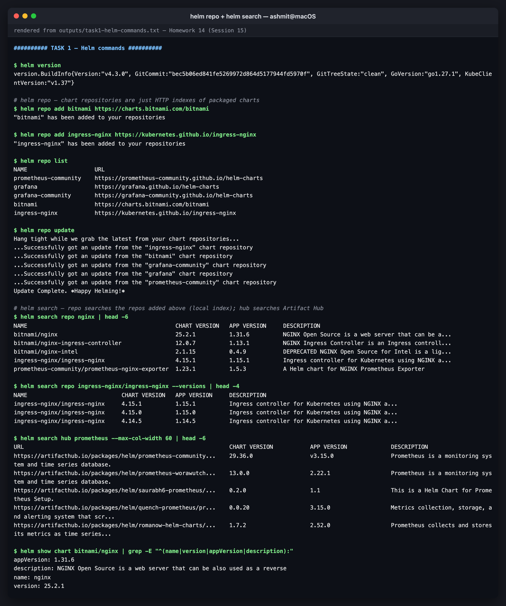
*helm repo + helm search*

## helm create, lint, template, install, list

```console
$ find demo-app -type f | sort
demo-app/.helmignore
demo-app/Chart.yaml
demo-app/templates/NOTES.txt
demo-app/templates/_helpers.tpl
demo-app/templates/deployment.yaml
demo-app/templates/hpa.yaml
demo-app/templates/httproute.yaml
demo-app/templates/ingress.yaml
demo-app/templates/service.yaml
demo-app/templates/serviceaccount.yaml
demo-app/templates/tests/test-connection.yaml
demo-app/values.yaml

$ helm template demo-app ./demo-app | grep -E "^(kind|  name):" 
kind: ServiceAccount
  name: demo-app
kind: Service
  name: demo-app
kind: Deployment
  name: demo-app
kind: Pod
  name: "demo-app-test-connection"

$ helm install demo ./demo-app --set image.tag=1.27-alpine --set replicaCount=2 --wait --timeout 3m
NAME: demo
LAST DEPLOYED: Thu Oct  8 03:05:24 2026
NAMESPACE: default
STATUS: deployed
REVISION: 1
DESCRIPTION: Install complete
```

`helm create` in Helm 4 scaffolds an `httproute.yaml`, a Gateway API route next to the classic
Ingress (see [Homework 11](../11-ingress-configmaps-secrets/ingress-vs-ingress-controller)).
`helm template` renders locally with no cluster access, so it is how you review exactly what an
install would create. The test Pod renders but is only created by `helm test`.

```console
$ helm list
NAME	NAMESPACE	REVISION	UPDATED                             	STATUS  	CHART         	APP VERSION
demo	default  	1       	2026-10-08 03:05:24.594334 +0530 IST	deployed	demo-app-0.1.0	1.16.0     
```

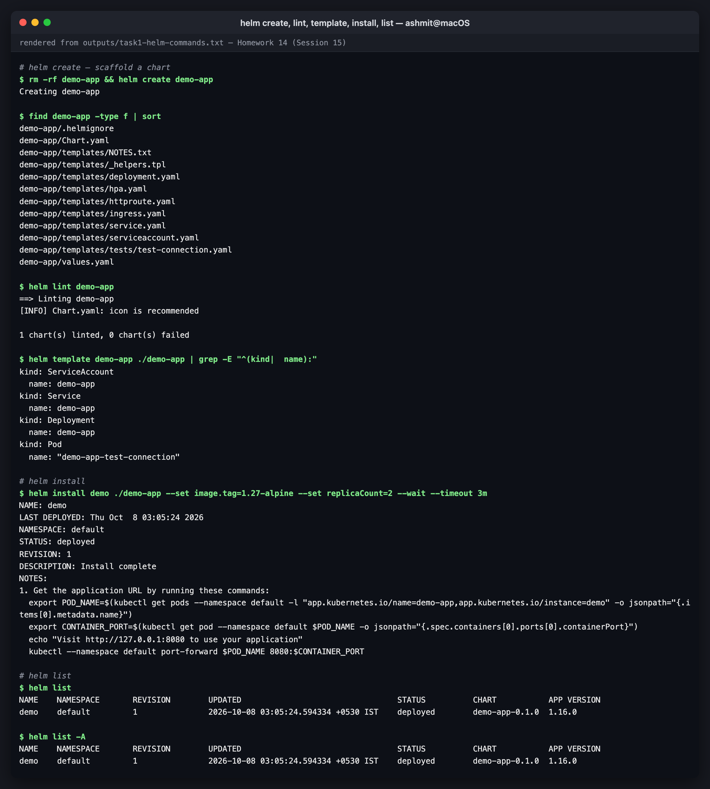
*helm create, lint, template, install, list*

## helm status and helm get

```console
$ helm get values demo
USER-SUPPLIED VALUES:
image:
  tag: 1.27-alpine
replicaCount: 2

$ helm get manifest demo | grep -E "^(kind|  name):|image:"
kind: ServiceAccount
  name: demo-demo-app
kind: Service
  name: demo-demo-app
kind: Deployment
  name: demo-demo-app
          image: "nginx:1.27-alpine"

$ helm get metadata demo
NAME: demo
CHART: demo-app
VERSION: 0.1.0
APP_VERSION: 1.16.0
ANNOTATIONS: 
LABELS: modifiedAt=1791408927,name=demo,owner=helm,status=deployed,version=1
DEPENDENCIES: 
NAMESPACE: default
REVISION: 1
STATUS: deployed
DEPLOYED_AT: 2026-10-08T03:05:24+05:30
APPLY_METHOD: server-side apply

$ kubectl get secrets -l owner=helm
NAME                         TYPE                 DATA   AGE
sh.helm.release.v1.demo.v1   helm.sh/release.v1   1      5s
```

`helm get values` shows only what *you* supplied (`--all` adds the chart defaults).
`helm get manifest` shows exactly what was applied. That release Secret is Helm's entire
memory: delete it and Helm forgets the release, even though the Deployment keeps running.
`APPLY_METHOD: server-side apply` is new in Helm 4, which lets the API server track field
ownership instead of Helm's old three-way merge.

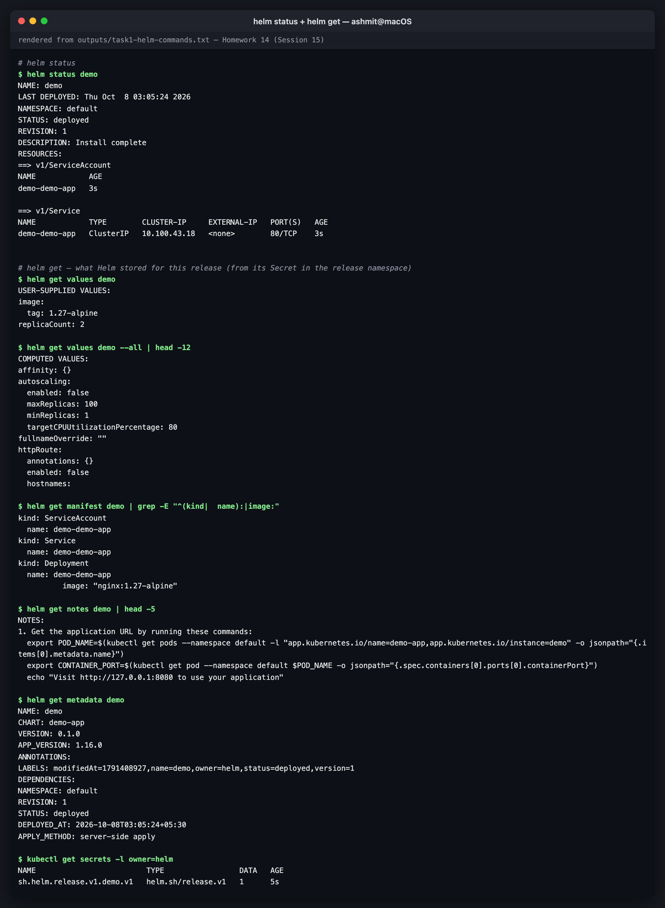
*helm status + helm get*

## helm upgrade, history, rollback, uninstall

```console
$ helm upgrade demo ./demo-app --reuse-values --set replicaCount=3 --wait --timeout 3m
Release "demo" has been upgraded. Happy Helming!

$ helm history demo
REVISION	UPDATED                 	STATUS    	CHART         	APP VERSION	DESCRIPTION     
1       	Thu Oct  8 03:05:24 2026	superseded	demo-app-0.1.0	1.16.0     	Install complete
2       	Thu Oct  8 03:05:29 2026	deployed  	demo-app-0.1.0	1.16.0     	Upgrade complete

$ helm rollback demo 1 --wait --timeout 3m
Rollback was a success! Happy Helming!

$ helm history demo
REVISION	UPDATED                 	STATUS    	CHART         	APP VERSION	DESCRIPTION     
1       	Thu Oct  8 03:05:24 2026	superseded	demo-app-0.1.0	1.16.0     	Install complete
2       	Thu Oct  8 03:05:29 2026	superseded	demo-app-0.1.0	1.16.0     	Upgrade complete
3       	Thu Oct  8 03:05:41 2026	deployed  	demo-app-0.1.0	1.16.0     	Rollback to 1   

$ kubectl get deploy demo-demo-app
NAME            READY   UP-TO-DATE   AVAILABLE   AGE
demo-demo-app   2/2     2            2           21s

$ helm uninstall demo --wait
release "demo" uninstalled
```

`--reuse-values` keeps the earlier `--set image.tag=1.27-alpine`. Without it, an upgrade starts
again from the chart defaults, and that is the most common way an upgrade "loses" a setting.
Rollback to revision 1 created **revision 3**: Helm history is append-only.

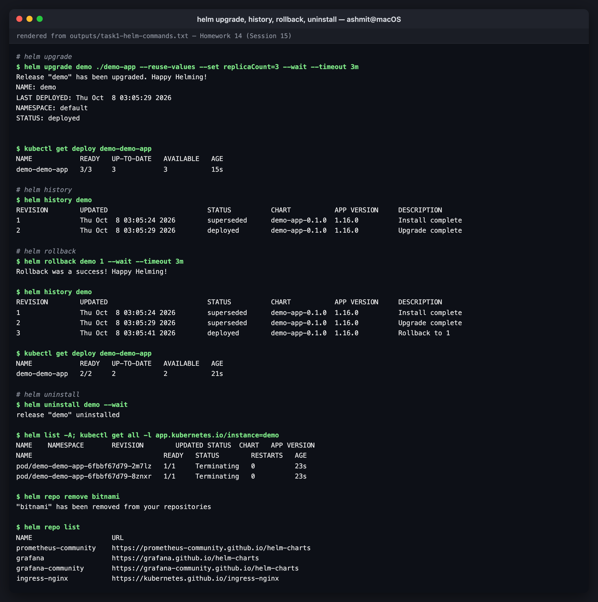
*helm upgrade, history, rollback, uninstall*

---

# Task 2 — The rollback workflow

Chart: [`rollback-demo/`](rollback-demo), written for this task. nginx serves a page rendered
from a ConfigMap that names the release, revision, message and image tag, so every step can be
verified by what the app actually answers, not only by what Helm reports. Transcript:
[`outputs/task2-rollback-workflow.txt`](outputs/task2-rollback-workflow.txt).

```
Install (rev 1) ─► Verify ─► Upgrade (rev 2) ─► Verify ─► Upgrade again (rev 3, BAD) ─► Verify ─► Rollback (rev 4 = copy of 2) ─► Verify
```

### Install → Verify

```console
$ helm install shop . --wait --timeout 3m
NAME: shop
LAST DEPLOYED: Thu Oct  8 03:05:48 2026
NAMESPACE: default
STATUS: deployed
REVISION: 1
DESCRIPTION: Install complete
TEST SUITE: None
NOTES:
shop revision 1 deployed: nginx 1.26-alpine, 1 replica(s).
Test it:  kubectl run t --rm -i --restart=Never --image=curlimages/curl -- curl -s http://shop

$ kubectl run v --rm -i --quiet --restart=Never --image=curlimages/curl:8.11.1 -- curl -s http://shop
shop | revision 1 | v1 - initial install | nginx 1.26-alpine
```

### Upgrade → Verify

```console
$ helm upgrade shop . --set image.tag=1.27-alpine --set replicaCount=3 --set message="v2 - upgraded" --wait --timeout 3m
Release "shop" has been upgraded. Happy Helming!

$ kubectl get deploy shop -o jsonpath='image={.spec.template.spec.containers[0].image} replicas={.status.readyReplicas}{"\n"}'
image=nginx:1.27-alpine replicas=3

$ kubectl run v --rm -i --quiet --restart=Never --image=curlimages/curl:8.11.1 -- curl -s http://shop
shop | revision 2 | v2 - upgraded | nginx 1.27-alpine
```

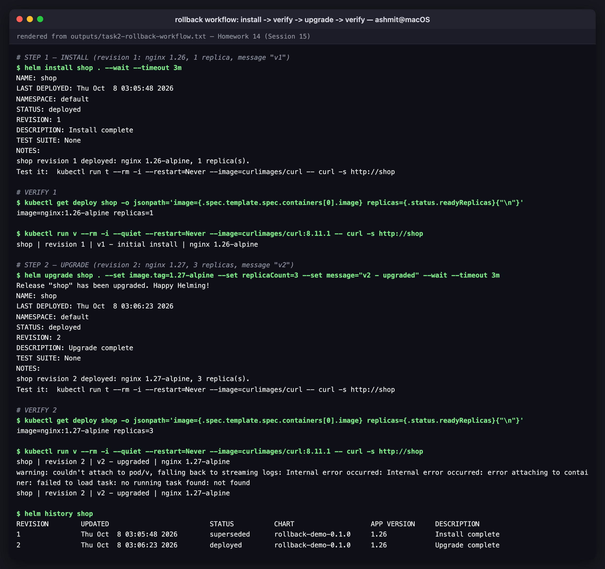
*install -> verify -> upgrade -> verify*

### Upgrade again (a bad release) → Verify

```console
$ helm upgrade shop . --reuse-values --set image.tag=1.99-does-not-exist --set message="v3 - broken" --wait --timeout 60s
level=WARN msg="upgrade failed" name=shop error="resource Deployment/default/shop not ready. status: InProgress, message: Updated: 1/3\ncontext deadline exceeded"
Error: UPGRADE FAILED: resource Deployment/default/shop not ready. status: InProgress, message: Updated: 1/3
context deadline exceeded

$ kubectl get pods -l app.kubernetes.io/instance=shop
NAME                    READY   STATUS             RESTARTS   AGE
shop-5ff56567c8-9qnzz   0/1     ImagePullBackOff   0          62s
shop-746c7b978f-ckkpd   1/1     Running            0          86s
shop-746c7b978f-nssb4   1/1     Running            0          91s
shop-746c7b978f-xnqcd   1/1     Running            0          79s

$ kubectl get deploy shop -o jsonpath='desired={.spec.replicas} ready={.status.readyReplicas} updated={.status.updatedReplicas}{"\n"}'
desired=3 ready=3 updated=1
```

`--wait` is what makes Helm notice. Without it, Helm would have printed "deployed" the moment
the API server accepted the manifests. The rolling update stopped after one new pod (which can
never pull its image), and the three old pods are still Running, so users are still served.
Helm marks the revision `failed` but **does not undo anything**.

### Rollback → Verify

```console
$ helm rollback shop 2 --wait --timeout 3m
Rollback was a success! Happy Helming!

$ helm history shop
REVISION	UPDATED                 	STATUS    	CHART              	APP VERSION	DESCRIPTION                                                                                  
1       	Thu Oct  8 03:05:48 2026	superseded	rollback-demo-0.1.0	1.26       	Install complete                                                                             
2       	Thu Oct  8 03:06:23 2026	superseded	rollback-demo-0.1.0	1.26       	Upgrade complete                                                                             
3       	Thu Oct  8 03:06:54 2026	failed    	rollback-demo-0.1.0	1.26       	Upgrade "shop" failed: resource Deployment/default/shop not ready. status: InProgress, messag
4       	Thu Oct  8 03:08:02 2026	deployed  	rollback-demo-0.1.0	1.26       	Rollback to 2                                                                                

$ kubectl get deploy shop -o jsonpath='image={.spec.template.spec.containers[0].image} replicas={.status.readyReplicas}{"\n"}'
image=nginx:1.27-alpine replicas=3

$ helm get values shop --revision 4
USER-SUPPLIED VALUES:
image:
  tag: 1.27-alpine
message: v2 - upgraded
replicaCount: 3
```

Revision 4 is a copy of revision 2: the image is back to 1.27, the broken pod is gone, and the
values are v2's. **But the application itself said something else**, straight after the
rollback:

```console
$ kubectl run v --rm -i --quiet --restart=Never --image=curlimages/curl:8.11.1 -- curl -s http://shop
shop | revision 3 | v3 - broken | nginx 1.99-does-not-exist
```

The image is 1.27, yet the page is the broken release's. That was worth a separate
experiment: see Task 2b.

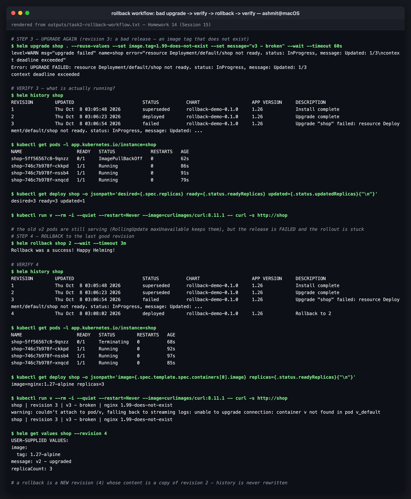
*bad upgrade -> verify -> rollback -> verify*

### Automatic rollback: `--atomic` in Helm 4

```console
$ helm upgrade shop . --reuse-values --set image.tag=1.99-does-not-exist --atomic --timeout 60s
Flag --atomic has been deprecated, use --rollback-on-failure instead
level=WARN msg="upgrade failed" name=shop error="resource Deployment/default/shop not ready. status: InProgress, message: Updated: 1/3\ncontext deadline exceeded"
Error: UPGRADE FAILED: release shop failed, and has been rolled back due to rollback-on-failure being set: resource Deployment/default/shop not ready. status: InProgress,
context deadline exceeded
```

The course's `--atomic` still works in Helm 4, with a deprecation warning. The new name is
`--rollback-on-failure`, and it implies `--wait`. Each failed attempt adds two revisions: the
failed upgrade, then the automatic "Rollback to N":

```console
5       	Thu Oct  8 03:08:11 2026	failed    	rollback-demo-0.1.0	1.26       	Upgrade "shop" failed: resource Deployment/default/shop not ready. status: InProgress, messag
6       	Thu Oct  8 03:09:13 2026	superseded	rollback-demo-0.1.0	1.26       	Rollback to 4                                                                                
7       	Thu Oct  8 03:09:14 2026	failed    	rollback-demo-0.1.0	1.26       	Upgrade "shop" failed: resource Deployment/default/shop not ready. status: InProgress, messag
8       	Thu Oct  8 03:10:14 2026	deployed  	rollback-demo-0.1.0	1.26       	Rollback to 6                                                                                
```

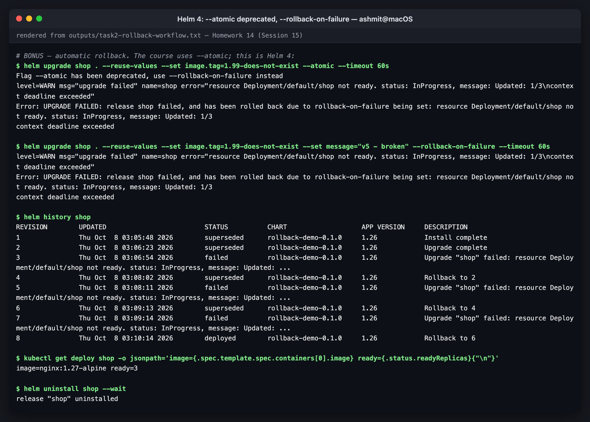
*Helm 4: --atomic deprecated, --rollback-on-failure*

---

# Task 2b — A failed upgrade that still reached production

Transcript: [`outputs/task2b-configmap-leak.txt`](outputs/task2b-configmap-leak.txt). A
`probe` pod sent three requests through the Service every 10 seconds while a broken upgrade
ran and was rolled back.

```console
# start a broken upgrade (image does not exist) in the background, and sample what the CURRENT healthy pods serve every 10 s
$ # sampling: 3 requests through the Service every 10 s (time | revision | message)
03:11:09   revision 1 | v1 - good  ; revision 1 | v1 - good  ; revision 1 | v1 - good  ;
03:11:59   revision 1 | v1 - good  ; revision 1 | v1 - good  ; revision 1 | v1 - good  ;
03:12:09   revision 1 | v1 - good  ; revision 1 | v1 - good  ; revision 1 | v1 - good  ;
03:12:20   revision 1 | v1 - good  ; revision 1 | v1 - good  ; revision 2 | v2 - BROKEN  ;
03:12:31   revision 2 | v2 - BROKEN  ; revision 2 | v2 - BROKEN  ; revision 1 | v1 - good  ;

$ kubectl get pods -l app.kubernetes.io/instance=shop -o custom-columns=POD:.metadata.name,STATUS:.status.phase,READY:.status.containerStatuses[0].ready,IMAGE:.spec.containers[0].image
POD                     STATUS    READY   IMAGE
shop-688bf96bb7-bzkf6   Pending   false   nginx:1.99-does-not-exist
shop-795d64d6ff-g9vq9   Running   true    nginx:1.27-alpine
shop-795d64d6ff-qp5z6   Running   true    nginx:1.27-alpine
shop-795d64d6ff-x9k94   Running   true    nginx:1.27-alpine

$ helm rollback shop 1 --wait --timeout 3m
Rollback was a success! Happy Helming!

$ # sampling after the rollback
03:12:47   revision 2 | v2 - BROKEN  ; revision 2 | v2 - BROKEN  ; revision 2 | v2 - BROKEN  ;
03:13:35   revision 2 | v2 - BROKEN  ; revision 2 | v2 - BROKEN  ; revision 2 | v2 - BROKEN  ;
03:13:46   revision 1 | v1 - good  ; revision 1 | v1 - good  ; revision 1 | v1 - good  ;
03:13:57   revision 1 | v1 - good  ; revision 2 | v2 - BROKEN  ; revision 1 | v1 - good  ;
03:14:09   revision 1 | v1 - good  ; revision 1 | v1 - good  ; revision 1 | v1 - good  ;
```

*(excerpt; every sample is in the transcript)*

The only pod running the new image is `Pending` and never served a request, yet **every
response was the broken release's content** from about 70 s into the upgrade until about 60 s
after the rollback.

**Why:**

1. `helm upgrade` applies **every** resource in the new revision at once, including the
   ConfigMap with the v2 page. Only the Deployment's rollout is gradual.
2. The chart mounts that ConfigMap as a **directory**. The kubelet periodically syncs ConfigMap
   volumes into **running** pods (about every 60–90 s by default). That is a documented
   feature, and here it is the bug.
3. So the old, healthy 1.27 pods started serving v2 content without restarting. Helm's
   rollback put the v1 ConfigMap back, and the same sync delay applied in reverse.

Rolling updates protect you only for what is in the **pod template**. Anything the pods read
live from outside it bypasses the rollout entirely.

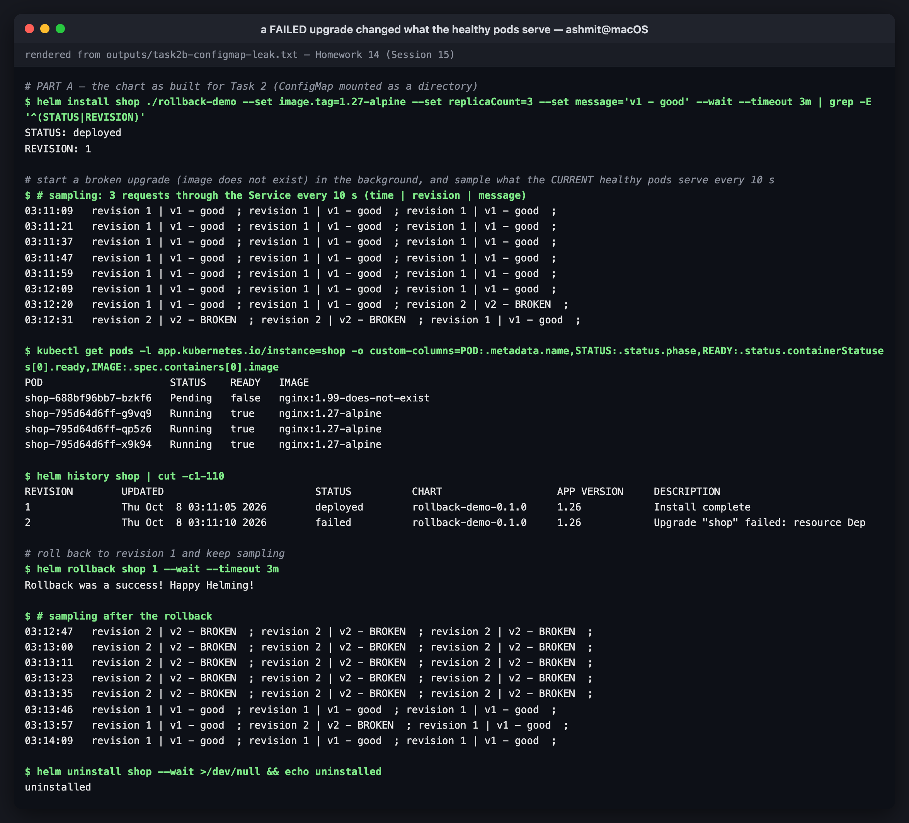
*a FAILED upgrade changed what the healthy pods serve*

**The fix** ([`rollback-demo-fixed/`](rollback-demo-fixed)): mount the file with **`subPath`**.
A subPath mount is copied once when the container starts and is never live-updated. The
`checksum/page` annotation that was already in the chart still makes every config change roll
the pods, but only through the rollout, where readiness checks protect it.

```console
$ diff rollback-demo/templates/deployment.yaml rollback-demo-fixed/templates/deployment.yaml
32a33,35
>             # subPath: the file is copied in when the container starts and is NOT live-updated.
>             # A whole-directory ConfigMap mount IS live-updated by the kubelet, which let a failed
>             # upgrade's new ConfigMap leak into the old, healthy pods (see the README).
34c37,38
<               mountPath: /usr/share/nginx/html
---
>               mountPath: /usr/share/nginx/html/index.html
>               subPath: index.html
```

Same experiment, fixed chart:

```console
03:15:32   revision 1 | v1 - good  ; revision 1 | v1 - good  ; revision 1 | v1 - good  ;
03:15:44   revision 1 | v1 - good  ; revision 1 | v1 - good  ; revision 1 | v1 - good  ;
03:15:55   revision 1 | v1 - good  ; revision 1 | v1 - good  ; revision 1 | v1 - good  ;

$ kubectl get pods -l app.kubernetes.io/instance=shop -o custom-columns=POD:.metadata.name,STATUS:.status.phase,READY:.status.containerStatuses[0].ready,IMAGE:.spec.containers[0].image
POD                     STATUS    READY   IMAGE
shop-67b55dbb98-dz4xn   Running   true    nginx:1.27-alpine
shop-67b55dbb98-q8wk9   Running   true    nginx:1.27-alpine
shop-67b55dbb98-zk6sg   Running   true    nginx:1.27-alpine
shop-7f598c6967-dmgtb   Pending   false   nginx:1.99-does-not-exist
```

All 48 requests (16 samples of 3), through the failed upgrade and the rollback, returned `v1 - good`.

Other ways to get the same guarantee:
- **immutable, versioned ConfigMaps** (a content hash in the name, as Kustomize's
  `configMapGenerator` does), so each revision has its own ConfigMap
- reading config from **environment variables**, which are fixed at container start
- keeping config in the image

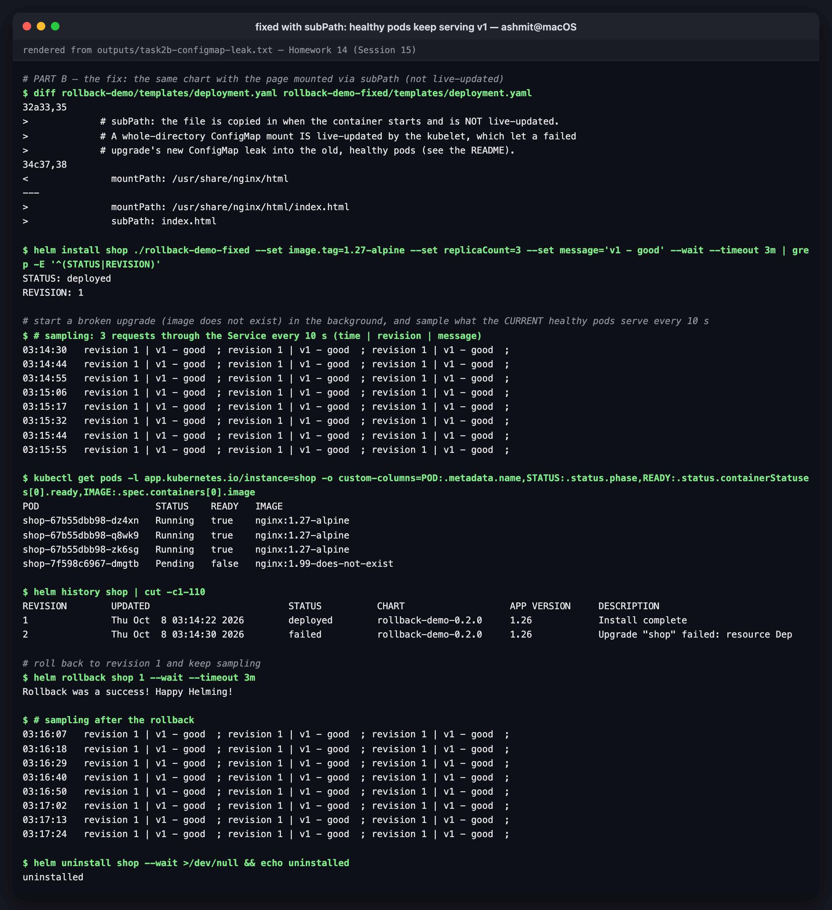
*fixed with subPath: healthy pods keep serving v1*

---

# Task 3 — Mini project: the Notes app

The course chart is used unchanged:
[`mini-project/notes-chart/`](mini-project/notes-chart), with `Chart.yaml`, `values.yaml`,
`values-prod.yaml`, and `templates/` containing a ConfigMap, a Deployment that uses `envFrom`
on that ConfigMap, and a NodePort Service. Transcript:
[`outputs/task3-mini-project.txt`](outputs/task3-mini-project.txt).

| | `values.yaml` (dev) | `values-prod.yaml` |
|---|---|---|
| replicas | 1 | 3 |
| image | nginx:1.24 | nginx:1.25 |
| `ENVIRONMENT` | development | production |

### Install (dev) → upgrade (prod)

```console
$ helm install notes notes-chart --wait --timeout 3m
NAME: notes
LAST DEPLOYED: Thu Oct  8 03:18:21 2026
NAMESPACE: default
STATUS: deployed
REVISION: 1
DESCRIPTION: Install complete
TEST SUITE: None

$ kubectl exec deploy/notes-deploy -- printenv ENVIRONMENT; kubectl get deploy notes-deploy -o jsonpath='{.spec.template.spec.containers[0].image} x {.spec.replicas}{"\n"}'
development
nginx:1.24 x 1

$ helm upgrade notes notes-chart -f notes-chart/values-prod.yaml --wait --timeout 3m
Release "notes" has been upgraded. Happy Helming!

$ kubectl exec deploy/notes-deploy -- printenv ENVIRONMENT
production
```

One chart, two environments, with only the values file different.

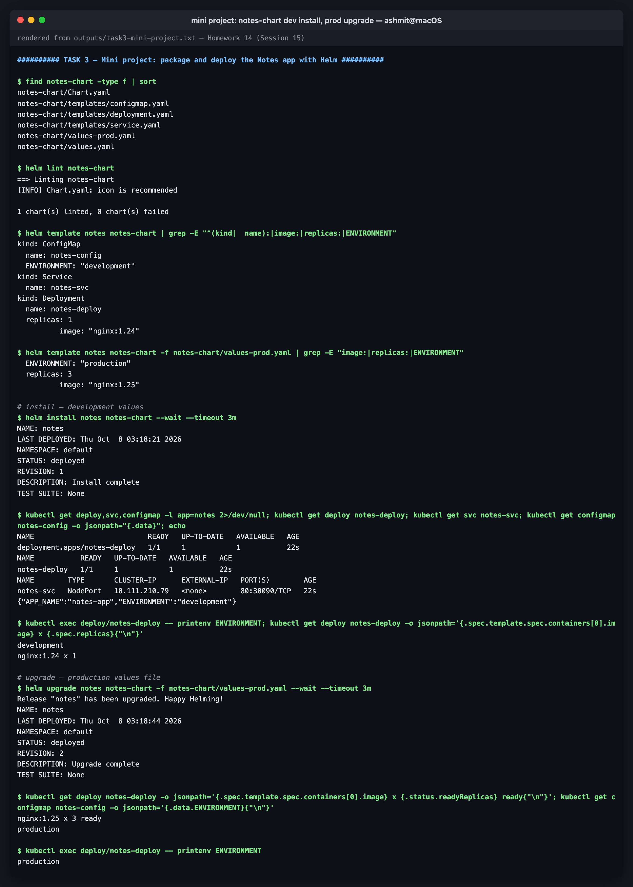
*notes-chart dev install, prod upgrade*

### The bug: a config-only upgrade that does nothing

That upgrade worked because the **image** also changed (1.24 → 1.25), which rolled the pods,
and new pods read the new ConfigMap. Change **only** the config:

```console
$ helm upgrade notes notes-chart -f notes-chart/values-prod.yaml --set app.environment=staging --wait --timeout 3m
Release "notes" has been upgraded. Happy Helming!

$ kubectl get configmap notes-config -o jsonpath='ConfigMap says: {.data.ENVIRONMENT}{"\n"}'; echo -n 'pod says:       '; kubectl exec deploy/notes-deploy -- printenv ENVIRONMENT
ConfigMap says: staging
pod says:       production
```

Helm says "upgraded" and the ConfigMap says `staging`, but the running app still says
`production`, with nothing to warn you. `envFrom` copies values into the container only when it
starts, and nothing in the pod template changed, so no pods were replaced.

### The fix: `checksum/config`

[`mini-project/notes-chart-fixed/`](mini-project/notes-chart-fixed) adds one annotation to the
pod template, the standard Helm idiom:

```yaml
      annotations:
        checksum/config: {{ include (print $.Template.BasePath "/configmap.yaml") . | sha256sum }}
```

Any change to the rendered ConfigMap changes this hash, so it changes the pod template, which
triggers a normal rolling update:

```console
$ kubectl get configmap notes-config -o jsonpath='ConfigMap says: {.data.ENVIRONMENT}{"\n"}'; echo -n 'pod says:       '; kubectl exec deploy/notes-deploy -- printenv ENVIRONMENT
ConfigMap says: production-eu
pod says:       production-eu
```

### Rollback to the original production release

```console
$ helm rollback notes 2 --wait --timeout 3m
Rollback was a success! Happy Helming!

$ helm history notes; kubectl get configmap notes-config -o jsonpath='ConfigMap says: {.data.ENVIRONMENT}{"\n"}'; echo -n 'pod says:       '; kubectl exec deploy/notes-deploy -- printenv ENVIRONMENT
REVISION	UPDATED                 	STATUS    	CHART            	APP VERSION	DESCRIPTION     
1       	Thu Oct  8 03:18:21 2026	superseded	notes-chart-0.1.0	1.0        	Install complete
2       	Thu Oct  8 03:18:44 2026	superseded	notes-chart-0.1.0	1.0        	Upgrade complete
3       	Thu Oct  8 03:19:21 2026	superseded	notes-chart-0.1.0	1.0        	Upgrade complete
4       	Thu Oct  8 03:19:22 2026	superseded	notes-chart-0.1.1	1.0        	Upgrade complete
5       	Thu Oct  8 03:19:27 2026	superseded	notes-chart-0.1.1	1.0        	Upgrade complete
6       	Thu Oct  8 03:19:31 2026	deployed  	notes-chart-0.1.0	1.0        	Rollback to 2   
ConfigMap says: production
pod says:       production
```

The `CHART` column shows a rollback can also go back to an **older chart version**: revision 6
runs `notes-chart-0.1.0` again, because Helm stores the full rendered manifest for every
revision, not just the values.

```console
$ kubectl run t --rm -i --quiet --restart=Never --image=curlimages/curl:8.11.1 -- curl -s http://notes-svc | grep -o "<title>.*</title>"
<title>Welcome to nginx!</title>
```

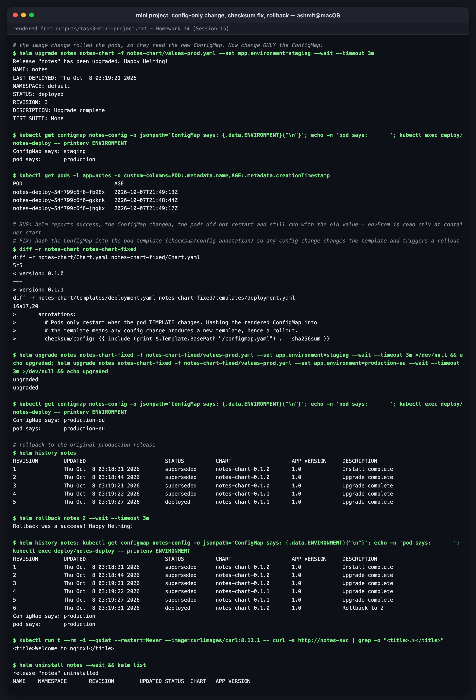
*config-only change, checksum fix, rollback*

---

## Reproducing this

```bash
cd 14-helm
# Task 1
helm repo add ingress-nginx https://kubernetes.github.io/ingress-nginx && helm repo update
helm search repo ingress-nginx --versions | head
helm create demo-app && helm lint demo-app && helm template demo ./demo-app
helm install demo ./demo-app --wait && helm list && helm status demo && helm get values demo
helm upgrade demo ./demo-app --reuse-values --set replicaCount=3 --wait
helm history demo && helm rollback demo 1 --wait && helm uninstall demo
# Task 2
cd rollback-demo
helm install shop . --wait
helm upgrade shop . --set image.tag=1.27-alpine --set replicaCount=3 --set message="v2" --wait
helm upgrade shop . --reuse-values --set image.tag=1.99-does-not-exist --wait --timeout 60s   # fails
helm rollback shop 2 --wait && helm history shop
helm upgrade shop . --reuse-values --set image.tag=1.99-does-not-exist --rollback-on-failure --timeout 60s
# Task 3
cd ../mini-project
helm install notes notes-chart --wait
helm upgrade notes notes-chart -f notes-chart/values-prod.yaml --wait
helm upgrade notes notes-chart-fixed -f notes-chart-fixed/values-prod.yaml --set app.environment=staging --wait
helm rollback notes 2 --wait
```

## Files

```
14-helm/
├── README.md
├── demo-app/                 `helm create` scaffold (Task 1)
├── rollback-demo/            chart written for Task 2 (ConfigMap mounted as a directory)
├── rollback-demo-fixed/      same chart, subPath mount (Task 2b fix)
├── mini-project/
│   ├── notes-chart/          course chart, unchanged
│   └── notes-chart-fixed/    + checksum/config annotation
├── outputs/
│   ├── task1-helm-commands.txt
│   ├── task2-rollback-workflow.txt
│   ├── task2b-configmap-leak.txt
│   └── task3-mini-project.txt
└── screenshots/
```
