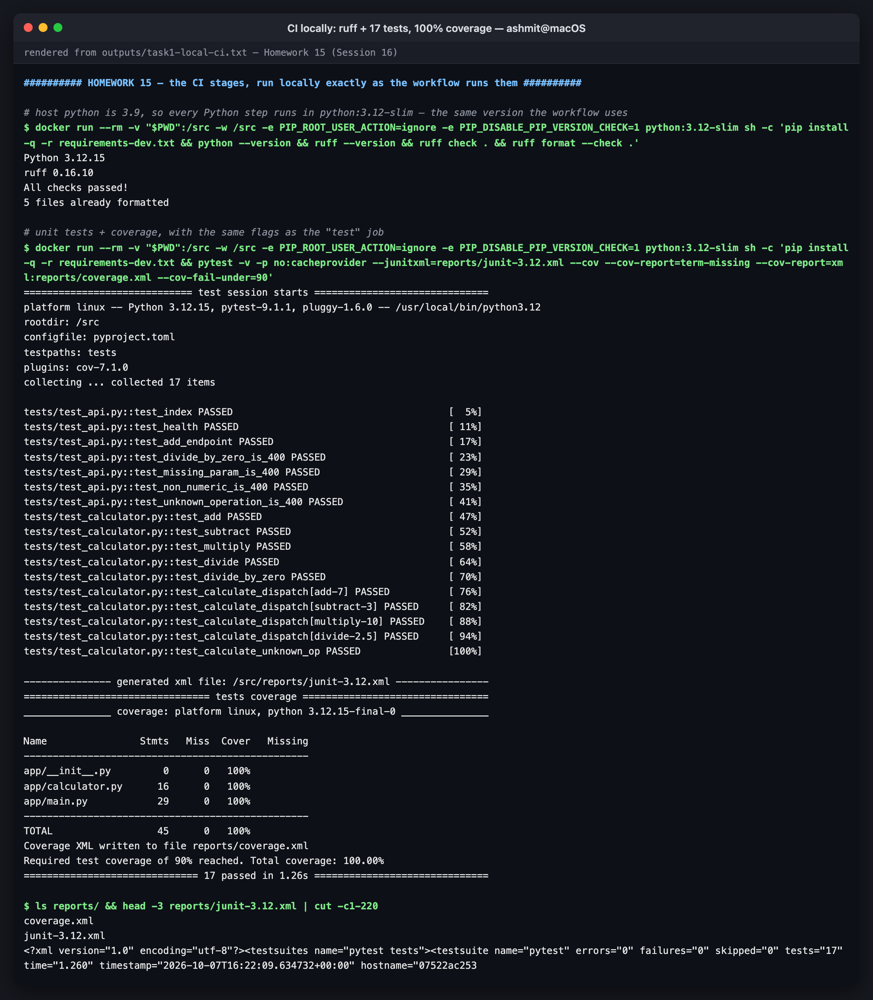
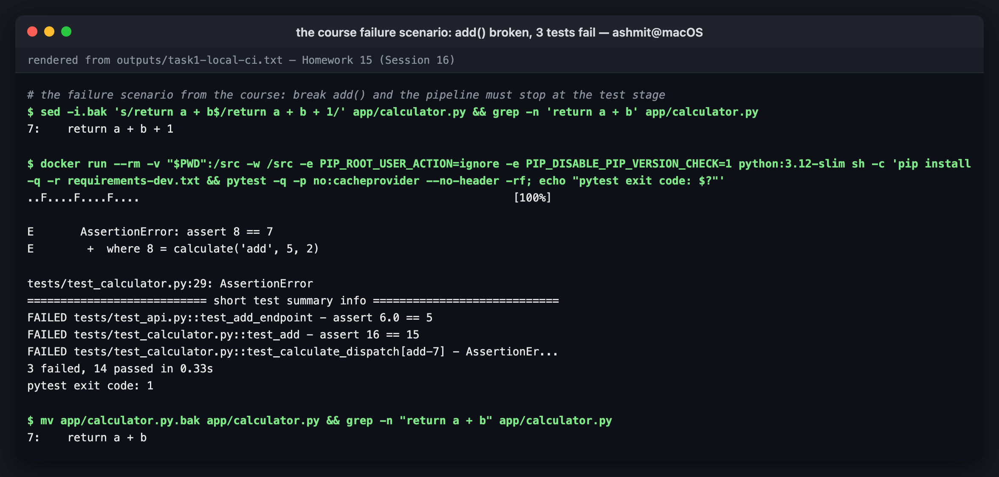
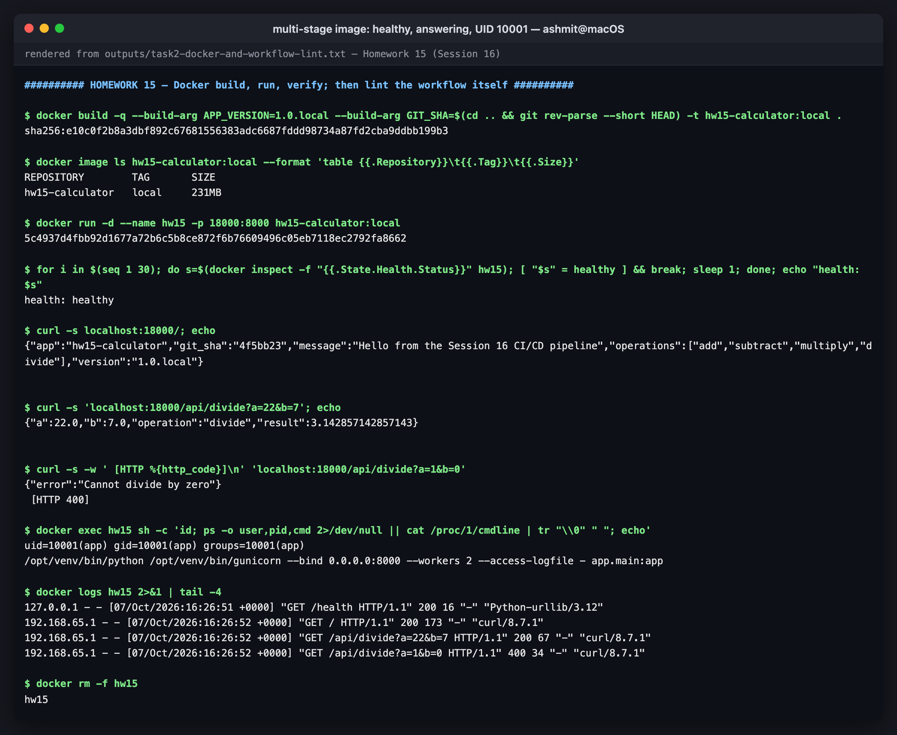
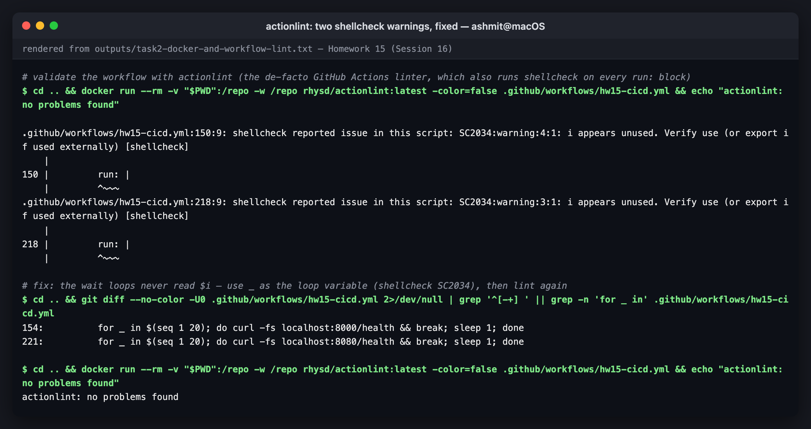

# Homework 15 — CI/CD with GitHub Actions

Course session: **`session-16-github-actions`** (reference project: `10-final-cicd-pipeline`).

A complete CI/CD demo project: a small Flask calculator API with real unit tests, a
multi-stage non-root Dockerfile, Kubernetes manifests, and one GitHub Actions workflow that
**lints, tests on two Python versions, builds the image, pushes it to GitHub Container
Registry and deploys it to a Kubernetes cluster**.

**All output blocks are extracted verbatim** from the transcripts in [`outputs/`](outputs).
The local-run screenshots are **renders of those transcripts**, not captures of a live
terminal; see [`screenshots/`](screenshots). The pipeline-run screenshots further down are
captures of the actual GitHub Actions pages.

| | |
|---|---|
| Workflow | [`../.github/workflows/hw15-cicd.yml`](../.github/workflows/hw15-cicd.yml) |
| Application | [`app/`](app): `calculator.py` (pure logic) + `main.py` (Flask API) |
| Tests | [`tests/`](tests): 17 tests, 100% coverage |
| Image | `ghcr.io/binarybhakti/hw15-calculator` |
| Deploy target | a throwaway **kind** cluster created on the GitHub runner |

> **Why the workflow is at the repository root.** GitHub only runs workflows from
> `.github/workflows/` at the root of a repository. This repo holds every homework, so the
> workflow lives at the root and is scoped to this folder with `paths:` filters and
> `defaults.run.working-directory`. A push that only touches another homework does not
> trigger it.

---

## Course reference vs this project

The course's `10-final-cicd-pipeline` has three jobs (`test` → `build` + `security-check`)
that produce a zip-style artifact. This project keeps that shape and carries it all the way
through to deployment:

| Course `10-final-cicd-pipeline` | This project |
|---|---|
| calculator functions + CLI loop | the same calculator, behind an HTTP API so it can be deployed |
| `test` job: pytest on 3.12 | `lint` job (ruff), then `test` as a **matrix** on 3.12 and 3.13, with coverage gate ≥ 90% |
| `build` job: copies files into `build/` | `build` job: **Docker image**, smoke-tested, exported as an artifact |
| `security-check`: `find -name .env` | `secrets-demo` job (how to *use* secrets safely). Real security scanning is [Homework 16](../16-devsecops) |
| artifact `calculator-build` | artifacts: JUnit XML ×2, coverage report, the image tarball |
| — | **CD**: push to GHCR, deploy to Kubernetes, smoke test, job summary |

---

# CI vs CD

| | **Continuous Integration** | **Continuous Delivery / Deployment** |
|---|---|---|
| Question it answers | *is this change safe to merge?* | *can this change be released, and is it running?* |
| Triggered by | every push and every pull request | merges to `main` |
| Here | `lint` → `test` (matrix) → `build` | `push` (GHCR) → `deploy` (Kubernetes) |
| Output | a verdict (✓/✗) plus reports | a versioned image in a registry and a running Deployment |
| Fails when | lint, tests or coverage fail, or the image doesn't start | the registry push, rollout or smoke test fails |

**Continuous Delivery** means every green `main` *could* be released with one click.
**Continuous Deployment** means it *is* released automatically. This pipeline does
continuous deployment to its test cluster: a green push to `main` ends with the new image
running in Kubernetes.

The dividing line is in the workflow itself, at line 167:

```yaml
  push:
    name: Push image to GHCR
    needs: [build, secrets-demo]
    if: github.event_name != 'pull_request' && github.ref == 'refs/heads/main'
```

A pull request runs CI and stops there. Only a push to `main` continues into CD.

# The pipeline

```
 git push / PR ──► lint ──► test (3.12) ─┐
                            test (3.13) ─┼──► build ──┐
                  secrets-demo ──────────┴────────────┼──► push (GHCR) ──► deploy (kind)
                                                      │      main only
              artifacts: junit ×2, coverage, image ◄──┘
```

| Job | `needs` | Runs on | What it proves |
|---|---|---|---|
| `lint` | — | PR + push | code style and static errors (ruff) |
| `test` | `lint` | PR + push | 17 unit tests pass on **both** Python versions; coverage ≥ 90% |
| `secrets-demo` | — | PR + push | a repository secret can be used without ever being printed |
| `build` | `test` | PR + push | the image builds **and starts**: `/health` and an API call answer inside the job |
| `push` | `build`, `secrets-demo` | push to `main` | the **exact tested image** (loaded from the artifact, not rebuilt) is in GHCR |
| `deploy` | `push` | push to `main` | that image, pinned **by digest**, rolls out on Kubernetes and answers through its Service |

Because every job declares `needs`, a failure anywhere stops everything after it. That is
the course's "Test → FAIL → Build does not run", demonstrated locally below.

# GitHub Actions concepts, mapped to the workflow

| Concept | What it is | Where in [`hw15-cicd.yml`](../.github/workflows/hw15-cicd.yml) |
|---|---|---|
| **Workflow** | a YAML file in `.github/workflows/`; one automated process | the whole file; `name: HW15 CI/CD` |
| **Event / trigger** | what starts a run | lines 6–16: `push` and `pull_request` (with `paths:` filters), `workflow_dispatch` (manual button) |
| **Job** | a set of steps that runs on **one fresh runner** | `lint`, `test`, `secrets-demo`, `build`, `push`, `deploy` (from line 33) |
| **`needs`** | job ordering and dependency; also how outputs pass between jobs | lines 51, 123, 166, 196; `needs.build.outputs.tags`, `needs.push.outputs.digest` |
| **Step** | one command (`run:`) or one reusable action (`uses:`) inside a job | e.g. `uses: actions/checkout@v7`, `run: pytest ...` |
| **Action** | a reusable, versioned step published on GitHub | `actions/setup-python@v7`, `docker/build-push-action@v7`, `helm/kind-action@v1.15.1` |
| **Runner** | the machine that executes a job | `runs-on: ubuntu-latest`, a GitHub-hosted VM that is new for every job |
| **Matrix** | one job definition fanned out into several runs | lines 55–56: `python-version: ["3.12", "3.13"]` → two parallel test jobs |
| **Secrets** | encrypted values, injected at runtime and masked in logs | line 106 `secrets.DEMO_API_KEY`; lines 183 and 213 `secrets.GITHUB_TOKEN` |
| **Permissions** | what the automatic `GITHUB_TOKEN` may do | line 23 (`contents: read` for everything); `packages: write` only in `push`, `packages: read` only in `deploy` |
| **Artifacts** | files kept after a job ends, and passed between jobs | `upload-artifact@v7` (JUnit, coverage, image tar) and `download-artifact@v8` in `push` |
| **Caching** | reuse between runs to save time | `cache: pip` in `setup-python`; Docker layer cache `cache-from/to: type=gha` |
| **Concurrency** | at most one run per branch; newer cancels older | lines 19–21 |
| **Environment** | a named deployment target, shown on the repo page, which can carry protection rules | line 201: `environment: kind-on-runner` |
| **Job summary** | Markdown a job writes for the run page | `>> "$GITHUB_STEP_SUMMARY"`: test table, pushed digest, `kubectl get` output |

### Runners

Every job here uses `ubuntu-latest`, a **GitHub-hosted runner**: a clean VM, free for public
repositories, with Docker, Python and kubectl preinstalled. It is destroyed after the job, so
jobs cannot share files except through artifacts (which is why `push` downloads the image tar
instead of rebuilding it).

The alternatives, from the course's `06-runners`:

| | GitHub-hosted | Self-hosted |
|---|---|---|
| `runs-on` | `ubuntu-latest`, `windows-latest`, `macos-latest` | `[self-hosted, linux, x64]` (labels you choose) |
| Machine | fresh VM per job | your server, VM or Kubernetes pod (e.g. Actions Runner Controller) |
| Good for | almost everything | private network access, GPUs, large caches, compliance |
| Risk | — | **never** use one on a public repo: a fork's PR could run code on your machine |

A **matrix** works with either kind; this workflow uses one to test two Python versions in
parallel.

### Secrets

Two kinds are used:

- **`GITHUB_TOKEN`** is created automatically for every run and expires when the run ends.
  Its rights come from `permissions:`. The workflow default is `contents: read`. The `push`
  job adds `packages: write` so it can publish to GHCR, and `deploy` adds `packages: read` so
  the kind cluster can pull the image, through an `imagePullSecret` built from that same
  short-lived token. No long-lived registry password exists anywhere.
- **`DEMO_API_KEY`** is a repository secret (Settings → Secrets and variables → Actions). The
  `secrets-demo` job shows the safe pattern: it checks *whether* the value is set and *how long*
  it is, and when printed directly GitHub replaces it with `***`. The workflow does not fail if
  the secret is absent, so forks and PRs still run.

Secrets are **not** passed to workflows triggered by pull requests from forks. This is
another reason CD is gated on `push` to `main`.

### Artifacts

| Artifact | Produced by | Contents |
|---|---|---|
| `junit-py3.12`, `junit-py3.13` | `test` (both matrix legs, uploaded even on failure) | JUnit XML, the format CI dashboards understand |
| `coverage-report` | `test` (3.12 leg) | `coverage.xml` + browsable `htmlcov/` |
| `hw15-image` | `build` | the image as a tarball, so `push` publishes **exactly** what was smoke-tested |

---

# Task — running the CI stages locally first

The host has Python 3.9, so each Python step was run in `python:3.12-slim`, the version the
workflow uses. Transcript: [`outputs/task1-local-ci.txt`](outputs/task1-local-ci.txt).

## Lint

```console
$ docker run --rm -v "$PWD":/src -w /src -e PIP_ROOT_USER_ACTION=ignore -e PIP_DISABLE_PIP_VERSION_CHECK=1 python:3.12-slim sh -c 'pip install -q -r requirements-dev.txt && python --version && ruff --version && ruff check . && ruff format --check .'
Python 3.12.15
ruff 0.16.10
All checks passed!
5 files already formatted
```

## Unit tests and coverage

```console
$ docker run --rm -v "$PWD":/src -w /src -e PIP_ROOT_USER_ACTION=ignore -e PIP_DISABLE_PIP_VERSION_CHECK=1 python:3.12-slim sh -c 'pip install -q -r requirements-dev.txt && pytest -v -p no:cacheprovider --junitxml=reports/junit-3.12.xml --cov --cov-report=term-missing --cov-report=xml:reports/coverage.xml --cov-fail-under=90'
============================= test session starts ==============================
platform linux -- Python 3.12.15, pytest-9.1.1, pluggy-1.6.0 -- /usr/local/bin/python3.12
rootdir: /src
configfile: pyproject.toml
testpaths: tests
plugins: cov-7.1.0
collecting ... collected 17 items

tests/test_api.py::test_index PASSED                                     [  5%]
tests/test_api.py::test_health PASSED                                    [ 11%]
tests/test_api.py::test_add_endpoint PASSED                              [ 17%]
tests/test_api.py::test_divide_by_zero_is_400 PASSED                     [ 23%]
tests/test_api.py::test_missing_param_is_400 PASSED                      [ 29%]
tests/test_api.py::test_non_numeric_is_400 PASSED                        [ 35%]
tests/test_api.py::test_unknown_operation_is_400 PASSED                  [ 41%]
tests/test_calculator.py::test_add PASSED                                [ 47%]
tests/test_calculator.py::test_subtract PASSED                           [ 52%]
tests/test_calculator.py::test_multiply PASSED                           [ 58%]
tests/test_calculator.py::test_divide PASSED                             [ 64%]
tests/test_calculator.py::test_divide_by_zero PASSED                     [ 70%]
tests/test_calculator.py::test_calculate_dispatch[add-7] PASSED          [ 76%]
tests/test_calculator.py::test_calculate_dispatch[subtract-3] PASSED     [ 82%]
tests/test_calculator.py::test_calculate_dispatch[multiply-10] PASSED    [ 88%]
tests/test_calculator.py::test_calculate_dispatch[divide-2.5] PASSED     [ 94%]
tests/test_calculator.py::test_calculate_unknown_op PASSED               [100%]

--------------- generated xml file: /src/reports/junit-3.12.xml ----------------
================================ tests coverage ================================
_______________ coverage: platform linux, python 3.12.15-final-0 _______________

Name                Stmts   Miss  Cover   Missing
-------------------------------------------------
app/__init__.py         0      0   100%
app/calculator.py      16      0   100%
app/main.py            29      0   100%
-------------------------------------------------
TOTAL                  45      0   100%
Coverage XML written to file reports/coverage.xml
Required test coverage of 90% reached. Total coverage: 100.00%
============================== 17 passed in 1.26s ==============================
```

The tests cover the pure functions (`tests/test_calculator.py`) and the HTTP layer
(`tests/test_api.py`), including every error path: divide by zero, missing parameter,
non-numeric input and unknown operation all return `400`, never `500`.


*lint and 17 tests at 100% coverage*

## The course's failure scenario: a broken `add()` stops the pipeline

```console
$ sed -i.bak 's/return a + b$/return a + b + 1/' app/calculator.py && grep -n 'return a + b' app/calculator.py
7:    return a + b + 1

$ docker run --rm -v "$PWD":/src -w /src -e PIP_ROOT_USER_ACTION=ignore -e PIP_DISABLE_PIP_VERSION_CHECK=1 python:3.12-slim sh -c 'pip install -q -r requirements-dev.txt && pytest -q -p no:cacheprovider --no-header -rf; echo "pytest exit code: $?"'
..F....F....F....                                                        [100%]
```

```console
=========================== short test summary info ============================
FAILED tests/test_api.py::test_add_endpoint - assert 6.0 == 5
FAILED tests/test_calculator.py::test_add - assert 16 == 15
FAILED tests/test_calculator.py::test_calculate_dispatch[add-7] - AssertionEr...
3 failed, 14 passed in 0.33s
pytest exit code: 1
```

Three tests catch the one-character bug, at both layers. Exit code `1` is what fails the
`test` job, and because `build` has `needs: test`, nothing after it runs.


*the deliberate add() bug caught by three tests*

# Task — the Docker image

[`Dockerfile`](Dockerfile): a **builder** stage creates a virtualenv with the dependencies; the
**runtime** stage copies only that venv and `app/`, runs as UID `10001`, serves with gunicorn
and declares a `HEALTHCHECK`. Transcript:
[`outputs/task2-docker-and-workflow-lint.txt`](outputs/task2-docker-and-workflow-lint.txt).

```console
$ docker image ls hw15-calculator:local --format 'table {{.Repository}}\t{{.Tag}}\t{{.Size}}'
REPOSITORY        TAG       SIZE
hw15-calculator   local     231MB

$ for i in $(seq 1 30); do s=$(docker inspect -f "{{.State.Health.Status}}" hw15); [ "$s" = healthy ] && break; sleep 1; done; echo "health: $s"
health: healthy

$ curl -s localhost:18000/; echo
{"app":"hw15-calculator","git_sha":"4f5bb23","message":"Hello from the Session 16 CI/CD pipeline","operations":["add","subtract","multiply","divide"],"version":"1.0.local"}

$ curl -s 'localhost:18000/api/divide?a=22&b=7'; echo
{"a":22.0,"b":7.0,"operation":"divide","result":3.142857142857143}

$ curl -s -w ' [HTTP %{http_code}]\n' 'localhost:18000/api/divide?a=1&b=0'
{"error":"Cannot divide by zero"}
 [HTTP 400]

$ docker exec hw15 sh -c 'id; ps -o user,pid,cmd 2>/dev/null || cat /proc/1/cmdline | tr "\\0" " "; echo'
uid=10001(app) gid=10001(app) groups=10001(app)
/opt/venv/bin/python /opt/venv/bin/gunicorn --bind 0.0.0.0:8000 --workers 2 --access-logfile - app.main:app 
```

`version` and `git_sha` are baked in as build arguments. In the pipeline they become
`1.0.<run number>` and the commit SHA, which is how the `deploy` job proves that the pod it
reaches is running *this* commit.


*image built, healthy, answering, running as UID 10001*

# Task — linting the workflow itself

A workflow is code too. `actionlint` checks the YAML schema, the expression syntax and every
`needs:`/`outputs` reference, and runs `shellcheck` on each `run:` block. It found two real
issues on the first pass:

```console
.github/workflows/hw15-cicd.yml:150:9: shellcheck reported issue in this script: SC2034:warning:4:1: i appears unused. Verify use (or export if used externally) [shellcheck]
    |
150 |         run: |
    |         ^~~~
.github/workflows/hw15-cicd.yml:218:9: shellcheck reported issue in this script: SC2034:warning:3:1: i appears unused. Verify use (or export if used externally) [shellcheck]
    |
218 |         run: |
    |         ^~~~
```

The wait loops never read `$i`. After renaming it to `_`:

```console
$ cd .. && docker run --rm -v "$PWD":/repo -w /repo rhysd/actionlint:latest -color=false .github/workflows/hw15-cicd.yml && echo "actionlint: no problems found"
actionlint: no problems found
```

The final version of the workflow was linted again just before pushing; see
[`outputs/task3-final-workflow-lint.txt`](outputs/task3-final-workflow-lint.txt).


*actionlint: two shellcheck warnings, fixed*

---

## Pipeline runs on GitHub

<!-- PIPELINE-RUNS -->

---

## Reproducing this

```bash
cd 15-cicd-github-actions

# CI locally (any machine with Docker)
docker run --rm -v "$PWD":/src -w /src python:3.12-slim \
  sh -c 'pip install -q -r requirements-dev.txt && ruff check . && pytest --cov'

# the image
docker build -t hw15-calculator:local .
docker run -d --name hw15 -p 18000:8000 hw15-calculator:local
curl 'localhost:18000/api/add?a=2&b=3'

# the pipeline: push a change under 15-cicd-github-actions/ to main,
# or Actions → "HW15 CI/CD" → Run workflow
```

## Files

```
15-cicd-github-actions/
├── README.md
├── app/
│   ├── calculator.py            pure logic
│   └── main.py                  Flask API (/, /health, /api/<op>)
├── tests/
│   ├── test_calculator.py
│   └── test_api.py
├── k8s/
│   ├── deployment.yaml          image pinned to a digest by the deploy job
│   └── service.yaml
├── Dockerfile                   multi-stage, non-root, HEALTHCHECK
├── requirements.txt  requirements-dev.txt  pyproject.toml
├── outputs/                     raw transcripts
└── screenshots/
../.github/workflows/hw15-cicd.yml   the pipeline
```
