# Homework 16 — CI/CD + DevSecOps

Course session: **`session-17-devsecops`** (reference: the course `demo/` app and its `devsecops.yml`).

A complete CI/CD + DevSecOps pipeline, in exactly the order the brief asks for:

```
Code → Build → Unit Test → SAST → SCA → Secret Scan → Docker Build
     → Container Image Scan → Security Gate → Push Image → Deploy to Kubernetes
```

The application is the course's **DevSecOps Dashboard** demo app. It was scanned **exactly as
shipped** first; the scanners found real problems, those were fixed, the app was scanned again,
and then the gate was shown to **block** two deliberate violations.

**All output blocks are extracted verbatim** from the transcripts in [`outputs/`](outputs).
The local-run screenshots are **renders of those transcripts**, not captures of a live
terminal; see [`screenshots/`](screenshots).

| | |
|---|---|
| Workflow | [`../.github/workflows/hw16-devsecops.yml`](../.github/workflows/hw16-devsecops.yml), 10 jobs chained with `needs:` |
| Application | [`app/`](app): Flask, from the course demo, hardened |
| Dockerfile | [`Dockerfile`](Dockerfile): multi-stage, non-root, no pip at runtime, `HEALTHCHECK` |
| Kubernetes | [`k8s/`](k8s): namespace with Pod Security `restricted`, hardened Deployment, Service |
| Security config | [`security/gate.py`](security/gate.py), [`security/gate-policy.json`](security/gate-policy.json), [`.semgrep.yml`](.semgrep.yml), [`.gitleaks.toml`](.gitleaks.toml), [`security/install-tools.sh`](security/install-tools.sh) |
| Registry | GitHub Container Registry, `ghcr.io/binarybhakti/hw16-devsecops` |

---

## The pipeline

| # | Job | Tools | Produces | Fails the job when |
|---|---|---|---|---|
| 1 | **Build** | pip, `compileall` | importable app, route list | a dependency or syntax error |
| 2 | **Unit Test** | pytest + pytest-cov | `junit.xml`, coverage ≥ 85% | any test fails |
| 3 | **SAST** | **Bandit**, **Semgrep** (`p/python`, `p/flask`, project rules), **Trivy config** (Dockerfile + k8s IaC) | JSON + SARIF → Code scanning tab | the scanner itself crashes |
| 4 | **SCA** | **pip-audit** (PyPI/OSV advisories), **Trivy fs** | JSON | crash |
| 5 | **Secret Scan** | **gitleaks**, **full git history** of the folder | JSON | crash |
| 6 | **Docker Build** | buildx + GHA layer cache | image tarball artifact | build error |
| 7 | **Image Scan** | **Trivy image**, on the tarball | JSON | crash |
| 8 | **Security Gate** | [`security/gate.py`](security/gate.py) | verdict table in the job summary | **any finding at or above policy** |
| 9 | **Push Image** | docker login with `GITHUB_TOKEN` | image in GHCR, digest | only on `main`, only if the gate passed |
| 10 | **Deploy** | kind on the runner, kubectl | Deployment pinned **by digest**, smoke test | rollout or smoke test fails |

Three design decisions are worth calling out:

**Scanners report, the gate decides.** Every scanner runs with "exit 0" and writes JSON. One
job, the Security Gate, reads all of them and applies one policy file. The decision lives in
one reviewable place ([`gate-policy.json`](security/gate-policy.json)) instead of seven
`--exit-code` flags spread over seven jobs, and every run shows *all* findings rather than
stopping at the first scanner that complains. If a scanner **crashes**, its job fails, the
gate is skipped, and push/deploy are skipped with it. The pipeline **fails closed**.

**What is scanned is what is shipped.** `docker-build` exports the image as a tarball;
`image-scan` scans that tarball; `push-image` loads and pushes the **same** tarball; `deploy`
references it by the **digest** returned from the push. There is no rebuild between scan and
deploy that could produce different bytes.

**No third-party wrapper actions for the scanners.** Trivy and gitleaks are installed from
their release binaries with the published SHA-256 checksums verified
([`install-tools.sh`](security/install-tools.sh)). After the March 2026 compromise of the
`aquasecurity/trivy-action` tags, pinning a verified binary is the safer default for a
security pipeline.

## Security gate policy

From [`security/gate-policy.json`](security/gate-policy.json):

| Scanner | Category | Blocks at | Reported only | Why this threshold |
|---|---|---|---|---|
| Bandit | SAST | **HIGH** severity with ≥ MEDIUM confidence | LOW / MEDIUM | Bandit's low findings are mostly style (e.g. `random` use) |
| Semgrep | SAST | **ERROR** (rules marked blocking) | WARNING / INFO | registry rules already grade themselves |
| pip-audit | SCA | **any** known vulnerability | — | dependency fixes are usually a one-line bump |
| Trivy fs | SCA | **HIGH / CRITICAL** | LOW / MEDIUM | second opinion on the same manifests |
| Trivy config | IaC | **HIGH / CRITICAL** misconfiguration | LOW / MEDIUM | e.g. root user, privileged pod |
| gitleaks | Secrets | **any** finding | — | a leaked secret is never acceptable |
| Trivy image | Container | **HIGH / CRITICAL with a fix available** | unfixed CVEs, LOW / MEDIUM | blocking on CVEs nobody can fix yet would block every build forever (see baseline) |

Exceptions are made **in config, with a written reason, as narrowly as possible**. The one
exception in this project is in [`.gitleaks.toml`](.gitleaks.toml): it matches an exact public
value, not a file path. The triage is shown [below](#a-false-positive-and-how-it-was-triaged).

---

# Task 1 — Baseline: the course app, scanned exactly as shipped

Before changing anything, the course `demo/` app was run through every scanner. Transcript:
[`outputs/task1-baseline-scan-course-code.txt`](outputs/task1-baseline-scan-course-code.txt).

```console
$ cat Dockerfile; echo; cat requirements.txt; tail -2 app/app.py
FROM python:3.12-slim

WORKDIR /app

COPY requirements.txt .

RUN pip install -r requirements.txt

COPY app ./app

EXPOSE 5001

CMD ["python", "app/app.py"]
Flask==3.1.3if __name__ == "__main__":
    app.run(host="0.0.0.0", port=5001, debug=True)
```

## SAST: both tools flag the Flask debugger

Bandit found 7 issues: **1 HIGH**, 1 MEDIUM, 5 LOW. The HIGH one:

```console
>> Issue: [B201:flask_debug_true] A Flask app appears to be run with debug=True, which exposes the Werkzeug debugger and allows the execution of arbitrary code.
   Severity: High   Confidence: Medium
   CWE: CWE-94 (https://cwe.mitre.org/data/definitions/94.html)
   More Info: https://bandit.readthedocs.io/en/1.9.4/plugins/b201_flask_debug_true.html
   Location: app/app.py:234:4
233	if __name__ == "__main__":
234	    app.run(host="0.0.0.0", port=5001, debug=True)
```

Semgrep agrees, and marks both findings **blocking**:

```console
┌─────────────────┐
│ 2 Code Findings │
└─────────────────┘
                   
    /src/app/app.py
    ❯❱ python.flask.security.audit.app-run-param-config.avoid_app_run_with_bad_host
          ❰❰ Blocking ❱❱
          Running flask app with host 0.0.0.0 could expose the server publicly.
          Details: https://sg.run/eLby                                         
                                                                               
          234┆ app.run(host="0.0.0.0", port=5001, debug=True)
   
    ❯❱ python.flask.security.audit.debug-enabled.debug-enabled
          ❰❰ Blocking ❱❱
          Detected Flask app with debug=True. Do not deploy to production with this flag enabled as it will   
          leak sensitive information. Instead, consider using Flask configuration variables or setting 'debug'
          using system environment variables.                                                                 
          Details: https://sg.run/dKrd                                                                        
                                                                                                              
          234┆ app.run(host="0.0.0.0", port=5001, debug=True)
```

This one matters in practice, not just in a report. The course Dockerfile's
`CMD ["python", "app/app.py"]` runs exactly this line, so the course image **ships the
Werkzeug interactive debugger listening on every interface**: anyone who can trigger an
exception gets a Python console in the container.

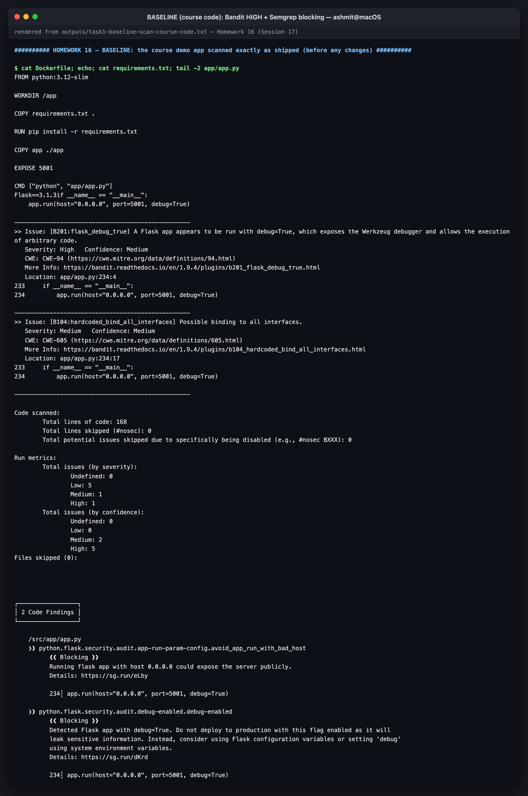
*baseline SAST: Bandit HIGH B201, Semgrep blocking*

## SCA: a vulnerable dev dependency, and why one SCA tool is not enough

```console
$ docker run --rm -v "$PWD":/src -w /src -e PIP_ROOT_USER_ACTION=ignore -e PIP_DISABLE_PIP_VERSION_CHECK=1 python:3.12-slim sh -c 'pip install -q pip-audit==2.10.1 && pip-audit -r requirements.txt -r requirements-dev.txt --progress-spinner off'
Name   Version ID              Fix Versions
------ ------- --------------- ------------
pytest 8.4.2   PYSEC-2026-1845 9.0.3
pytest 8.4.2   PYSEC-2026-1845 9.0.3
Found 2 known vulnerabilities in 1 package
```

The course's `requirements-dev.txt` pins `pytest==8.4.2`, which has an advisory fixed in 9.0.3.
**Trivy fs did not report it**: it only parses a file literally named `requirements.txt` and
never opened `requirements-dev.txt`. Two SCA tools with different parsers catch different
things, which is why both run here.

## Container: root, and no health check

```console
$ docker build -q -t hw16-course-baseline:local . && docker run --rm --entrypoint id hw16-course-baseline:local
sha256:408e64598402e629f73d2b3322941a45bb95427b1596dd08c8d67333b66ebf8e
uid=0(root) gid=0(root) groups=0(root)
```

```console
Failures: 2 (UNKNOWN: 0, LOW: 1, MEDIUM: 0, HIGH: 1, CRITICAL: 0)
DS-0002 (HIGH): Specify at least 1 USER command in Dockerfile with non-root user as argument
Running containers with 'root' user can lead to a container escape situation. It is a best practice to run containers as non-root users, which can be done by adding a 'USER' statement to the Dockerfile.
DS-0026 (LOW): Add HEALTHCHECK instruction in your Dockerfile
You should add HEALTHCHECK instruction in your docker container images to perform the health check on running containers.
```

The OS packages carry **44 HIGH CVEs, and every one of them is "no fix yet"** in Debian 13. That
finding is what shaped the image-scan rule in the policy: block HIGH/CRITICAL *when a fix
exists*, and report the rest.

```console
HIGH no fix yet 44
```

Secrets: `gitleaks` found nothing in the course code (`no leaks found`).

> **Honest note on the transcript:** the first Trivy run in it fails with
> `failed to download vulnerability DB ... context deadline exceeded`. The 120 MB database
> download timed out while the semgrep image was pulling over the same connection. The
> transcript then shows the DB downloaded on its own and both Trivy scans re-run.

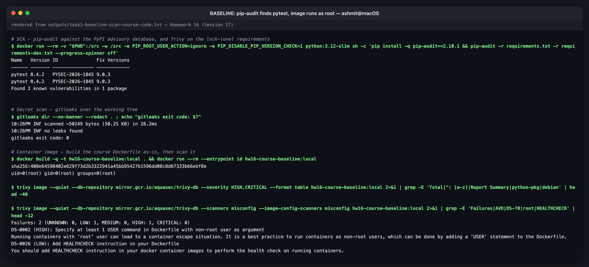
*baseline: pytest advisory, root container, missing HEALTHCHECK*

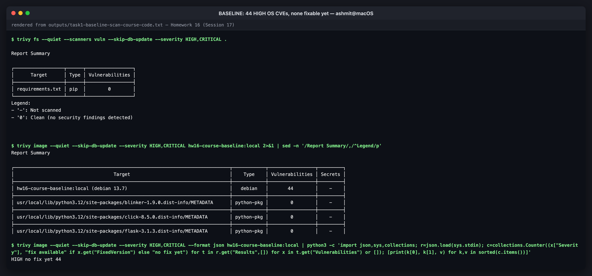
*baseline: 44 HIGH OS CVEs, all without a fix*

### What a gate would have done with the course app

| Scanner | Baseline result | Gate |
|---|---|---|
| Bandit | B201 HIGH (debug=True) | **BLOCK** |
| Semgrep | 2 × blocking | **BLOCK** |
| pip-audit | pytest PYSEC-2026-1845 | **BLOCK** |
| Trivy config | DS-0002 HIGH (root) | **BLOCK** |
| Trivy image | 44 HIGH, none fixable | pass (reported) |
| gitleaks | clean | pass |

The course workflow would very likely still have pushed this image. Two of its three scan
steps report but don't gate: CodeQL uploads results without failing the job, and
`trivy image` runs without `--exit-code`. The one that does gate, `pip-audit` with no `-r`,
audits the runner's environment, where the dev `pytest` pin is never installed. Scanning is
not the same thing as gating.

---

# Task 2 — Fixes

| Finding | Fix | File |
|---|---|---|
| B201 / Semgrep: `debug=True` on `0.0.0.0` | container serves with **gunicorn**; the dev entry point binds `127.0.0.1` and reads debug from `FLASK_DEBUG` | [`app/app.py`](app/app.py), [`Dockerfile`](Dockerfile) |
| B104: bind all interfaces | same | — |
| B311 ×5: `random` | `secrets.SystemRandom()` (not security-relevant here, but explicit instead of `# nosec`) | `app/app.py` |
| PYSEC-2026-1845 pytest 8.4.2 | `pytest==9.1.1`, `pytest-cov==7.1.0` | [`requirements-dev.txt`](requirements-dev.txt) |
| DS-0002: runs as root | `USER 10001`, plus `runAsNonRoot` in the pod | `Dockerfile`, [`k8s/deployment.yaml`](k8s/deployment.yaml) |
| DS-0026: no HEALTHCHECK | `HEALTHCHECK` against `/health` | `Dockerfile` |
| 10 fixable MEDIUM/LOW CVEs, **all in `pip`** (found after the first rebuild) | pip removed from the runtime image and the venv; the app never installs anything at runtime | `Dockerfile` |
| KSV-0013 (no image tag), KSV-0110 (default namespace) | tagged placeholder replaced by a digest at deploy; `hw16` namespace with Pod Security `restricted` | `k8s/` |
| **Found by reading, not by a scanner:** DOM XSS. The pipeline-simulator API echoed a user-supplied `branch` back, and `main.js` inserted it with `innerHTML` | server validates `branch` against `^[A-Za-z0-9._/-]{1,64}$`; the client sets it with `textContent` | `app/app.py`, [`app/static/js/main.js`](app/static/js/main.js) |
| Unvalidated `fail_chance` (`float("abc")` → 500) | validated, range-checked → 400 | `app/app.py` |
| — | security headers on every response: CSP, `nosniff`, `X-Frame-Options`, `Referrer-Policy` | `app/app.py` |
| — | 9 new tests covering the headers and the input validation | [`tests/test_app.py`](tests/test_app.py) |

The XSS is worth noting. None of the seven scanners found it: the Python tools don't read
JavaScript, and the data flow crosses the HTTP boundary. A clean scan report means *no
known pattern matched*, not *secure*.

The Deployment's `securityContext` enforces at runtime what the Dockerfile promises:
`runAsNonRoot`, `readOnlyRootFilesystem`, `allowPrivilegeEscalation: false`,
`capabilities: drop [ALL]`, `seccompProfile: RuntimeDefault`,
`automountServiceAccountToken: false`, resource requests and limits, and readiness/liveness
probes. The namespace carries `pod-security.kubernetes.io/enforce: restricted`, so the API
server **refuses** any pod in it that drops one of those settings.

---

# Task 3 — Every stage, locally, after the fixes

The same commands the workflow runs, in the same order. Transcript:
[`outputs/task2-pipeline-stages-local.txt`](outputs/task2-pipeline-stages-local.txt). All
containers ran with `--cpus=1` and Trivy with `--parallel 1`, because the laptop is shared with
a 2-node Minikube cluster.

**SAST is clean:** Bandit `No issues identified.`, and

```console
$ docker run --rm --cpus=1 -v "$PWD":/src -w /src semgrep/semgrep:latest semgrep scan --config p/python --config p/flask --config .semgrep.yml --metrics=off --quiet --json-output=reports/semgrep.json app; echo "semgrep findings: $(python3 -c "import json;print(len(json.load(open(\"reports/semgrep.json\"))[\"results\"]))")"
semgrep findings: 0
```

Trivy config leaves one MEDIUM, **KSV-0125** "image from an untrusted registry". Trivy's
default trusted list doesn't include `ghcr.io`. It is reported, not blocking. The real
control for this is an admission policy (Kyverno/Gatekeeper) with your own registry allowlist.

**SCA is clean:**

```console
$ docker run --rm --cpus=1 -v "$PWD":/src -w /src -e PIP_ROOT_USER_ACTION=ignore -e PIP_DISABLE_PIP_VERSION_CHECK=1 python:3.12-slim sh -c 'pip install -q pip-audit==2.10.1 && pip-audit -r requirements.txt -r requirements-dev.txt --progress-spinner off --format json --output reports/pip-audit.json; pip-audit -r requirements.txt -r requirements-dev.txt --progress-spinner off'
No known vulnerabilities found
No known vulnerabilities found
```

**The image:** non-root, 18 MB smaller than with pip, and **no fixable CVEs left**:

```console
$ docker build -q --build-arg GIT_SHA=local-after -t hw16-devsecops:local . && docker image ls hw16-devsecops:local --format "{{.Repository}}:{{.Tag}}  {{.Size}}" && docker run --rm --cpus=1 --entrypoint id hw16-devsecops:local
sha256:beb94a1c58127f67358f0e11891f0dbf9c6d355fb196944a7f10a462506b6da0
hw16-devsecops:local  213MB
uid=10001(app) gid=10001(app) groups=10001(app)
```

```console
HIGH no fix yet 44
LOW no fix yet 61
MEDIUM no fix yet 58
UNKNOWN no fix yet 2
```

**The gate:**

```console
$ python3 security/gate.py reports; echo "gate exit code: $?"
## Security gate: PASSED

| scanner | policy (block at) | findings | blocking | result |
|---|---|---|---|---|
| bandit | HIGH | 0 | 0 | pass |
| semgrep | ERROR | 0 | 0 | pass |
| pip_audit | ANY | 0 | 0 | pass |
| trivy_fs | HIGH | 0 | 0 | pass |
| trivy_config | HIGH | 1 | 0 | pass |
| gitleaks | ANY | 0 | 0 | pass |
| trivy_image | HIGH | 165 | 0 | pass |
gate exit code: 0
```

> **Honest note:** in this run, stage 2's `pip install` failed with
> `No matching distribution found for coverage>=7.10.6`, meaning PyPI was unreachable from the
> container at that moment; no test ran. In CI, `needs:` would have stopped the pipeline right
> there. The local script carried on, so the stage was re-run on its own with pip retries:
> [`outputs/task2b-unit-tests-rerun.txt`](outputs/task2b-unit-tests-rerun.txt), **17 passed,
> 88.52% coverage**.

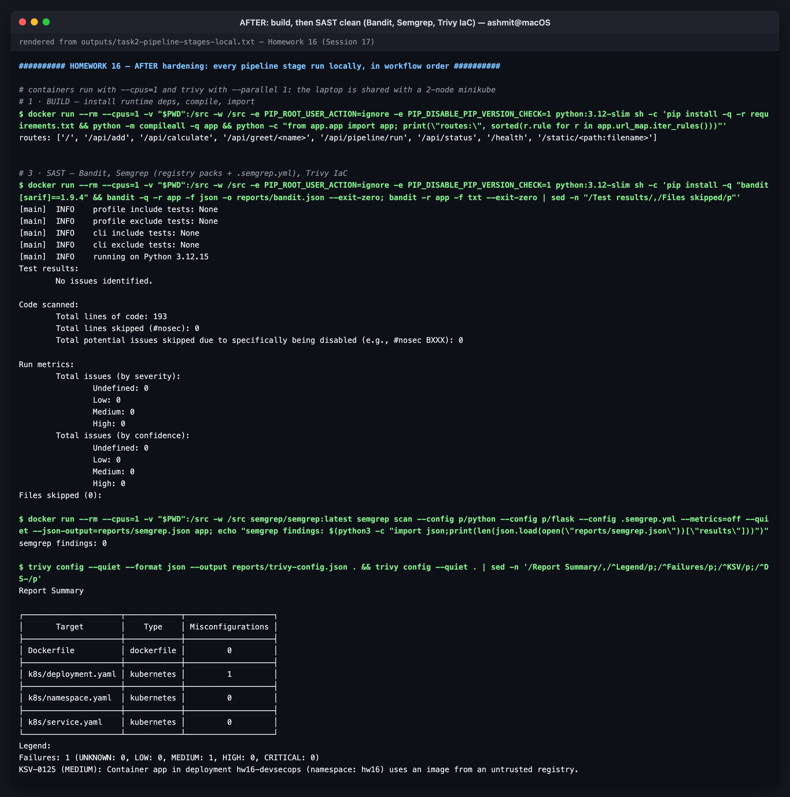
*after: build and SAST*

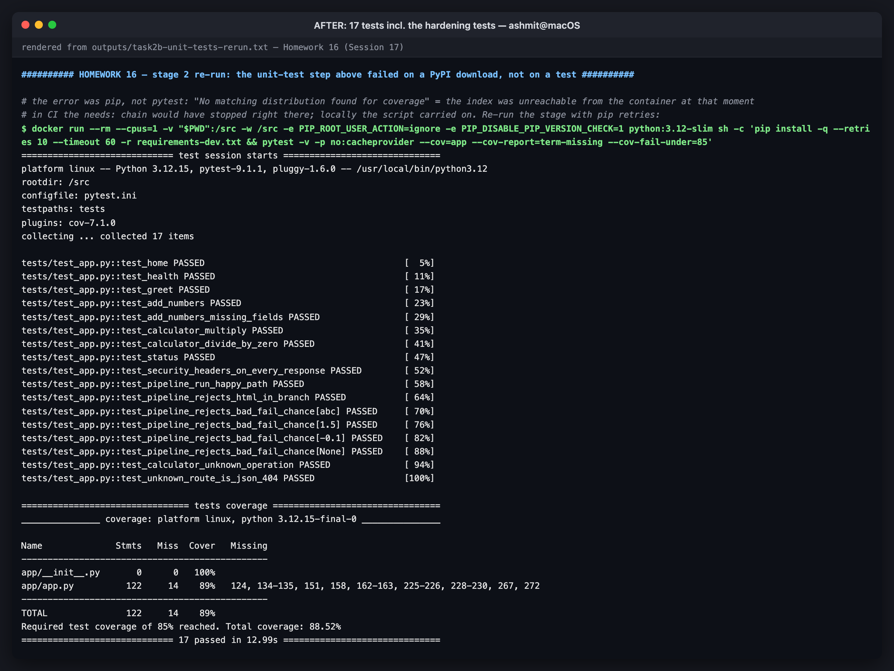
*after: 17 tests including the hardening tests*

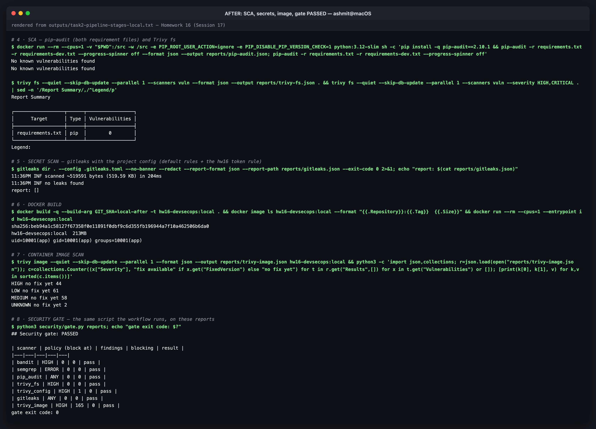
*after: SCA, secrets, image, gate PASSED*

## Does the image really run under the pod's restrictions?

A `readOnlyRootFilesystem` that crashes the app is worse than none, so the Docker
equivalents of the Deployment's `securityContext` were tested
([`outputs/task5-runtime-hardening.txt`](outputs/task5-runtime-hardening.txt)):

```console
$ docker run -d --name hw16 --cpus=1 -p 15001:5001 --read-only --tmpfs /tmp --cap-drop ALL --security-opt no-new-privileges --user 10001:10001 hw16-devsecops:local
992e1fcb506290da5993b487bf0859f8efba3d92e70224b7c63a9b626e063e03
```

```console
$ curl -s -X POST localhost:15001/api/pipeline/run -H 'Content-Type: application/json' -d '{"branch":""}' -w ' [HTTP %{http_code}]\n'
{"error":"Invalid branch name"}
 [HTTP 400]
```

```console
$ docker exec hw16 sh -c 'id; touch /app/x; touch /tmp/ok && echo "/tmp is writable"; python -m pip --version'
uid=10001(app) gid=10001(app) groups=10001(app)
touch: cannot touch '/app/x': Read-only file system
/tmp is writable
/opt/venv/bin/python: No module named pip
```

gunicorn boots with `--worker-tmp-dir /dev/shm`, so its heartbeat files never need the
read-only root. The CSP and the other headers are present on every response.

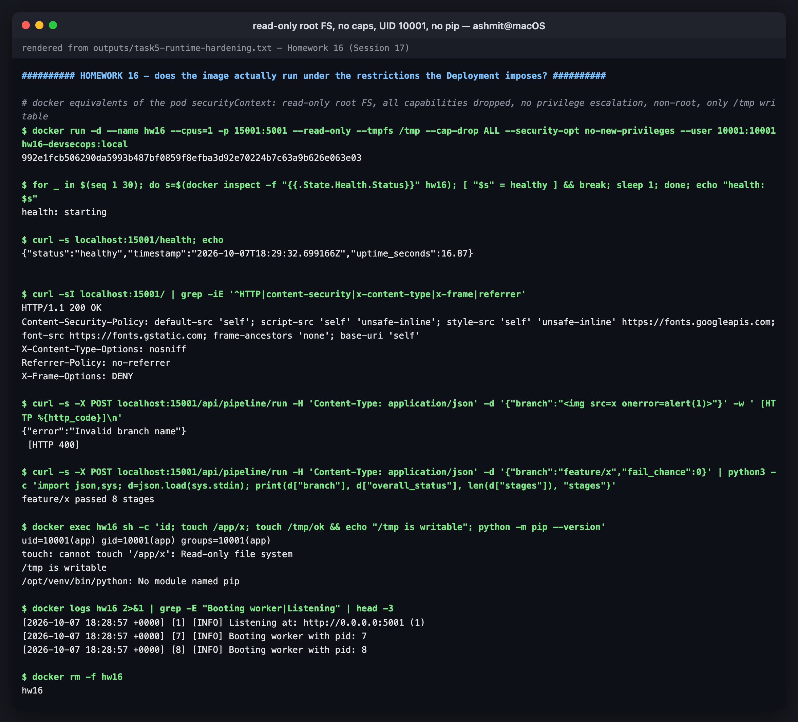
*runtime hardening verified*

---

# Task 4 — Proving the gate blocks

A gate that has never failed has not been tested. Two violations were introduced one at a
time and the same `gate.py` was run on the reports. Transcript:
[`outputs/task3-gate-blocking-demo.txt`](outputs/task3-gate-blocking-demo.txt).

## Demo A — a vulnerable dependency

```console
$ sed -i.bak 's/^Flask==3.1.3$/Flask==2.2.0/' requirements.txt && cat requirements.txt
Flask==2.2.0
gunicorn==26.2.0
```

```console
$ python3 security/gate.py reports-demo; echo "gate exit code: $?"
## Security gate: BLOCKED

| scanner | policy (block at) | findings | blocking | result |
|---|---|---|---|---|
| bandit | HIGH | 0 | 0 | pass |
| semgrep | ERROR | 0 | 0 | pass |
| pip_audit | ANY | 4 | 4 | BLOCK |
| trivy_fs | HIGH | 2 | 1 | BLOCK |
| trivy_config | HIGH | 1 | 0 | pass |
| gitleaks | ANY | 0 | 0 | pass |
| trivy_image | HIGH | 165 | 0 | pass |

### Blocking findings

| scanner | severity | finding |
|---|---|---|
| pip_audit | VULN | `flask==2.2.0 PYSEC-2023-62 (fix: 2.2.5,2.3.2)` |
| pip_audit | VULN | `flask==2.2.0 PYSEC-2023-62 (fix: 2.2.5,2.3.2)` |
| pip_audit | VULN | `flask==2.2.0 PYSEC-2026-2151 (fix: 3.1.3)` |
| pip_audit | VULN | `flask==2.2.0 PYSEC-2026-2151 (fix: 3.1.3)` |
| trivy_fs | HIGH | `Flask CVE-2023-30861 fix=2.3.2, 2.2.5` |
gate exit code: 1
```

Both SCA tools caught it independently. Exit code 1 fails the `security-gate` job, so
`push-image` and `deploy` never start. (The doubled pip-audit rows are pip-audit's own
output, visible in its table in the same transcript; the gate reports what the tool reports.)

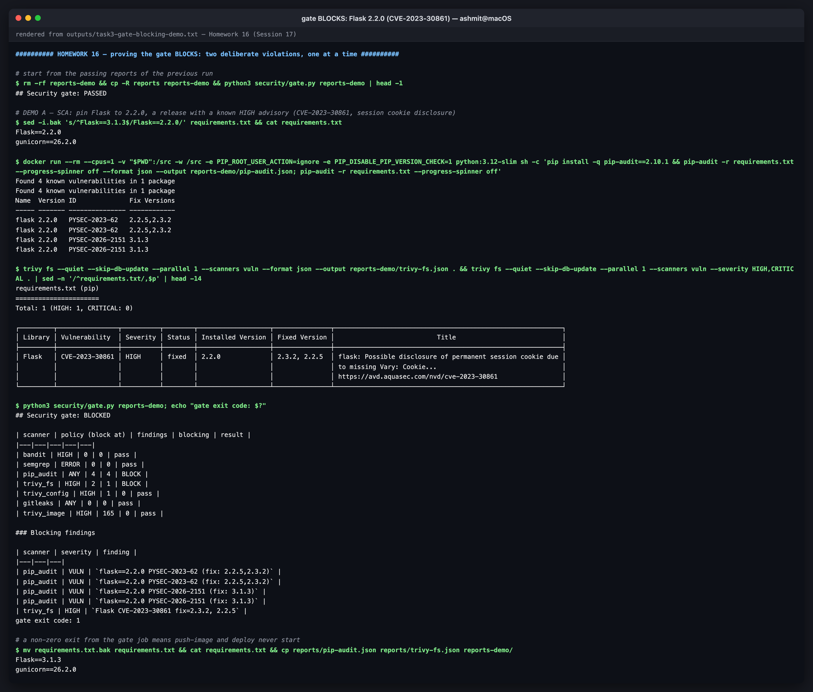
*gate blocks a vulnerable Flask pin*

## Demo B — a leaked token

The project's [`.gitleaks.toml`](.gitleaks.toml) adds a rule for this app's (fictional) token
format, `hw16_live_` followed by 24 lowercase letters and digits. The demo writes a random one
into the code:

```console
$ printf "API_TOKEN = \"hw16_live_%s\"\n" "$(LC_ALL=C tr -dc a-z0-9 </dev/urandom | head -c 24)" > app/local_settings.py && sed -E "s/(hw16_live_).{20}/\1********************/" app/local_settings.py
API_TOKEN = "hw16_live_********************p0hy"
```

```console
| gitleaks | ANY | 5 | 5 | BLOCK |
```

```console
| gitleaks | SECRET | `hw16-demo-api-token app/local_settings.py:1` |
```

The custom rule exists so the demo never has to put a realistic cloud key into Git history,
where GitHub push protection and every later history scan would trip over it.

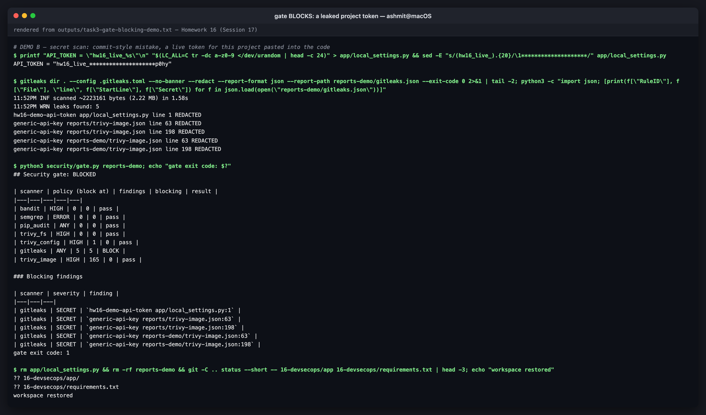
*gate blocks a leaked project token*

## A false positive, and how it was triaged

Demo B's scan reported **5** leaks, not 1. The other four were `generic-api-key` hits in
the local Trivy JSON reports:

```console
$ sed -n '63p' reports/trivy-image.json | cut -c1-80
          "created_by": "ENV GPG_KEY=7169605F62C751356D054A26A821E680E5FA6305",
```

That is the official `python` base image's `ENV GPG_KEY`, the **public** fingerprint of the
CPython release manager's signing key, copied into Trivy's report. The first fix was to
allowlist the `reports/` path, since it is gitignored and CI scans git history, so CI would
never see it. That left one hit, **in this homework's own committed transcript**, which now
quoted the line. Allowlisting `outputs/` would have hidden any real secret ever pasted into a
transcript, so the final fix allowlists the **exact value** instead:

```console
$ gitleaks dir . --config .gitleaks.toml --no-banner --redact --exit-code 1 2>&1 | tail -1; echo "gitleaks exit code: ${PIPESTATUS[0]}"
11:54PM INF no leaks found
gitleaks exit code: 0
```

Without this, the first push of this homework would have **blocked its own pipeline** on the
history scan.

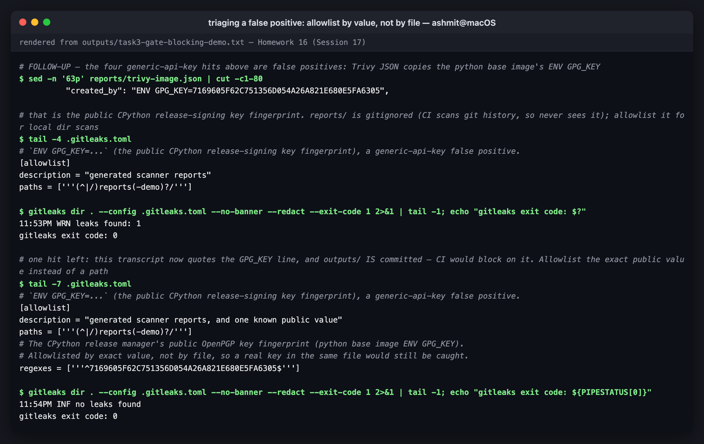
*triaging the false positive*

## Reproducing the block on GitHub

The workflow runs on pushes to **any** branch that touch `16-devsecops/`. Push and deploy are
limited to `main`. To see the gate fail in GitHub Actions:

```bash
git switch -c hw16-gate-demo
sed -i '' 's/^Flask==3.1.3$/Flask==2.2.0/' 16-devsecops/requirements.txt   # GNU sed: -i without ''
git commit -am "Demo: pin a vulnerable Flask to show the security gate blocking"
git push -u origin hw16-gate-demo
# Actions → "HW16 DevSecOps": stages 1-7 green, "8 · Security Gate" red,
# "9 · Push Image" and "10 · Deploy" skipped. Delete the branch afterwards.
```

Use the dependency demo on GitHub, not the token demo. A token committed to a branch stays in
the repository's history.

---

## Pipeline runs on GitHub

<!-- PIPELINE-RUNS -->

---

## The workflow, validated

```console
$ docker run --rm --cpus=1 -v "$PWD":/repo -w /repo rhysd/actionlint:latest -color=false .github/workflows/hw16-devsecops.yml && echo "actionlint: no problems found"
actionlint: no problems found
```

[`outputs/task4-workflow-lint.txt`](outputs/task4-workflow-lint.txt) also lists every job with
its `needs:`, showing the strict chain from `build` to `deploy`.

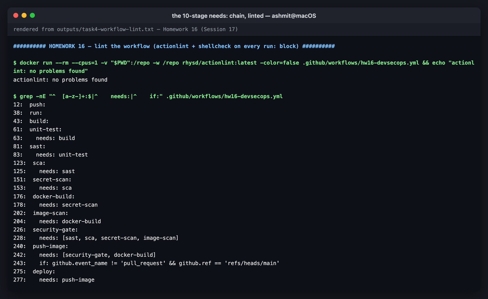
*the needs: chain, linted*

## Reproducing this

```bash
cd 16-devsecops
pip install bandit pip-audit semgrep          # or run them in python:3.12-slim as the transcripts do
bandit -r app
semgrep scan --config p/python --config p/flask --config .semgrep.yml app
pip-audit -r requirements.txt -r requirements-dev.txt
trivy config . && trivy fs --scanners vuln .
gitleaks dir . --config .gitleaks.toml
docker build -t hw16-devsecops:local . && trivy image hw16-devsecops:local

# collect JSON reports into reports/ (see outputs/task2-pipeline-stages-local.txt) and:
python3 security/gate.py reports

# Kubernetes (any cluster):
kubectl apply -f k8s/namespace.yaml
sed 's|ghcr.io/binarybhakti/hw16-devsecops:set-by-ci|<your image>|' k8s/deployment.yaml | kubectl apply -f -
kubectl apply -f k8s/service.yaml
```

## Files

```
16-devsecops/
├── README.md
├── app/                       Flask app (course demo, hardened) + templates/ static/
├── tests/test_app.py          17 tests
├── Dockerfile                 multi-stage, non-root, no pip at runtime, HEALTHCHECK
├── requirements.txt  requirements-dev.txt  pytest.ini
├── k8s/
│   ├── namespace.yaml         Pod Security "restricted"
│   ├── deployment.yaml        securityContext, probes, limits, read-only root
│   └── service.yaml
├── security/
│   ├── gate.py                the security gate
│   ├── gate-policy.json       the policy it applies
│   └── install-tools.sh       checksum-verified trivy / gitleaks install
├── .semgrep.yml               project SAST rules
├── .gitleaks.toml             default rules + project token rule + narrow allowlist
├── outputs/                   raw transcripts
└── screenshots/
../.github/workflows/hw16-devsecops.yml   the pipeline
```
