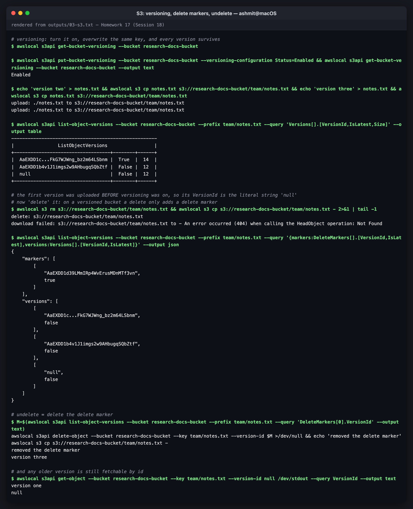
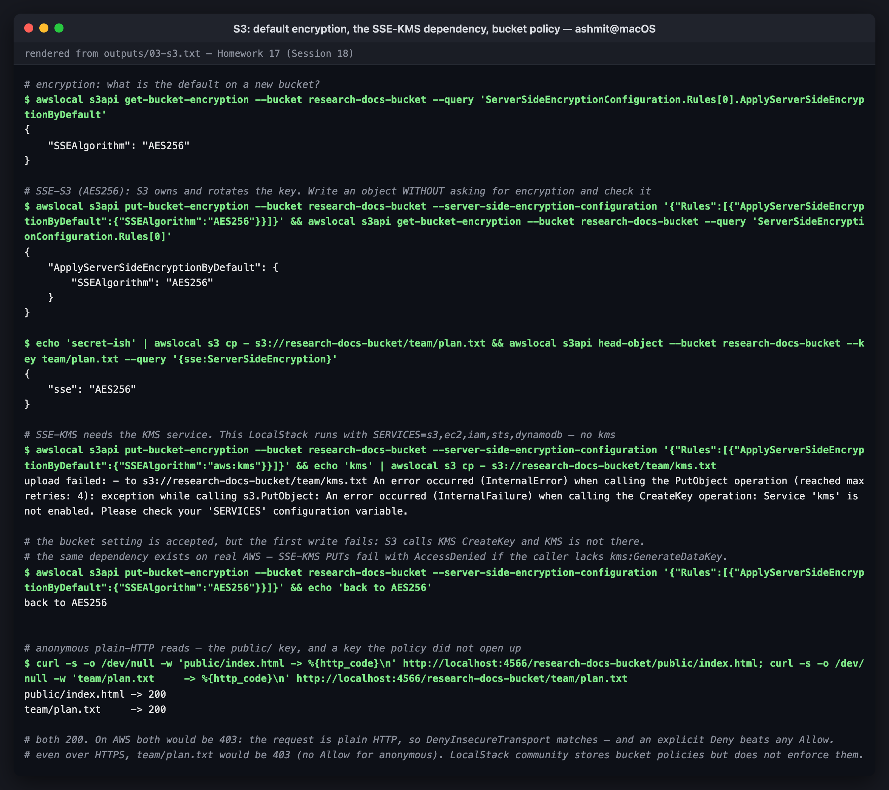

# 03 — S3: Simple Storage Service (Storage)

**S3 is object storage.** You put a blob of bytes under a key in a bucket, get it back over
HTTPS, and AWS stores it redundantly across at least three Availability Zones, with
**11 nines (99.999999999%) of durability**. There's no filesystem, no disk to size, and no server.

The practical parts ran against **LocalStack 4.14.0** (community). All output blocks are
verbatim from [`../outputs/03-s3.txt`](../outputs/03-s3.txt). The configuration files used are
in this folder: [`research-lifecycle.json`](research-lifecycle.json) and
[`research-bucket-policy.json`](research-bucket-policy.json).

> **LocalStack note.** S3 is LocalStack's most complete service. Versioning, lifecycle
> configuration, encryption settings and storage classes all behave as on AWS. Two things
> don't: **bucket policies aren't enforced**, and **SSE-KMS needs the KMS service running**.
> Both are shown below.

---

## Object storage vs block vs file

| | **S3** (object) | **EBS** (block) | **EFS** (file) |
|---|---|---|---|
| Unit | whole object, up to 5 TB | 512-byte blocks | files in directories |
| Access | HTTPS API (`GET`/`PUT`) | mounted by one instance (one AZ) | NFS, many instances, many AZs |
| Edit in place | **no**, you rewrite the whole object | yes | yes |
| Capacity | unlimited, pay per GB stored | provisioned size | elastic |
| Good for | backups, static sites, data lakes, logs, artifacts, Terraform state | OS disks, databases | shared app storage |

---

## Buckets and objects

A **bucket** is the container. Its name is **globally unique across every AWS account**,
DNS-compatible (lowercase, 3–63 chars), and **fixed to one region**. An **object** is a key, the
data, and metadata.

```console
$ awslocal s3 mb s3://research-docs-bucket
make_bucket: research-docs-bucket

$ echo 'version one' > notes.txt && awslocal s3 cp notes.txt s3://research-docs-bucket/team/notes.txt
upload: ./notes.txt to s3://research-docs-bucket/team/notes.txt

$ echo 'hello public' | awslocal s3 cp - s3://research-docs-bucket/public/index.html --content-type text/html

$ echo 'archived' | awslocal s3 cp - s3://research-docs-bucket/logs/2026-09.log --storage-class STANDARD_IA

$ awslocal s3api list-objects-v2 --bucket research-docs-bucket --query 'Contents[].[Key,Size,StorageClass]' --output table
--------------------------------------------
|               ListObjectsV2              |
+--------------------+-----+---------------+
|  logs/2026-09.log  |  9  |  STANDARD_IA  |
|  public/index.html |  13 |  STANDARD     |
|  team/notes.txt    |  12 |  STANDARD     |
+--------------------+-----+---------------+
```

**There are no folders.** `team/notes.txt` is one flat key that happens to contain a `/`. The
"folders" you see in the console come from listing with a delimiter:

```console
$ awslocal s3api list-objects-v2 --bucket research-docs-bucket --delimiter / --query '[CommonPrefixes[].Prefix, KeyCount]' --output json
[
    [
        "logs/",
        "public/",
        "team/"
    ],
    null
]
$ awslocal s3api head-object --bucket research-docs-bucket --key public/index.html --query '{type:ContentType,len:ContentLength,etag:ETag}'
{
    "type": "text/html",
    "len": 13,
    "etag": "\"b08fcc3336e721fa1728f506ea20c209\""
}
```

The **ETag** is the MD5 of the content for simple, non-KMS uploads. That's how `aws s3 sync`
tells whether a file changed. The `Content-Type` metadata is what makes a browser render
`index.html` instead of downloading it. Forgetting it is the classic static-site bug.

| Fact | Value |
|---|---|
| Max object size | 5 TB (single `PUT` up to 5 GB; above ~100 MB use multipart upload) |
| Objects per bucket | unlimited |
| Consistency | **strong read-after-write** for all operations (since Dec 2020) |
| Buckets per account | 10,000 by default (raised in 2024 from the old limit of 100) |
| Request rate | 3,500 writes / 5,500 reads per second **per prefix**, so spread hot keys across prefixes |

---

## Storage classes

You choose the class per object. The trade-off is **storage price against retrieval price and
latency**.

| Class | Use when | Min duration | Retrieval | AZs |
|---|---|---|---|---|
| **S3 Standard** | data you read often | — | instant, free | ≥3 |
| **S3 Intelligent-Tiering** | access pattern unknown or changing | — | instant (archive tiers optional) | ≥3 |
| **S3 Standard-IA** | read less than monthly, needs to be fast when it is | 30 days | instant, **per-GB fee** | ≥3 |
| S3 One Zone-IA | re-creatable data, cheaper | 30 days | instant, per-GB fee | **1**, lost if that AZ is |
| S3 Express One Zone | single-digit-ms latency for hot analytics/ML | — | fastest | 1 (directory buckets) |
| **S3 Glacier Instant Retrieval** | archive read about once a quarter | 90 days | milliseconds, higher fee | ≥3 |
| S3 Glacier Flexible Retrieval | archive, minutes to hours is fine | 90 days | 1 min – 12 h | ≥3 |
| **S3 Glacier Deep Archive** | compliance archives kept for years | 180 days | 12 – 48 h | ≥3 |

The `logs/2026-09.log` object above was written straight into `STANDARD_IA`. More often, you
let a lifecycle rule move objects down the table over time.

**Gotcha: minimum duration and minimum size.** Delete a Standard-IA object after 5 days and
you're billed for 30. Objects under 128 KB are billed as 128 KB in the IA classes. Lifecycle
transitions of tiny objects can cost more than they save. That's why the lifecycle reply below
includes `TransitionDefaultMinimumObjectSize: all_storage_classes_128K`: AWS (and LocalStack)
skip transitioning objects below 128 KB by default.

---

## Versioning

```console
$ awslocal s3api get-bucket-versioning --bucket research-docs-bucket

$ awslocal s3api put-bucket-versioning --bucket research-docs-bucket --versioning-configuration Status=Enabled && awslocal s3api get-bucket-versioning --bucket research-docs-bucket --output text
Enabled

$ echo 'version two' > notes.txt && awslocal s3 cp notes.txt s3://research-docs-bucket/team/notes.txt && echo 'version three' > notes.txt && awslocal s3 cp notes.txt s3://research-docs-bucket/team/notes.txt
upload: ./notes.txt to s3://research-docs-bucket/team/notes.txt
upload: ./notes.txt to s3://research-docs-bucket/team/notes.txt

$ awslocal s3api list-object-versions --bucket research-docs-bucket --prefix team/notes.txt --query 'Versions[].[VersionId,IsLatest,Size]' --output table
-----------------------------------------------------
|                ListObjectVersions                 |
+-----------------------------------+--------+------+
|  AaEXDD1c...FkG7WJWng_bz2m64LSbnm |  True  |  14  |
|  AaEXDD1b4v1J1imgs2w9AHbugqSQbZtf |  False |  12  |
|  null                             |  False |  12  |
+-----------------------------------+--------+------+
```

An empty `get-bucket-versioning` means **never enabled**, the initial state. Once on, every
overwrite keeps the old version. The bottom row's `VersionId` is the literal string `null`,
because that object was written **before** versioning was enabled.

A "delete" on a versioned bucket only adds a **delete marker**:

```console
$ awslocal s3 rm s3://research-docs-bucket/team/notes.txt && awslocal s3 cp s3://research-docs-bucket/team/notes.txt - 2>&1 | tail -1
delete: s3://research-docs-bucket/team/notes.txt
download failed: s3://research-docs-bucket/team/notes.txt to - An error occurred (404) when calling the HeadObject operation: Not Found
$ awslocal s3api list-object-versions --bucket research-docs-bucket --prefix team/notes.txt --query '{markers:DeleteMarkers[].[VersionId,IsLatest],versions:Versions[].[VersionId,IsLatest]}' --output json
{
    "markers": [
        [
            "AaEXDD1d39LMmIRp4WvErusMDnMTf3vn",
            true
        ]
    ],
    "versions": [
        [
            "AaEXDD1c...FkG7WJWng_bz2m64LSbnm",
            false
        ],
        [
            "AaEXDD1b4v1J1imgs2w9AHbugqSQbZtf",
            false
        ],
        [
            "null",
            false
        ]
    ]
}
```

The object looks gone (404), but all three versions are still there. **Undelete = delete the
delete marker**, and any old version can still be read by ID:

```console
$ M=$(awslocal s3api list-object-versions --bucket research-docs-bucket --prefix team/notes.txt --query 'DeleteMarkers[0].VersionId' --output text)
awslocal s3api delete-object --bucket research-docs-bucket --key team/notes.txt --version-id $M >/dev/null && echo 'removed the delete marker'
awslocal s3 cp s3://research-docs-bucket/team/notes.txt -
removed the delete marker
version three

$ awslocal s3api get-object --bucket research-docs-bucket --key team/notes.txt --version-id null /dev/stdout --query VersionId --output text
version one
null
```

| Point | Detail |
|---|---|
| States | Unversioned → **Enabled** ⇄ **Suspended**. It can never go back to Unversioned |
| Cost | every version is billed as a full object. Pair versioning with a `NoncurrentVersionExpiration` rule |
| Protects against | accidental overwrite and delete, ransomware-style overwrites |
| Doesn't protect against | someone with `s3:DeleteObjectVersion` deleting versions by ID. For that, use **MFA Delete** or **Object Lock** (WORM) |
| Required by | cross-region replication, Object Lock, and Terraform state buckets (to recover a corrupted state file) |


*S3: versioning, delete markers, undelete*

---

## Lifecycle policies

Lifecycle rules **transition** objects to cheaper classes and **expire** (delete) them on a
schedule, per prefix or tag, with no cron job.

```console
$ cat research-lifecycle.json
{
  "Rules": [
    {
      "ID": "logs-tiering",
      "Status": "Enabled",
      "Filter": { "Prefix": "logs/" },
      "Transitions": [
        { "Days": 30,  "StorageClass": "STANDARD_IA" },
        { "Days": 90,  "StorageClass": "GLACIER" }
      ],
      "Expiration": { "Days": 365 },
      "NoncurrentVersionExpiration": { "NoncurrentDays": 30 }
    }
  ]
}
$ awslocal s3api put-bucket-lifecycle-configuration --bucket research-docs-bucket --lifecycle-configuration file://research-lifecycle.json && awslocal s3api get-bucket-lifecycle-configuration --bucket research-docs-bucket --query 'Rules[].[ID,Status,Filter.Prefix,Expiration.Days]' --output text
{
    "TransitionDefaultMinimumObjectSize": "all_storage_classes_128K"
}
logs-tiering	Enabled	logs/	365
```

```
 day 0 ─────────► day 30 ─────────► day 90 ─────────────────────► day 365
 STANDARD          STANDARD_IA        GLACIER (Flexible Retrieval)   deleted
                                       old versions: deleted 30 days after being superseded
```

Other useful rule actions: `AbortIncompleteMultipartUpload` (failed multipart uploads leave
invisible, **billed** parts behind, so every bucket should have this rule) and
`ExpiredObjectDeleteMarker` cleanup.

---

## Encryption

Since January 2023, **every new object on AWS is encrypted at rest by default** with SSE-S3.
LocalStack reproduces that:

```console
$ awslocal s3api get-bucket-encryption --bucket research-docs-bucket --query 'ServerSideEncryptionConfiguration.Rules[0].ApplyServerSideEncryptionByDefault'
{
    "SSEAlgorithm": "AES256"
}
$ echo 'secret-ish' | awslocal s3 cp - s3://research-docs-bucket/team/plan.txt && awslocal s3api head-object --bucket research-docs-bucket --key team/plan.txt --query '{sse:ServerSideEncryption}'
{
    "sse": "AES256"
}
```

The object was written without asking for encryption, and it's encrypted anyway.

| Option | Who holds the key | Audit trail of key use | When |
|---|---|---|---|
| **SSE-S3** (`AES256`) | S3, fully managed | no | the default; fine for most data |
| **SSE-KMS** (`aws:kms`) | AWS KMS: an AWS-managed key or **your** customer-managed key | **yes**, every decrypt is in CloudTrail | regulated data; when you need to *revoke* access by disabling a key |
| DSSE-KMS | KMS, two layers | yes | compliance regimes that demand dual-layer |
| SSE-C | **you**, sent with every request | — | rare; you must never lose the key |
| Client-side | you, before upload | — | S3 never sees plaintext |
| *In transit* | TLS | — | enforce with the bucket policy below |

### The SSE-KMS dependency, observed

```console
$ awslocal s3api put-bucket-encryption --bucket research-docs-bucket --server-side-encryption-configuration '{"Rules":[{"ApplyServerSideEncryptionByDefault":{"SSEAlgorithm":"aws:kms"}}]}' && echo 'kms' | awslocal s3 cp - s3://research-docs-bucket/team/kms.txt
upload failed: - to s3://research-docs-bucket/team/kms.txt An error occurred (InternalError) when calling the PutObject operation (reached max retries: 4): exception while calling s3.PutObject: An error occurred (InternalFailure) when calling the CreateKey operation: Service 'kms' is not enabled. Please check your 'SERVICES' configuration variable.
```

This happened in the first attempt at this lab too. That run used SSE-KMS as the bucket
default, every later write failed after four retries, and the object simply wasn't there.
**The bucket setting is accepted; only the next write fails.** That's the real lesson: with
SSE-KMS, S3 has to call KMS on every `PUT` and `GET`. On AWS the same shape of failure appears
as `AccessDenied` when the writer has `s3:PutObject` but not `kms:GenerateDataKey` (or the
reader lacks `kms:Decrypt`) on the key. SSE-KMS also adds KMS request charges, which
`BucketKeyEnabled: true` reduces by about 99%.

---

## Bucket policies

A bucket policy is a **resource-based** IAM policy. It has a `Principal`, so it can grant access
to other accounts, or to everyone.

```console
$ cat research-bucket-policy.json
{
  "Version": "2012-10-17",
  "Statement": [
    {
      "Sid": "DenyInsecureTransport",
      "Effect": "Deny",
      "Principal": "*",
      "Action": "s3:*",
      "Resource": [
        "arn:aws:s3:::research-docs-bucket",
        "arn:aws:s3:::research-docs-bucket/*"
      ],
      "Condition": { "Bool": { "aws:SecureTransport": "false" } }
    },
    {
      "Sid": "PublicReadOfPublicPrefixOnly",
      "Effect": "Allow",
      "Principal": "*",
      "Action": "s3:GetObject",
      "Resource": "arn:aws:s3:::research-docs-bucket/public/*"
    }
  ]
}
$ awslocal s3api put-bucket-policy --bucket research-docs-bucket --policy file://research-bucket-policy.json && awslocal s3api get-bucket-policy --bucket research-docs-bucket --query Policy --output text | python3 -c 'import json,sys; [print(s["Sid"], s["Effect"]) for s in json.load(sys.stdin)["Statement"]]'
DenyInsecureTransport Deny
PublicReadOfPublicPrefixOnly Allow
```

Statement 1 is the standard **TLS-only** guardrail: an explicit Deny for any request where
`aws:SecureTransport` is false. Statement 2 opens **only** the `public/` prefix to anonymous
readers.

```console
$ curl -s -o /dev/null -w 'public/index.html -> %{http_code}\n' http://localhost:4566/research-docs-bucket/public/index.html; curl -s -o /dev/null -w 'team/plan.txt     -> %{http_code}\n' http://localhost:4566/research-docs-bucket/team/plan.txt
public/index.html -> 200
team/plan.txt     -> 200
```

**On AWS both would be `403`.** These are plain-HTTP requests, so `DenyInsecureTransport`
matches both, and an explicit Deny beats the Allow. Even over HTTPS, `team/plan.txt` would be
`403`, because nothing allows anonymous access to it. LocalStack community returns `200` for
both because, as with IAM in [01-iam](../01-iam), it **stores the policy without enforcing it**.

| Control | Scope | Use it for |
|---|---|---|
| **Block Public Access** (account + bucket) | overrides any policy or ACL that would make data public | leave it **on** everywhere, except the rare bucket that's meant to be public |
| Bucket policy | the bucket | TLS-only, cross-account access, VPC-endpoint-only, CloudFront OAC |
| IAM identity policy | a user/role | what *your* principals may do |
| ACLs | legacy, per object | **disabled** by default since 2023 (Object Ownership: bucket owner enforced). Don't use them |

A static website today is served via **CloudFront with Origin Access Control**: the bucket stays
private, and the policy allows only the CloudFront distribution.


*S3: default encryption, the SSE-KMS dependency, bucket policy*

---

## Cleanup: a versioned bucket fights back

```console
$ awslocal s3api list-object-versions --bucket research-docs-bucket --output json --query '{Objects: [Versions[].{Key:Key,VersionId:VersionId}, DeleteMarkers[].{Key:Key,VersionId:VersionId}][] }' > /tmp/research-del.json && awslocal s3api delete-objects --bucket research-docs-bucket --delete file:///tmp/research-del.json --query 'length(Deleted)' && awslocal s3 rb s3://research-docs-bucket && rm -f notes.txt /tmp/research-del.json
6
remove_bucket: research-docs-bucket
```

`rb` refuses a non-empty bucket, and on a versioned bucket "empty" means **every version and
every delete marker** is gone. Six entries had to be deleted by version ID before the bucket
could go. Terraform needs `force_destroy = true` on `aws_s3_bucket` for the same reason.

---

## Common use cases

| Use case | Typical setup |
|---|---|
| Static website / SPA hosting | private bucket + CloudFront (OAC) + ACM certificate |
| Backups and DR | versioning + lifecycle to Glacier + cross-region replication + Object Lock |
| Data lake | raw/curated/analytics prefixes, Parquet files, queried by Athena/Glue/EMR |
| Logs and audit trails | CloudTrail, ALB and VPC Flow Logs, with lifecycle expiry |
| Build artifacts and container layers | CI uploads, ECR is S3-backed underneath |
| **Terraform remote state** | versioned, encrypted, private bucket + native S3 state locking (`use_lockfile`) |
| User uploads from an app | browser → **pre-signed URL** → S3 directly, never through your servers |
| ML datasets and model artifacts | Standard / Express One Zone for training throughput |

---

## Files

```
03-s3/
├── README.md
├── research-lifecycle.json       the tiering + expiry rule
└── research-bucket-policy.json   TLS-only + public/ prefix read
../outputs/03-s3.txt              full transcript, including cleanup
../screenshots/03-*.png
```
