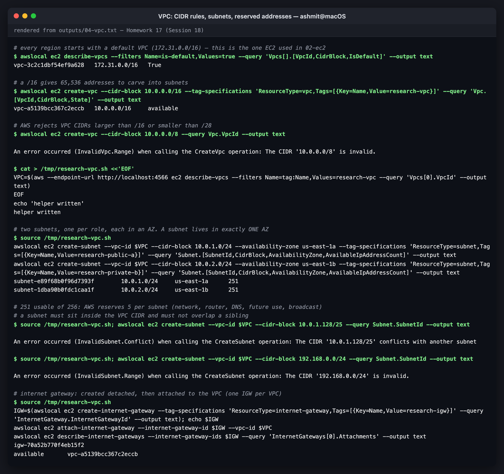
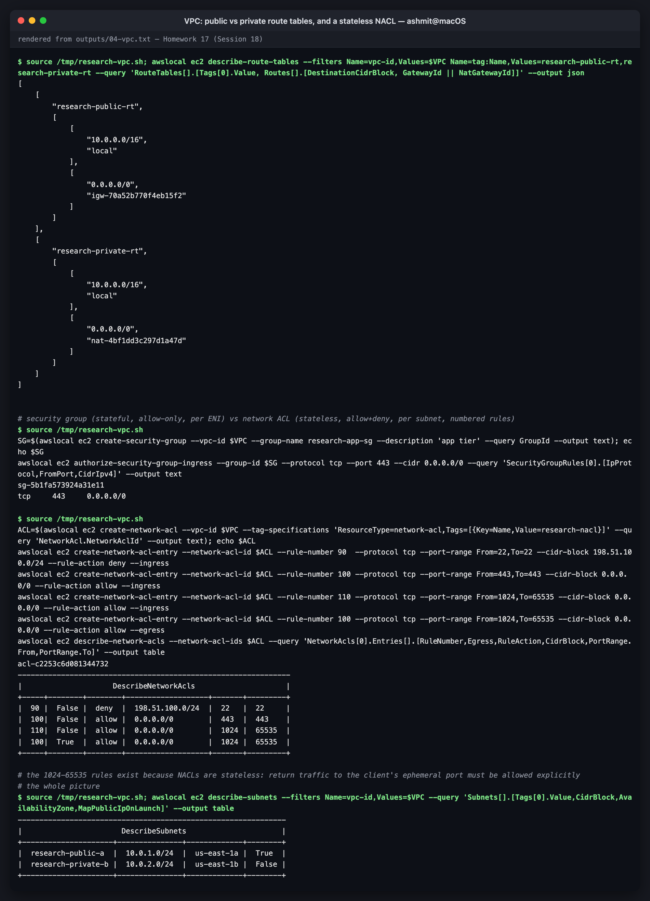

# 04 — VPC: Virtual Private Cloud (Networking)

**A VPC is your own isolated, private network inside an AWS region.** You choose its IP range,
cut it into subnets, and decide with route tables, gateways and firewalls what can talk to what,
and what can reach the internet. Every EC2 instance, RDS database, load balancer and EKS node
lives in a subnet of some VPC.

The practical parts ran against **LocalStack 4.14.0** (community). All output blocks are
verbatim from [`../outputs/04-vpc.txt`](../outputs/04-vpc.txt).

> **LocalStack note.** The VPC API is modelled faithfully: CIDR validation, overlap checks,
> reserved addresses, route tables, IGW/NAT attachment. **No packets flow**, though. A route
> to a NAT gateway is stored, but nothing is NATed. Use LocalStack for checking the *shape* of a
> network (and the Terraform that builds it), not for testing reachability.

---

## The target design

This is the standard two-tier layout, and it's what the lab below builds:

```
                              Internet
                                  │
                       ┌──────────▼──────────┐
                       │  Internet Gateway   │  igw-…  (1 per VPC, horizontally scaled, free)
                       └──────────┬──────────┘
  VPC 10.0.0.0/16                 │
  ┌───────────────────────────────┼──────────────────────────────────────────────┐
  │  us-east-1a                   │                    us-east-1b                │
  │  ┌────────────────────────────▼───────┐   ┌──────────────────────────────┐   │
  │  │ PUBLIC subnet 10.0.1.0/24          │   │ PRIVATE subnet 10.0.2.0/24   │   │
  │  │ route table research-public-rt:    │   │ route table research-private-rt│   │
  │  │   10.0.0.0/16 → local              │   │   10.0.0.0/16 → local        │   │
  │  │   0.0.0.0/0   → igw-…              │   │   0.0.0.0/0   → nat-…  ──┐   │   │
  │  │                                    │   │                          │   │   │
  │  │  [ NAT gateway + Elastic IP ] ◄────┼───┼──────────────────────────┘   │   │
  │  │  [ load balancer, bastion ]        │   │  [ app servers, databases ]  │   │
  │  └────────────────────────────────────┘   └──────────────────────────────┘   │
  │        NACL (subnet boundary, stateless)        SG (per ENI, stateful)       │
  └──────────────────────────────────────────────────────────────────────────────┘
```

(In production you'd have a public and a private subnet **in each AZ**, plus one NAT gateway
per AZ. The lab keeps one of each to stay readable.)

---

## CIDR

A VPC's address range is written in **CIDR** notation: `10.0.0.0/16` means "the first 16 bits
are fixed", leaving 32 − 16 = 16 bits, so 2¹⁶ = **65,536 addresses**.

| CIDR | Addresses | Typical use |
|---|---|---|
| `/16` | 65,536 | a VPC (the largest AWS allows) |
| `/20` | 4,096 | a large subnet (EKS pods use a lot of IPs) |
| `/24` | 256 (251 usable) | a typical subnet |
| `/28` | 16 (11 usable) | the smallest subnet (and smallest VPC) AWS allows |
| `/32` | 1 | a single host, in security-group rules |

Use the RFC 1918 private ranges, `10.0.0.0/8`, `172.16.0.0/12` and `192.168.0.0/16`, and
**plan so VPCs never overlap**. Overlapping CIDRs can't be peered or joined through a Transit
Gateway later, and renumbering a VPC means rebuilding it.

```console
$ awslocal ec2 describe-vpcs --filters Name=is-default,Values=true --query 'Vpcs[].[VpcId,CidrBlock,IsDefault]' --output text
vpc-3c2c1dbf54ef9a628	172.31.0.0/16	True

$ awslocal ec2 create-vpc --cidr-block 10.0.0.0/16 --tag-specifications 'ResourceType=vpc,Tags=[{Key=Name,Value=research-vpc}]' --query 'Vpc.[VpcId,CidrBlock,State]' --output text
vpc-a5139bcc367c2eccb	10.0.0.0/16	available

$ awslocal ec2 create-vpc --cidr-block 10.0.0.0/8 --query Vpc.VpcId --output text

An error occurred (InvalidVpc.Range) when calling the CreateVpc operation: The CIDR '10.0.0.0/8' is invalid.
```

Every region comes with a **default VPC** (`172.31.0.0/16`, a public subnet in every AZ). That's
where the instances in [02-ec2](../02-ec2) landed, since no subnet was specified. It's fine for
experiments, but real workloads get a purpose-built VPC like `research-vpc`. A `/8` is refused:
**AWS VPCs are `/16` to `/28`.**

---

## Subnets

A subnet is a slice of the VPC CIDR that lives in **exactly one Availability Zone**.

(Each step below starts with `source /tmp/research-vpc.sh`. That's a one-line helper written
earlier in the transcript, which sets `$VPC` by looking up the VPC tagged `research-vpc`.)

```console
$ source /tmp/research-vpc.sh
awslocal ec2 create-subnet --vpc-id $VPC --cidr-block 10.0.1.0/24 --availability-zone us-east-1a --tag-specifications 'ResourceType=subnet,Tags=[{Key=Name,Value=research-public-a}]' --query 'Subnet.[SubnetId,CidrBlock,AvailabilityZone,AvailableIpAddressCount]' --output text
awslocal ec2 create-subnet --vpc-id $VPC --cidr-block 10.0.2.0/24 --availability-zone us-east-1b --tag-specifications 'ResourceType=subnet,Tags=[{Key=Name,Value=research-private-b}]' --query 'Subnet.[SubnetId,CidrBlock,AvailabilityZone,AvailableIpAddressCount]' --output text
subnet-e89f68b0f96d7393f	10.0.1.0/24	us-east-1a	251
subnet-1dba90b0fdc1caa1f	10.0.2.0/24	us-east-1b	251
```

**251, not 256.** AWS reserves five addresses in every subnet. In `10.0.1.0/24` those are:

| Address | Reserved for |
|---|---|
| `10.0.1.0` | network address |
| `10.0.1.1` | the VPC router |
| `10.0.1.2` | the Amazon DNS resolver (VPC base + 2) |
| `10.0.1.3` | reserved for future use |
| `10.0.1.255` | broadcast (VPCs don't support broadcast, but the address is reserved anyway) |

Two validation rules, both enforced:

```console
$ source /tmp/research-vpc.sh; awslocal ec2 create-subnet --vpc-id $VPC --cidr-block 10.0.1.128/25 --query Subnet.SubnetId --output text

An error occurred (InvalidSubnet.Conflict) when calling the CreateSubnet operation: The CIDR '10.0.1.128/25' conflicts with another subnet

$ source /tmp/research-vpc.sh; awslocal ec2 create-subnet --vpc-id $VPC --cidr-block 192.168.0.0/24 --query Subnet.SubnetId --output text

An error occurred (InvalidSubnet.Range) when calling the CreateSubnet operation: The CIDR '192.168.0.0/24' is invalid.
```

Subnets can't overlap a sibling, and they must sit inside the VPC's CIDR.


*VPC: CIDR rules, subnets, reserved addresses*

---

## Internet gateway

```console
$ source /tmp/research-vpc.sh
IGW=$(awslocal ec2 create-internet-gateway --tag-specifications 'ResourceType=internet-gateway,Tags=[{Key=Name,Value=research-igw}]' --query 'InternetGateway.InternetGatewayId' --output text); echo $IGW
awslocal ec2 attach-internet-gateway --internet-gateway-id $IGW --vpc-id $VPC
awslocal ec2 describe-internet-gateways --internet-gateway-ids $IGW --query 'InternetGateways[0].Attachments' --output text
igw-70a52b770f4eb15f2
available	vpc-a5139bcc367c2eccb
```

The IGW is the VPC's door to the internet. It's created detached, **at most one is attached
per VPC**, it's highly available by design, and it's free. It also performs the **1:1 NAT
between an instance's private IP and its public IP**. That's why the OS of an EC2 instance never
sees its public address (see [02-ec2](../02-ec2)).

**Attaching an IGW doesn't make anything public by itself.** A route to it does.

---

## Route tables

Every subnet uses exactly one route table. A new VPC gets a **main** route table with a single
route:

```console
$ source /tmp/research-vpc.sh; awslocal ec2 describe-route-tables --filters Name=vpc-id,Values=$VPC --query 'RouteTables[].{main:Associations[0].Main,routes:Routes[].[DestinationCidrBlock,GatewayId]}' --output json
[
    {
        "main": true,
        "routes": [
            [
                "10.0.0.0/16",
                "local"
            ]
        ]
    }
]
```

The `local` route means "anything in the VPC is reachable directly". It's on every route table
and can't be removed. Any subnet not explicitly associated with a table uses the main one, so
best practice is to **leave the main table private** and associate public subnets explicitly.

The public route table adds `0.0.0.0/0 → IGW`:

```console
$ source /tmp/research-vpc.sh
IGW=$(awslocal ec2 describe-internet-gateways --filters Name=tag:Name,Values=research-igw --query 'InternetGateways[0].InternetGatewayId' --output text)
PUB=$(awslocal ec2 describe-subnets --filters Name=tag:Name,Values=research-public-a --query 'Subnets[0].SubnetId' --output text)
RT=$(awslocal ec2 create-route-table --vpc-id $VPC --tag-specifications 'ResourceType=route-table,Tags=[{Key=Name,Value=research-public-rt}]' --query 'RouteTable.RouteTableId' --output text); echo $RT
awslocal ec2 create-route --route-table-id $RT --destination-cidr-block 0.0.0.0/0 --gateway-id $IGW --output text
awslocal ec2 associate-route-table --route-table-id $RT --subnet-id $PUB --query AssociationState.State --output text
awslocal ec2 modify-subnet-attribute --subnet-id $PUB --map-public-ip-on-launch && echo 'public subnet: auto-assign public IPv4 on'
rtb-2bf541e8f3a31b0bf
True
None
public subnet: auto-assign public IPv4 on
```

(`None` is LocalStack returning no `AssociationState` in its reply. The association itself is
real; it shows up in the final route listing below.)

Routing uses **longest prefix match**: a packet for `10.0.2.7` matches both `10.0.0.0/16` and
`0.0.0.0/0`, and the more specific `/16` wins, so it stays local.

---

## NAT gateway

Instances in a **private** subnet have no public IP, but still need *outbound* internet access
for OS updates, package installs and calls to external APIs. A NAT gateway provides it.

```console
$ source /tmp/research-vpc.sh
PUB=$(awslocal ec2 describe-subnets --filters Name=tag:Name,Values=research-public-a --query 'Subnets[0].SubnetId' --output text)
PRIV=$(awslocal ec2 describe-subnets --filters Name=tag:Name,Values=research-private-b --query 'Subnets[0].SubnetId' --output text)
EIP=$(awslocal ec2 allocate-address --domain vpc --query AllocationId --output text); echo EIP $EIP
NAT=$(awslocal ec2 create-nat-gateway --subnet-id $PUB --allocation-id $EIP --query 'NatGateway.NatGatewayId' --output text); echo NAT $NAT
RT=$(awslocal ec2 create-route-table --vpc-id $VPC --tag-specifications 'ResourceType=route-table,Tags=[{Key=Name,Value=research-private-rt}]' --query 'RouteTable.RouteTableId' --output text); echo $RT
awslocal ec2 create-route --route-table-id $RT --destination-cidr-block 0.0.0.0/0 --nat-gateway-id $NAT --output text
awslocal ec2 associate-route-table --route-table-id $RT --subnet-id $PRIV --query AssociationState.State --output text
EIP eipalloc-9ef30d251f2ce0e43
NAT nat-4bf1dd3c297d1a47d
rtb-bd19c3e87b23ae6d9
True
None
```

The two route tables side by side. **This is the entire difference between public and
private**:

```console
$ source /tmp/research-vpc.sh; awslocal ec2 describe-route-tables --filters Name=vpc-id,Values=$VPC Name=tag:Name,Values=research-public-rt,research-private-rt --query 'RouteTables[].[Tags[0].Value, Routes[].[DestinationCidrBlock, GatewayId || NatGatewayId]]' --output json
[
    [
        "research-public-rt",
        [
            [
                "10.0.0.0/16",
                "local"
            ],
            [
                "0.0.0.0/0",
                "igw-70a52b770f4eb15f2"
            ]
        ]
    ],
    [
        "research-private-rt",
        [
            [
                "10.0.0.0/16",
                "local"
            ],
            [
                "0.0.0.0/0",
                "nat-4bf1dd3c297d1a47d"
            ]
        ]
    ]
]
```

| NAT gateway point | Detail |
|---|---|
| Where it lives | **in a public subnet**: it needs the IGW route to get out |
| Address | needs an **Elastic IP**; all private-subnet egress appears from that one IP (useful for partner allow-lists) |
| Direction | **outbound-initiated only**; the internet can't open connections in |
| Availability | zonal. One per AZ, or an AZ outage cuts off egress for every AZ routed through it |
| Cost | **~$0.045/hour + $0.045/GB processed** in us-east-1, so roughly $32/month idle per gateway before data. Often the surprise line on a small AWS bill. A **gateway VPC endpoint** for S3/DynamoDB (free) keeps that traffic off the NAT |
| Alternative | a NAT *instance* (cheap, but you patch and scale it), or IPv6 + egress-only IGW |

---

## Security groups vs network ACLs

```console
$ source /tmp/research-vpc.sh
SG=$(awslocal ec2 create-security-group --vpc-id $VPC --group-name research-app-sg --description 'app tier' --query GroupId --output text); echo $SG
awslocal ec2 authorize-security-group-ingress --group-id $SG --protocol tcp --port 443 --cidr 0.0.0.0/0 --query 'SecurityGroupRules[0].[IpProtocol,FromPort,CidrIpv4]' --output text
sg-5b1fa573924a31e11
tcp	443	0.0.0.0/0

$ source /tmp/research-vpc.sh
ACL=$(awslocal ec2 create-network-acl --vpc-id $VPC --tag-specifications 'ResourceType=network-acl,Tags=[{Key=Name,Value=research-nacl}]' --query 'NetworkAcl.NetworkAclId' --output text); echo $ACL
awslocal ec2 create-network-acl-entry --network-acl-id $ACL --rule-number 90  --protocol tcp --port-range From=22,To=22 --cidr-block 198.51.100.0/24 --rule-action deny --ingress
awslocal ec2 create-network-acl-entry --network-acl-id $ACL --rule-number 100 --protocol tcp --port-range From=443,To=443 --cidr-block 0.0.0.0/0 --rule-action allow --ingress
awslocal ec2 create-network-acl-entry --network-acl-id $ACL --rule-number 110 --protocol tcp --port-range From=1024,To=65535 --cidr-block 0.0.0.0/0 --rule-action allow --ingress
awslocal ec2 create-network-acl-entry --network-acl-id $ACL --rule-number 100 --protocol tcp --port-range From=1024,To=65535 --cidr-block 0.0.0.0/0 --rule-action allow --egress
awslocal ec2 describe-network-acls --network-acl-ids $ACL --query 'NetworkAcls[0].Entries[].[RuleNumber,Egress,RuleAction,CidrBlock,PortRange.From,PortRange.To]' --output table
acl-c2253c6d081344732
---------------------------------------------------------------
|                     DescribeNetworkAcls                     |
+-----+--------+--------+-------------------+-------+---------+
|  90 |  False |  deny  |  198.51.100.0/24  |  22   |  22     |
|  100|  False |  allow |  0.0.0.0/0        |  443  |  443    |
|  110|  False |  allow |  0.0.0.0/0        |  1024 |  65535  |
|  100|  True  |  allow |  0.0.0.0/0        |  1024 |  65535  |
+-----+--------+--------+-------------------+-------+---------+
```

The security group needs **one** rule for HTTPS. The NACL needs **three** to do the same job,
because it's **stateless**. It doesn't remember that an inbound request was allowed, so the
reply (going out to the client's ephemeral port, 1024–65535) needs its own egress rule, and
responses to the instance's own outbound calls need ingress rule 110. Rule 90 shows what only a
NACL can do: **an explicit deny** of one network range.

| | **Security group** | **Network ACL** |
|---|---|---|
| Attached to | an ENI (instance, RDS, ALB, Lambda in VPC…) | a subnet |
| State | **stateful**: replies allowed automatically | **stateless**: both directions must be allowed |
| Rules | **allow only** | allow **and deny** |
| Evaluation | all rules, most permissive wins | **in rule-number order, first match wins**; a final `*` deny catches the rest |
| Default (new) | deny all in, allow all out | custom NACL: deny everything; the VPC's default NACL: allow everything |
| Reference other groups | **yes** (`source = sg-app`) | no, CIDRs only |
| Typical use | the primary firewall, per tier | coarse subnet guardrails, blocking a bad CIDR fast |


*VPC: public vs private route tables, and a stateless NACL*

---

## Public vs private subnet

```console
$ source /tmp/research-vpc.sh; awslocal ec2 describe-subnets --filters Name=vpc-id,Values=$VPC --query 'Subnets[].[Tags[0].Value,CidrBlock,AvailabilityZone,MapPublicIpOnLaunch]' --output table
--------------------------------------------------------------
|                       DescribeSubnets                      |
+---------------------+---------------+-------------+--------+
|  research-public-a  |  10.0.1.0/24  |  us-east-1a |  True  |
|  research-private-b |  10.0.2.0/24  |  us-east-1b |  False |
+---------------------+---------------+-------------+--------+
```

| | **Public subnet** | **Private subnet** |
|---|---|---|
| Defining feature | route table has **`0.0.0.0/0 → igw-…`** | **no** route to an IGW (`0.0.0.0/0 → nat-…`, or none at all) |
| Instances get a public IP | usually (`MapPublicIpOnLaunch=True`) | no |
| Reachable from the internet | yes, if the SG allows it | **no**, not even with a wide-open SG |
| Outbound internet | directly via the IGW | via the NAT gateway (or not at all, the "isolated" tier) |
| Put here | load balancers, NAT gateways, bastions | app servers, databases, EKS nodes, caches |

"Public" isn't a checkbox on the subnet. **It's a property of its route table.** Remove the IGW
route and the same subnet is private, even with public IPs still assigned.

---

## Cleanup: dependencies, in reverse

```console
$ awslocal ec2 describe-vpcs --query 'Vpcs[].[CidrBlock,IsDefault]' --output text; rm -f /tmp/research-vpc.sh
172.31.0.0/16	True
```

The VPC can't be deleted while anything is inside it. Teardown order: NAT gateways → release the
Elastic IP → disassociate and delete the custom route tables → detach and delete the IGW →
subnets → security group → NACL → VPC. That full script is in the transcript. Only the default
VPC remains. Terraform builds this same order from its dependency graph, which is the subject
of the next session's mini-project.

---

## Common use cases

| Use case | VPC design |
|---|---|
| Classic 3-tier web app | public (ALB) / private (app) / isolated (DB) subnets × 2–3 AZs |
| EKS cluster | large private subnets for nodes + pods, public subnets for the load balancers |
| Hybrid cloud | Site-to-Site VPN or Direct Connect to the on-prem network, non-overlapping CIDRs |
| Many VPCs, many accounts | hub-and-spoke through a Transit Gateway, centralised egress/inspection |
| Private access to AWS services | gateway endpoints (S3, DynamoDB) and interface endpoints (PrivateLink), so no NAT and no internet |
| Fully air-gapped workloads | private subnets only, no IGW, no NAT, endpoints only |
| Network forensics | VPC Flow Logs to S3/CloudWatch |

---

## Files

```
04-vpc/README.md
../outputs/04-vpc.txt           full transcript, including the cleanup script
../screenshots/04-*.png
```
