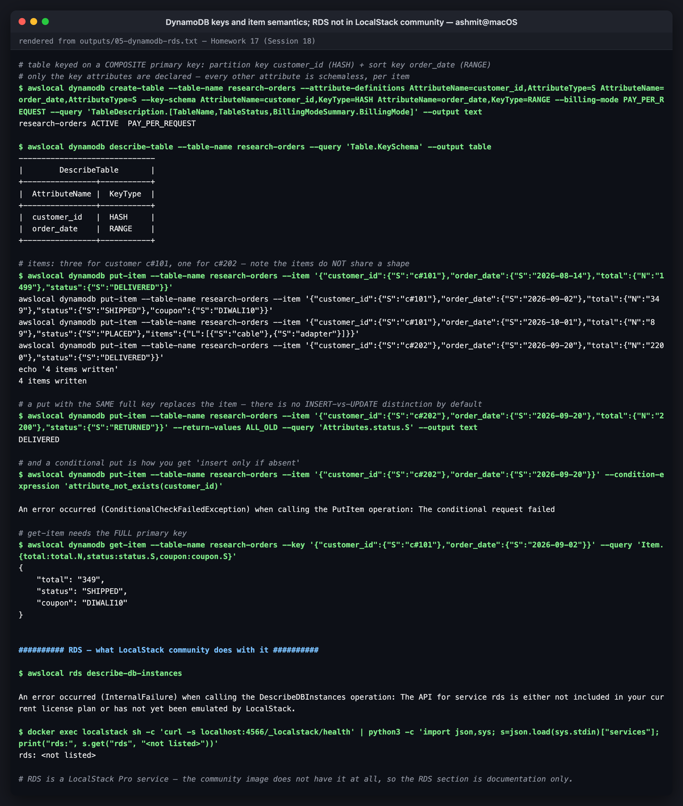
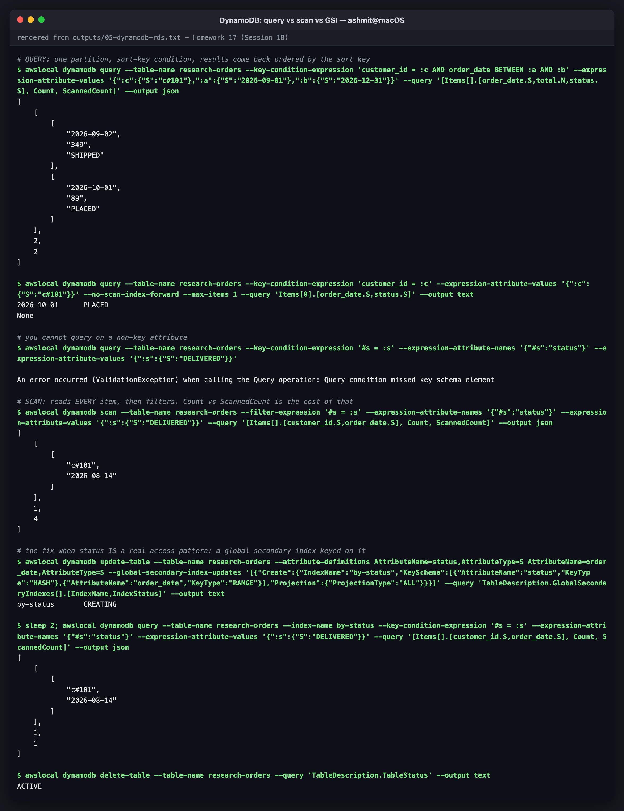

# 05 — DynamoDB & RDS (Database Services)

AWS has two flagship managed databases, built on opposite philosophies:

- **DynamoDB**: a serverless **NoSQL** key-value/document store. There are no servers and no
  connections, and it gives single-digit-millisecond reads at any scale, **as long as you know
  your access patterns up front.**
- **RDS**: managed **relational** databases (PostgreSQL, MySQL, …). It's full SQL with joins
  and transactions, and AWS handles patching, backups and failover. You still pick an instance
  size.

The DynamoDB lab ran against **LocalStack 4.14.0** (community). All output is verbatim from
[`../outputs/05-dynamodb-rds.txt`](../outputs/05-dynamodb-rds.txt). **RDS isn't available in
LocalStack community.** That was tried and the error is captured below, so the RDS half is a
study write-up only.

---

# Part 1 — DynamoDB

## NoSQL, and what it changes

| | **Relational (RDS)** | **DynamoDB** |
|---|---|---|
| Data model | tables of rows with a fixed schema; normalised; joins | tables of **items**; schemaless apart from the key; denormalised |
| Design starts from | the **entities** (customers, orders) | the **access patterns** ("get a customer's orders, newest first") |
| Query language | SQL, anything ad hoc | `GetItem` / `Query` on keys; `Scan` for everything else |
| Joins | yes | **no**; you pre-join by storing related items together |
| Scaling | vertical (bigger instance) + read replicas | horizontal, automatic, effectively unlimited |
| Connections | a pool to manage | HTTPS requests, no connection limit (ideal for Lambda) |
| Capacity | an instance running 24/7 | **on-demand** (pay per request) or provisioned RCU/WCU |
| Consistency | strong (ACID) | eventually consistent reads by default, strong on request; ACID transactions across up to 100 items |

## Tables, items, attributes, keys

```console
$ awslocal dynamodb create-table --table-name research-orders --attribute-definitions AttributeName=customer_id,AttributeType=S AttributeName=order_date,AttributeType=S --key-schema AttributeName=customer_id,KeyType=HASH AttributeName=order_date,KeyType=RANGE --billing-mode PAY_PER_REQUEST --query 'TableDescription.[TableName,TableStatus,BillingModeSummary.BillingMode]' --output text
research-orders	ACTIVE	PAY_PER_REQUEST
$ awslocal dynamodb describe-table --table-name research-orders --query 'Table.KeySchema' --output table
------------------------------
|        DescribeTable       |
+----------------+-----------+
|  AttributeName |  KeyType  |
+----------------+-----------+
|  customer_id   |  HASH     |
|  order_date    |  RANGE    |
+----------------+-----------+
```

| Term | Meaning | Here |
|---|---|---|
| **Table** | the collection | `research-orders` |
| **Item** | one record, max **400 KB** | one order |
| **Attribute** | a name/typed-value pair. Types: `S` string, `N` number, `B` binary, `BOOL`, `NULL`, `L` list, `M` map, `SS`/`NS`/`BS` sets | `total`, `status`, `coupon`, `items` |
| **Partition key** (`HASH`) | hashed to choose the physical partition the item lives on | `customer_id` |
| **Sort key** (`RANGE`) | orders items *within* a partition, and enables range queries | `order_date` |
| **Primary key** | partition key alone (*simple*), or partition + sort (*composite*). It must be unique | `(customer_id, order_date)` |

Only the **key** attributes were declared at creation. Everything else is per item, and items
in the same table don't need to share a shape:

```console
$ awslocal dynamodb put-item --table-name research-orders --item '{"customer_id":{"S":"c#101"},"order_date":{"S":"2026-08-14"},"total":{"N":"1499"},"status":{"S":"DELIVERED"}}'
awslocal dynamodb put-item --table-name research-orders --item '{"customer_id":{"S":"c#101"},"order_date":{"S":"2026-09-02"},"total":{"N":"349"},"status":{"S":"SHIPPED"},"coupon":{"S":"DIWALI10"}}'
awslocal dynamodb put-item --table-name research-orders --item '{"customer_id":{"S":"c#101"},"order_date":{"S":"2026-10-01"},"total":{"N":"89"},"status":{"S":"PLACED"},"items":{"L":[{"S":"cable"},{"S":"adapter"}]}}'
awslocal dynamodb put-item --table-name research-orders --item '{"customer_id":{"S":"c#202"},"order_date":{"S":"2026-09-20"},"total":{"N":"2200"},"status":{"S":"DELIVERED"}}'
echo '4 items written'
4 items written
```

One item has a `coupon`, one has an `items` list, two have neither. In SQL that would be a schema
migration or nullable columns. Note also that `N` values are sent as **strings** (`"1499"`):
DynamoDB numbers are arbitrary-precision decimals, sent as text to avoid float rounding.

```
        partition "c#101"                         partition "c#202"
  ┌──────────────────────────────────────┐   ┌──────────────────────────────┐
  │ 2026-08-14  1499  DELIVERED          │   │ 2026-09-20  2200  DELIVERED  │
  │ 2026-09-02   349  SHIPPED  DIWALI10  │   └──────────────────────────────┘
  │ 2026-10-01    89  PLACED   [cable,…] │
  └──────────────────────────────────────┘
        ▲ items kept sorted by order_date inside the partition
```

### Writes replace; conditions guard

```console
$ awslocal dynamodb put-item --table-name research-orders --item '{"customer_id":{"S":"c#202"},"order_date":{"S":"2026-09-20"},"total":{"N":"2200"},"status":{"S":"RETURNED"}}' --return-values ALL_OLD --query 'Attributes.status.S' --output text
DELIVERED

$ awslocal dynamodb put-item --table-name research-orders --item '{"customer_id":{"S":"c#202"},"order_date":{"S":"2026-09-20"}}' --condition-expression 'attribute_not_exists(customer_id)'

An error occurred (ConditionalCheckFailedException) when calling the PutItem operation: The conditional request failed
```

A `PutItem` with an existing key **silently replaces the whole item**. `ALL_OLD` shows what was
overwritten (`DELIVERED` became `RETURNED`). There's no separate INSERT that fails on duplicates.
You ask for that with a **condition expression**, which is also how DynamoDB does optimistic
locking (`version = :expected`). To change *some* attributes without replacing the rest, use
`UpdateItem`.


*DynamoDB keys and item semantics; RDS not in LocalStack community*

## Reading: GetItem, Query, Scan

```console
$ awslocal dynamodb get-item --table-name research-orders --key '{"customer_id":{"S":"c#101"},"order_date":{"S":"2026-09-02"}}' --query 'Item.{total:total.N,status:status.S,coupon:coupon.S}'
{
    "total": "349",
    "status": "SHIPPED",
    "coupon": "DIWALI10"
}
```

**GetItem** needs the *full* primary key and returns at most one item. It's the cheapest
possible read.

**Query** targets **one partition**, optionally with a sort-key condition (`=`, `<`, `BETWEEN`,
`begins_with`), and returns items in sort-key order:

```console
$ awslocal dynamodb query --table-name research-orders --key-condition-expression 'customer_id = :c AND order_date BETWEEN :a AND :b' --expression-attribute-values '{":c":{"S":"c#101"},":a":{"S":"2026-09-01"},":b":{"S":"2026-12-31"}}' --query '[Items[].[order_date.S,total.N,status.S], Count, ScannedCount]' --output json
[
    [
        [
            "2026-09-02",
            "349",
            "SHIPPED"
        ],
        [
            "2026-10-01",
            "89",
            "PLACED"
        ]
    ],
    2,
    2
]

$ awslocal dynamodb query --table-name research-orders --key-condition-expression 'customer_id = :c' --expression-attribute-values '{":c":{"S":"c#101"}}' --no-scan-index-forward --max-items 1 --query 'Items[0].[order_date.S,status.S]' --output text
2026-10-01	PLACED
None
```

`Count 2, ScannedCount 2`: it read exactly what it returned. The second query is "the latest
order for a customer": sort descending, take one. That's the payoff of choosing `order_date` as
the sort key, and why ISO-8601 dates (which sort correctly as strings) are the standard sort key.
(The trailing `None` is the CLI's empty pagination token printed by `--output text`.)

A query must name the partition key:

```console
$ awslocal dynamodb query --table-name research-orders --key-condition-expression '#s = :s' --expression-attribute-names '{"#s":"status"}' --expression-attribute-values '{":s":{"S":"DELIVERED"}}'

An error occurred (ValidationException) when calling the Query operation: Query condition missed key schema element
```

**Scan** reads the *whole table* and filters afterwards:

```console
$ awslocal dynamodb scan --table-name research-orders --filter-expression '#s = :s' --expression-attribute-names '{"#s":"status"}' --expression-attribute-values '{":s":{"S":"DELIVERED"}}' --query '[Items[].[customer_id.S,order_date.S], Count, ScannedCount]' --output json
[
    [
        [
            "c#101",
            "2026-08-14"
        ]
    ],
    1,
    4
]
```

**`Count 1, ScannedCount 4`.** You're billed for the 4 it read, not the 1 it returned. On four
items that's nothing. On forty million it's a large bill and a slow request. (`#s` is there
because `status` is a DynamoDB **reserved word**; there are over 500 of them, `name` and `date`
included.)

When "orders by status" is a real access pattern, the fix is a **global secondary index (GSI)**:
a second key schema over the same data.

```console
$ awslocal dynamodb update-table --table-name research-orders --attribute-definitions AttributeName=status,AttributeType=S AttributeName=order_date,AttributeType=S --global-secondary-index-updates '[{"Create":{"IndexName":"by-status","KeySchema":[{"AttributeName":"status","KeyType":"HASH"},{"AttributeName":"order_date","KeyType":"RANGE"}],"Projection":{"ProjectionType":"ALL"}}}]' --query 'TableDescription.GlobalSecondaryIndexes[].[IndexName,IndexStatus]' --output text
by-status	CREATING

$ sleep 2; awslocal dynamodb query --table-name research-orders --index-name by-status --key-condition-expression '#s = :s' --expression-attribute-names '{"#s":"status"}' --expression-attribute-values '{":s":{"S":"DELIVERED"}}' --query '[Items[].[customer_id.S,order_date.S], Count, ScannedCount]' --output json
[
    [
        [
            "c#101",
            "2026-08-14"
        ]
    ],
    1,
    1
]
```

Same answer, **`ScannedCount 1`**. The index is maintained automatically on every write,
asynchronously (GSI reads are eventually consistent), and costs its own storage and write
capacity.

| Read | Needs | Cost | Use |
|---|---|---|---|
| GetItem | full primary key | 1 item | point lookup |
| Query | partition key (+ optional sort-key condition) | only the items in range | the normal case |
| Query on GSI / LSI | the index's keys | items in range on the index | alternate access patterns |
| Scan | nothing | **the entire table** | exports, one-off admin jobs, never on a hot path |


*DynamoDB: query vs scan vs GSI*

### Choosing a partition key

DynamoDB spreads data and throughput by **hashing the partition key**. A good key has **many
distinct values, accessed fairly evenly**: `customer_id`, `device_id`, `session_id`. A bad key
concentrates traffic on one partition (a **hot partition**), for example `status` (three values),
`date` (today takes every write), or a single `"tenant": "big-customer"`. Each partition is
capped at about 3,000 read and 1,000 write units per second, regardless of table size.

## DynamoDB use cases

| Use case | Why DynamoDB |
|---|---|
| Shopping carts, user sessions, user profiles | key-value by user ID, spiky traffic |
| Gaming leaderboards and player state | very high write rates, single-digit ms |
| IoT telemetry | partition = device, sort = timestamp, TTL expiry for old data |
| Serverless backends (Lambda + API Gateway) | no connection pooling, pay-per-request |
| **Terraform state locking** (the classic `dynamodb_table` backend option) | conditional writes as a distributed lock. Newer Terraform versions can lock natively in S3 instead (`use_lockfile`) |
| Event-driven pipelines | DynamoDB Streams trigger Lambda on every change |

Poor fits: ad-hoc analytics, reporting with many joins and group-bys, and anything where access
patterns are still unknown. Those belong in RDS, or in a warehouse fed from DynamoDB exports.

---

# Part 2 — RDS

## Trying it on LocalStack

```console
$ awslocal rds describe-db-instances

An error occurred (InternalFailure) when calling the DescribeDBInstances operation: The API for service rds is either not included in your current license plan or has not yet been emulated by LocalStack.
$ docker exec localstack sh -c 'curl -s localhost:4566/_localstack/health' | python3 -c 'import json,sys; s=json.load(sys.stdin)["services"]; print("rds:", s.get("rds", "<not listed>"))'
rds: <not listed>
```

RDS is a **LocalStack Pro** service. The community image doesn't list it at all. Everything below
is documentation, with no fabricated output.

## What RDS is

**Amazon RDS** runs a relational database engine for you on managed instances. You get a
connection endpoint and SQL. AWS does provisioning, OS and engine patching, backups,
point-in-time restore, failover and monitoring. You still own schema design, query tuning,
choosing the instance class, and the database users.

| You manage | AWS manages |
|---|---|
| schema, indexes, queries | hardware, OS, engine install and patching |
| DB users and grants | automated backups and snapshots |
| instance class and storage size | Multi-AZ replication and failover |
| parameter groups (engine settings) | monitoring infrastructure, storage durability |
| network placement (subnets, SGs) | — |

No SSH and no OS access. If you need either, you need EC2 (or RDS Custom).

## Supported engines

| Engine | Notes |
|---|---|
| **PostgreSQL** | the default modern choice; extensions such as PostGIS and pgvector |
| **MySQL** | widely used; 8.0 / 8.4 |
| **MariaDB** | community MySQL fork |
| **Oracle** | bring-your-own-licence or licence-included |
| **SQL Server** | Express / Web / Standard / Enterprise |
| **IBM Db2** | added 2023 |
| **Amazon Aurora** (MySQL- and PostgreSQL-compatible) | AWS's cloud-native engine. Storage is a shared, self-healing volume, **6 copies across 3 AZs**, up to 15 low-lag replicas, fast failover, Serverless v2 autoscaling |

## DB instances

A **DB instance** is one running database server: an **instance class** plus **storage**.

| Choice | Options |
|---|---|
| Class family | `db.t4g/t3` burstable (dev), `db.m6g/m7g` general, `db.r6g/r7g` memory-optimised (most production DBs) |
| Storage | gp3 (default), io1/io2 for guaranteed IOPS; **storage autoscaling** grows it before it fills |
| Placement | a **DB subnet group** listing private subnets in ≥2 AZs |
| Configuration | **parameter group** (engine settings like `max_connections`), **option group** (engine features) |
| Endpoint | a DNS name such as `mydb.abc123.us-east-1.rds.amazonaws.com:5432`. Always connect by name, never by IP, because failover changes the IP |

## Security

```
   private subnet (app)                 private / isolated subnet (DB)
  ┌───────────────────┐   5432 only   ┌──────────────────────────────┐
  │  app  sg-app      │ ────────────► │  RDS   sg-db                 │
  └───────────────────┘   source =    │  inbound: 5432 from sg-app   │
                          sg-app      │  publicly_accessible = false │
                                      └──────────────────────────────┘
```

| Layer | Control |
|---|---|
| Network | DB subnet group in **private** subnets; `PubliclyAccessible=false`; security group allowing the engine port **only from the app's security group** |
| Authentication | master user password stored in **Secrets Manager** (`ManageMasterUserPassword`, auto-rotated), or **IAM database authentication** (15-minute tokens instead of passwords) |
| Encryption at rest | KMS, chosen **at creation**. An unencrypted instance can't be encrypted in place; you go via snapshot → encrypted copy → restore |
| Encryption in transit | TLS; force it with `rds.force_ssl=1` (PostgreSQL) or `require_secure_transport` (MySQL) |
| Audit | engine audit logs exported to CloudWatch, CloudTrail for the RDS API |
| Protection | `DeletionProtection=true` on production |

## Backups

| Kind | How | Retention | Restore |
|---|---|---|---|
| **Automated backups** | daily snapshot in the backup window + transaction logs every ~5 min | 1–35 days (0 disables them, and also disables read replicas) | **point-in-time restore** to any second within the window, as a **new** instance |
| **Manual snapshots** | you take them (`create-db-snapshot`) | until you delete them, even after the instance is gone | to a new instance; can be copied cross-region and cross-account |
| AWS Backup | central policies across services | per plan | per plan |

Gotcha: **restores always create a new instance with a new endpoint.** The app's connection
string has to change, or you swap DNS. Plan that before the day you need it.

## Multi-AZ

```
         us-east-1a                                us-east-1b
  ┌──────────────────────┐   synchronous    ┌──────────────────────┐
  │ PRIMARY (read/write) │ ───replication──►│ STANDBY (no traffic) │
  └──────────▲───────────┘                  └──────────────────────┘
             │  endpoint DNS points here; on failure it flips to the standby (~60–120 s)
          app
```

- **Purpose: availability, not scaling.** The standby serves **no reads** in the classic
  Multi-AZ instance deployment.
- Replication is **synchronous**, so a committed write is on both copies. Failover loses no data.
- Automatic failover on instance, AZ, storage or network failure, and during patching. Backups
  are taken from the standby, so the primary has no I/O pause.
- The **Multi-AZ DB cluster** variant (MySQL/PostgreSQL) uses **two readable standbys** and
  fails over in about 35 seconds.

## Read replicas

- **Purpose: read scaling** (and a cross-region DR copy).
- Replication is **asynchronous**, so replicas can lag. A user who writes and then immediately
  reads from a replica may not see their write.
- Up to 15 replicas, each with **its own endpoint**. The application has to send reads there
  itself.
- A replica can be **promoted** to a standalone, writable instance, for example for DR in
  another region. Promotion is manual and one-way.

| | **Multi-AZ** | **Read replica** |
|---|---|---|
| Goal | high availability | read scalability |
| Replication | synchronous | asynchronous |
| Serves reads | no (instance) / yes (cluster) | yes |
| Endpoint | same as the primary | its own |
| Failover | automatic | manual promotion |
| Cross-region | no | yes |

## RDS use cases

| Use case | Why RDS |
|---|---|
| Transactional web/mobile app backends | ACID, joins, constraints, mature ORMs |
| E-commerce orders, payments, inventory | multi-row transactions where correctness is critical |
| SaaS products | relational model, per-tenant schemas or row-level security |
| Lift-and-shift of on-prem MySQL/PostgreSQL/Oracle/SQL Server | same engine, no DBA toil for backups and patching |
| Reporting on operational data | read replicas take the reporting load off the primary |
| Teams without a dedicated DBA | backups, PITR and failover come built in |

## DynamoDB or RDS?

| Choose **DynamoDB** when… | Choose **RDS** when… |
|---|---|
| access patterns are known and key-based | queries are ad hoc or still evolving |
| scale is unpredictable or massive | the data is relational, with joins and constraints |
| you want zero servers and pay-per-request | you need full SQL and existing tools/ORMs |
| millisecond latency at any size is required | strict multi-table transactions are central |
| the workload is serverless (Lambda) | you're migrating an existing SQL database |

Many real systems use **both**: RDS for orders and billing, DynamoDB for sessions, carts and
event state.

---

## Files

```
05-dynamodb-rds/README.md
../outputs/05-dynamodb-rds.txt   DynamoDB lab + the RDS attempt
../screenshots/05-*.png
```
