# Homework 18 — Cloud & Terraform in Action

Course session: **`session19-cloud-terraform`**.

An end-to-end Terraform project: a VPC with a public subnet, an internet gateway and route table,
a security group, an EC2 instance with an IAM role, and an S3 bucket it reads its content from.
The project uses two providers, variables with validation, a data source, implicit and explicit
dependencies, and outputs. It goes through `plan`, `apply`, state inspection, drift detection and
`destroy`, all against **LocalStack** instead of AWS.

**All output blocks are extracted verbatim** from the transcripts in [`outputs/`](outputs).

The screenshots are **renders of those transcripts**, not captures of a live terminal — every lab ran non-interactively, so there was no window to photograph. Each image names its source transcript in the title bar; see [`screenshots/`](screenshots).

## Where the brief is answered

| Session 19 brief | Where |
|---|---|
| Terraform providers | [Task 1](#task-1--providers-init-validate) — `aws` + `random`, and a provider aimed at LocalStack |
| Variables | [`variables.tf`](terraform/variables.tf), two of them with `validation {}` rules; Task 1 |
| Resources | 15 across [`network.tf`](terraform/network.tf), [`security.tf`](terraform/security.tf), [`compute.tf`](terraform/compute.tf), [`storage.tf`](terraform/storage.tf) |
| Outputs | [`outputs.tf`](terraform/outputs.tf); [Task 6](#task-6--dependency-graph-and-outputs) |
| Dependencies | [Dependencies](#dependencies-implicit-and-explicit), Task 3 (apply order), Task 6 (graph) |
| AWS infrastructure: VPC, subnet, SG, EC2, S3 | [Task 4](#task-4--every-resource-verified-through-the-api) |
| Terraform state | [Task 5](#task-5--state-and-drift) — state, recorded dependencies, drift |
| `plan` / `apply` / `destroy` | Tasks 2, 3, 7 |
| Architecture diagram | [below](#architecture) — [`architecture.svg`](architecture.svg) |

---

## Architecture

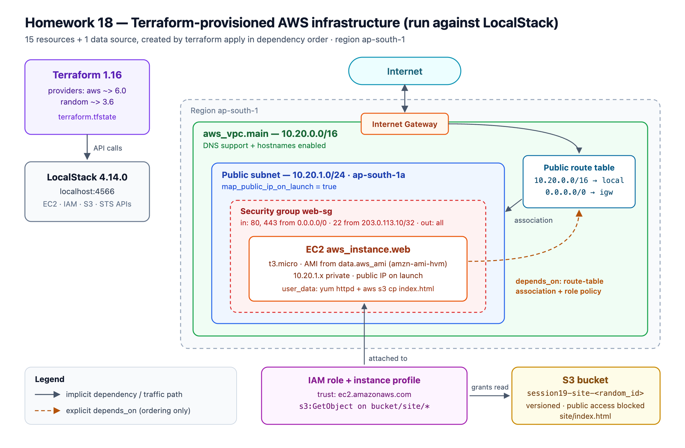
*the infrastructure Terraform builds — source: [architecture.svg](architecture.svg)*

| Layer | Resource | Notes |
|---|---|---|
| Network | `aws_vpc.main` | `10.20.0.0/16`, DNS support + hostnames |
| | `aws_subnet.public` | `10.20.1.0/24` in `ap-south-1a`, public IP on launch |
| | `aws_internet_gateway.main` | attached to the VPC |
| | `aws_route_table.public` + `aws_route_table_association.public` | `0.0.0.0/0 → igw`; makes the subnet *public* |
| Security | `aws_security_group.web` | 80/443 from anywhere, **22 only from `admin_cidr`**, all egress |
| Identity | `aws_iam_role.web`, `aws_iam_role_policy.read_site`, `aws_iam_instance_profile.web` | instance may `s3:GetObject` on `site/*` of one bucket, nothing else |
| Compute | `data.aws_ami.linux` → `aws_instance.web` | `t3.micro`; `user_data` installs httpd and pulls `index.html` from S3 |
| Storage | `random_id.bucket_suffix`, `aws_s3_bucket.site`, versioning, public-access block, `aws_s3_object.index` | globally unique name via the random provider |

A subnet is "public" only because of the route table. The route `0.0.0.0/0 → igw` is what makes
it public; the subnet resource itself has no "public" setting apart from
`map_public_ip_on_launch`.

### What LocalStack can and cannot show

LocalStack Community (pinned to **4.14.0**, the last image that runs without a licence; `latest`
and the 2026.x tags exit asking for credentials) implements the **EC2, IAM, S3 and STS APIs**.
Every `describe-*` call below returns real data that Terraform created. But the EC2 instance is
an **API record, not a virtual machine**. No VM boots, `user_data` never runs, nothing listens on
port 80, and there is nothing to SSH into. [Task 4](#what-localstack-community-does-not-give-you)
shows this directly instead of just asserting it. Everything about the *infrastructure as code*
(the graph, state, dependencies, drift, destroy) behaves exactly as it would on AWS.

---

## The project

```
terraform/
├── versions.tf        required_version, required_providers: aws ~> 6.0, random ~> 3.6
├── provider.tf        aws (aimed at LocalStack, default_tags) + random
├── variables.tf       region, endpoint, project, CIDRs, instance type, AMI filter, admin CIDR
├── terraform.tfvars   values for this run
├── network.tf         VPC, subnet, IGW, route table, association
├── security.tf        security group
├── storage.tf         random_id, S3 bucket, versioning, public-access block, index.html
├── compute.tf         AMI data source, IAM role/policy/profile, EC2 instance
└── outputs.tf         10 outputs
```

Splitting by layer is a convention, not a requirement: Terraform loads every `.tf` file in the
directory as one configuration. The split makes reviews readable. A network change touches
`network.tf` and nothing else.

`default_tags` in the provider block stamps `Project`, `Session` and `ManagedBy` on every AWS
resource, so individual resources only declare a `Name`. That pays off in
[Task 7](#task-7--destroy), where a tag filter proves nothing is left behind.

---

# Task 1 — Providers, init, validate

```console
$ terraform init -no-color
Initializing the backend...

Initializing provider plugins...
- Finding hashicorp/aws versions matching "~> 6.0"...
- Finding hashicorp/random versions matching "~> 3.6"...
- Installing hashicorp/aws v6.67.0...
- Installed hashicorp/aws v6.67.0 (signed by HashiCorp)
- Installing hashicorp/random v3.9.1...
- Installed hashicorp/random v3.9.1 (signed by HashiCorp)

Terraform has created a lock file .terraform.lock.hcl to record the provider
selections it made above. Include this file in your version control repository
so that Terraform can guarantee to make the same selections by default when
you run "terraform init" in the future.

Terraform has been successfully initialized!

$ terraform providers -no-color

Providers required by configuration:
.
├── provider[registry.terraform.io/hashicorp/aws] ~> 6.0
└── provider[registry.terraform.io/hashicorp/random] ~> 3.6
```

A **provider** is a plugin that translates resource blocks into API calls. `aws` talks to the
EC2/IAM/S3 APIs. `random` talks to nothing: it generates values and stores them in state so they
stay stable between runs. Both are pinned with `~>` ("this minor series or newer, not the next
major"), and the exact versions chosen go into the committed lock file.

```console
$ terraform fmt -check -recursive; echo "fmt exit code: $?"
fmt exit code: 0

$ terraform validate -no-color
Success! The configuration is valid.
```

**Variables with validation.** A bad value fails before a single API call:

```console
$ terraform plan -no-color -var="vpc_cidr=10.20.0.0/33" 2>&1 | sed -n "/Error/,\$p"
Error: Invalid value for variable

  on variables.tf line 19:
  19: variable "vpc_cidr" {
    ├────────────────
    │ var.vpc_cidr is "10.20.0.0/33"

vpc_cidr must be a valid IPv4 CIDR block, e.g. 10.20.0.0/16.

This was checked by the validation rule at variables.tf:24,3-13.
```

Values come from four places, in increasing precedence: the `default` in `variables.tf`,
`terraform.tfvars`, `-var-file`, and `-var` on the command line (used above).

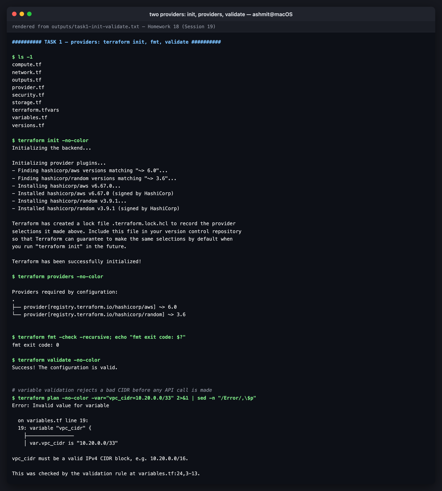
*two providers: init, providers, validate*

---

# Task 2 — `terraform plan`

```console
$ terraform plan -no-color -out=infra.tfplan
data.aws_ami.linux: Reading...
data.aws_ami.linux: Read complete after 1s [id=ami-760aaa0f]
```

The **data source** is read during plan. It is a lookup, not a resource: it asked the EC2 API for
the newest Amazon-owned image whose name matches `amzn-ami-hvm-*-x86_64-gp2`, and got
`ami-760aaa0f`. Hard-coding an AMI ID is the usual mistake, because AMI IDs differ by region and
are replaced with every patch release.

The plan lists 15 resources ([full plan, 472 lines](outputs/task2-plan.txt)) and ends:

```console
Plan: 15 to add, 0 to change, 0 to destroy.

Changes to Outputs:
  + ami_id              = "ami-760aaa0f"
  + instance_id         = (known after apply)
  + instance_private_ip = (known after apply)
  + instance_public_ip  = (known after apply)
  + internet_gateway_id = (known after apply)
  + public_subnet_id    = (known after apply)
  + security_group_id   = (known after apply)
  + site_bucket         = (known after apply)
  + vpc_cidr            = "10.20.0.0/16"
  + vpc_id              = (known after apply)
```

`ami_id` is already known because the data source was read during plan. Everything the cloud
assigns is `(known after apply)`.

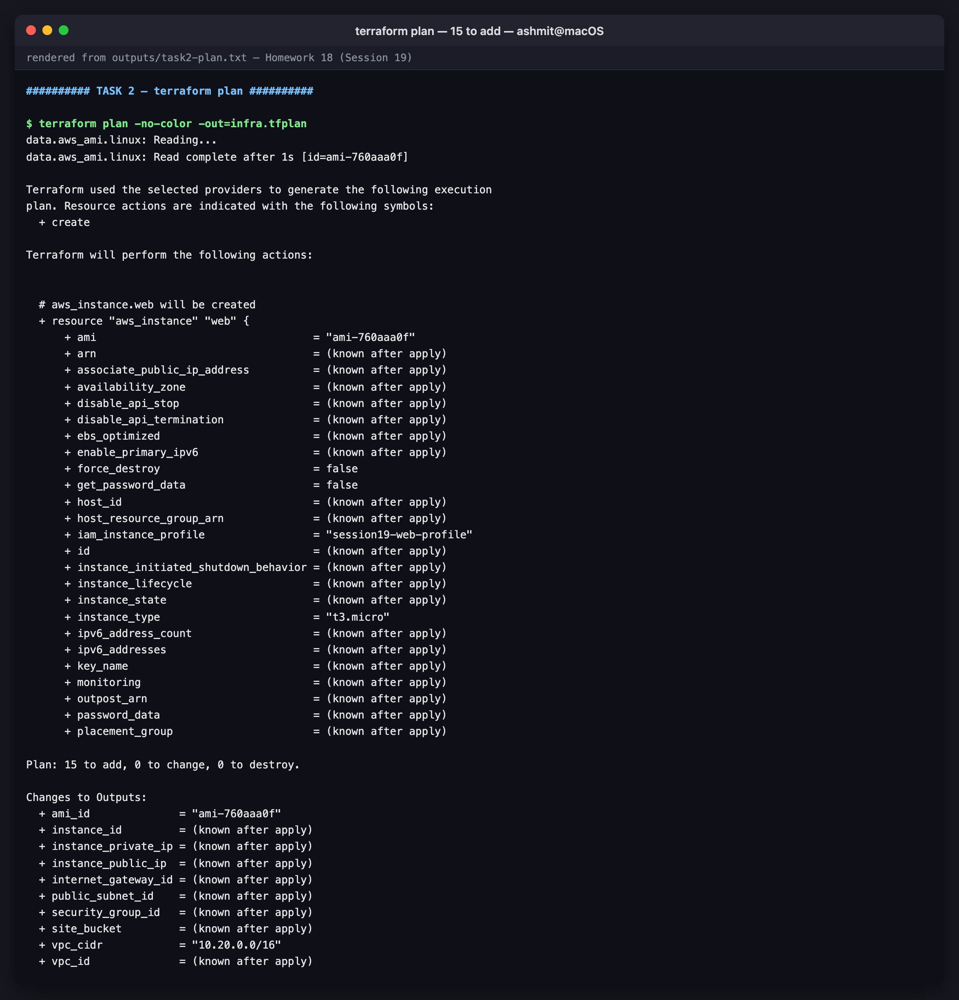
*terraform plan — 15 to add*

---

## Dependencies, implicit and explicit

**Implicit dependencies** come from references. `aws_subnet.public` contains
`vpc_id = aws_vpc.main.id`, so Terraform creates the subnet after the VPC. Nearly every ordering
in this project comes from references like that one.

**Explicit dependencies** (`depends_on`) are for ordering that matters in reality but does not
appear in the code. From [`compute.tf`](terraform/compute.tf):

```hcl
resource "aws_instance" "web" {
  subnet_id              = aws_subnet.public.id
  vpc_security_group_ids = [aws_security_group.web.id]
  iam_instance_profile   = aws_iam_instance_profile.web.name
  ...
  depends_on = [
    aws_route_table_association.public,
    aws_iam_role_policy.read_site,
  ]
}
```

The instance references the subnet, but **not the route table, its association or the gateway**.
Without `depends_on`, Terraform could boot the instance while the subnet still has no route to
the internet. Then the first line of `user_data` (`yum install -y httpd`) times out on a real VM.
In the same way, the instance profile references the role but not the role's *policy*, so
`aws s3 cp` could run before the instance is allowed to read the bucket. Both are race conditions
that Terraform cannot see, so they are written down.

---

# Task 3 — `terraform apply`: the order is the graph

```console
$ terraform apply -no-color infra.tfplan
random_id.bucket_suffix: Creating...
random_id.bucket_suffix: Creation complete after 0s [id=XiPboQ]
aws_vpc.main: Creating...
aws_iam_role.web: Creating...
aws_s3_bucket.site: Creating...
aws_iam_role.web: Creation complete after 6s [id=session19-web-role]
aws_iam_instance_profile.web: Creating...
aws_s3_bucket.site: Creation complete after 8s [id=session19-site-5e23dba1]
aws_s3_bucket_public_access_block.site: Creating...
aws_s3_bucket_versioning.site: Creating...
aws_iam_role_policy.read_site: Creating...
aws_s3_object.index: Creating...
aws_vpc.main: Creation complete after 8s [id=vpc-c2c1b37a6c45ad588]
aws_internet_gateway.main: Creating...
aws_subnet.public: Creating...
aws_security_group.web: Creating...
aws_s3_bucket_public_access_block.site: Creation complete after 2s [id=session19-site-5e23dba1]
aws_iam_role_policy.read_site: Creation complete after 2s [id=session19-web-role:read-site-bucket]
aws_s3_object.index: Creation complete after 2s [id=session19-site-5e23dba1/site/index.html]
aws_internet_gateway.main: Creation complete after 3s [id=igw-5435a6826c328d71b]
aws_route_table.public: Creating...
aws_s3_bucket_versioning.site: Creation complete after 3s [id=session19-site-5e23dba1]
aws_route_table.public: Creation complete after 0s [id=rtb-2db6721bfb4f0a7c6]
aws_security_group.web: Creation complete after 4s [id=sg-0090ae80b9b8874bb]
aws_iam_instance_profile.web: Creation complete after 7s [id=session19-web-profile]
aws_subnet.public: Still creating... [00m10s elapsed]
aws_subnet.public: Creation complete after 16s [id=subnet-193bcc5cb706c7c2d]
aws_route_table_association.public: Creating...
aws_route_table_association.public: Creation complete after 1s [id=rtbassoc-4c337beac725177cf]
aws_instance.web: Creating...
aws_instance.web: Still creating... [00m10s elapsed]
aws_instance.web: Creation complete after 16s [id=i-5b36c93cf7bf4ac58]

Apply complete! Resources: 15 added, 0 changed, 0 destroyed.
```

How the order follows from the dependencies:

| Moment | What happened | Why |
|---|---|---|
| first | `random_id` alone | the bucket name needs its value |
| then, in parallel | VPC, IAM role, S3 bucket | three independent roots; Terraform runs up to 10 operations at once |
| after the VPC | IGW, subnet, SG start together | each references only `aws_vpc.main.id` |
| after the IGW | route table | its route references `aws_internet_gateway.main.id` |
| after subnet **and** route table | association | references both |
| **last** | `aws_instance.web` | waited for the association (`depends_on`) even though the security group, profile and AMI were ready seconds earlier |

The subnet took 16 s and the instance waited for it through the association. That is the
`depends_on` working: without it, the instance would have started as soon as the subnet existed.

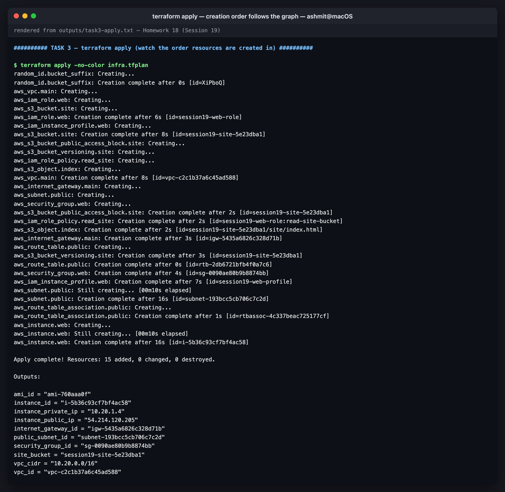
*terraform apply — creation order follows the graph*

---

# Task 4 — Every resource, verified through the API

Terraform's report is Terraform's own view. These calls go straight to the EC2, IAM and S3 APIs.

**Network**

```console
$ awslocal --region ap-south-1 ec2 describe-vpcs --vpc-ids $(terraform output -raw vpc_id) --query 'Vpcs[].{Id:VpcId,Cidr:CidrBlock,State:State,Name:Tags[?Key==`Name`]|[0].Value}' --output table
-------------------------------------------------------------------------
|                             DescribeVpcs                              |
+--------------+-------------------------+----------------+-------------+
|     Cidr     |           Id            |     Name       |    State    |
+--------------+-------------------------+----------------+-------------+
|  10.20.0.0/16|  vpc-c2c1b37a6c45ad588  |  session19-vpc |  available  |
+--------------+-------------------------+----------------+-------------+

$ awslocal --region ap-south-1 ec2 describe-subnets --subnet-ids $(terraform output -raw public_subnet_id) --query 'Subnets[].{Id:SubnetId,Cidr:CidrBlock,AZ:AvailabilityZone,PublicIpOnLaunch:MapPublicIpOnLaunch,FreeIPs:AvailableIpAddressCount}' --output table
--------------------------------------------------
|                 DescribeSubnets                |
+-------------------+----------------------------+
|  AZ               |  ap-south-1a               |
|  Cidr             |  10.20.1.0/24              |
|  FreeIPs          |  250                       |
|  Id               |  subnet-193bcc5cb706c7c2d  |
|  PublicIpOnLaunch |  True                      |
+-------------------+----------------------------+
```

`FreeIPs: 250`, not 256. AWS reserves **5 addresses in every subnet**: the network address,
`.1` for the VPC router, `.2` for DNS, `.3` reserved for future use, and the broadcast address.

```console
$ awslocal --region ap-south-1 ec2 describe-route-tables --filters Name=vpc-id,Values=$(terraform output -raw vpc_id) --query 'RouteTables[].{Main:Associations[0].Main,Subnet:Associations[0].SubnetId,Routes:Routes[].[DestinationCidrBlock,GatewayId]}' --output json
[
    {
        "Main": true,
        "Subnet": null,
        "Routes": [
            [
                "10.20.0.0/16",
                "local"
            ]
        ]
    },
    {
        "Main": false,
        "Subnet": "subnet-193bcc5cb706c7c2d",
        "Routes": [
            [
                "10.20.0.0/16",
                "local"
            ],
            [
                "0.0.0.0/0",
                "igw-5435a6826c328d71b"
            ]
        ]
    }
]
```

**Two** route tables. The first is the VPC's *main* table, created automatically, with only the
`local` route; any subnet not explicitly associated falls back to it and is therefore private.
The second is ours, associated with our subnet, and has the default route to the gateway.

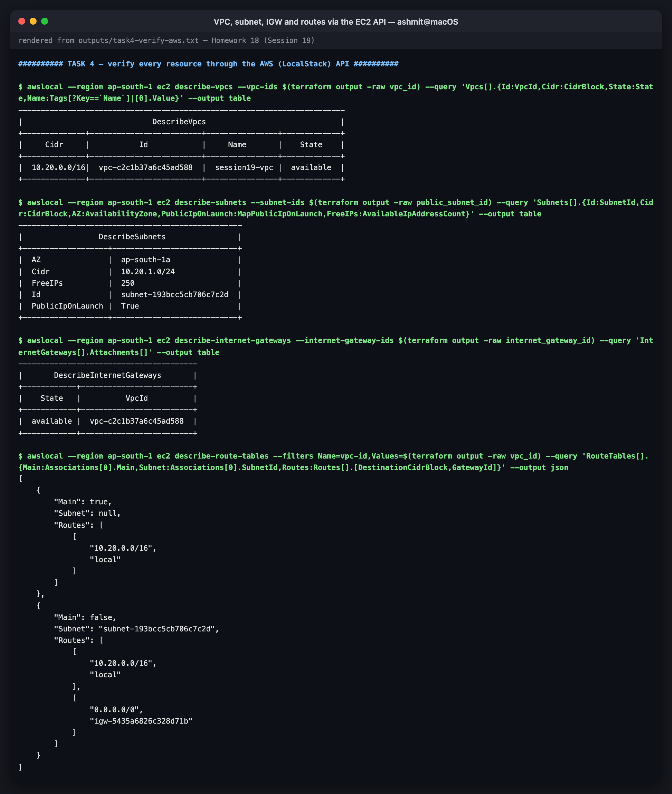
*VPC, subnet, IGW and routes via the EC2 API*

**Security group, instance, IAM, S3**

```console
$ awslocal --region ap-south-1 ec2 describe-security-groups --group-ids $(terraform output -raw security_group_id) --query 'SecurityGroups[].IpPermissions[].{Port:FromPort,Proto:IpProtocol,From:IpRanges[0].CidrIp,Why:IpRanges[0].Description}' --output table
--------------------------------------------------------------------
|                      DescribeSecurityGroups                      |
+------------------+-------+--------+------------------------------+
|       From       | Port  | Proto  |             Why              |
+------------------+-------+--------+------------------------------+
|  0.0.0.0/0       |  80   |  tcp   |  HTTP                        |
|  0.0.0.0/0       |  443  |  tcp   |  HTTPS                       |
|  203.0.113.10/32 |  22   |  tcp   |  SSH from the admin address  |
+------------------+-------+--------+------------------------------+

$ awslocal --region ap-south-1 ec2 describe-instances --instance-ids $(terraform output -raw instance_id) --query 'Reservations[].Instances[].{Id:InstanceId,State:State.Name,Type:InstanceType,AMI:ImageId,Subnet:SubnetId,PrivateIp:PrivateIpAddress,PublicIp:PublicIpAddress,Profile:IamInstanceProfile.Arn}' --output json
[
    {
        "Id": "i-5b36c93cf7bf4ac58",
        "State": "running",
        "Type": "t3.micro",
        "AMI": "ami-760aaa0f",
        "Subnet": "subnet-193bcc5cb706c7c2d",
        "PrivateIp": "10.20.1.4",
        "PublicIp": "54.214.120.205",
        "Profile": "arn:aws:iam::000000000000:instance-profile/session19-web-profile"
    }
]
```

SSH is open only to `203.0.113.10/32`, a single address (from the documentation range,
standing in for an admin's IP). Opening port 22 to `0.0.0.0/0` is the most common finding in any
cloud security scan. The private IP `10.20.1.4` is the first usable address after the four
reserved ones at the start of the subnet.

```console
$ awslocal --region ap-south-1 ec2 describe-instance-attribute --instance-id $(terraform output -raw instance_id) --attribute userData --query UserData.Value --output text | base64 --decode
#!/bin/bash
yum install -y httpd
aws s3 cp s3://session19-site-5e23dba1/site/index.html /var/www/html/index.html
systemctl enable --now httpd

$ awslocal --region ap-south-1 iam get-role-policy --role-name session19-web-role --policy-name read-site-bucket --query PolicyDocument
{
    "Version": "2012-10-17",
    "Statement": [
        {
            "Action": [
                "s3:GetObject"
            ],
            "Effect": "Allow",
            "Resource": "arn:aws:s3:::session19-site-5e23dba1/site/*"
        }
    ]
}

$ awslocal --region ap-south-1 s3 cp s3://$(terraform output -raw site_bucket)/site/index.html -
<h1>Hello from session19 - provisioned by Terraform</h1>
```

The bucket name `session19-site-5e23dba1` appears in the user_data script **and** the IAM
policy. Terraform interpolated the same `random_id` into both, which is also why the policy and
the instance depend on the bucket. The policy is least privilege: one action, one prefix, one
bucket.

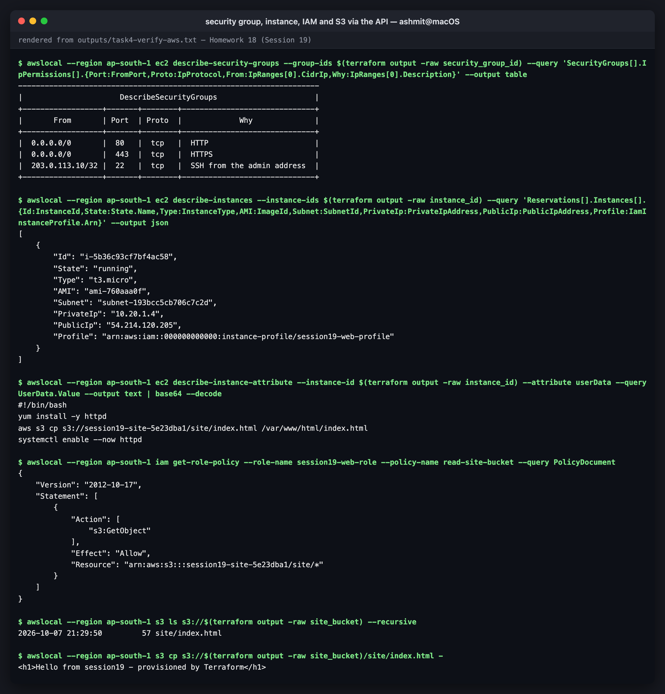
*security group, instance, IAM and S3 via the API*

## What LocalStack Community does not give you

```console
# what LocalStack Community does NOT give you: the instance is an API record, not a VM.
# every container image running on this machine — nothing new appeared for i-... :
$ docker ps --format '{{.Image}}' | sort
gcr.io/k8s-minikube/kicbase:v0.0.51
gcr.io/k8s-minikube/kicbase:v0.0.51
localstack/localstack:4.14.0
postgres:16-alpine
postgres:17-alpine

$ nc -vz -G 3 $(terraform output -raw instance_public_ip) 80; echo "exit code: $?"
nc: connectx to 54.214.120.205 port 80 (tcp) failed: Operation timed out
exit code: 1
```

The EC2 API reports the instance as `running`, but no container or VM exists for it. The public
IP `54.214.120.205` is an address LocalStack made up, and nothing answers on it. On real AWS this
exact configuration would serve the `<h1>` page on port 80. Here the point is the infrastructure
code, not a running web server.

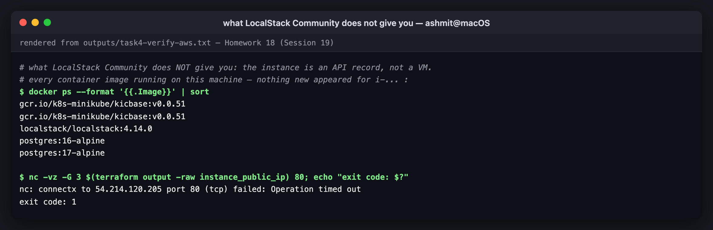
*what LocalStack Community does not give you*

---

# Task 5 — State and drift

```console
$ terraform state list
data.aws_ami.linux
aws_iam_instance_profile.web
aws_iam_role.web
aws_iam_role_policy.read_site
aws_instance.web
aws_internet_gateway.main
aws_route_table.public
aws_route_table_association.public
aws_s3_bucket.site
aws_s3_bucket_public_access_block.site
aws_s3_bucket_versioning.site
aws_s3_object.index
aws_security_group.web
aws_subnet.public
aws_vpc.main
random_id.bucket_suffix

$ terraform state show -no-color aws_instance.web | grep -E "^ +(ami|id|instance_state|instance_type|private_ip|public_ip|subnet_id|iam_instance_profile|availability_zone) +="
    ami                                  = "ami-760aaa0f"
    availability_zone                    = "ap-south-1a"
    iam_instance_profile                 = "session19-web-profile"
    id                                   = "i-5b36c93cf7bf4ac58"
    instance_state                       = "running"
    instance_type                        = "t3.micro"
    private_ip                           = "10.20.1.4"
    public_ip                            = "54.214.120.205"
    subnet_id                            = "subnet-193bcc5cb706c7c2d"
```

State is Terraform's **map from code addresses to real IDs**: `aws_instance.web` ↔
`i-5b36c93cf7bf4ac58`. Without it Terraform could not tell "this instance already exists" from
"create another one".

```console
$ python3 -c "import json; s=json.load(open(\"terraform.tfstate\")); print(\"version:\", s[\"version\"], \" serial:\", s[\"serial\"], \" lineage:\", s[\"lineage\"]); print(\"resources tracked:\", len(s[\"resources\"]))"
version: 4  serial: 16  lineage: 7e68f6d6-712c-2fa8-4ad2-547994151064
resources tracked: 16
```

`lineage` is a UUID fixed when this state was first created; `terraform state push` refuses to
replace a state with one of a different lineage, so one project's state cannot be pushed over
another's. `serial`
increases with every write. Sixteen entries: 15 resources and one data source.

State also records **each resource's dependencies**. This is what `destroy` reads to work out
the reverse order, even after the code is deleted:

```console
$ python3 -c "import json; s=json.load(open(\"terraform.tfstate\")); r=[x for x in s[\"resources\"] if x[\"type\"]==\"aws_instance\"][0]; print(\"\n\".join(sorted(r[\"instances\"][0][\"dependencies\"])))"
aws_iam_instance_profile.web
aws_iam_role.web
aws_iam_role_policy.read_site
aws_internet_gateway.main
aws_route_table.public
aws_route_table_association.public
aws_s3_bucket.site
aws_s3_object.index
aws_security_group.web
aws_subnet.public
aws_vpc.main
data.aws_ami.linux
random_id.bucket_suffix
```

The instance depends on **13** things, transitively. `aws_internet_gateway.main` is among them
even though `compute.tf` never mentions it. It arrives through `depends_on` → association →
route table → gateway.

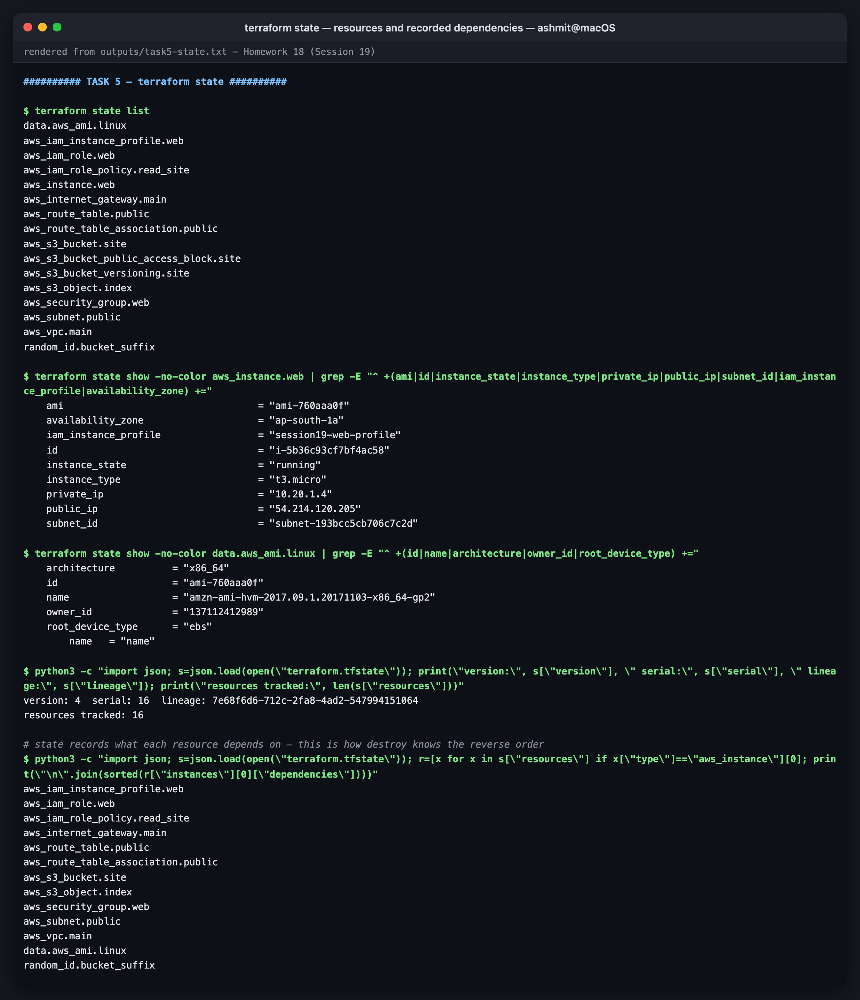
*terraform state — resources and recorded dependencies*

## Drift

Drift is the real infrastructure no longer matching the code, usually because someone clicked
in the console. To simulate it, a tag is changed behind Terraform's back:

```console
$ awslocal --region ap-south-1 ec2 create-tags --resources $(terraform output -raw security_group_id) --tags Key=Session,Value=hand-edited

$ terraform plan -no-color -detailed-exitcode | sed -n "/will be updated/,/^Plan:/p"; echo "exit code: ${PIPESTATUS[0]}  (2 = changes pending)"
  # aws_security_group.web will be updated in-place
  ~ resource "aws_security_group" "web" {
        id                     = "sg-0090ae80b9b8874bb"
        name                   = "session19-web-sg"
      ~ tags                   = {
            "Name"    = "session19-web-sg"
          - "Session" = "hand-edited" -> null
        }
      ~ tags_all               = {
          ~ "Session"   = "hand-edited" -> "19"
            # (3 unchanged elements hidden)
        }
        # (9 unchanged attributes hidden)
    }

Plan: 0 to add, 1 to change, 0 to destroy.
exit code: 2  (2 = changes pending)
```

Every `plan` refreshes state from the real API first, then compares. It caught the change and
proposes putting `Session` back to `19`, the value from `default_tags`. The diff shows the
mechanics: the hand-made tag appeared as a resource-level tag, which Terraform removes, and the
provider-level default tag wins again. Applying fixes the drift:

```console
$ terraform apply -no-color -auto-approve | grep -E "Modif|Apply complete"
aws_security_group.web: Modifying... [id=sg-0090ae80b9b8874bb]
aws_security_group.web: Modifications complete after 2s [id=sg-0090ae80b9b8874bb]
Apply complete! Resources: 0 added, 1 changed, 0 destroyed.

$ terraform plan -no-color -detailed-exitcode | tail -2; echo "exit code: ${PIPESTATUS[0]}"
Terraform has compared your real infrastructure against your configuration
and found no differences, so no changes are needed.
exit code: 0
```

The change was **in-place** (`~`), not a replacement, because tags can be updated on a live
security group. Changing the group's `name`, by contrast, would force `-/+` destroy-and-recreate.

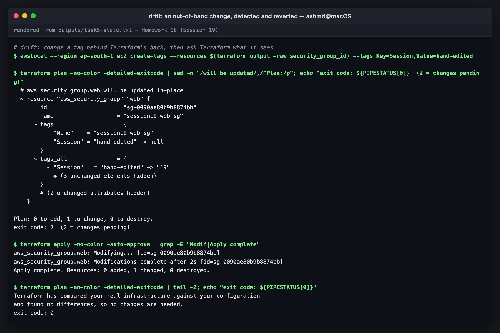
*drift: an out-of-band change, detected and reverted*

---

# Task 6 — Dependency graph and outputs

```console
$ terraform graph > graph.dot && grep -c -- "->" graph.dot
19

$ grep -- "->" graph.dot | grep -E "aws_instance.web|aws_route_table_association.public|aws_subnet.public" | grep -v provider | sed "s/\[root\] //g; s/ (expand)//g" | sort
  "aws_instance.web" -> "aws_iam_instance_profile.web";
  "aws_instance.web" -> "aws_iam_role_policy.read_site";
  "aws_instance.web" -> "aws_route_table_association.public";
  "aws_instance.web" -> "aws_s3_object.index";
  "aws_instance.web" -> "aws_security_group.web";
  "aws_instance.web" -> "data.aws_ami.linux";
  "aws_route_table_association.public" -> "aws_route_table.public";
  "aws_route_table_association.public" -> "aws_subnet.public";
  "aws_subnet.public" -> "aws_vpc.main";
```

The two `depends_on` targets appear as ordinary edges: `→ aws_route_table_association.public`
and `→ aws_iam_role_policy.read_site`.

Note also what is missing: there is **no edge `aws_instance.web → aws_subnet.public`**, even
though the instance references `aws_subnet.public.id`. `terraform graph` applies a *transitive
reduction*. The instance already reaches the subnet through the association, so the direct edge
is redundant and dropped. The same reduction explains `→ aws_s3_object.index` in place of an edge
to the bucket. `terraform graph | dot -Tsvg` draws this as a picture.

```console
$ terraform output -no-color
ami_id = "ami-760aaa0f"
instance_id = "i-5b36c93cf7bf4ac58"
instance_private_ip = "10.20.1.4"
instance_public_ip = "54.214.120.205"
internet_gateway_id = "igw-5435a6826c328d71b"
public_subnet_id = "subnet-193bcc5cb706c7c2d"
security_group_id = "sg-0090ae80b9b8874bb"
site_bucket = "session19-site-5e23dba1"
vpc_cidr = "10.20.0.0/16"
vpc_id = "vpc-c2c1b37a6c45ad588"

$ terraform output -json | python3 -c "import json,sys; o=json.load(sys.stdin); print(o[\"instance_id\"][\"value\"], o[\"instance_private_ip\"][\"value\"], o[\"site_bucket\"][\"value\"])"
i-5b36c93cf7bf4ac58 10.20.1.4 session19-site-5e23dba1
```

Every verification command in Task 4 used `$(terraform output -raw ...)` instead of a pasted ID.
That is what outputs are for: the interface between this configuration and whatever runs next,
whether a script, a CI job or another Terraform project reading this state.

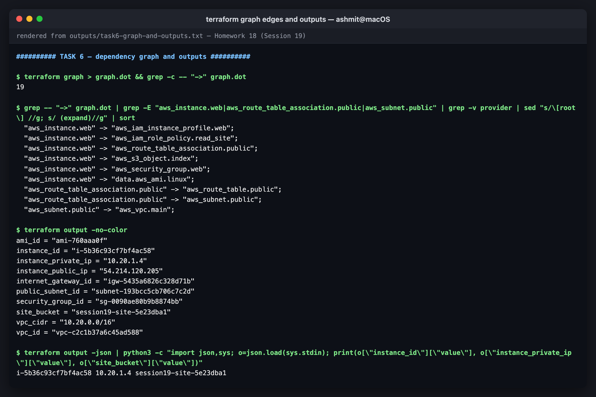
*terraform graph edges and outputs*

---

# Task 7 — `destroy`

```console
$ terraform plan -destroy -no-color | grep -E "^Plan:"
Plan: 0 to add, 0 to change, 15 to destroy.

$ terraform destroy -no-color -auto-approve | grep -E "Destroying|Destruction complete|Destroy complete"
aws_s3_bucket_versioning.site: Destroying... [id=session19-site-5e23dba1]
aws_instance.web: Destroying... [id=i-5b36c93cf7bf4ac58]
aws_s3_bucket_public_access_block.site: Destroying... [id=session19-site-5e23dba1]
aws_s3_bucket_versioning.site: Destruction complete after 0s
aws_s3_bucket_public_access_block.site: Destruction complete after 0s
aws_instance.web: Destruction complete after 11s
aws_route_table_association.public: Destroying... [id=rtbassoc-4c337beac725177cf]
aws_iam_role_policy.read_site: Destroying... [id=session19-web-role:read-site-bucket]
aws_iam_instance_profile.web: Destroying... [id=session19-web-profile]
aws_s3_object.index: Destroying... [id=session19-site-5e23dba1/site/index.html]
aws_security_group.web: Destroying... [id=sg-0090ae80b9b8874bb]
aws_iam_role_policy.read_site: Destruction complete after 1s
aws_iam_instance_profile.web: Destruction complete after 1s
aws_iam_role.web: Destroying... [id=session19-web-role]
aws_route_table_association.public: Destruction complete after 1s
aws_route_table.public: Destroying... [id=rtb-2db6721bfb4f0a7c6]
aws_subnet.public: Destroying... [id=subnet-193bcc5cb706c7c2d]
aws_iam_role.web: Destruction complete after 0s
aws_s3_object.index: Destruction complete after 1s
aws_s3_bucket.site: Destroying... [id=session19-site-5e23dba1]
aws_subnet.public: Destruction complete after 0s
aws_security_group.web: Destruction complete after 2s
aws_s3_bucket.site: Destruction complete after 1s
aws_route_table.public: Destruction complete after 1s
aws_internet_gateway.main: Destroying... [id=igw-5435a6826c328d71b]
random_id.bucket_suffix: Destroying... [id=XiPboQ]
random_id.bucket_suffix: Destruction complete after 0s
aws_internet_gateway.main: Destruction complete after 0s
aws_vpc.main: Destroying... [id=vpc-c2c1b37a6c45ad588]
aws_vpc.main: Destruction complete after 0s
Destroy complete! Resources: 15 destroyed.
```

The apply order runs **backwards**. The instance goes first, because nothing depends on it. The
subnet, security group and route table can go only once the instance and association are gone.
The IGW goes after the route table that pointed at it, and the VPC is last because everything
lived inside it. On real AWS, getting this order wrong produces `DependencyViolation` errors,
which is the main reason to let Terraform do teardown instead of the console.

Then checked through the API:

```console
$ awslocal --region ap-south-1 ec2 describe-vpcs --vpc-ids vpc-c2c1b37a6c45ad588 2>&1 | tail -1
An error occurred (InvalidVpcID.NotFound) when calling the DescribeVpcs operation: VpcID {'vpc-c2c1b37a6c45ad588'} does not exist.

$ awslocal --region ap-south-1 ec2 describe-instances --instance-ids i-5b36c93cf7bf4ac58 --query 'Reservations[].Instances[].State.Name' --output text
terminated

$ awslocal --region ap-south-1 ec2 describe-vpcs --filters Name=tag:Project,Values=session19 --query 'length(Vpcs)'
0

$ awslocal --region ap-south-1 iam get-role --role-name session19-web-role 2>&1 | tail -1
An error occurred (NoSuchEntity) when calling the GetRole operation: Role session19-web-role not found

$ awslocal --region ap-south-1 s3 ls | grep -c session19-site-5e23dba1; echo '(0 matching buckets)'
0
(0 matching buckets)

$ terraform state list | wc -l
       0
```

The instance still *appears*, as `terminated`. That matches real AWS, where terminated
instances stay visible in `describe-instances` for about an hour; they are not billed. The tag
filter `Project=session19` counts zero VPCs, which is where `default_tags` pays off: one query
finds anything the project left behind.

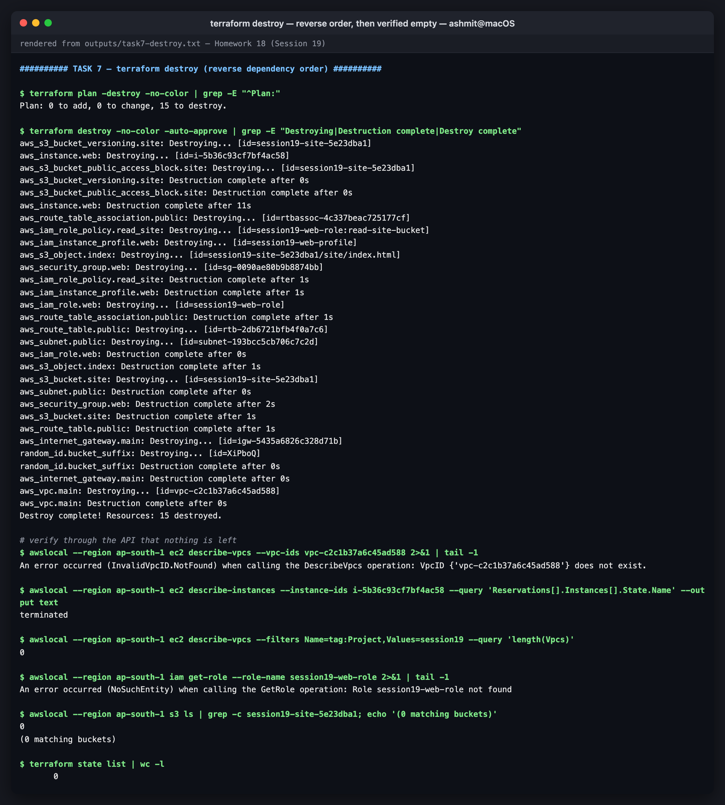
*terraform destroy — reverse order, then verified empty*

---

## Reproducing this

```bash
# LocalStack — pin 4.14.0; newer images need a licence
docker run -d --name localstack -p 4566:4566 \
  -e SERVICES=s3,ec2,iam,sts,dynamodb localstack/localstack:4.14.0
pip3 install --user awscli awscli-local
export AWS_ACCESS_KEY_ID=test AWS_SECRET_ACCESS_KEY=test AWS_DEFAULT_REGION=us-east-1

cd 18-cloud-terraform/terraform
terraform init
terraform validate
terraform plan -out=infra.tfplan
terraform apply infra.tfplan
terraform state list
terraform graph | dot -Tsvg > graph.svg      # needs graphviz
awslocal --region ap-south-1 ec2 describe-instances --instance-ids "$(terraform output -raw instance_id)"
terraform destroy
```

For real AWS: strip the LocalStack lines from `provider.tf` (credentials, `skip_*`,
`s3_use_path_style`, `endpoints`), and set `ami_name_filter` to a current image such as
`al2023-ami-2023.*-x86_64`. The default matches the 2017 Amazon Linux image that LocalStack
ships, which is long deprecated on AWS. Then set `admin_cidr` to your own `/32`.

---

## Files

```
18-cloud-terraform/
├── README.md
├── architecture.svg              diagram source
├── terraform/
│   ├── versions.tf  provider.tf  variables.tf  terraform.tfvars
│   ├── network.tf  security.tf  storage.tf  compute.tf  outputs.tf
│   ├── .terraform.lock.hcl       committed: aws 6.67.0, random 3.9.1
│   └── .gitignore
├── outputs/
│   ├── task1-init-validate.txt
│   ├── task2-plan.txt
│   ├── task3-apply.txt
│   ├── task4-verify-aws.txt
│   ├── task5-state.txt
│   ├── task6-graph-and-outputs.txt
│   └── task7-destroy.txt
└── screenshots/                  00-architecture + 10 transcript renders
```
