# Homework 19 — Monitoring, Observability & GitOps

Course session: **`session20-monitoring-observability-gitops`**.

Three tasks:
- **Task 1, Monitoring.** A real stack around one instrumented app (Prometheus, Alertmanager,
  Grafana, Loki, Jaeger), shown through a deliberately triggered incident.
- **Task 2, Observability.** The three pillars, written up.
- **Task 3, GitOps.** Argo CD deploying from this repository: releases by commit, self-heal,
  prune, and rollback by `git revert`.

**All terminal output is extracted verbatim** from the transcripts in [`outputs/`](outputs).
The terminal images are **renders of those transcripts**. The **Grafana, Prometheus,
Alertmanager, Jaeger and Argo CD images are real browser screenshots** of the running UIs,
taken with headless Chrome during the runs. See [`screenshots/`](screenshots).

| Deliverable | Where |
|---|---|
| Monitoring demo | [Task 1](#task-1--monitoring) · [`01-monitoring/`](01-monitoring) |
| Observability documentation | **[`02-observability/README.md`](02-observability)** |
| GitOps demo | [Task 3](#task-3--gitops-with-argo-cd) · [`03-gitops/`](03-gitops) and the [`gitops-config`](https://github.com/BinaryBhakti/devops-homework/tree/gitops-config) branch |
| Screenshots | inline below |

Things found along the way:
- **cAdvisor could not see any container on Docker Desktop.** It sees nothing without the
  socket mounted explicitly, and with it still only the root cgroup on Docker 29's containerd
  image store. Replaced with the app's own process metrics. [Details](#why-there-is-no-cadvisor).
- **Argo CD could not clone this repository** over a ~0.5 MB/s link (about 70 MB of
  screenshots, against 60–90 s timeouts). Fixed with a small orphan **`gitops-config`** branch
  plus shallow clones. [Details](#why-argo-cd-watches-a-separate-branch).
- **Self-heal speed depends on the kind of drift**: 5–6 s for a deleted Service or an edited
  ConfigMap, **186 s** for a hand-scaled Deployment. [Details](#2-drift-and-self-heal).

---

# Task 1 — Monitoring

[`01-monitoring/docker-compose.yml`](01-monitoring/docker-compose.yml) extends the course's
`03-prometheus` / `04-grafana` compose files (Prometheus scraping itself) into a full stack
around a real service:

```
           ┌────────────── orders-api (Flask) ──────────────┐
loadgen ──►│ /metrics  (Prometheus client)                  │
           │ stdout    (one JSON object per log line)       │
           │ OTLP      (OpenTelemetry spans)                │
           └──┬───────────────┬─────────────────┬───────────┘
              │ scrape 5 s     │ Docker API       │ OTLP/HTTP
        Prometheus ◄─ node-   Alloy ──► Loki     Jaeger
         │  rules    exporter
         ▼
     Alertmanager ──► alert-receiver (webhook; stands in for Slack/PagerDuty)
              all three ──► Grafana (provisioned datasources + dashboard)
```

| Brief item | How it is measured |
|---|---|
| Metrics | `http_requests_total`, `http_request_duration_seconds` (histogram), `orders_created_total`, `app_healthy` |
| Logs | JSON lines on stdout → Grafana Alloy → Loki, queried with LogQL |
| Alerts | 6 Prometheus rules → Alertmanager → webhook receiver |
| CPU utilisation | `rate(process_cpu_seconds_total)` for the app; node-exporter for the whole Docker VM |
| Memory utilisation | `process_resident_memory_bytes` for the app; node-exporter for the VM |
| Application health | `/healthz`, the Docker healthcheck, Prometheus `up`, and the app's `app_healthy` gauge |

The app ([`app/app.py`](01-monitoring/app/app.py)) has two admin endpoints to cause trouble on
demand: `POST /admin/chaos` (error rate, extra latency) and `POST /admin/health` (fail
`/healthz`).

## Healthy baseline

Transcript: [`outputs/task1-monitoring.txt`](outputs/task1-monitoring.txt).

```console
$ curl -s localhost:8000/metrics | grep -E '^(http_requests_total|app_healthy|orders_created_total|http_requests_in_flight)' | head -8
http_requests_total{method="GET",route="/api/orders",status="200"} 73.0
http_requests_total{method="POST",route="/api/orders",status="201"} 36.0
http_requests_total{method="GET",route="/healthz",status="200"} 1.0
http_requests_in_flight 2.0
app_healthy 1.0
orders_created_total 36.0

$ curl -s localhost:9090/api/v1/targets | python3 -c 'import json,sys; [print("  ", t["labels"]["job"].ljust(12), t["health"].ljust(5), t["scrapeUrl"]) for t in json.load(sys.stdin)["data"]["activeTargets"]]'
   node         up    http://node-exporter:9100/metrics
   orders-api   up    http://app:8000/metrics
   prometheus   up    http://localhost:9090/metrics
```

CPU and memory, for the app and the VM it runs on:

```console
$ PQ 'rate(process_cpu_seconds_total{job="orders-api"}[1m])'
   {'service': 'orders-api'} => 0.0514

$ PQ '100 * (1 - avg(rate(node_cpu_seconds_total{mode="idle"}[1m])))'
    => 86.8612

$ PQ 'process_resident_memory_bytes{job="orders-api"} / 1024 / 1024'
   {'service': 'orders-api'} => 42.2852

$ PQ '100 * (1 - node_memory_MemAvailable_bytes / node_memory_MemTotal_bytes)'
    => 53.1841
```

The app uses 0.05 cores and 42 MiB. The Docker VM is at **87% CPU**, which is the same host
saturation that runs through Homeworks 12–14, now visible on a graph instead of inferred from
restarts.

```console
$ curl -s localhost:9090/api/v1/rules | python3 -c 'import json,sys; [print("  ", r["name"].ljust(20), r["state"]) for g in json.load(sys.stdin)["data"]["groups"] for r in g["rules"]]'
   AppDown              inactive
   AppUnhealthy         inactive
   HighErrorRate        inactive
   HighLatencyP95       inactive
   AppHighCPU           inactive
   AppHighMemory        inactive
```

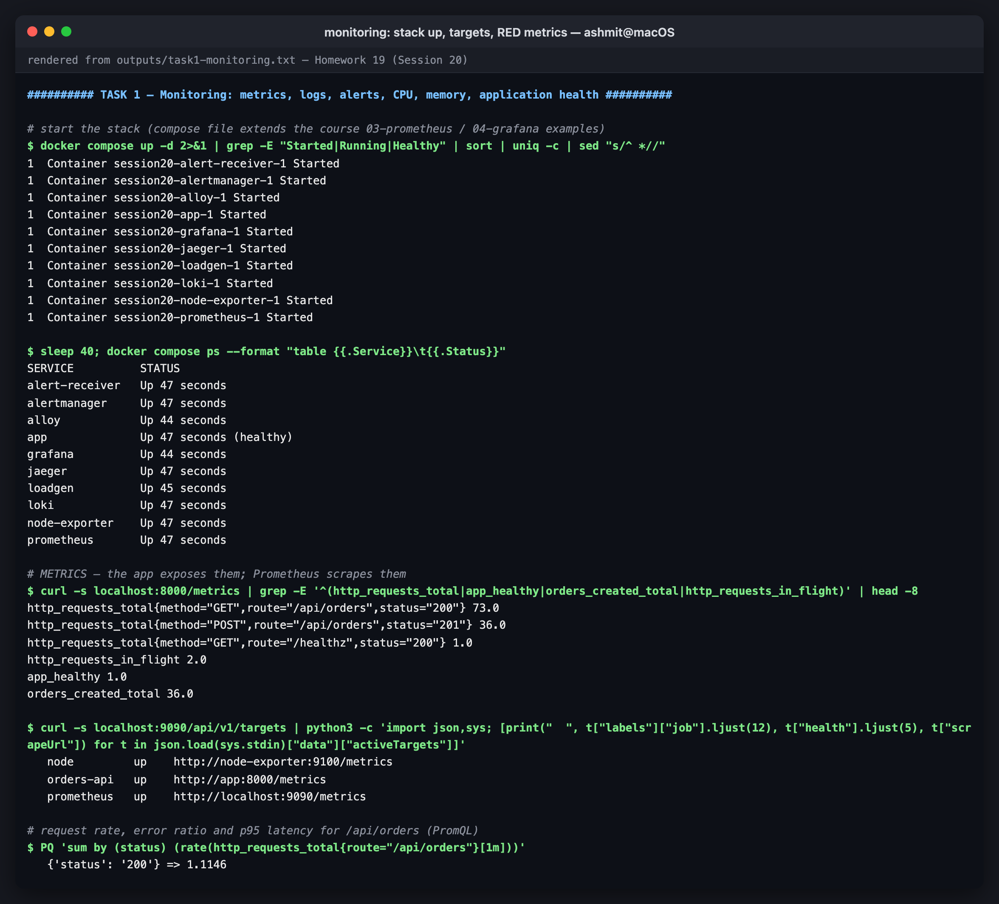
*stack up, targets, RED metrics*

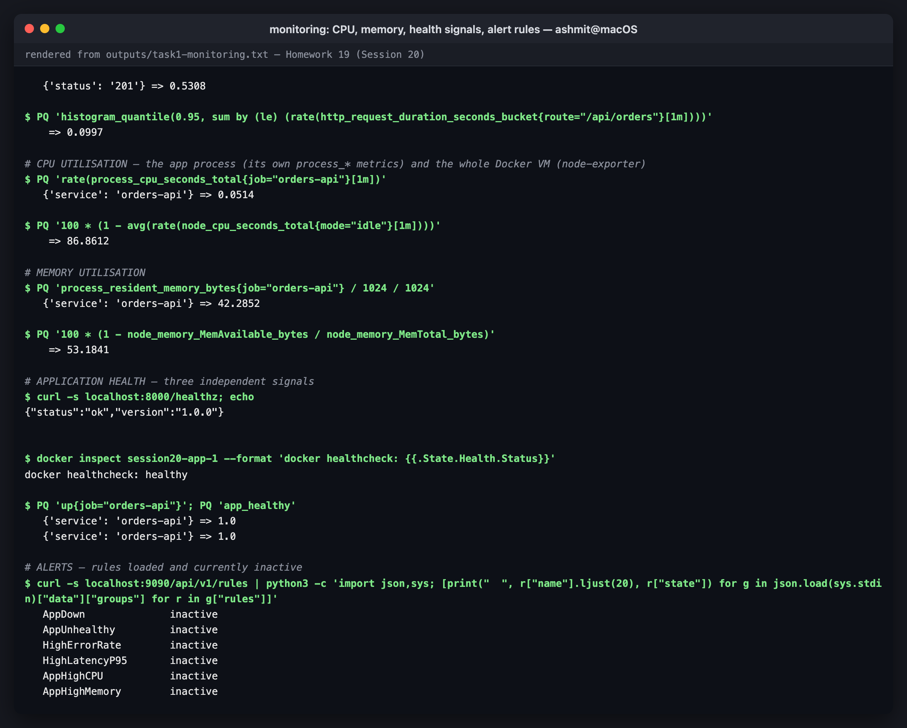
*CPU, memory, health signals, alert rules*

## An incident, from first symptom to resolved

Transcript: [`outputs/task1-monitoring-incident.txt`](outputs/task1-monitoring-incident.txt).
Inject 30% errors and 700 ms of extra latency:

```console
$ curl -s -X POST localhost:8000/admin/chaos -H 'Content-Type: application/json' -d '{"error_rate": 0.3, "slow_ms": 700}'; echo
{"error_rate":0.3,"healthy":true,"slow_ms":700}

$ sleep 25; alerts
   HighLatencyP95 PENDING - p95 latency of /api/orders is 835.9ms

$ sleep 40; alerts
   HighErrorRate FIRING - more than 5% of /api/orders requests are failing (20.37%)
   HighLatencyP95 FIRING - p95 latency of /api/orders is 962.5ms
```

**PENDING before FIRING**: each rule has a `for:` duration (30 s), so a single bad scrape
does not page anyone. Alertmanager received the alerts and delivered them:

```console
$ docker compose logs alert-receiver --no-log-prefix | tail -4
ALERT FIRING HighLatencyP95 warning - p95 latency of /api/orders is 908.1ms
ALERT FIRING HighErrorRate warning - more than 5% of /api/orders requests are failing (19.85%)
```

The same incident in the **logs**, via Loki, with trace IDs that link each line to its trace:

```console
   {"ts": "2026-10-07T22:23:22Z", "level": "error", "service": "orders-api", "version": "1.0.0", "msg": "database timeout while listing orders", "trace_id": "98251b4d55f0a69da82e044dd4afe7d3", "route": "
```

Then an **application health** failure:

```console
GET /healthz -> HTTP 503

$ sleep 35; alerts
   AppUnhealthy FIRING - orders-api /healthz reports unhealthy
   HighErrorRate FIRING - more than 5% of /api/orders requests are failing (23.08%)
   HighLatencyP95 FIRING - p95 latency of /api/orders is 962.7ms
```

And recovery. Alertmanager sends `RESOLVED` notifications too (`send_resolved: true`):

```console
$ sleep 90; alerts
   (no active alerts)

$ docker compose logs alert-receiver --no-log-prefix | grep RESOLVED | tail -4
ALERT RESOLVED AppUnhealthy critical - orders-api /healthz reports unhealthy
ALERT RESOLVED HighErrorRate warning - more than 5% of /api/orders requests are failing (5.019%)
ALERT RESOLVED HighLatencyP95 warning - p95 latency of /api/orders is 557.1ms
```

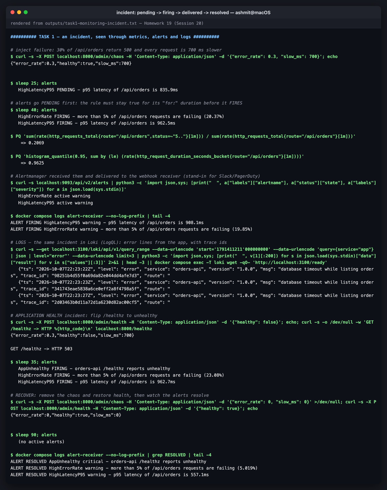
*incident: pending -> firing -> delivered -> resolved*

### The incident in the UIs (real browser screenshots, taken while the alerts were firing)

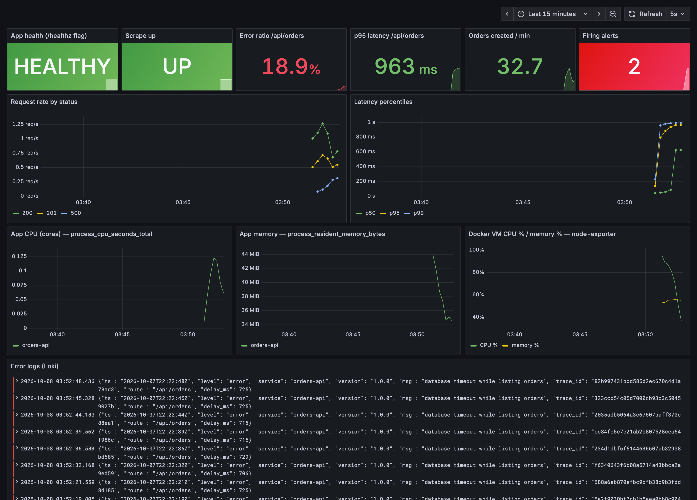
*Grafana: the provisioned dashboard mid-incident — 18.9% errors, 963 ms p95, 2 firing alerts, error logs from Loki at the bottom*

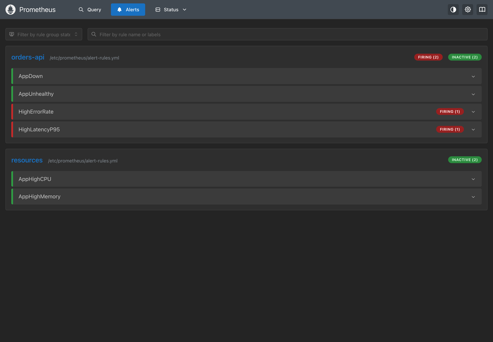
*Prometheus: the alert rules, two firing*

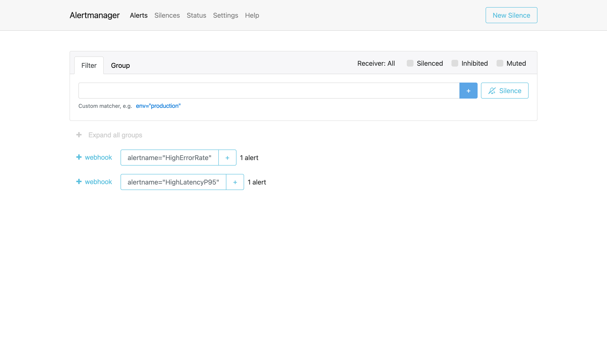
*Alertmanager: the alerts it is routing*

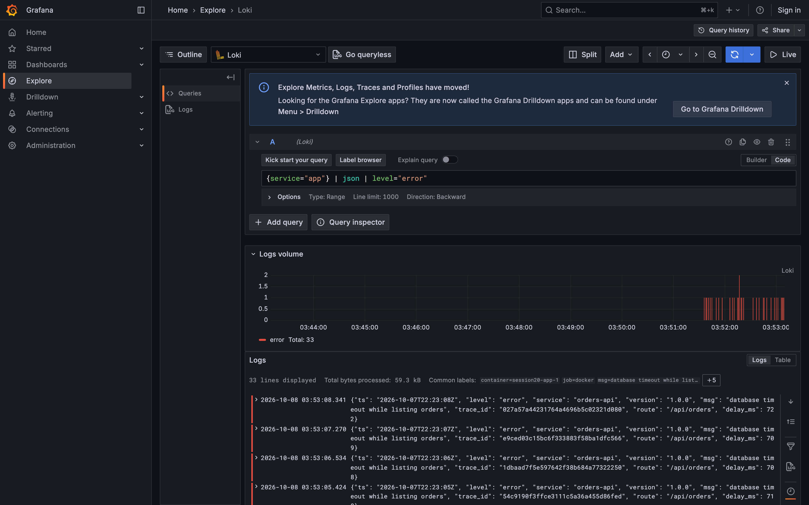
*Grafana Explore: LogQL {service="app"} | json | level="error"*

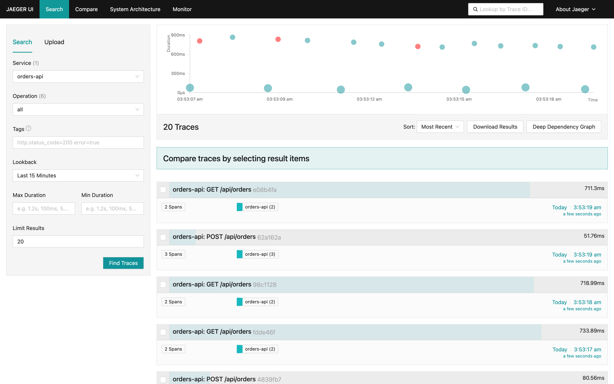
*Jaeger: traces of orders-api; the slow GETs (~700 ms) and the errored ones in red*

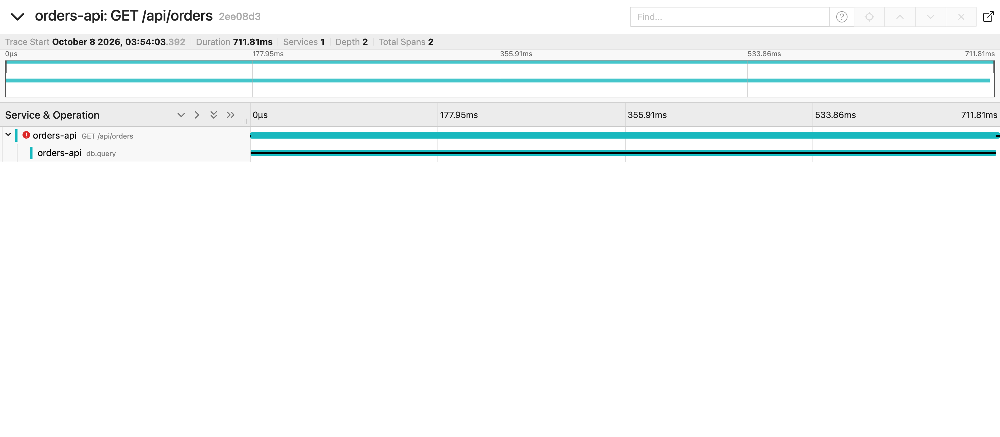
*Jaeger: one failing request — the db.query span is almost the whole 711 ms*

The three pillars answered three different questions about the same incident:
- **metrics** said *how bad*: 20% errors, p95 about 960 ms
- **logs** said *what*: "database timeout while listing orders"
- **traces** said *where*: the `db.query` span

## Problems hit building the stack

**Grafana on 3300, not 3000.** Port 3000 on this Mac is held by another development server.
The first run left Grafana in `Created`; it is now published on `localhost:3300`.

**The app's healthcheck timed out.** The Docker healthcheck starts a Python interpreter, which
took more than 3 s on the loaded host, so a healthy app was marked `unhealthy`. The timeout is
now 10 s. A healthcheck can fail because of how it runs rather than what it checks.

### Why there is no cAdvisor

The first version used cAdvisor for per-container CPU and memory. It exported only the root
cgroup:

- with `/var/run` mounted, its log said `Registration of the docker container factory failed:
  … Cannot connect to the Docker daemon`. Docker Desktop only exposes the socket to containers
  that mount `/var/run/docker.sock` explicitly.
- with the socket mounted, the factory registered but still produced no per-container series.
  This Docker (29.x) uses the **containerd image store**, whose layout cAdvisor v0.52 does not
  read.

Rather than ship a component that shows nothing, the app's own `process_cpu_seconds_total` and
`process_resident_memory_bytes` (exported by the Prometheus client for free) measure exactly
the process that matters, and node-exporter covers the VM. In Kubernetes this does not come
up, because cAdvisor is built into the kubelet ([observability write-up](02-observability)).

---

# Task 2 — Observability

**[`02-observability/README.md`](02-observability)** covers:
- monitoring vs observability, and why observability is required
- each pillar: what it is, its strengths and limits, and how the three combine in an incident
- common tools (Prometheus/Mimir, Loki/ELK, Jaeger/Tempo, OpenTelemetry, SaaS)
- Kubernetes observability: node-exporter, cAdvisor, kube-state-metrics, metrics-server,
  control-plane metrics, Events, kube-prometheus-stack, ServiceMonitors
- a practice checklist

It links back to the evidence above, and to two real incidents in this repository that were
diagnosed from cluster telemetry.

---

# Task 3 — GitOps with Argo CD

## GitOps in four principles

| Principle | Meaning | In this demo |
|---|---|---|
| **Declarative** | the system is described as desired state, not as steps | four YAML files in `app/` |
| **Versioned and immutable** | desired state lives in Git, the **source of truth**, with full history | every change below is a commit; rollback is `git revert` |
| **Pulled automatically** | an agent in the cluster pulls from Git; CI never pushes to the cluster with admin credentials | Argo CD runs inside the cluster and fetches the repo |
| **Continuously reconciled** | the agent keeps comparing live state with Git and corrects drift | `selfHeal: true`, `prune: true` |

```
 developer ──git push──► GitHub (gitops-config branch)   ◄── the ONLY way in
                                   ▲
                                   │ pull (shallow, every 3 min or on refresh)
                       ┌───────────┴───────────┐
                       │  Argo CD (in cluster) │  compare desired (Git) vs live (cluster)
                       └───────────┬───────────┘
                                   │ apply / prune / self-heal
                                   ▼
                         namespace session20: Deployment, Service, ConfigMap
```

Push-based CD (a CI job running `kubectl apply`) needs cluster credentials stored in CI, and it
only acts when a pipeline runs. Pull-based GitOps keeps credentials inside the cluster and
corrects drift between deploys too.

## Install and first sync

Transcript: [`outputs/task3-gitops-1-install.txt`](outputs/task3-gitops-1-install.txt). The
course's stable `install.yaml`, with Dex, notifications and ApplicationSet scaled to zero to
fit this small cluster:

```console
$ kubectl -n argocd get pods
NAME                                 READY   STATUS    RESTARTS   AGE
argocd-application-controller-0      1/1     Running   0          77s
argocd-redis-bdbdffcb4-26qjw         1/1     Running   0          79s
argocd-repo-server-d89c7967d-f449x   1/1     Running   0          79s
argocd-server-776b7cdd4d-sqtkj       1/1     Running   0          79s

$ kubectl -n argocd get deploy argocd-server -o jsonpath='{.spec.template.spec.containers[0].image}{"\n"}'
quay.io/argoproj/argocd:v3.5.4
```

The Application ([`03-gitops/argocd-application.yaml`](03-gitops/argocd-application.yaml))
points at this repository, with `automated: {prune: true, selfHeal: true}`. It then stayed
**`Unknown`** and deployed nothing.

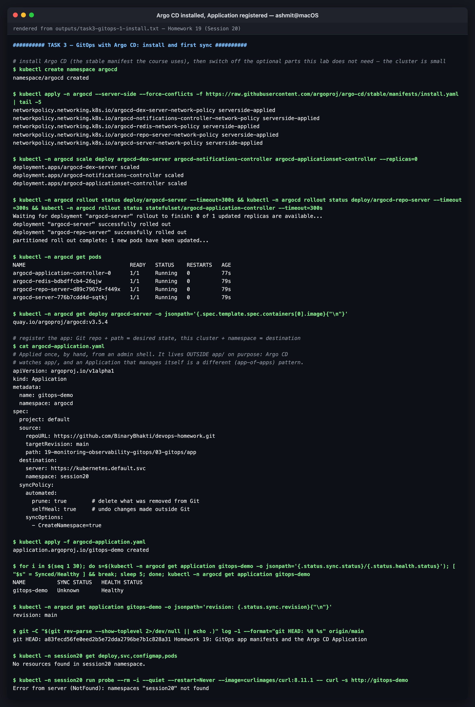
*Argo CD installed, Application registered*

### Why Argo CD watches a separate branch

| Step | Evidence | Meaning |
|---|---|---|
| 1 | repo-server: `Could not resolve host: github.com`, intermittently | CoreDNS forwards to Docker Desktop's DNS proxy, which dropped queries when the host was saturated (and across sleep/wake) |
| 2 | with DNS fine: `rpc error: code = DeadlineExceeded` | the controller allows 60 s per manifest request, git 90 s |
| 3 | manual clone in the repo-server: `fetch-pack: unexpected disconnect while reading sideband packet` after ~120 s | the transfer itself never completes |
| 4 | the same tarball from the Mac: 72 MB at ~480 KB/s | **this link is ~0.5 MB/s and the repo is ~70 MB of screenshots** |

Raising the timeouts did not help, because the cluster's network path dropped the long
transfer. The fix was to give Argo CD something small to clone:

```console
$ git ls-remote --heads origin gitops-config
ccc84c9001f5f8bcdddadb814371ce9a2d3054ed	refs/heads/gitops-config
```

- **[`gitops-config`](https://github.com/BinaryBhakti/devops-homework/tree/gitops-config)**
  is an orphan branch that holds only `app/` (24 KB). It is the in-repo equivalent of the
  common practice of a separate config repository: app source and deploy config change at
  different rates and need different permissions.
- **[`repository-secret.yaml`](03-gitops/repository-secret.yaml)** registers the repository
  with `depth: "1"`, so Argo CD shallow-clones it.

```console
$ kubectl -n argocd get application gitops-demo
NAME          SYNC STATUS   HEALTH STATUS
gitops-demo   Synced        Healthy

$ kubectl -n argocd get application gitops-demo -o jsonpath='synced revision: {.status.sync.revision}{"\n"}'; echo "gitops-config HEAD: $(git rev-parse origin/gitops-config)"
synced revision: ccc84c9001f5f8bcdddadb814371ce9a2d3054ed
gitops-config HEAD: ccc84c9001f5f8bcdddadb814371ce9a2d3054ed
```

The synced revision equals the branch HEAD. That equality is the core GitOps guarantee: you
can tell what is running by reading Git.

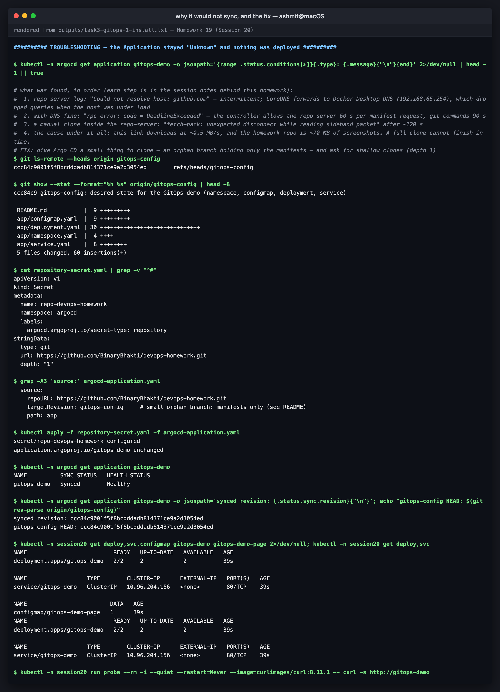
*why it would not sync, and the fix*

## The demo: every change goes through Git

Transcript: [`outputs/task3-gitops-2-demo.txt`](outputs/task3-gitops-2-demo.txt). All `git`
commands run in a checkout of `gitops-config`.

### 1. A release is a commit

```console
$ git diff --stat; git diff app | grep -E '^[-+] ' 
 app/configmap.yaml  | 2 +-
 app/deployment.yaml | 4 ++--
 2 files changed, 3 insertions(+), 3 deletions(-)
-    gitops-demo v1 — deployed by Argo CD from Git
+    gitops-demo v2 — a new release, shipped by a git push
-  replicas: 2
+  replicas: 3
-        page-version: "v1"          # bumped with the page so a content change rolls the pods
+        page-version: "v2"          # bumped with the page so a content change rolls the pods

$ git commit -qam 'GitOps demo: release v2 (3 replicas, new page)' && git push -q origin gitops-config && git log -1 --format='%h %s'
62bfe8c GitOps demo: release v2 (3 replicas, new page)

$ kubectl -n argocd get application gitops-demo -o jsonpath='synced to: {.status.sync.revision}{"\n"}status:    {.status.sync.status} / {.status.health.status}{"\n"}'
synced to: 62bfe8c7ccdaa1def01f0a9793689e42b632055a
status:    Synced / Healthy

$ kubectl -n session20 rollout status deploy/gitops-demo --timeout=120s && kubectl -n session20 get deploy gitops-demo
deployment "gitops-demo" successfully rolled out
NAME          READY   UP-TO-DATE   AVAILABLE   AGE
gitops-demo   3/3     3            3           93s

$ page
gitops-demo v2 — a new release, shipped by a git push
```

No `kubectl apply`, no pipeline: a push, and the cluster followed. Argo polls every 3 minutes
by default; the demo adds a refresh annotation to look immediately, which is what a GitHub
webhook does in production.

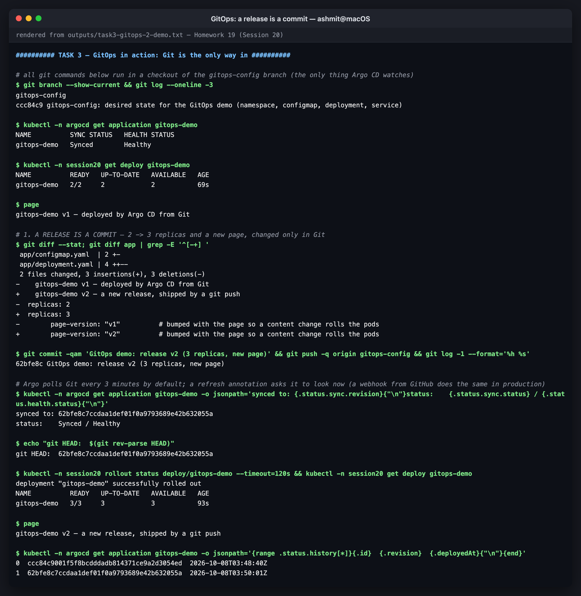
*a release is a commit*

### 2. Drift and self-heal

Three kinds of manual change, made directly on the cluster. In the first pass I checked each
one after only 15 s, and **none had been corrected yet**. The transcript keeps that pass, a note
that wrongly claimed the scale had been reverted, and an explicit correction. A follow-up
then measured each one with a 5 s poll:

```console
service "gitops-demo" deleted from session20 namespace
Service back after 6 s

ConfigMap reverted after 5 s: gitops-demo v1 — deployed by Argo CD from Git

spec.replicas back to 2 after 186 s
```

| Drift | Corrected after | Reading |
|---|---|---|
| Service deleted | **6 s** | Argo watches the resources it manages; the deletion triggered a sync |
| ConfigMap edited by hand | **5 s** | same: the hot-fix was overwritten with the Git version |
| Deployment scaled 2 → 6 | **186 s** | about the default 3-minute reconciliation (`timeout.reconciliation`); this change was only caught by the periodic refresh |

I did not pin down why the replica change did not trigger an immediate sync like the other two.
The 186 s is consistent with it being caught only by the periodic comparison. The practical
point stands either way: **self-heal is eventual**. For "nobody may scale by hand", the
reliable control is RBAC that denies the write in the first place.

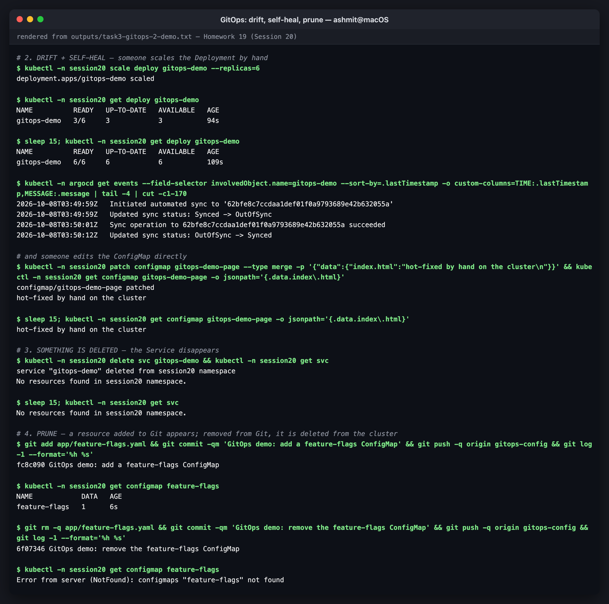
*drift, self-heal, prune*

### 3. Prune

```console
$ git add app/feature-flags.yaml && git commit -qm 'GitOps demo: add a feature-flags ConfigMap' && git push -q origin gitops-config && git log -1 --format='%h %s'
fc8c090 GitOps demo: add a feature-flags ConfigMap

$ kubectl -n session20 get configmap feature-flags
NAME            DATA   AGE
feature-flags   1      6s

$ git rm -q app/feature-flags.yaml && git commit -qm 'GitOps demo: remove the feature-flags ConfigMap' && git push -q origin gitops-config && git log -1 --format='%h %s'
6f07346 GitOps demo: remove the feature-flags ConfigMap

$ kubectl -n session20 get configmap feature-flags
Error from server (NotFound): configmaps "feature-flags" not found
```

With `prune: true`, deleting a file from Git deletes the object from the cluster. Without it,
the object would be left orphaned and flagged as OutOfSync.

### 4. Rollback is `git revert`

```console
$ git revert --no-edit 62bfe8c7ccdaa1def01f0a9793689e42b632055a >/dev/null && git push -q origin gitops-config && git log -2 --format='%h %s'
0a292c9 Revert "GitOps demo: release v2 (3 replicas, new page)"
6f07346 GitOps demo: remove the feature-flags ConfigMap

$ kubectl -n session20 rollout status deploy/gitops-demo --timeout=120s && kubectl -n session20 get deploy gitops-demo
deployment "gitops-demo" successfully rolled out
NAME          READY   UP-TO-DATE   AVAILABLE   AGE
gitops-demo   2/2     2            2           27m

$ page
gitops-demo v1 — deployed by Argo CD from Git

$ kubectl -n argocd get application gitops-demo -o jsonpath='{range .status.history[*]}{.id}  {.revision}  {.deployedAt}{"\n"}{end}'
0  ccc84c9001f5f8bcdddadb814371ce9a2d3054ed  2026-10-08T03:48:40Z
1  62bfe8c7ccdaa1def01f0a9793689e42b632055a  2026-10-08T03:50:01Z
2  fc8c0903e1764f2fd9d3a7b5f9562f7f4786cd64  2026-10-08T03:54:15Z
3  6f07346bd16ac4e5bcc25deff021976e077c7ead  2026-10-08T03:54:30Z
4  0a292c9fcd321fe840f612b37ce681e60e3afe81  2026-10-08T03:54:42Z
```

Five deploys, each one a Git commit you can read, review and blame. A rollback is just another
forward commit: history is never rewritten, and the reason for the rollback lives in the
commit log next to the change it undid. Compare with Helm's revision numbers in
[Homework 14](../14-helm): same idea, but here the record is Git itself.

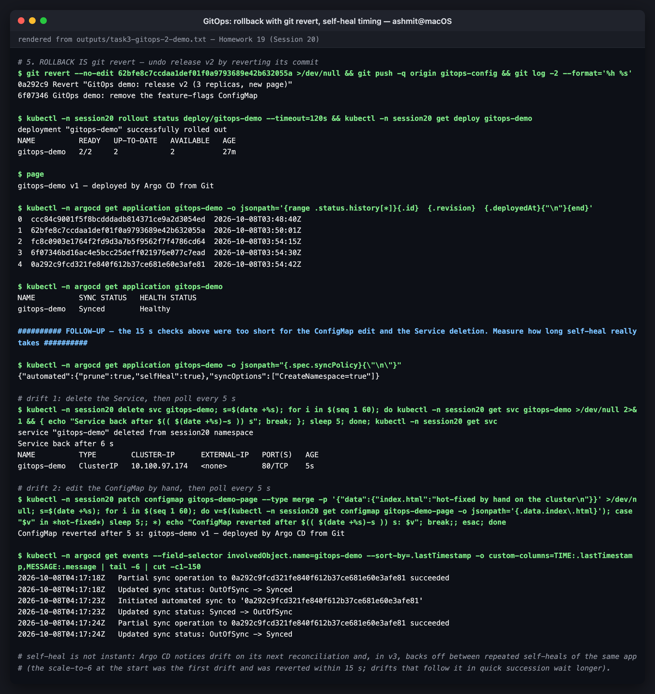
*rollback with git revert, self-heal timing*

### The Argo CD UI (real browser screenshots)


*the Application: Healthy, Synced to gitops-config (0a292c9), the revert commit as the last sync*

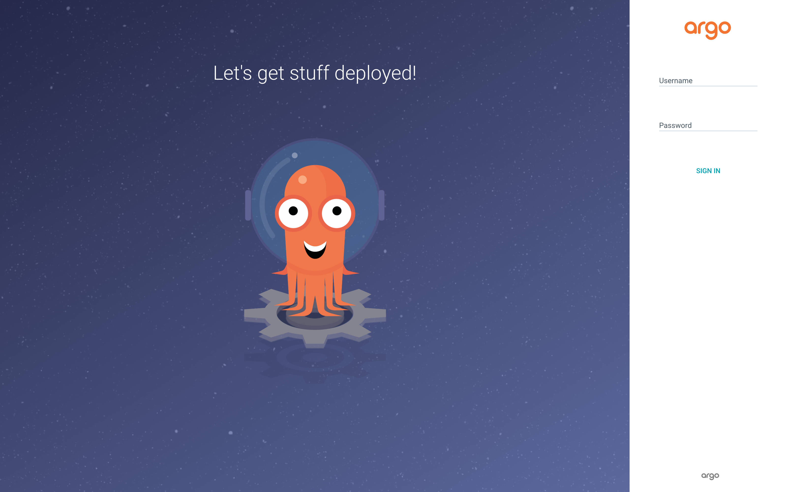
*Applications list*

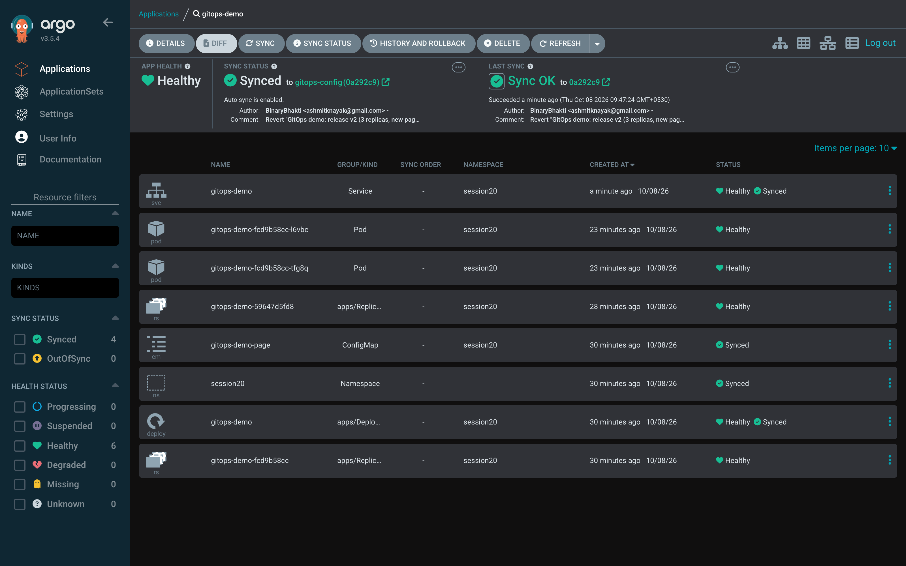
*history*

## Kubernetes + GitOps, in practice

- **Repo layout**: app source and CI in one repo; desired state (manifests, Helm values) in a
  config repo, or a config branch as here, with one folder per environment. CI builds and pushes
  an image, then commits the new tag to the config repo, and Argo CD deploys it. The final
  project ([Homework 20](../20-final-devops-project)) wires exactly that.
- **Secrets** never go into the GitOps repo in plain form. Use Sealed Secrets, SOPS, or External
  Secrets pointing at a vault
  ([Homework 11, Task 5](../11-ingress-configmaps-secrets#task-5--what-this-cluster-has-and-what-production-adds)).
- **Promotion** between environments is a pull request that copies a tag from `dev/` to
  `prod/`, so it is reviewed, approved and auditable like code.
- **Tools**: Argo CD (UI, Applications, ApplicationSets) and Flux (controllers plus CRDs,
  Git-native, no UI by default).

---

## Reproducing this

```bash
# Task 1 — monitoring
cd 19-monitoring-observability-gitops/01-monitoring && docker compose up -d --build
open http://localhost:3300 http://localhost:9090/alerts http://localhost:16686
curl -X POST localhost:8000/admin/chaos -H 'Content-Type: application/json' -d '{"error_rate":0.3,"slow_ms":700}'
curl -X POST localhost:8000/admin/chaos -H 'Content-Type: application/json' -d '{"error_rate":0,"slow_ms":0}'
docker compose down -v

# Task 3 — GitOps
kubectl create namespace argocd
kubectl apply -n argocd --server-side --force-conflicts -f https://raw.githubusercontent.com/argoproj/argo-cd/stable/manifests/install.yaml
cd ../03-gitops && kubectl apply -f repository-secret.yaml -f argocd-application.yaml
kubectl -n argocd get application gitops-demo -w
# then change app/ on the gitops-config branch and push
```

## Files

```
19-monitoring-observability-gitops/
├── README.md
├── 01-monitoring/
│   ├── docker-compose.yml        the stack
│   ├── app/                      instrumented orders-api (Flask, prometheus_client, OpenTelemetry) + loadgen
│   ├── prometheus/               prometheus.yml, alert-rules.yml
│   ├── alertmanager/             alertmanager.yml
│   ├── alloy/config.alloy        Docker logs -> Loki
│   └── grafana/                  provisioned datasources + the dashboard JSON
├── 02-observability/README.md    Task 2
├── 03-gitops/
│   ├── argocd-application.yaml   watches the gitops-config branch
│   └── repository-secret.yaml    shallow clones (depth 1)
├── outputs/                      4 transcripts
└── screenshots/                  17 images (9 real UI screenshots, 8 transcript renders)
(branch gitops-config)/app/       namespace, configmap, deployment, service — the desired state
```
