# Homework 20 — Final DevOps Project: IncidentDesk

Course session: **`session21-python`**.

IncidentDesk is a small incident tracker: a FastAPI + PostgreSQL backend and a React frontend.
This homework takes it through the whole chain the course built up:

```
Application ─► Git ─► GitHub ─► CI: build & test ─► SAST · SCA · secret scan ─► Docker image ─► image scan
           ─► security gate ─► GHCR ─► deploy test (kind, in CI) ─► GitOps publish ─► Argo CD ─► Kubernetes (Helm)
           ─► Prometheus + Grafana
Terraform: VPC, subnets, NAT, security groups, backup bucket, IAM, lock table (LocalStack)
         + namespaces, Pod Security, ResourceQuota, LimitRange (the cluster)
```

**All terminal output is extracted verbatim** from the transcripts in [`outputs/`](outputs). The
GitHub and Prometheus images are **real browser screenshots**. The terminal images are
**renders of those transcripts**: the labs ran non-interactively, so there was no window to
photograph. See [`screenshots/`](screenshots).

## Result at a glance

| Requirement | Status | Evidence |
|---|---|---|
| Application + tests | 13 pytest cases against PostgreSQL, ruff clean | [`01`](outputs/01-backend-lint-and-tests.txt) |
| Docker | multi-stage, non-root, Compose stack working end to end | [`03`](outputs/03-docker-build.txt), [`04`](outputs/04-docker-compose.txt) |
| CI/CD + DevSecOps | run 1 **blocked by the security gate** (Semgrep: wildcard CORS); runs 2–10 green | §6, screenshots 03/04 |
| Kubernetes via Helm + GitOps | Argo CD `Synced / Healthy`, e2e through the Ingress = HTTP 200 | [`10`](outputs/10-gitops-deploy.txt) |
| Terraform | 30 resources on LocalStack; namespaces/quota/limits on the cluster | [`07`](outputs/07-terraform-cloud.txt), [`08`](outputs/08-terraform-k8s-bootstrap.txt) |
| Monitoring | Prometheus scraping the app, 6 alert rules, one firing for real | [`16`](outputs/16-monitoring-live.txt) |
| Troubleshooting | 2 real deploy incidents + 6 injected faults, each diagnosed and fixed | [`11`–`15`](outputs) |

**Caveats, stated up front:** EKS needs LocalStack Pro, so Kubernetes is local Minikube (§5). The
laptop node (8 GB host) was overloaded for much of the work; where that bled into a result it is
said next to the result rather than hidden. The Grafana dashboard is provisioned as code
([`monitoring/dashboards`](monitoring/dashboards)), but no screenshot is included: under that load
the Grafana UI never finished loading in the headless browser, and an empty image proves nothing.

---

## Architecture

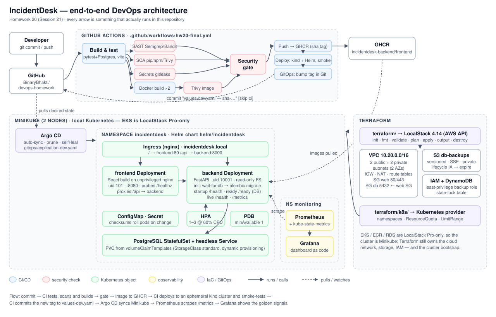

| Layer | What | Where |
|---|---|---|
| Application | FastAPI, SQLAlchemy 2, Alembic, pytest · React 19 + Vite → unprivileged nginx | [`application/`](application) |
| Containers | multi-stage Dockerfiles, non-root, read-only root FS; Compose for local | [`application/*/Dockerfile`](application), [`docker/`](docker) |
| CI/CD + DevSecOps | GitHub Actions: 11 jobs, gate before push, kind deploy, GitOps publish | [`/.github/workflows/hw20-final.yml`](../.github/workflows/hw20-final.yml) |
| Security | Semgrep, Bandit, pip-audit, npm audit, Trivy fs/image, gitleaks, gate policy | [`security/`](security) |
| Registry | GHCR: `incidentdesk-backend`, `incidentdesk-frontend`, tagged `sha-<commit>` | — |
| Kubernetes | Deployment, StatefulSet + PVC, Services, ConfigMap, Secret, Ingress, HPA, PDB, probes | [`kubernetes/`](kubernetes) (plain), [`helm/incidentdesk/`](helm/incidentdesk) (deployed) |
| GitOps | Argo CD watching the `gitops-config` branch, auto-sync + prune + self-heal | [`gitops/`](gitops) |
| Infrastructure | Terraform: cloud side on LocalStack, cluster bootstrap on Minikube | [`terraform/`](terraform), [`terraform/k8s/`](terraform/k8s) |
| Monitoring | Prometheus (lean) + Grafana, alert rules, dashboard as code | [`monitoring/`](monitoring) |

## Technologies

Python 3.12 · FastAPI · SQLAlchemy · Alembic · PostgreSQL 16 · React 19 · Vite 8 · nginx ·
Docker / Compose · GitHub Actions · GHCR · Semgrep · Bandit · pip-audit · npm audit · Trivy ·
gitleaks · Kubernetes 1.37 (Minikube) · kind · Helm 4 · Argo CD 3.5 · Terraform 1.16 (AWS
provider 6, Kubernetes provider) · LocalStack 4.14 · Prometheus 3 · Grafana 13 · kube-state-metrics.

---

## 1. Application

Backend ([`application/backend`](application/backend)):
- REST API for incidents: create, list with filters, get, update with resolve/reopen, delete, and stats
- `/health` for **liveness** (no database call) and `/ready` for **readiness** (`SELECT 1`)
- `/metrics` exposes RED metrics plus `incidents_created_total` and `incidents_resolved_total`
- schema owned by **Alembic** (migration `0001_create_incidents`), run before uvicorn starts

Tests: 13 pytest cases against a real, separate PostgreSQL. The suite refuses to start without
`TEST_DATABASE_URL`, so it can never touch the application database.

```console
$ docker run --rm --cpus=1 --memory=512m -v "$PWD":/src -w /src hw20-backend-test:local pytest -q -p no:cacheprovider; echo "exit code: $?"
ImportError while loading conftest '/src/tests/conftest.py'.
tests/conftest.py:12: in <module>
    pytest.exit(
E   _pytest.outcomes.Exit: TEST_DATABASE_URL is not set — refusing to run tests against the application database
exit code: 4
```

Changes from the course's TaskBoard code, each for a reason:

| Course code | Here | Why |
|---|---|---|
| frontend deps `"latest"` | pinned, `package-lock.json` committed | reproducible builds; `npm ci` |
| instructor's name hard-coded in the UI | neutral text | a submitted project should not carry someone else's name |
| `allow_origins=["*"]` CORS | no CORS unless `CORS_ORIGINS` is set | **blocked by Semgrep in pipeline run 1** (see §6) |
| `create_all()` at startup alongside Alembic | Alembic only | one owner for the schema |
| default `DATABASE_URL` with a password | no password in the default | **flagged by gitleaks** during local scanning |

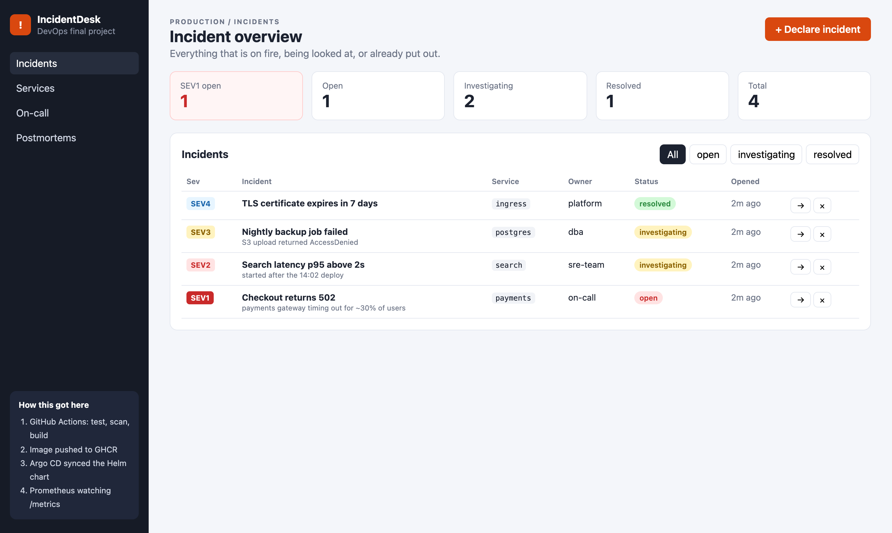
*the UI, running under docker compose*

## 2. Docker

Both images are multi-stage and run as non-root: backend uid 10001, frontend uid 101 on port
8080. The build toolchain doesn't ship.

```console
$ docker images --format "table {{.Repository}}\t{{.Tag}}\t{{.Size}}" | grep -E "REPOSITORY|incidentdesk"
REPOSITORY                    TAG           SIZE
incidentdesk-frontend         local         81.9MB
incidentdesk-backend          local         339MB

$ docker run --rm --cpus=1 --entrypoint sh incidentdesk-frontend:local -c "command -v node npm || echo no node/npm in the runtime image"
no node/npm in the runtime image
```

[`docker/docker-compose.yml`](docker/docker-compose.yml) runs the full stack. The backend waits
for a **healthy** database, runs the migration, then serves; the frontend's nginx proxies `/api`
on the same origin:

```console
$ curl -s localhost:8000/health; echo; curl -s localhost:8000/ready; echo
{"status":"UP"}
{"status":"READY","database":"ok"}

$ curl -s localhost:3080/api/incidents/stats; echo
{"total":4,"open":1,"investigating":2,"resolved":1,"sev1_open":1}
```

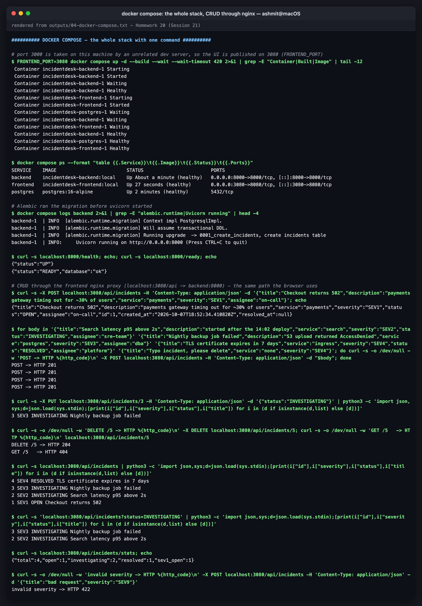
*docker compose: the whole stack, CRUD through nginx*

## 3. Kubernetes

The manifests exist twice: plain YAML in [`kubernetes/`](kubernetes) to read, and the Helm chart
[`helm/incidentdesk/`](helm/incidentdesk) that is actually deployed. Objects: backend Deployment
(init container runs the Alembic migration), frontend Deployment, PostgreSQL **StatefulSet** with a
PVC, three Services, ConfigMap, Secret, NGINX Ingress (`/api` → backend, `/` → frontend), HPA,
PodDisruptionBudget, and startup/readiness/liveness probes on every container. The namespace
itself, its Pod Security level, ResourceQuota and LimitRange come from Terraform (§5).

Steady state, after the fixes in §8:

```console
$ kubectl -n incidentdesk get deploy,statefulset,svc,ingress,hpa,pvc
NAME                                    READY   UP-TO-DATE   AVAILABLE   AGE
deployment.apps/incidentdesk-backend    2/2     2            2           10h
deployment.apps/incidentdesk-frontend   1/1     1            1           10h

NAME                                     READY   AGE
statefulset.apps/incidentdesk-postgres   1/1     10h

NAME                            TYPE        CLUSTER-IP     EXTERNAL-IP   PORT(S)    AGE
service/incidentdesk-backend    ClusterIP   10.97.37.97    <none>        8000/TCP   10h
service/incidentdesk-frontend   ClusterIP   10.96.148.49   <none>        80/TCP     10h
service/incidentdesk-postgres   ClusterIP   None           <none>        5432/TCP   10h

NAME                                     CLASS   HOSTS                ADDRESS        PORTS   AGE
ingress.networking.k8s.io/incidentdesk   nginx   incidentdesk.local   192.168.49.2   80      10h

NAME                                                       REFERENCE                         TARGETS         MINPODS   MAXPODS   REPLICAS   AGE
horizontalpodautoscaler.autoscaling/incidentdesk-backend   Deployment/incidentdesk-backend   cpu: 243%/60%   1         2         2          10h

NAME                                                 STATUS   VOLUME                                     CAPACITY   ACCESS MODES   STORAGECLASS   VOLUMEATTRIBUTESCLASS   AGE
persistentvolumeclaim/data-incidentdesk-postgres-0   Bound    pvc-c2307c1f-91ab-4f75-b647-2e6c9781c5b2   1Gi        RWO            standard       <unset>                 10h
```

End to end, from inside the cluster: frontend nginx → `/api` → backend → PostgreSQL, then the
same through the Ingress controller:

```console
$ kubectl exec e2e -- curl -s http://incidentdesk-frontend.incidentdesk/api/incidents/stats; echo
{"total":1,"open":1,"investigating":0,"resolved":0,"sev1_open":0}

$ kubectl exec e2e -- curl -s -o /dev/null -w 'via the NGINX Ingress (Host: incidentdesk.local) -> HTTP %{http_code}\n' -H 'Host: incidentdesk.local' http://ingress-nginx-controller.ingress-nginx.svc/
via the NGINX Ingress (Host: incidentdesk.local) -> HTTP 200
```

The quota is enforced and has room to spare:

```console
$ kubectl -n incidentdesk describe resourcequota | sed -n "/Resource/,\$p"
Resource                Used   Hard
--------                ----   ----
limits.memory           576Mi  3Gi
persistentvolumeclaims  1      4
pods                    3      20
requests.cpu            120m   1500m
requests.memory         256Mi  1536Mi
```

## 4. Helm and GitOps deployment

Nobody runs `helm install` against the dev cluster. The pipeline's last job copies the chart to
the **`gitops-config`** branch, sets the image tag to the commit it just built, and commits as
`github-actions[bot]`. Argo CD watches that branch and renders the chart with `values-dev.yaml`.
(Why a separate branch: [Homework 19](../19-monitoring-observability-gitops) — Argo CD could not
clone the 70 MB homework repo over this link; the environment branch is tiny and fetched shallow.)

```console
$ git fetch -q origin gitops-config && git log -1 --format="%h %an %ad%n%s" --date=iso origin/gitops-config
9598b59 github-actions[bot] 2026-10-08 06:40:34 +0000
gitops: deploy incidentdesk sha-0c01e2b to dev [skip ci]

$ git show origin/gitops-config:incidentdesk/values-dev.yaml | grep -n 'tag:'
8:    tag: "sha-0c01e2b"              # updated by the CI "gitops" job on every main build
12:    tag: "sha-0c01e2b"              # updated by the CI "gitops" job on every main build
```

The **first** sync did not go well, and that is recorded as it happened:

```console
$ kubectl -n argocd get application incidentdesk-dev
NAME               SYNC STATUS   HEALTH STATUS
incidentdesk-dev   OutOfSync     Degraded
```

The frontend was restarting and the backend never became ready; both causes are in §8. After the
fixes went through the same pipeline:

```console
$ kubectl -n argocd get application incidentdesk-dev
NAME               SYNC STATUS   HEALTH STATUS
incidentdesk-dev   Synced        Healthy

$ kubectl -n incidentdesk get deploy -o jsonpath='{range .items[*]}{.metadata.name}: {.spec.template.spec.containers[0].image}{"\n"}{end}'
incidentdesk-backend: ghcr.io/binarybhakti/incidentdesk-backend:sha-e6a6703
incidentdesk-frontend: ghcr.io/binarybhakti/incidentdesk-frontend:sha-e6a6703
```

At that moment Argo CD had synced `a327134` while the branch head was already one bot commit
ahead (`63bdb14`, `sha-bf87a40`). Argo polls every 3 minutes, so a short lag is expected. The later
challenge transcripts show the newer images (`sha-212269d`) running.

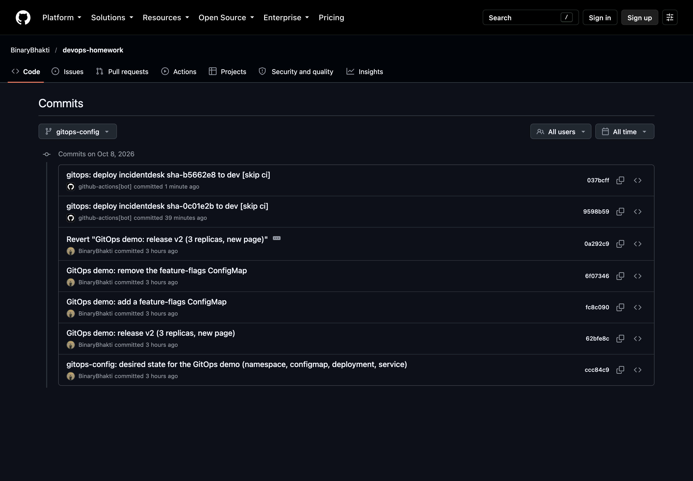
*gitops-config: every deploy is a bot commit*

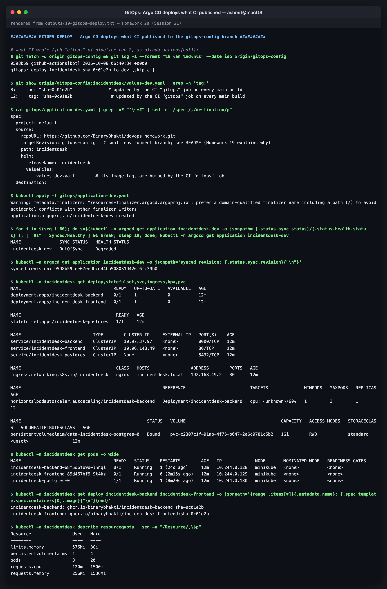
*first GitOps deploy*

## 5. Terraform infrastructure

EKS is a LocalStack **Pro** service, and this project runs on LocalStack 4.14 community (the
last free image). So the Kubernetes cluster is local Minikube, and Terraform provisions
everything around it, in two root modules.

**Cloud side** ([`terraform/`](terraform)), on LocalStack: a VPC across 2 AZs, public and private
subnets, IGW, NAT gateway, route tables, web and db security groups (the db accepts PostgreSQL
**only from the web SG**), a versioned and encrypted S3 bucket for DB backups with a lifecycle
policy, an IAM role scoped to that bucket, and a DynamoDB state-lock table.

```console
$ terraform plan -input=false -no-color -out=tfplan | grep -E "^  # |Plan:"
Plan: 30 to add, 0 to change, 0 to destroy.
$ terraform apply -input=false -no-color tfplan | grep -E "Creation complete|Apply complete"
Apply complete! Resources: 30 added, 0 changed, 0 destroyed.
```

Verified through the AWS API rather than through Terraform:

```console
$ awslocal ec2 describe-vpcs --filters Name=tag:Project,Values=incidentdesk --query 'Vpcs[].[VpcId,CidrBlock,Tags[?Key==`Name`]|[0].Value]' --output text
vpc-b9c63015f82528d69	10.20.0.0/16	incidentdesk-dev-vpc
$ awslocal ec2 describe-security-groups --filters Name=tag:Project,Values=incidentdesk --query 'SecurityGroups[].[GroupName,length(IpPermissions)]' --output text
incidentdesk-dev-db	1
incidentdesk-dev-web	2
```

**Idempotence check:** a second `plan` must be empty. It wasn't, for one resource:

```console
      + description                  = "PostgreSQL from the web tier"
      ~ referenced_security_group_id = "000000000000/sg-0ca9bcf13ea9e1f7c" -> "sg-0ca9bcf13ea9e1f7c"
Plan: 0 to add, 1 to change, 0 to destroy.
```

This is a LocalStack artifact: it returns the referenced SG as `<account>/<sg-id>` and drops
the description. Real AWS returns the bare ID for a same-account reference. The config is left
correct for real AWS instead of being masked with `ignore_changes`; the other 29 resources are
stable.

**Cluster side** ([`terraform/k8s/`](terraform/k8s)): namespaces with Pod Security levels, plus a
ResourceQuota and LimitRange on the app namespace. The `argocd` namespace already existed, so it
was **imported** into state rather than failing with "already exists":

```console
$ terraform import -no-color 'kubernetes_namespace_v1.ns["argocd"]' argocd | grep -E 'Import|Imported'
kubernetes_namespace_v1.ns["argocd"]: Importing from ID "argocd"...
kubernetes_namespace_v1.ns["argocd"]: Import prepared!
Import successful!
```

Its second plan was not empty either. That was a real config bug, not an emulator quirk. The
LimitRange set `max.cpu` without `default.cpu`, so the API server copied `max` into `default`
and Terraform kept trying to remove it. Stating it explicitly fixed it:

```console
$ terraform plan -input=false -no-color -detailed-exitcode >/dev/null; echo "plan exit code: $? (0 = no changes)"
plan exit code: 0 (0 = no changes)
```

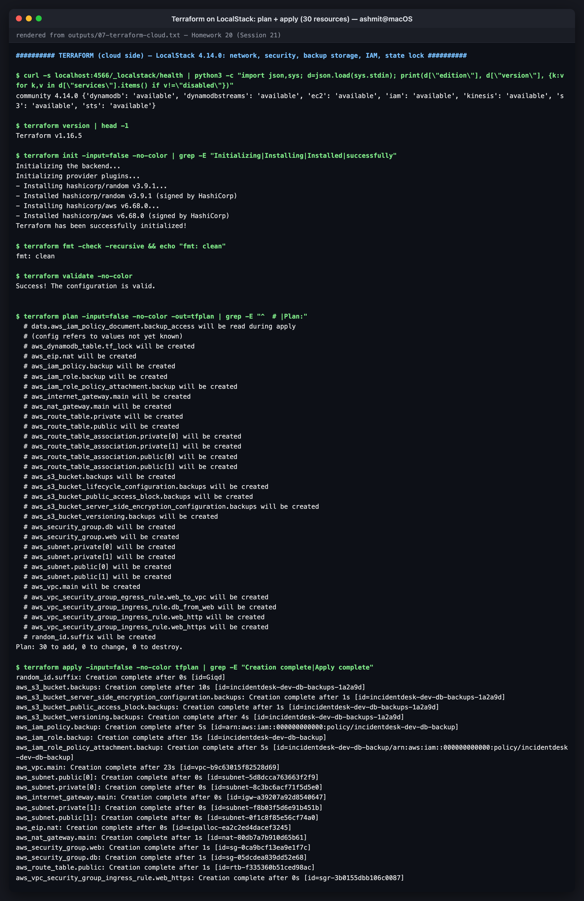
*Terraform on LocalStack: plan + apply*

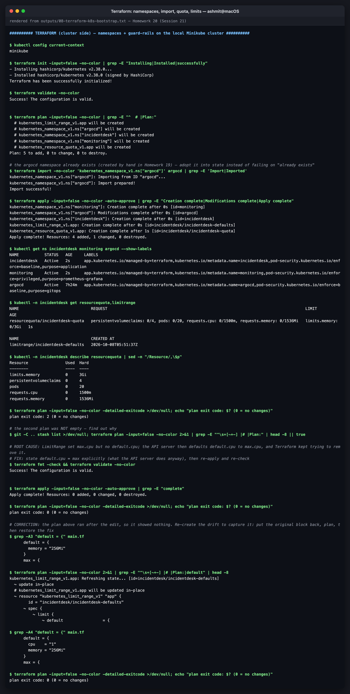
*Terraform: namespaces, import, quota, limits*

## 6. CI/CD pipeline and DevSecOps

[`/.github/workflows/hw20-final.yml`](../.github/workflows/hw20-final.yml):

```
build-test ─┬─ sast ──────────┐
            ├─ sca ───────────┤
            ├─ secret-scan ───┼─ security-gate ─ push (GHCR) ─ deploy (kind + Helm) ─ gitops (publish to gitops-config)
            └─ docker-build ─ image-scan (backend, frontend) ┘
```

| Stage | What runs |
|---|---|
| Build & test | ruff, pytest against a PostgreSQL service container with an 85% coverage gate, frontend `npm ci` + build |
| SAST | Semgrep (`p/python`, `p/dockerfile` + project rules, SARIF to code scanning), Bandit |
| SCA | pip-audit, npm audit, Trivy fs (lockfiles + IaC misconfiguration) |
| Secret scan | gitleaks over the **git history** of the project |
| Docker build → image scan | both images; Trivy fails on fixable HIGH/CRITICAL |
| Security gate | reads every result; `push` needs it |
| Push | GHCR, `sha-<commit>` + `latest`, the exact images that were scanned |
| Deploy | a kind cluster on the runner, `helm upgrade --install`, smoke test: health, ready, create + read an incident through PostgreSQL, the frontend proxy, `/metrics` |
| GitOps | copies the chart, sets the new tag, commits to `gitops-config` as `github-actions[bot]` |

Every value reaches a shell through `env:`, never `${{ }}` inside `run:`. A multi-line output
pasted into a script broke [Homework 15](../15-cicd-github-actions)'s first run.

### Pipeline runs on GitHub

All runs: [Actions → hw20-final](https://github.com/BinaryBhakti/devops-homework/actions/workflows/hw20-final.yml).

| Run | Result | Why |
|---|---|---|
| 1 | **blocked at the security gate** | Semgrep flagged `allow_origins=["*"]` (wildcard CORS) in the course code; `push`, `deploy` and `gitops` never ran |
| 2 | green | CORS replaced by an explicit, empty-by-default allow-list plus a test for it (`0c01e2b`) |
| 3–10 | green | the deploy fixes in §8 and follow-up commits, each through the full pipeline |

The gate doing its job (run 1) and the fixed pipeline publishing to GitOps (run 2):

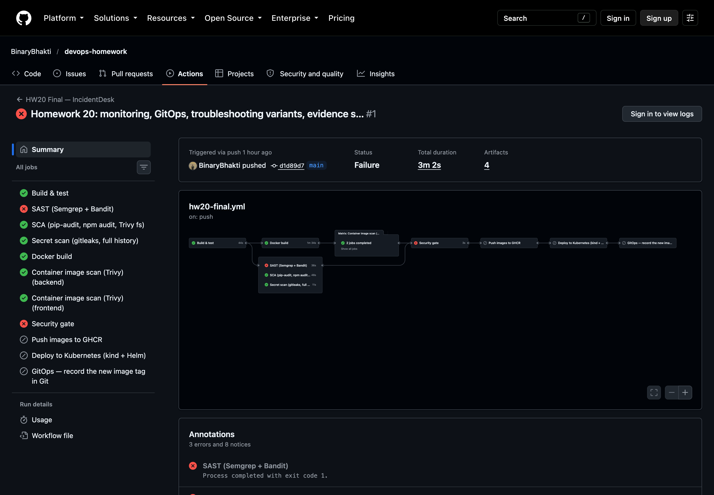
*run 1: blocked at the security gate*

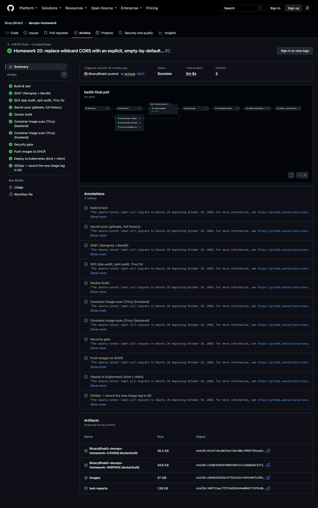
*run 2: every job green, through to gitops*

**Locally, before the first push**, the same scanners found and fixed:
- 9 Kubernetes/Dockerfile/Terraform misconfigurations
- 42 fixable HIGH CVEs in the frontend's nginx base image (fixed with `apk upgrade` and removing
  unused curl)
- a default DB password in `config.py`

```console
# GATE BLOCKED: the frontend image failed with 42 fixable HIGH CVEs, all inherited from the nginx-unprivileged base image (curl, OpenSSL, c-ares).
# FIX: apk upgrade in the runtime stage + remove curl (unused). Rebuilt and re-scanned:
frontend image exit code: 0
```

The secret scan after the password fix ([`05b-secret-scan-after.txt`](outputs/05b-secret-scan-after.txt)),
in both modes:

```console
1:34PM INF no leaks found
```

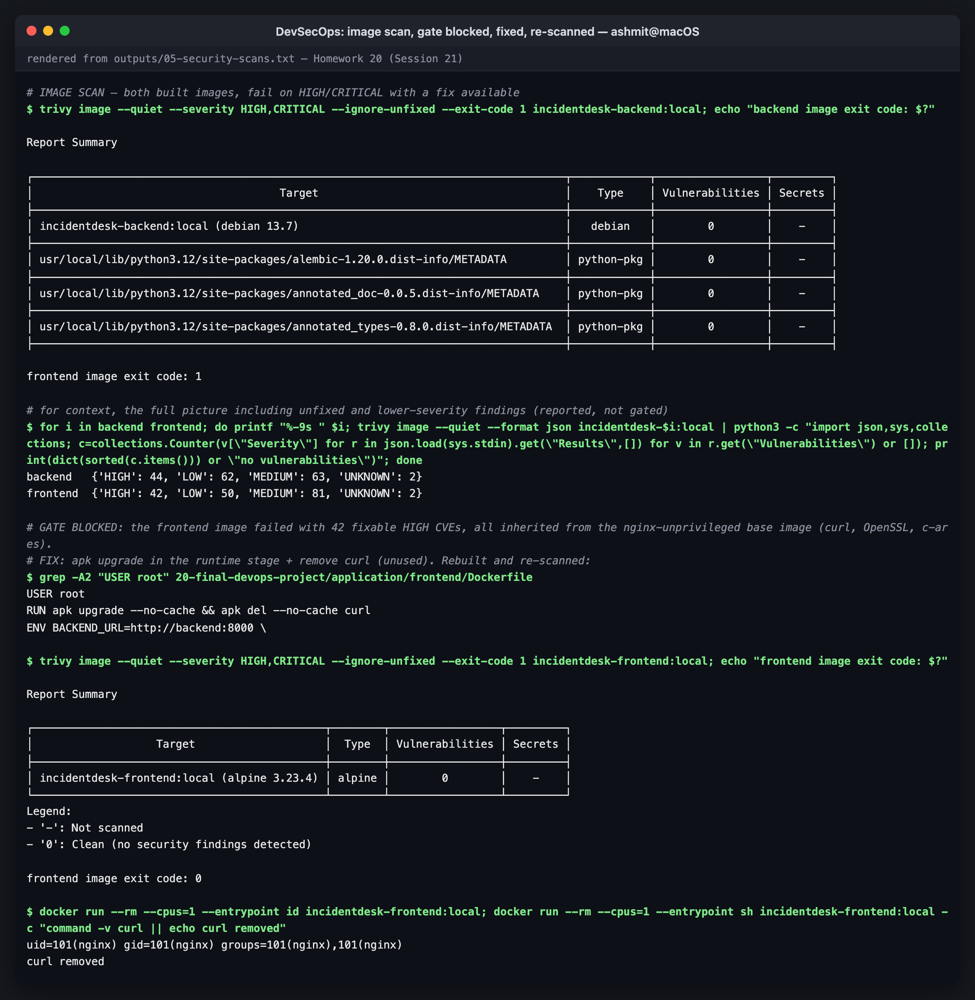
*image scan: gate blocked, fixed, re-scanned*

The full gate policy is in [`security/README.md`](security/README.md).

## 7. Monitoring

Prometheus (chart `prometheus-community/prometheus`) and Grafana run in the `monitoring` namespace.
The scrape config is deliberately lean ([`monitoring/prometheus-values.yaml`](monitoring/prometheus-values.yaml)):
the jobs this project doesn't need are switched off, and cAdvisor series are kept only for the
`incidentdesk` namespace. Alert rules are in [`monitoring/alert-rules.yml`](monitoring/alert-rules.yml);
the Grafana dashboard is provisioned from [`monitoring/dashboards`](monitoring/dashboards).

Live queries against the running app, with light synthetic traffic
([`16-monitoring-live.txt`](outputs/16-monitoring-live.txt)):

```console
# METRICS — request rate by route and status (RED: Rate, Errors)
$ PQ 'sum by (handler, status) (rate(http_requests_total{namespace="incidentdesk"}[2m]))'
   {'handler': '/api/incidents', 'status': '2xx'} => 0.0632
   {'handler': '/api/incidents/stats', 'status': '2xx'} => 0.0333
   {'handler': '/api/incidents/{incident_id}', 'status': '4xx'} => 0.0

# latency (RED: Duration)
$ PQ 'histogram_quantile(0.95, sum by (le) (rate(http_request_duration_seconds_bucket{namespace="incidentdesk"}[5m])))'
    => 0.8833
```

```console
$ curl -s localhost:9091/api/v1/alerts | python3 -c 'import json,sys; [print("  ", a["labels"]["alertname"], a["state"], "-", a["annotations"].get("summary","")) for a in json.load(sys.stdin)["data"]["alerts"]]'
   IncidentDeskHighLatencyP95 firing - API p95 latency is 963ms
   IncidentDeskHPAAtMax pending - HPA incidentdesk-backend has been at max replicas for 10 minutes — capacity, not just load
   IncidentDeskBackendDown pending - No IncidentDesk backend pod is being scraped successfully
```

The alerts are **true**, not staged: the node was overloaded, p95 latency really was close to a
second, and the HPA really was pinned at its dev maximum of 2.

What did **not** work, as recorded:
- `incidents_created_total` by severity and CPU per pod both returned **no data**. Memory per pod
  (also cAdvisor) did return data, so the likely cause is the cAdvisor scrape timing out under load
  rather than the relabelling. Not resolved.
- Both `kubernetes-nodes-cadvisor` targets were **down**: one is the stopped worker node (no route
  to host), the other timed out. The transcript's comment says "the one down target"; the target
  list above it shows two, and the list is right.
- Logs: the backend logs to stdout and `kubectl logs` reads them. Loki/Alloy (Homework 19) is not
  installed here, to fit the laptop.

The Prometheus screenshots were taken later than the transcript, during a worse spell:
`IncidentDeskBackendDown` had moved from pending to firing.

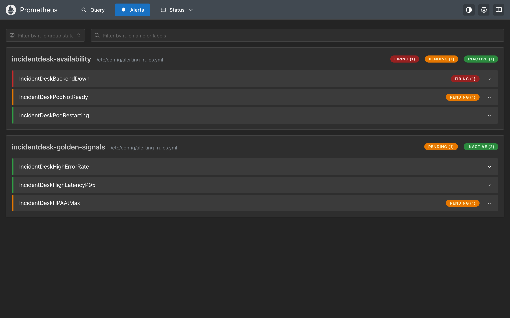
*Prometheus alerts: the IncidentDesk rule groups*

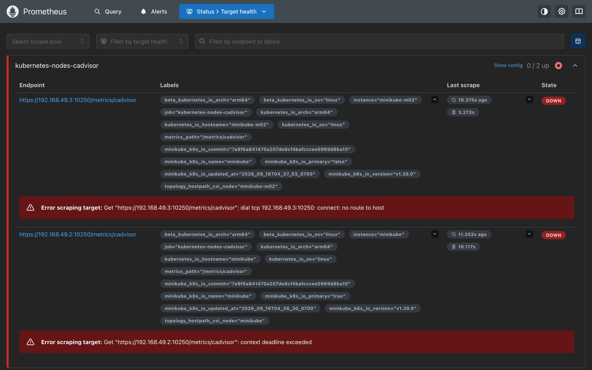
*Prometheus targets: the cAdvisor pool, both down (see above)*

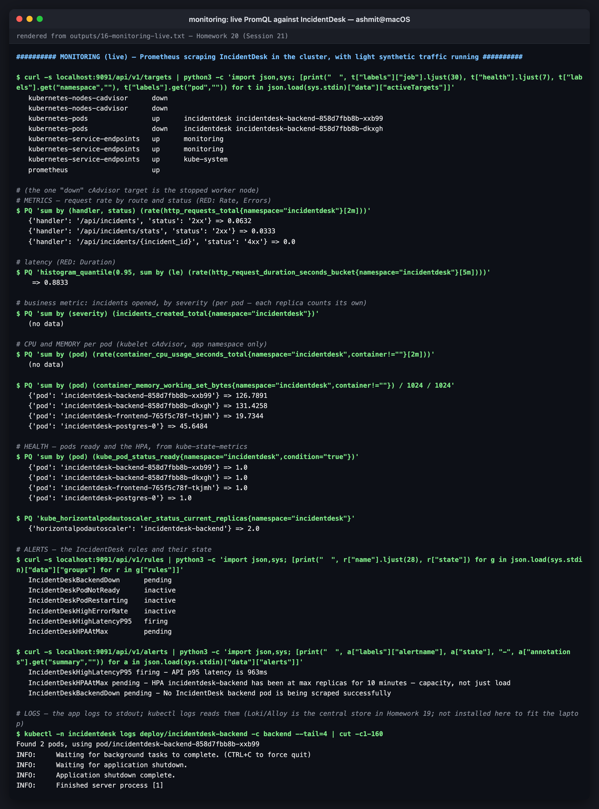
*live PromQL against IncidentDesk*

## 8. Troubleshooting

### Real incidents on the first GitOps deploys (not injected)

Evidence: [`11-real-deploy-issues.txt`](outputs/11-real-deploy-issues.txt).

**A. Frontend OOMKilled.**

```console
$ kubectl -n incidentdesk get pod -l app.kubernetes.io/component=frontend -o jsonpath='{range .items[*]}{.metadata.name}: last={.status.containerStatuses[0].lastState.terminated.reason} exit={.status.containerStatuses[0].lastState.terminated.exitCode} restarts={.status.containerStatuses[0].restartCount}{"\n"}{end}'
incidentdesk-frontend-9c778c6c6-mqzdl: last=OOMKilled exit=137 restarts=9
```

`worker_processes auto` starts one nginx worker per **node** CPU (8) inside a 64Mi limit.
Fix (`87167ae`): pin 2 workers in the image and raise the limit to 96Mi.

**B. Backend killed by its own probes after an HPA scale-out.** Python start-up CPU read as 550% of
the 50m request, so the HPA went 1 → 3. Three pods each starting and migrating starved each other
until the probes killed them:

```console
4m45s       Normal    Killing                pod/incidentdesk-backend-6466fbd968-rtc8t    Container backend failed liveness probe, will be restarted
31s         Normal    Killing                pod/incidentdesk-backend-6466fbd968-rtc8t    Container backend failed startup probe, will be restarted
```

Fixes: a 180 s scale-up stabilization window, dev `maxReplicas` 2, a 3-minute startup budget and a
5 s liveness timeout (`6710b57`, `5476e02`, `a95be67`).

**C. Perpetual `OutOfSync`.** The API server fills in PVC-template defaults that the chart did not
state, so Argo CD always saw a diff on the StatefulSet. Fix (`e6a6703`): state `apiVersion`, `kind`
and `volumeMode` explicitly.

### Six injected faults

Every fault went in the GitOps way: a commit to `gitops-config`, or a hand edit with `kubectl` for
5 and 6. Each was then observed, investigated, fixed by `git revert` (or by Argo CD itself) and
verified. The faulty values are in [`troubleshooting/`](troubleshooting).

| # | Fault | Symptom | Root cause | Fix |
|---|---|---|---|---|
| 1 | DB password "rotated" in chart values | new backend pod stuck in `Init` (migration can't log in); old pods keep serving | postgres applies `POSTGRES_PASSWORD` only when it **initialises** an empty data dir; the PVC already has one | `git revert`; a real rotation is `ALTER ROLE` first, then the Secret, then restart clients |
| 2 | readiness path renamed to `/readyz` | new pod never Ready, rollout stuck; users unaffected | the app serves `/ready`; `/readyz` → 404 | `git revert` |
| 3 | hand-typed image tag `sha-1a2b3c4` | `Init:ErrImagePull`; old pods keep serving | that tag was never built; CI only publishes SHAs it pushed | `git revert` |
| 4 | CPU request and limit removed | **nothing broke** | the namespace LimitRange injected a 50m default request, so the HPA could still compute utilisation | `git revert` |
| 5 | Service selector edited by hand | `/api` → HTTP 502, no endpoints | selector matched no pods | Argo CD self-heal, **5 s** |
| 6 | Ingress `/api` port edited to 8080 | `/api` → HTTP 503, `/` still 200 | the backend Service has no port 8080 | Argo CD self-heal, **15 s** |

Fault 1, the decisive evidence:

```console
$ kubectl -n incidentdesk logs statefulset/incidentdesk-postgres --tail=40 | grep -E 'FATAL|DETAIL' | tail -2
2026-10-08 18:13:32.580 UTC [2270] FATAL:  password authentication failed for user "incidentdesk"
2026-10-08 18:13:32.580 UTC [2270] DETAIL:  Connection matched file "/var/lib/postgresql/data/pgdata/pg_hba.conf" line 128: "host all all all scram-sha-256"
```

Fault 2, the new pod against the old ones and the endpoint list:

```console
$ kubectl -n incidentdesk get endpointslices -l kubernetes.io/service-name=incidentdesk-backend -o jsonpath='{range .items[*].endpoints[*]}{.targetRef.name} ready={.conditions.ready}{"\n"}{end}'
incidentdesk-backend-858d7fbb8b-xxb99 ready=true
incidentdesk-backend-858d7fbb8b-dkxgh ready=true
incidentdesk-backend-7c59fdd8db-9kqsx ready=false
```

Fault 6, broken and then healed:

```console
$ ing /api/incidents/stats; ing /
ingress /api/incidents/stats -> HTTP 503
ingress / -> HTTP 200
```

```console
$ s=$(date +%s); for i in $(seq 1 72); do p=$(kubectl -n incidentdesk get ingress incidentdesk -o jsonpath='{.spec.rules[0].http.paths[0].backend.service.port}'); case "$p" in *8080*) sleep 5;; *) echo "restored to $p after $(( $(date +%s)-s )) s"; break;; esac; done
restored to {"name":"http"} after 15 s
```

**Where the runs were not clean**, all of it in the transcripts:
- **Fault 1:** the very last check after the revert timed out (`HTTP 000`, curl exit 28), although
  Argo CD was Healthy and the rollout had completed. The next transcript, minutes later, starts at
  HTTP 200 but shows 4 restarts on both backend pods: the node was overloaded, and that is the
  likely cause of the timeout, not the fault.
- **Fault 2:** the first attempt was compromised, because its BEFORE step already showed HTTP 000.
  It was re-run on a calm cluster, and the re-run is the one shown.
- **Fault 3:** the `describe | grep 'Failed to pull'` line came back empty, because the event had
  aged out. The `Init:ErrImagePull` status is the evidence.
- **Fault 4:** the fault did not reproduce. The `FailedGetResourceMetric (x174 over 9h)` warning in
  the same output is historical metrics-server flakiness, not this fault.
- **Fault 6:** the first check probed `/`, which goes to the frontend, so it said "200" and
  "restored to (empty)". It was re-run against `/api`, the rule that was actually patched.

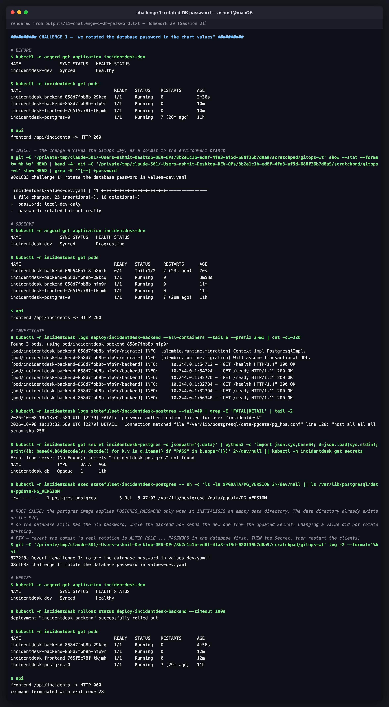
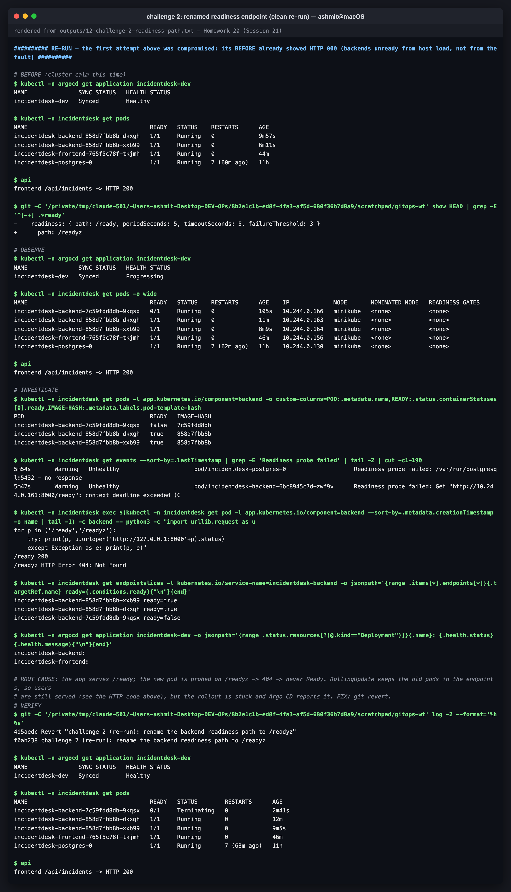
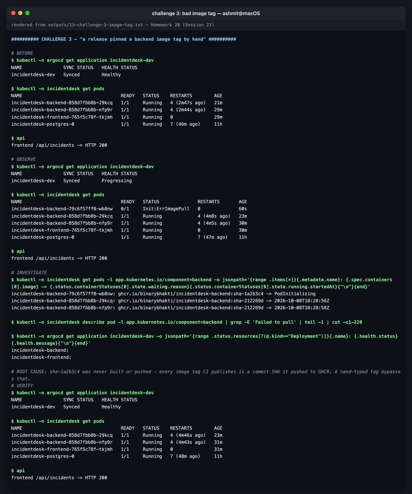
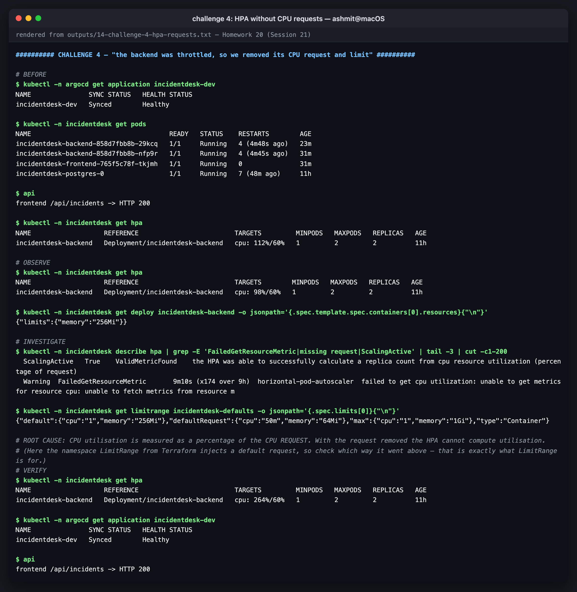
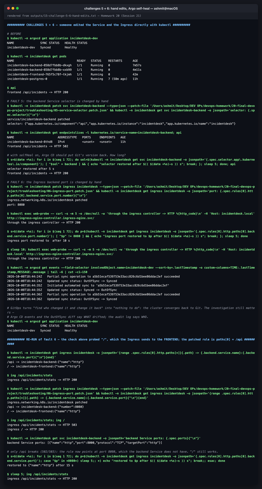
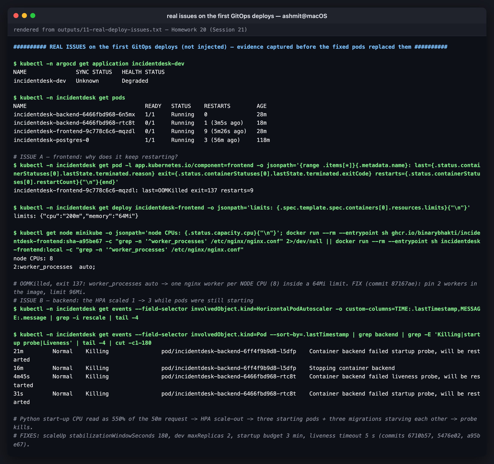

## 9. Lessons learned

1. **A security gate earns its place on day one.** The very first pipeline run was blocked over
   code inherited from the course (wildcard CORS). Without the gate, it would have shipped.
2. **Limits must match the node, not the developer's laptop guess.** `worker_processes auto` looks
   at the node's CPUs, not the container's limit; on an 8-CPU node, 64Mi was never going to fit.
3. **HPA plus slow start-up is a feedback loop.** Start-up CPU looks like load, scale-out adds more
   start-ups, and probes finish the job. Stabilization windows and startup probes break the loop.
4. **Changing a value is not rotating a secret.** Stateful systems keep their own copy, so the
   order is database first, then the Secret, then the clients.
5. **GitOps makes drift boring.** Hand edits were undone in 5–15 s, and rollback is `git revert`.
   The diff and the events still tell you *what* drifted; only the audit log says *who*.
6. **Check that your check tests the thing you broke.** Fault 6's first verification hit the wrong
   path and "passed". A probe needs to fail before the fix if its pass afterwards is to mean anything.
7. **Declare what the API server will default**, or GitOps tools report drift forever (the PVC
   template, the LimitRange `default.cpu`).

---

## Reproducing this

```bash
cd 20-final-devops-project
# local
cd docker && FRONTEND_PORT=3080 docker compose up --build -d && cd ..
# infrastructure
docker run -d --name localstack -p 4566:4566 -e SERVICES=s3,ec2,iam,sts,dynamodb localstack/localstack:4.14.0
(cd terraform && terraform init && terraform apply)
(cd terraform/k8s && terraform init && terraform apply)
# GitOps (Argo CD installed as in Homework 19)
kubectl apply -f ../19-monitoring-observability-gitops/03-gitops/repository-secret.yaml
kubectl apply -f gitops/application-dev.yaml
# monitoring
helm upgrade --install prometheus prometheus-community/prometheus -n monitoring -f monitoring/prometheus-values.yaml
helm upgrade --install grafana grafana-community/grafana -n monitoring -f monitoring/grafana-values.yaml
# a deploy is a push to main: CI tests, scans, builds, publishes; Argo CD rolls it out
```
